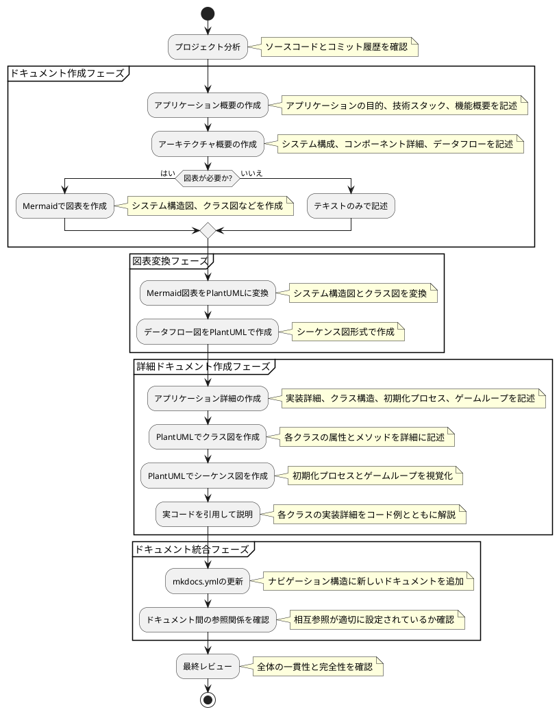

# Copilot Instructions - テスト駆動開発（TDD）プラクティス

このファイルは、GitHub Copilotがテスト駆動開発（TDD）のベストプラクティスに従ってコードを生成するためのガイドラインです。

## 基本原則

### TDDサイクル（レッド・グリーン・リファクタリング）
1. **レッド**: 動作しない、おそらく最初のうちはコンパイルも通らないテストを１つ書く
2. **グリーン**: そのテストを迅速に動作させる。このステップでは罪を犯してもよい
3. **リファクタリング**: テストを通すために発生した重複をすべて除去する

### アプローチの優先順位
1. **テストファースト**: テスト対象のコードを書く前にテストを書く
2. **アサートファースト**: テストの終わりにパスすべきアサーションを最初に書く
3. **小さなステップ**: 細かいステップを踏み続けられるようになる

## コード生成ガイドライン

### テストコード生成時
- 日本語のテスト名を使用（可読性とドキュメント性を重視）
- 一つのテストには一つのアサーション
- Given-When-Then構造を意識
- 独立性を保つ（他のテストに依存しない）

例：
```javascript
describe('FizzBuzz', () => {
  test('1を渡したら文字列1を返す', () => {
    expect(FizzBuzz.generate(1)).toBe('1');
  });
});
```

### プロダクトコード生成時の段階的アプローチ

#### 1. 仮実装
最初は最も簡単な実装から始める
```javascript
static generate(number) {
  return '1'; // ベタ書きから開始
}
```

#### 2. 三角測量
2つ以上の例があるときのみ一般化を行う
```javascript
static generate(number) {
  return number.toString(); // 一般化
}
```

#### 3. 明白な実装
実装方法が明確な場合は直接実装
```javascript
static generate(number) {
  if (number % 3 === 0) {
    return 'Fizz';
  }
  return number.toString();
}
```

### リファクタリングガイドライン

#### 適用すべきリファクタリング手法
1. **メソッドの抽出**: ひとまとめにできるコードの断片をメソッドにする
2. **変数名の変更**: 変数の役割をより良く表す名前に変更
3. **重複の除去**: 同じ処理を複数箇所で行っている場合は共通化
4. **条件記述の統合**: 同じ結果を返す条件を統合

#### リファクタリング実行時の注意点
- 外部から見た振る舞いを変更しない
- 各ステップでテストが通ることを確認
- 小さなステップで変更を行う
- 各リファクタリング後にコミット

## プロジェクト構造の推奨事項

### ディレクトリ構造
```
project/
├── src/           # プロダクトコード
├── test/          # テストコード
├── package.json   # 依存関係
└── README.md      # プロジェクト説明
```

### 命名規則
- テストファイル: `*.test.js` または `*.spec.js`
- クラス名: PascalCase (`FizzBuzz`)
- メソッド名: camelCase (`generate`)
- 定数: UPPER_SNAKE_CASE (`MAX_COUNT`)

## 技術スタック別の設定

### JavaScript/Node.js
```json
{
  "scripts": {
    "test": "jest",
    "test:watch": "jest --watch",
    "test:coverage": "jest --coverage"
  },
  "devDependencies": {
    "jest": "^29.0.0"
  }
}
```

### TypeScript
```json
{
  "scripts": {
    "test": "jest",
    "build": "tsc",
    "type-check": "tsc --noEmit"
  },
  "devDependencies": {
    "jest": "^29.0.0",
    "@types/jest": "^29.0.0",
    "ts-jest": "^29.0.0",
    "typescript": "^5.0.0"
  }
}
```

### Python
```python
# pytest設定例
import pytest

class TestFizzBuzz:
    def test_1を渡したら文字列1を返す(self):
        assert FizzBuzz.generate(1) == "1"
```

## TODOリスト管理

### TODOリストの作成手順
1. 仕様を小さな機能に分解
2. 各機能をテスト可能な単位まで細分化
3. 優先順位をつけて順番に実装
4. 完了したものは取り消し線で表示

例：
```markdown
TODOリスト
- ~~数を文字列にして返す~~
  - ~~1を渡したら文字列"1"を返す~~
  - ~~2を渡したら文字列"2"を返す~~
- 3の倍数のときは数の代わりに｢Fizz｣と返す
  - 3を渡したら文字列"Fizz"を返す
```

## バージョン管理のベストプラクティス

### コミットメッセージの形式
```
<type>: <description>

type:
- feat: 新機能の追加
- test: テストの追加・修正
- refactor: リファクタリング
- fix: バグ修正
- docs: ドキュメントの更新
```

### コミットのタイミング
1. テストが通った時点（グリーン）
2. リファクタリング完了時点
3. 機能完成時点

## エラーハンドリング

### テスト失敗時の対応
1. エラーメッセージを carefully 読む
2. 最小限の変更でテストを通す
3. 予期しない失敗の場合は歩幅を小さくする

### 実装時の注意点
- 一度に複数の機能を実装しない
- テストが失敗したら即座に修正
- 不明な点は公式ドキュメントを参照

## コード品質の指標

### テストカバレッジ
- 目標: 80%以上
- 重要な機能: 100%カバレッジ
- テストのためのテストは書かない

### コードの複雑度
- 一つのメソッドは一つの責任
- ネストの深さは3レベルまで
- メソッドの長さは20行以内を目安

## 継続的改善

### 定期的な振り返り
- TDDサイクルがスムーズに回っているか
- テストの実行時間は適切か
- リファクタリングのタイミングは適切か

### 学習リソース
- 書籍: 「テスト駆動開発」「リファクタリング」「リーダブルコード」
- 実践: 小さなプロジェクトでのTDD練習
- コミュニティ: TDD/アジャイル開発の勉強会参加

## 注意事項

### やってはいけないこと
- テストを書く前にプロダクトコードを書く
- 複数のテストを一度に書く
- リファクタリング中に新機能を追加
- テストが失敗している状態でコミット

### 推奨事項
- 小さなステップを意識的に踏む
- テストコードも読みやすさを重視
- リファクタリングを恐れない
- チーム全体でTDDの価値を共有

---

*このガイドラインは、テスト駆動開発の実践を通じて継続的に更新・改善されるべきものです。*

## ドキュメント作成フロー


```plantuml
@startuml
start
:プロジェクト分析;
note right: ソースコードとコミット履歴を確認

partition "ドキュメント作成フェーズ" {
  :アプリケーション概要の作成;
  note right: アプリケーションの目的、技術スタック、機能概要を記述
  
  :アーキテクチャ概要の作成;
  note right: システム構成、コンポーネント詳細、データフローを記述
  
  if (図表が必要か?) then (はい)
    :Mermaidで図表を作成;
    note right: システム構造図、クラス図などを作成
  else (いいえ)
    :テキストのみで記述;
  endif
}

partition "図表変換フェーズ" {
  :Mermaid図表をPlantUMLに変換;
  note right: システム構造図とクラス図を変換
  
  :データフロー図をPlantUMLで作成;
  note right: シーケンス図形式で作成
}

partition "詳細ドキュメント作成フェーズ" {
  :アプリケーション詳細の作成;
  note right: 実装詳細、クラス構造、初期化プロセス、ゲームループを記述
  
  :PlantUMLでクラス図を作成;
  note right: 各クラスの属性とメソッドを詳細に記述
  
  :PlantUMLでシーケンス図を作成;
  note right: 初期化プロセスとゲームループを視覚化
  
  :実コードを引用して説明;
  note right: 各クラスの実装詳細をコード例とともに解説
}

partition "ドキュメント統合フェーズ" {
  :mkdocs.ymlの更新;
  note right: ナビゲーション構造に新しいドキュメントを追加
  
  :ドキュメント間の参照関係を確認;
  note right: 相互参照が適切に設定されているか確認
}

:最終レビュー;
note right: 全体の一貫性と完全性を確認

stop
@enduml
```

## 作業手順の詳細

1. **プロジェクト分析**
    - ソースコードの構造を理解
    - コミット履歴から実装の流れを把握
    - 主要なクラスと機能を特定

2. **ドキュメント作成フェーズ**
    - アプリケーション概要：プロジェクトの目的、技術スタック、機能の概要を記述
    - アーキテクチャ概要：システム構成、コンポーネント詳細、データフローを記述
    - 必要に応じて図表を作成（初期段階ではMermaidを使用）

3. **図表変換フェーズ**
    - Mermaidで作成した図表をPlantUMLに変換
    - システム構造図、クラス図、データフロー図などを変換
    - PlantUML形式に合わせて構文を調整

4. **詳細ドキュメント作成フェーズ**
    - アプリケーション詳細：実装の詳細、クラス構造、処理フローを記述
    - クラス図：各クラスの属性とメソッドを詳細に記述
    - シーケンス図：初期化プロセスとゲームループを視覚化
    - 実コード引用：各クラスの実装詳細をコード例とともに解説

5. **ドキュメント統合フェーズ**
    - mkdocs.ymlの更新：ナビゲーション構造に新しいドキュメントを追加
    - ドキュメント間の参照関係を確認：相互参照が適切に設定されているか確認

6. **最終レビュー**
    - 全体の一貫性と完全性を確認
    - 図表が正しく表示されることを確認
    - ナビゲーション構造が適切であることを確認

この作業フローに従うことで、プロジェクトの実装状況を反映した包括的なドキュメントを効率的に作成することができます。
