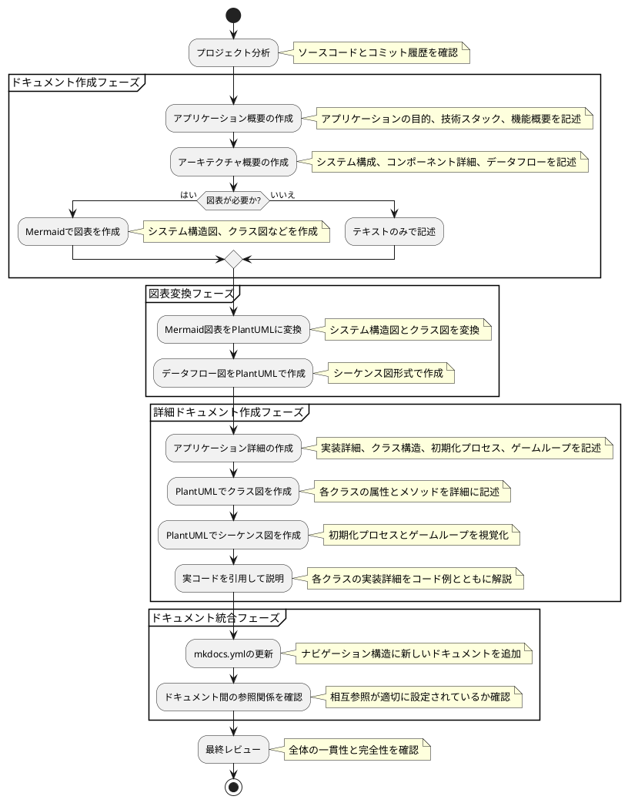
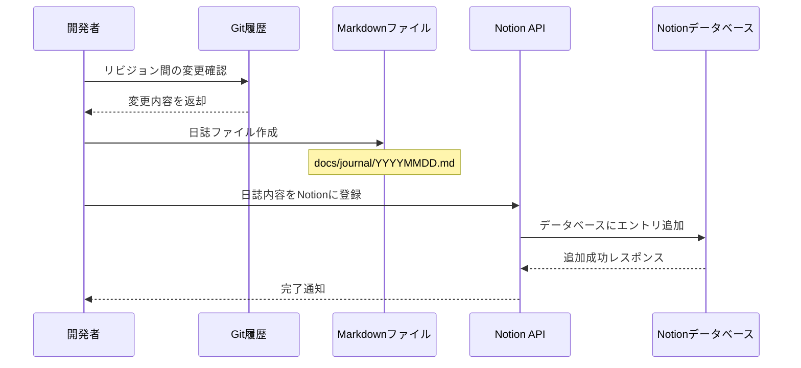
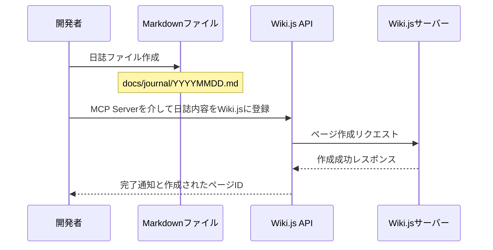
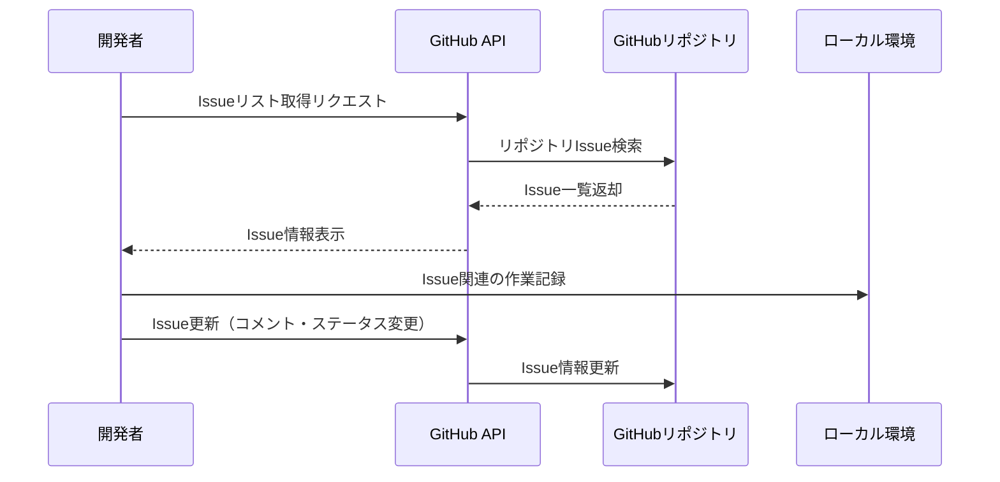
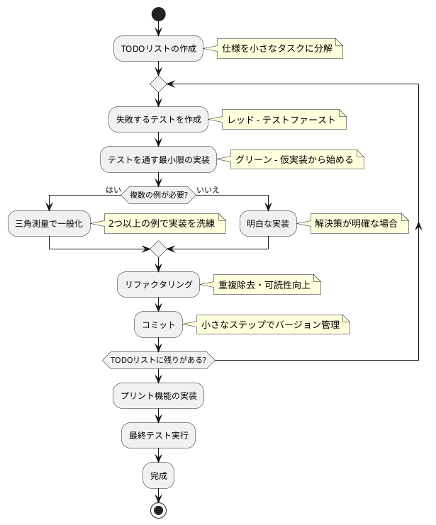

# GitHub Copilot プロジェクト指示書

## プロジェクト情報

- プロジェクト名: 実践 AIプログラミング
- GitHubリポジトリ: https://github.com/k2works/ai-programing-exercise
- 対象ユーザー名: k2works
- 対象リポジトリ名: ai-programing-exercise
- プロジェクトの目的: AIプログラミングの実践的な学習と開発のためのプロジェクトです
- プロジェクトの構成:
    - `app/`: アプリケーション
    - `src/`: ソースコード
    - `docs/`: ドキュメント
    - `scripts/`: スクリプト
    - `README.md`: プロジェクトの概要とセットアップ手順
    - `mkdocs.yml`: ドキュメント生成の設定ファイル
    - `package.json`: プロジェクトの依存関係とスクリプト


## ドキュメント作成フロー


```plantuml
@startuml
start
:プロジェクト分析;
note right: ソースコードとコミット履歴を確認

partition "ドキュメント作成フェーズ" {
  :アプリケーション概要の作成;
  note right: アプリケーションの目的、技術スタック、機能概要を記述
  
  :アーキテクチャ概要の作成;
  note right: システム構成、コンポーネント詳細、データフローを記述
  
  if (図表が必要か?) then (はい)
    :Mermaidで図表を作成;
    note right: システム構造図、クラス図などを作成
  else (いいえ)
    :テキストのみで記述;
  endif
}

partition "図表変換フェーズ" {
  :Mermaid図表をPlantUMLに変換;
  note right: システム構造図とクラス図を変換
  
  :データフロー図をPlantUMLで作成;
  note right: シーケンス図形式で作成
}

partition "詳細ドキュメント作成フェーズ" {
  :アプリケーション詳細の作成;
  note right: 実装詳細、クラス構造、初期化プロセス、ゲームループを記述
  
  :PlantUMLでクラス図を作成;
  note right: 各クラスの属性とメソッドを詳細に記述
  
  :PlantUMLでシーケンス図を作成;
  note right: 初期化プロセスとゲームループを視覚化
  
  :実コードを引用して説明;
  note right: 各クラスの実装詳細をコード例とともに解説
}

partition "ドキュメント統合フェーズ" {
  :mkdocs.ymlの更新;
  note right: ナビゲーション構造に新しいドキュメントを追加
  
  :ドキュメント間の参照関係を確認;
  note right: 相互参照が適切に設定されているか確認
}

:最終レビュー;
note right: 全体の一貫性と完全性を確認

stop
@enduml
```

### 1. **プロジェクト分析**
    - ソースコードの構造を理解
    - コミット履歴から実装の流れを把握
    - 主要なクラスと機能を特定

### 2. **ドキュメント作成フェーズ**
    - アプリケーション概要：プロジェクトの目的、技術スタック、機能の概要を記述
    - アーキテクチャ概要：システム構成、コンポーネント詳細、データフローを記述
    - 必要に応じて図表を作成（初期段階ではMermaidを使用）

### 3. **図表変換フェーズ**
    - Mermaidで作成した図表をPlantUMLに変換
    - システム構造図、クラス図、データフロー図などを変換
    - PlantUML形式に合わせて構文を調整

### 4. **詳細ドキュメント作成フェーズ**
    - アプリケーション詳細：実装の詳細、クラス構造、処理フローを記述
    - クラス図：各クラスの属性とメソッドを詳細に記述
    - シーケンス図：初期化プロセスとゲームループを視覚化
    - 実コード引用：各クラスの実装詳細をコード例とともに解説

### 5. **ドキュメント統合フェーズ**
    - mkdocs.ymlの更新：ナビゲーション構造に新しいドキュメントを追加
    - ドキュメント間の参照関係を確認：相互参照が適切に設定されているか確認

### 6. **最終レビュー**
    - 全体の一貫性と完全性を確認
    - 図表が正しく表示されることを確認
    - ナビゲーション構造が適切であることを確認

この作業フローに従うことで、プロジェクトの実装状況を反映した包括的なドキュメントを効率的に作成することができます。

## 外部サービスとの連携

- Notion Github Slack AtlassianなどのAPIを統合するためのMCP Serverを使用します。このサーバーは、GitHub Copilotがプロジェクトの開発日誌やGitHub Issueの管理を支援するために必要なAPIを提供します。
- `C:\Users\PC202411-1\AppData\Local\github-copilot\intellij\mcp.json` に記載されているMCP Serverの設定を利用します。いちいちスクリプトを作成しません。
- Notionを指定した場合は、MCP Serverの `notionAPI` を使用して、日誌の登録やデータベースの操作を行います。
  - Notionの日誌のタイトルは、`YYYY年MM月DD日` の形式で作成します。
  - Notionの日誌の作成者は、GitHub のユーザー名を使用します。
- GitHubを指定した場合は、MCP Serverの `githubAPI` を使用して、Issueの取得や管理を行います。
- Slackを指定した場合は、MCP Serverの `slackAPI` を使用して、通知やメッセージの送信を行います。
- Atlassianを指定した場合は、MCP Serverの `atlassianAPI` を使用して、JiraやConfluenceとの連携を行います。
- Wiki.jsを指定した場合は、MCP Serverの `wikijs` を使用して、ドキュメントの管理を行います。
  - Wiki.jsの日誌のタイトルは、`日誌: YYYY年MM月DD日` の形式で作成します。
  - Wiki.jsのパスは、`日誌/YYYY年MM月DD日` の形式で指定します。
  - plantumlを使用して、シーケンス図やクラス図を生成します。


## 開発日誌作成・管理フロー

### プロセス概要図

以下のシーケンス図は、Git履歴から日誌を作成し、Notionに登録するまでの流れを示しています。


```mermaid
sequenceDiagram
    participant Dev as 開発者
    participant Git as Git履歴
    participant MD as Markdownファイル
    participant API as Notion API
    participant DB as Notionデータベース
    
    Dev->>Git: リビジョン間の変更確認
    Git-->>Dev: 変更内容を返却
    Dev->>MD: 日誌ファイル作成
    Note over MD: docs/journal/YYYYMMDD.md
    Dev->>API: 日誌内容をNotionに登録
    API->>DB: データベースにエントリ追加
    DB-->>API: 追加成功レスポンス
    API-->>Dev: 完了通知
```

### 1. 日誌ファイルの作成

開発日誌は以下の形式でMarkdownファイルとして作成します：

```markdown
# 開発日誌

## 日付: 2025年5月31日

## 変更概要
[簡潔な変更の概要]

## 作業内容の詳細

### [カテゴリ1]
- [詳細な作業内容]
- [バグ修正内容]

### [カテゴリ2]
- [詳細な作業内容]

## 今後の改善点
- [改善点1]
- [改善点2]

## レビュー状況
- [レビュー状況の記述]
```

日誌ファイルは `docs/journal/YYYYMMDD.md` の形式で保存します。

### 2. Notionへの登録フロー

開発日誌はNotionデータベースにも登録します。以下の手順でMCP Server notionAPIを使用して登録します：

- Notion APIを使用して、データベース一覧を取得してIDを確認 `API-retrieve-a-database`
- Notion APIを使用して、日誌内容をJSON形式でデータベースに登録

### 3. Git履歴からの日誌作成

特定のリビジョン間の変更を日誌にまとめる際は以下のコマンドを使用します：

```bash
# リビジョン間の変更を取得
git log [開始リビジョン]..[終了リビジョン] --oneline

# 特定ファイルの変更詳細を確認
git diff [開始リビジョン]..[終了リビジョン] -- [ファイルパス]
```

## Wiki.jsへの日誌登録フロー

### プロセス概要図

以下のシーケンス図は、日誌ファイルからWiki.jsにドキュメントを登録するまでの流れを示しています。


```mermaid
sequenceDiagram
    participant Dev as 開発者
    participant MD as Markdownファイル
    participant API as Wiki.js API
    participant Wiki as Wiki.jsサーバー
    
    Dev->>MD: 日誌ファイル作成
    Note over MD: docs/journal/YYYYMMDD.md
    Dev->>API: MCP Serverを介して日誌内容をWiki.jsに登録
    API->>Wiki: ページ作成リクエスト
    Wiki-->>API: 作成成功レスポンス
    API-->>Dev: 完了通知と作成されたページID
```

### 1. Wiki.jsへの登録手順

日誌をWiki.jsに登録する場合は、MCP Serverの `wikijs` 機能を使用して以下の手順で行います：

1. Wiki.jsの検索機能を使って既存のページがないか確認します
   ```
   wikijs_search({"query": "日誌"})
   ```

2. 新しいページを作成します
   ```
   wikijs_create({
     "path": "日誌/YYYY年MM月DD日",
     "title": "日誌: YYYY年MM月DD日", 
     "description": "作業内容の簡単な説明", 
     "content": "Markdownフォーマットの日誌の内容"
   })
   ```

3. 既存のページを更新する場合は以下を使用します
   ```
   wikijs_update({
     "id": "ページID",
     "title": "日誌: YYYY年MM月DD日", 
     "content": "更新されたMarkdownフォーマットの内容"
   })
   ```

### 2. Wiki.jsページの内容フォーマット

Wiki.jsページの内容は、標準的なマークダウン形式で以下のように構成します：

```markdown
# 日誌

## 日付: YYYY年MM月DD日

### [作業タイトル]

[作業内容の詳細な説明]

#### 発生した問題

1. **[問題カテゴリ]**:
   - [問題の詳細]
   - [エラーメッセージや具体的な状況]

2. **[問題カテゴリ]**:
   - [問題の詳細]

#### 解決策

1. **[解決策カテゴリ]**:
   ```コード例やコンフィグ例```

## 今後の改善点
- [改善点の詳細]

## レビュー状況
- [レビューの現在の状況]
```

## GitHub Issue管理フロー

### GitHub Issueの取得と追跡

プロジェクトのGitHub Issueを取得・管理するためのフローです。

対象ユーザー名は k2works
対象リポジトリ名は pragmatic-programing-exercise-2025


```mermaid
sequenceDiagram
    participant Dev as 開発者
    participant API as GitHub API
    participant Repo as GitHubリポジトリ
    participant Local as ローカル環境
    
    Dev->>API: Issueリスト取得リクエスト
    API->>Repo: リポジトリIssue検索
    Repo-->>API: Issue一覧返却
    API-->>Dev: Issue情報表示
    Dev->>Local: Issue関連の作業記録
    Dev->>API: Issue更新（コメント・ステータス変更）
    API->>Repo: Issue情報更新
```

### 1. GitHub Issueの取得

GitHub Issueを取得するには、MCP Server （GitHub API）の `search_issues` 機能を使用します。

### 2. コマンドラインからのIssue取得

GitHub CLIを使用すると、コマンドラインから直接Issueを取得できます：

```bash
# 全Issueのリスト取得
gh issue list

# 特定のIssueの詳細取得
gh issue view ISSUE_NUMBER

# 新しいIssueの作成
gh issue create --title "Issue Title" --body "Issue description"
```

### 3. 日誌とIssueの関連付け

開発日誌にIssue番号を記録することで、作業内容とIssueを関連付けます：

```markdown
# 開発日誌: 2025年5月31日

## 関連Issue
- #42: 給与計算機能のバグ修正
- #56: ユニットテスト追加

## 作業内容の詳細
...
```

## テスト駆動開発（TDD）標準手順

### テスト駆動開発の基本サイクル

テスト駆動開発は以下の3つのステップを繰り返すサイクルです：

1. **レッド（Red）**: 失敗するテストを書く
2. **グリーン（Green）**: テストを通す最小限のコードを書く
3. **リファクタリング（Refactoring）**: コードの品質を向上させる


```plantuml
@startuml
start
:TODOリストの作成;
note right: 仕様を小さなタスクに分解

repeat
  :失敗するテストを作成;
  note right: レッド - テストファースト
  
  :テストを通す最小限の実装;
  note right: グリーン - 仮実装から始める
  
  if (複数の例が必要?) then (はい)
    :三角測量で一般化;
    note right: 2つ以上の例で実装を洗練
  else (いいえ)
    :明白な実装;
    note right: 解決策が明確な場合
  endif
  
  :リファクタリング;
  note right: 重複除去・可読性向上
  
  :コミット;
  note right: 小さなステップでバージョン管理
  
repeat while (TODOリストに残りがある?)

:プリント機能の実装;
:最終テスト実行;
:完成;
stop
@enduml
```

### 1. プロジェクトセットアップフェーズ

#### 1.1 開発環境の準備

言語に応じたテスティングフレームワークをセットアップします：

**Python の場合:**
```bash
# pytestのインストール
pip install pytest

# テストファイルの作成（main.py）
# テストクラスまたは関数ベースでテストを作成
```

**JavaScript/Node.js の場合:**
```bash
# Jestのインストール
npm install --save-dev jest

# package.jsonにテストスクリプトを追加
```

**Ruby の場合:**
```bash
# Minitestの使用（Ruby標準ライブラリ）
gem install minitest-reporters  # オプション
```

#### 1.2 初期テストの作成

まず動作確認用の簡単なテストを作成してテスティングフレームワークが正常に動作することを確認します。

```python
# Python例
def test_setup():
    assert greeting() == 'hello world'

def greeting():
    return 'hello world'
```

#### 1.3 バージョン管理の初期化

```bash
git add .
git commit -m 'test: セットアップ'
```

### 2. TODOリスト作成フェーズ

#### 2.1 仕様の分析

要求仕様を以下の観点で分析します：
- 入力と出力の関係
- エッジケース
- ビジネスルール

#### 2.2 TODOリストの作成

仕様を小さな実装可能なタスクに分解します：

```markdown
TODOリスト:
- [ ] 基本機能
  - [ ] 具体的なケース1
  - [ ] 具体的なケース2
- [ ] 例外処理
- [ ] 境界値テスト
- [ ] 統合機能
```

**例（FizzBuzz）:**
```markdown
TODOリスト:
- [ ] 数を文字列にして返す
  - [ ] 1を渡したら文字列"1"を返す
  - [ ] 2を渡したら文字列"2"を返す
- [ ] 3の倍数のときは数の代わりに「Fizz」と返す
- [ ] 5の倍数のときは「Buzz」と返す
- [ ] 3と5両方の倍数の場合には「FizzBuzz」と返す
- [ ] 1から100までの数
- [ ] プリントする
```

### 3. レッド-グリーン-リファクタリングサイクル

#### 3.1 レッドフェーズ（失敗するテストを書く）

**アサートファースト**の原則に従い、まずアサーションから書きます：

```python
def test_1を渡したら文字列1を返す():
    assert FizzBuzz.generate(1) == '1'
```

テストを実行して失敗することを確認します：
```bash
pytest main.py -v
# 期待結果: FAILED
```

#### 3.2 グリーンフェーズ（テストを通す）

最初は**仮実装**でテストを通します：

```python
class FizzBuzz:
    @staticmethod
    def generate(number):
        return '1'  # ベタ書きの値を返す
```

テストが通ることを確認：
```bash
pytest main.py -v
# 期待結果: PASSED
```

#### 3.3 三角測量による一般化

2つ目のテストを追加して一般化を促します：

```python
def test_2を渡したら文字列2を返す():
    assert FizzBuzz.generate(2) == '2'
```

テストが失敗することを確認し、一般的な実装に変更：

```python
class FizzBuzz:
    @staticmethod
    def generate(number):
        return str(number)  # 一般的な実装
```

#### 3.4 リファクタリングフェーズ

テストが通った状態で、コードの品質を向上させます：

**よく適用するリファクタリング:**
- メソッドの抽出
- 変数名の変更
- 重複コードの除去
- クラス構造の整理

```python
# リファクタリング例：テストの共通化
class TestFizzBuzz:
    def setup_method(self):
        self.fizzbuzz = FizzBuzz
    
    def test_1を渡したら文字列1を返す(self):
        assert self.fizzbuzz.generate(1) == '1'
```

各ステップ後にテストを実行して機能が壊れていないことを確認します。

#### 3.5 コミット

各サイクル完了時にコミットします：

```bash
git add .
git commit -m 'test: 数を文字列にして返す'

git add .
git commit -m 'refactor: メソッドの抽出'
```

### 4. 明白な実装フェーズ

実装方法が明確な場合は、**明白な実装**を適用します：

```python
def test_3を渡したら文字列Fizzを返す():
    assert FizzBuzz.generate(3) == 'Fizz'

# 明白な実装
class FizzBuzz:
    @staticmethod
    def generate(number):
        if number % 3 == 0:
            return 'Fizz'
        return str(number)
```

### 5. コミットメッセージの規約

プロジェクトで統一したコミットメッセージ形式を使用します：

```bash
# 機能追加
git commit -m 'feat: 新機能の説明'

# テスト追加
git commit -m 'test: テスト内容の説明'

# リファクタリング
git commit -m 'refactor: リファクタリング内容'

# バグ修正
git commit -m 'fix: 修正内容'

# ドキュメント更新
git commit -m 'docs: ドキュメント更新内容'
```

### 6. 完成フェーズ

#### 6.1 統合機能の実装

個別機能が完成したら、統合機能を実装します：

```python
@staticmethod
def generate_list():
    return [FizzBuzz.generate(i) for i in range(1, 101)]

@staticmethod
def print_fizzbuzz():
    result = FizzBuzz.generate_list()
    for item in result:
        print(item)
```

#### 6.2 実行機能の追加

プログラムとして実行できるようにメイン部分を実装：

```python
if __name__ == '__main__':
    import sys
    if len(sys.argv) > 1 and sys.argv[1] == 'test':
        pytest.main([__file__])
    else:
        FizzBuzz.print_fizzbuzz()
```

#### 6.3 最終テストとコミット

```bash
# 全テストの実行
pytest main.py -v

# 実際の実行確認
python main.py | head -20

# 最終コミット
git add .
git commit -m 'feat: 完全なFizzBuzz実装完成'
```

### 7. 品質保証のチェックリスト

実装完了前に以下を確認します：

- [ ] すべてのテストが通っている
- [ ] TODOリストがすべて完了している
- [ ] リファクタリングが適切に行われている
- [ ] コミット履歴が適切に記録されている
- [ ] コードの可読性が確保されている
- [ ] 実際の動作確認ができている

### 8. プロジェクト固有の考慮事項

各プロジェクトで以下を検討します：

#### 8.1 技術スタック固有の設定

- テスティングフレームワークの選択
- CI/CDパイプラインとの統合
- コードカバレッジの測定

#### 8.2 チーム開発での考慮事項

- ペアプログラミング/モブプログラミングの適用
- コードレビューのタイミング
- ブランチ戦略との調整

#### 8.3 ドキュメント化

- 実装の判断根拠の記録
- 学んだことの共有
- 次回改善点の記録

この手順に従うことで、品質の高いコードを段階的かつ安全に実装することができます。

