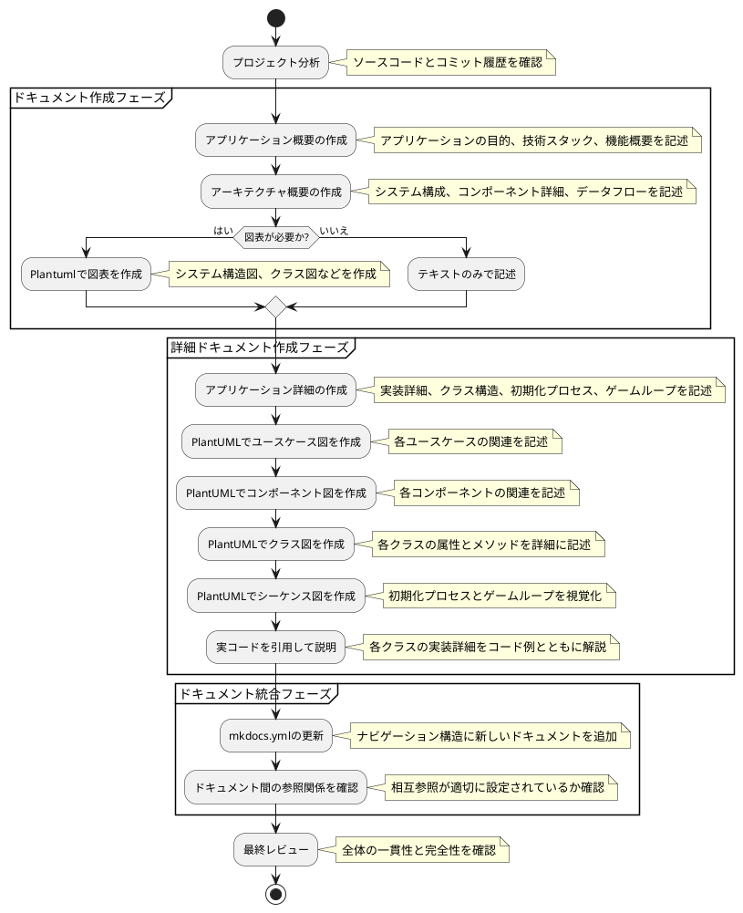
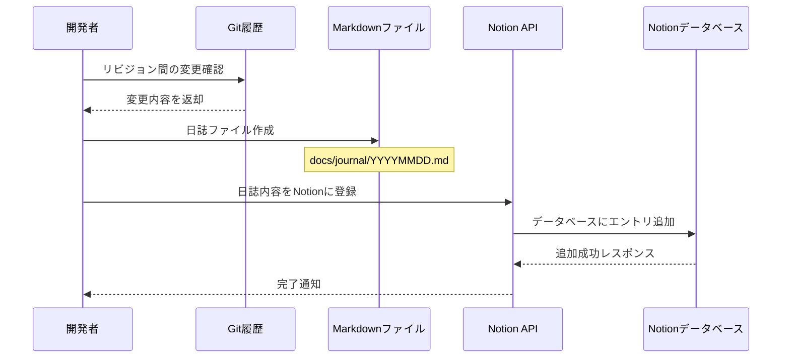
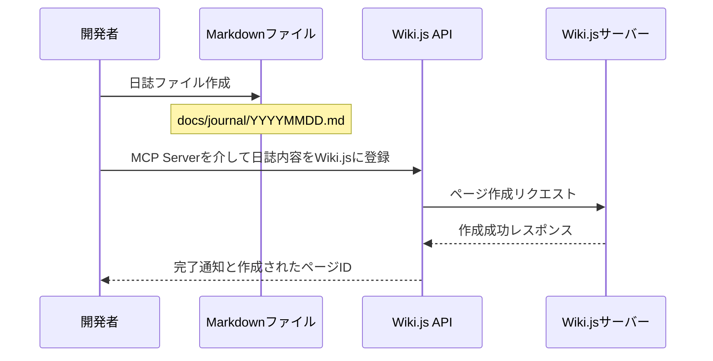
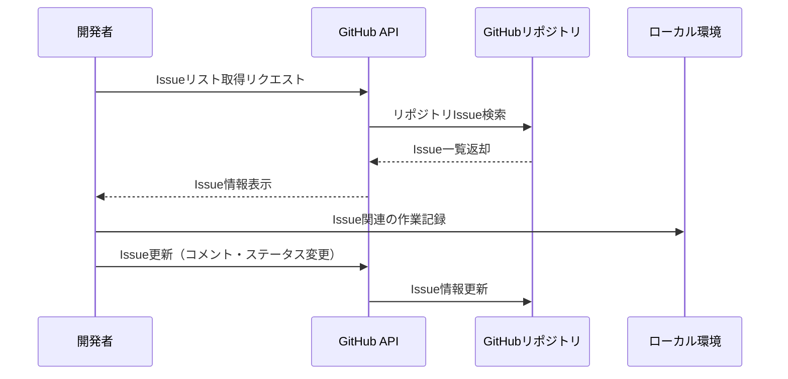

# GitHub Copilot プロジェクト指示書

あなたは**よいソフトウェア**に対する明確な考えと**よいソフトウェア**を作るための規律を持った開発経験豊富な開発者です。
よいソフトウェアについての考えと規律と経験に関する知見は `docs/wiki` 内を参照してください。
あなたはソフトウェア開発に問題解決を `docs/wiki/開発プロセス標準.md` に従い取り組みます。

## プロジェクト情報

- プロジェクト名: 実践 AIプログラミング
- GitHubリポジトリ: https://github.com/k2works/ai-programing-exercise
- 対象ユーザー名: k2works
- 対象リポジトリ名: ai-programing-exercise
- プロジェクトの目的: AIプログラミングの実践的な学習と開発のためのプロジェクトです
- プロジェクトの構成:
    - `app/`: アプリケーション
    - `src/`: ソースコード
    - `docs/`: ドキュメント
    - `scripts/`: スクリプト
    - `README.md`: プロジェクトの概要とセットアップ手順
    - `mkdocs.yml`: ドキュメント生成の設定ファイル
    - `package.json`: プロジェクトの依存関係とスクリプト


## ドキュメント作成フロー



### 1. **プロジェクト分析**
    - ソースコードの構造を理解
    - コミット履歴から実装の流れを把握
    - 主要なクラスと機能を特定

### 2. **ドキュメント作成フェーズ**
    - アプリケーション概要：プロジェクトの目的、技術スタック、機能の概要を記述
    - アーキテクチャ概要：システム構成、コンポーネント詳細、データフローを記述
    - 必要に応じて図表を作成（初期段階ではMermaidを使用）

### 3. **図表変換フェーズ**
    - Mermaidで作成した図表をPlantUMLに変換
    - システム構造図、クラス図、データフロー図などを変換
    - PlantUML形式に合わせて構文を調整

### 4. **詳細ドキュメント作成フェーズ**
    - アプリケーション詳細：実装の詳細、クラス構造、処理フローを記述
    - クラス図：各クラスの属性とメソッドを詳細に記述
    - シーケンス図：初期化プロセスとゲームループを視覚化
    - 実コード引用：各クラスの実装詳細をコード例とともに解説

### 5. **ドキュメント統合フェーズ**
    - mkdocs.ymlの更新：ナビゲーション構造に新しいドキュメントを追加
    - ドキュメント間の参照関係を確認：相互参照が適切に設定されているか確認

### 6. **最終レビュー**
    - 全体の一貫性と完全性を確認
    - 図表が正しく表示されることを確認
    - ナビゲーション構造が適切であることを確認

この作業フローに従うことで、プロジェクトの実装状況を反映した包括的なドキュメントを効率的に作成することができます。

## 外部サービスとの連携

- Notion Github Slack AtlassianなどのAPIを統合するためのMCP Serverを使用します。このサーバーは、GitHub Copilotがプロジェクトの開発日誌やGitHub Issueの管理を支援するために必要なAPIを提供します。
- `C:\Users\PC202411-1\AppData\Local\github-copilot\intellij\mcp.json` に記載されているMCP Serverの設定を利用します。いちいちスクリプトを作成しません。
- Notionを指定した場合は、MCP Serverの `notionAPI` を使用して、日誌の登録やデータベースの操作を行います。
  - Notionの日誌のタイトルは、`YYYY年MM月DD日` の形式で作成します。
  - Notionの日誌の作成者は、GitHub のユーザー名を使用します。
- GitHubを指定した場合は、MCP Serverの `githubAPI` を使用して、Issueの取得や管理を行います。
- Slackを指定した場合は、MCP Serverの `slackAPI` を使用して、通知やメッセージの送信を行います。
- Atlassianを指定した場合は、MCP Serverの `atlassianAPI` を使用して、JiraやConfluenceとの連携を行います。
- Wiki.jsを指定した場合は、MCP Serverの `wikijs` を使用して、ドキュメントの管理を行います。
  - Wiki.jsの日誌のタイトルは、`日誌: YYYY年MM月DD日` の形式で作成します。
  - Wiki.jsのパスは、`日誌/YYYY年MM月DD日` の形式で指定します。
  - plantumlを使用して、シーケンス図やクラス図を生成します。


## 開発日誌作成・管理フロー

### プロセス概要図

以下のシーケンス図は、Git履歴から日誌を作成し、Notionに登録するまでの流れを示しています。



### 1. 日誌ファイルの作成

開発日誌は以下の形式でMarkdownファイルとして作成します：

```markdown
# 開発日誌

## 日付: 2025年5月31日

## 変更概要
[簡潔な変更の概要]

## 作業内容の詳細

### [カテゴリ1]
- [詳細な作業内容]
- [バグ修正内容]

### [カテゴリ2]
- [詳細な作業内容]

## 今後の改善点
- [改善点1]
- [改善点2]

## レビュー状況
- [レビュー状況の記述]
```

日誌ファイルは `docs/journal/YYYYMMDD.md` の形式で保存します。

### 2. Notionへの登録フロー

開発日誌はNotionデータベースにも登録します。以下の手順でMCP Server notionAPIを使用して登録します：

- Notion APIを使用して、データベース一覧を取得してIDを確認 `API-retrieve-a-database`
- Notion APIを使用して、日誌内容をJSON形式でデータベースに登録

### 3. Git履歴からの日誌作成

特定のリビジョン間の変更を日誌にまとめる際は以下のコマンドを使用します：

```bash
# リビジョン間の変更を取得
git log [開始リビジョン]..[終了リビジョン] --oneline

# 特定ファイルの変更詳細を確認
git diff [開始リビジョン]..[終了リビジョン] -- [ファイルパス]
```

## Wiki.jsへの日誌登録フロー

### プロセス概要図

以下のシーケンス図は、日誌ファイルからWiki.jsにドキュメントを登録するまでの流れを示しています。



### 1. Wiki.jsへの登録手順

日誌をWiki.jsに登録する場合は、MCP Serverの `wikijs` 機能を使用して以下の手順で行います：

1. Wiki.jsの検索機能を使って既存のページがないか確認します
   ```
   wikijs_search({"query": "日誌"})
   ```

2. 新しいページを作成します
   ```
   wikijs_create({
     "path": "日誌/YYYY年MM月DD日",
     "title": "日誌: YYYY年MM月DD日", 
     "description": "作業内容の簡単な説明", 
     "content": "Markdownフォーマットの日誌の内容"
   })
   ```

3. 既存のページを更新する場合は以下を使用します
   ```
   wikijs_update({
     "id": "ページID",
     "title": "日誌: YYYY年MM月DD日", 
     "content": "更新されたMarkdownフォーマットの内容"
   })
   ```

- 日誌は Wiki.jsの `日誌` フォルダに保存されます。
- 日誌のパスは `日誌/YYYY年MM月DD日` の形式で指定します。
- 日誌のタイトルは `日誌: YYYY年MM月DD日` の形式で作成します。

### 2. Wiki.jsページの内容フォーマット

Wiki.jsページの内容は、標準的なマークダウン形式で以下のように構成します：

```markdown
# 日誌

## 日付: YYYY年MM月DD日

### [作業タイトル]

[作業内容の詳細な説明]

#### 発生した問題

1. **[問題カテゴリ]**:
   - [問題の詳細]
   - [エラーメッセージや具体的な状況]

2. **[問題カテゴリ]**:
   - [問題の詳細]

#### 解決策

1. **[解決策カテゴリ]**:
   ```コード例やコンフィグ例```

## 今後の改善点
- [改善点の詳細]

## レビュー状況
- [レビューの現在の状況]
```

## GitHub Issue管理フロー

### GitHub Issueの取得と追跡

プロジェクトのGitHub Issueを取得・管理するためのフローです。

対象ユーザー名は k2works
対象リポジトリ名は pragmatic-programing-exercise-2025



### 1. GitHub Issueの取得

GitHub Issueを取得するには、MCP Server （GitHub API）の `search_issues` 機能を使用します。

### 2. コマンドラインからのIssue取得

GitHub CLIを使用すると、コマンドラインから直接Issueを取得できます：

```bash
# 全Issueのリスト取得
gh issue list

# 特定のIssueの詳細取得
gh issue view ISSUE_NUMBER

# 新しいIssueの作成
gh issue create --title "Issue Title" --body "Issue description"
```

### 3. 日誌とIssueの関連付け

開発日誌にIssue番号を記録することで、作業内容とIssueを関連付けます：

```markdown
# 開発日誌: 2025年5月31日

## 関連Issue
- #42: 給与計算機能のバグ修正
- #56: ユニットテスト追加

## 作業内容の詳細
...
```

