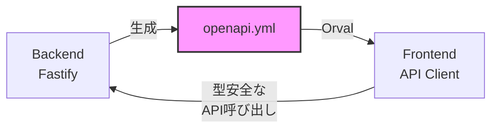
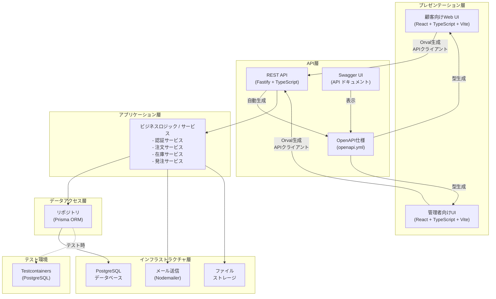
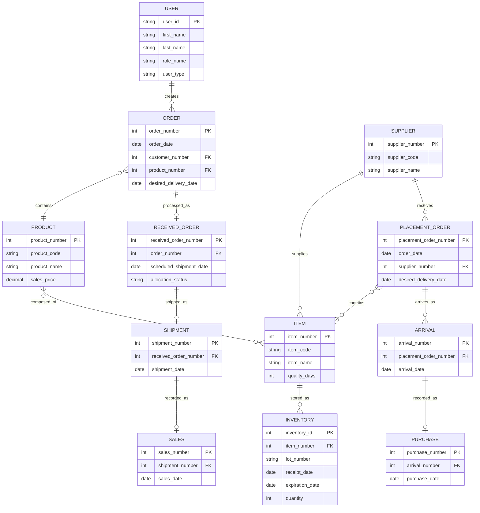
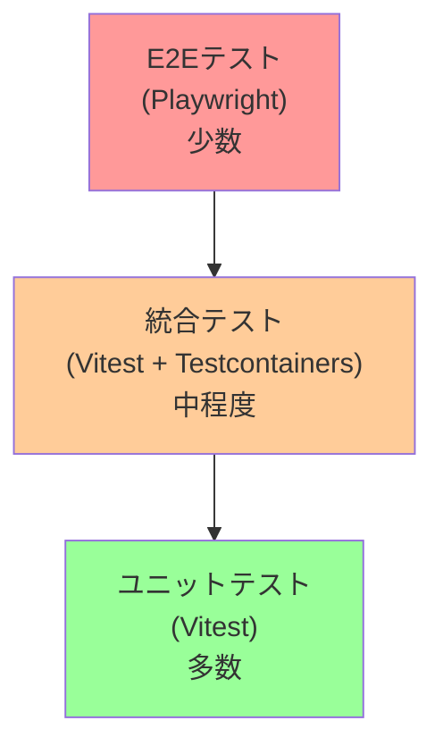

# 設計書

## 概要

花束管理システムは、フラワーショップ「フレール・メモワール」のWEB事業を支援する包括的なシステムです。本システムは以下の主要機能を提供します：

- **ユーザー管理**: 得意先とスタッフの認証・認可
- **商品管理**: 花束商品の登録・販売制御
- **注文管理**: 得意先からの注文受付・処理
- **在庫管理**: 単品の在庫追跡・品質管理
- **発注管理**: 仕入先への発注・入荷処理
- **出荷管理**: 商品のピッキング・配送

システムの核心的な課題は、賞味期限のある単品を効率的に管理し、廃棄を最小限に抑えながら、指定日に新鮮な花束を届けることです。

## 技術スタック

### フロントエンド

| カテゴリ | 技術 | バージョン/備考 |
|---------|------|----------------|
| フレームワーク | React | 18+ with TypeScript |
| ビルドツール | Vite | 5+ |
| 状態管理 | React Context API / Zustand | - |
| ルーティング | React Router | v6 |
| UIライブラリ | Material-UI (MUI) / Tailwind CSS | - |
| フォーム管理 | React Hook Form | - |
| HTTPクライアント | Axios | Orvalで自動生成 |
| 日付処理 | date-fns | - |
| バリデーション | Zod | - |

### バックエンド

| カテゴリ | 技術 | バージョン/備考 |
|---------|------|----------------|
| ランタイム | Node.js | 20+ with TypeScript |
| フレームワーク | Fastify | 4+ |
| ORM | Prisma | 5+ |
| データベース | PostgreSQL | 15+ |
| API仕様 | OpenAPI | 3.0 (openapi.yml) |
| API ドキュメント | Swagger UI | @fastify/swagger, @fastify/swagger-ui |
| 認証 | JWT | @fastify/jwt |
| パスワードハッシュ | bcrypt | - |
| バリデーション | Zod | @fastify/type-provider-zod |
| ロギング | Pino | Fastify組み込み |
| 環境変数管理 | dotenv | - |

### API連携

| カテゴリ | 技術 | 説明 |
|---------|------|------|
| 型生成 | Orval | OpenAPI → TypeScript型 + Axios client |
| スキーマ管理 | openapi.yml | バックエンドで生成、フロントエンドで利用 |
| 型安全性 | TypeScript | バックエンドとフロントエンドで共通の型定義 |

### 開発ツール

| カテゴリ | 技術 | 備考 |
|---------|------|------|
| パッケージマネージャー | npm / pnpm | - |
| リンター | ESLint | TypeScript ESLint, Prettier連携 |
| フォーマッター | Prettier | - |
| ユニットテスト | Vitest | - |
| 統合テスト | Vitest + Testcontainers | PostgreSQL |
| E2Eテスト | Playwright | - |
| 型チェック | TypeScript | 5+ |
| Git Hooks | Husky + lint-staged | - |
| タスクランナー | Gulp | ファイル監視、自動実行 |
| 循環参照検知 | dependency-cruiser | - |

### インフラストラクチャ

| カテゴリ | 技術 | 備考 |
|---------|------|------|
| コンテナ | Docker + Docker Compose | 開発環境 |
| リバースプロキシ | Nginx | 本番環境 |
| メール送信 | Nodemailer | - |
| ファイルストレージ | ローカルファイルシステム | AWS S3 (オプション) |

### プロジェクト構成

```
bouquet-management-system/
├── frontend/                 # Reactフロントエンド
│   ├── src/
│   │   ├── components/      # 再利用可能なコンポーネント
│   │   ├── pages/           # ページコンポーネント
│   │   ├── hooks/           # カスタムフック
│   │   ├── api/             # Orvalで生成されたAPIクライアント
│   │   ├── types/           # TypeScript型定義
│   │   ├── utils/           # ユーティリティ関数
│   │   └── App.tsx
│   ├── orval.config.ts      # Orval設定ファイル
│   ├── package.json
│   ├── vite.config.ts
│   └── tsconfig.json
│
├── backend/                  # Fastify + Prismaバックエンド
│   ├── src/
│   │   ├── routes/          # Fastifyルート定義
│   │   ├── services/        # ビジネスロジック
│   │   ├── repositories/    # データアクセス層（Prisma）
│   │   ├── plugins/         # Fastifyプラグイン
│   │   ├── schemas/         # Zodスキーマ定義
│   │   ├── types/           # TypeScript型定義
│   │   ├── utils/           # ユーティリティ関数
│   │   └── server.ts        # サーバーエントリーポイント
│   ├── prisma/
│   │   ├── schema.prisma    # Prismaスキーマ定義
│   │   ├── migrations/      # マイグレーションファイル
│   │   └── seed.ts          # シードデータ
│   ├── tests/
│   │   ├── integration/     # 統合テスト（Testcontainers）
│   │   └── unit/            # ユニットテスト
│   ├── openapi.yml          # OpenAPI仕様書（自動生成）
│   ├── package.json
│   └── tsconfig.json
│
├── docker-compose.yml        # 開発環境用Docker構成
└── README.md
```

### API連携フロー



1. **バックエンド**: Fastifyで`@fastify/swagger`を使用してOpenAPI仕様を自動生成
2. **openapi.yml**: バックエンドから生成されたAPI仕様書
3. **Orval**: openapi.ymlからTypeScript型とAxiosクライアントを自動生成
4. **フロントエンド**: 生成されたクライアントを使用して型安全なAPI呼び出し

## アーキテクチャ

### システムアーキテクチャ

本システムは、ヘキサゴナルアーキテクチャ（ポート＆アダプターパターン）を採用します。



### 境界づけられたコンテキスト

システムは以下のコンテキストに分割されます：

1. **認証コンテキスト**: ユーザー認証・認可
2. **ユーザーコンテキスト**: ユーザー情報管理
3. **商品コンテキスト**: 商品マスタ管理
4. **販売コンテキスト**: 商品販売制御
5. **注文コンテキスト**: 得意先注文管理
6. **受注コンテキスト**: スタッフ注文処理
7. **在庫コンテキスト**: 単品在庫管理
8. **発注コンテキスト**: 仕入先発注管理
9. **出荷コンテキスト**: 商品出荷管理
10. **得意先コンテキスト**: 得意先情報管理
11. **仕入先コンテキスト**: 仕入先情報管理

## コンポーネントとインターフェース

### 主要コンポーネント

#### 1. 認証コンポーネント
- **責務**: ユーザー認証・セッション管理
- **インターフェース**:
  - `authenticate(userId, password): AuthToken`
  - `validateSession(token): boolean`
  - `logout(token): void`

#### 2. ユーザー管理コンポーネント
- **責務**: ユーザーアカウントのCRUD操作
- **インターフェース**:
  - `registerUser(userData): User`
  - `updateUser(userId, userData): User`
  - `deactivateUser(userId): void`
  - `reactivateUser(userId): void`
  - `deleteUser(userId): void`

#### 3. 商品管理コンポーネント
- **責務**: 商品マスタと販売制御
- **インターフェース**:
  - `registerProduct(productData): Product`
  - `updateProduct(productId, productData): Product`
  - `stopSales(productId): void`
  - `resumeSales(productId): void`
  - `endSales(productId): void`

#### 4. 注文管理コンポーネント
- **責務**: 注文のライフサイクル管理
- **インターフェース**:
  - `placeOrder(orderData): Order`
  - `modifyOrder(orderId, changes): Order`
  - `cancelOrder(orderId): void`
  - `allocateInventory(orderId): AllocationResult`

#### 5. 在庫管理コンポーネント
- **責務**: 単品在庫の追跡と品質管理
- **インターフェース**:
  - `receiveItems(arrivalData): Inventory`
  - `allocateItems(orderId, items): void`
  - `getInventoryProjection(days): Projection[]`
  - `expireItems(date): void`

#### 6. 発注管理コンポーネント
- **責務**: 仕入先への発注処理
- **インターフェース**:
  - `createPlacementOrder(orderData): PlacementOrder`
  - `cancelPlacementOrder(orderId): boolean`
  - `receiveItems(orderId, items): Arrival`

#### 7. 出荷管理コンポーネント
- **責務**: 商品のピッキングと配送
- **インターフェース**:
  - `generatePickingList(date): PickingList`
  - `confirmPicking(pickingId): void`
  - `executeShipment(shipmentData): Shipment`

## ドメインモデル

### 集約とエンティティ

ドメイン駆動設計（DDD）の原則に従い、システムを以下の集約に分割します。

#### 1. ユーザー集約 (User Aggregate)

**集約ルート**: User

**エンティティ**:
- User（ユーザー）

**値オブジェクト**:
- UserId（ユーザーID）
- UserName（ユーザー名）
- Password（パスワード）
- Email（メールアドレス）
- RoleName（ロール名）

**ビジネスルール**:
- ユーザーIDは一意である
- パスワードはハッシュ化して保存する
- 無効化されたユーザーは認証できない

```typescript
class User {
  private constructor(
    private readonly id: UserId,
    private name: UserName,
    private password: Password,
    private email: Email,
    private role: RoleName,
    private status: UserStatus
  ) {}
  
  authenticate(password: string): boolean {
    return this.password.verify(password) && this.status.isActive()
  }
  
  deactivate(): void {
    this.status = UserStatus.INACTIVE
  }
  
  reactivate(): void {
    this.status = UserStatus.ACTIVE
  }
}
```

#### 2. 商品集約 (Product Aggregate)

**集約ルート**: Product

**エンティティ**:
- Product（商品）
- ProductComposition（商品構成）

**値オブジェクト**:
- ProductId（商品ID）
- ProductCode（商品コード）
- ProductName（商品名）
- Price（価格）
- SalesStatus（販売状態）

**ビジネスルール**:
- 商品コードは一意である
- 販売中の商品のみ注文可能
- 商品は複数の単品で構成される
- 保留中の注文がある商品は販売終了できない

```typescript
class Product {
  private constructor(
    private readonly id: ProductId,
    private readonly code: ProductCode,
    private name: ProductName,
    private salesPrice: Price,
    private costPrice: Price,
    private status: SalesStatus,
    private compositions: ProductComposition[]
  ) {}
  
  canOrder(): boolean {
    return this.status.isOnSale()
  }
  
  stopSales(): void {
    this.status = SalesStatus.STOPPED
  }
  
  resumeSales(): void {
    this.status = SalesStatus.ON_SALE
  }
  
  endSales(): void {
    if (this.hasPendingOrders()) {
      throw new Error('保留中の注文があるため販売終了できません')
    }
    this.status = SalesStatus.ENDED
  }
  
  getRequiredItems(): Map<ItemId, number> {
    return this.compositions.reduce((map, comp) => {
      map.set(comp.itemId, comp.quantity)
      return map
    }, new Map())
  }
}
```

#### 3. 注文集約 (Order Aggregate)

**集約ルート**: Order

**エンティティ**:
- Order（注文）
- ReceivedOrder（受注）
- Shipment（出荷）
- Sales（売上）

**値オブジェクト**:
- OrderId（注文ID）
- OrderDate（注文日）
- DeliveryDate（配送日）
- DeliveryAddress（配送先住所）
- OrderStatus（注文状態）

**ビジネスルール**:
- 1注文につき1商品のみ
- 配送日は注文日の2日後以降
- 出荷日は配送日の1日前
- 出荷済みの注文は変更・キャンセル不可

```typescript
class Order {
  private constructor(
    private readonly id: OrderId,
    private readonly customerId: CustomerId,
    private readonly productId: ProductId,
    private quantity: number,
    private deliveryDate: DeliveryDate,
    private deliveryAddress: DeliveryAddress,
    private status: OrderStatus
  ) {}
  
  static create(
    customerId: CustomerId,
    productId: ProductId,
    quantity: number,
    deliveryDate: DeliveryDate,
    deliveryAddress: DeliveryAddress
  ): Order {
    const orderDate = new Date()
    if (!deliveryDate.isAtLeast2DaysAfter(orderDate)) {
      throw new Error('配送日は注文日の2日後以降である必要があります')
    }
    
    return new Order(
      OrderId.generate(),
      customerId,
      productId,
      quantity,
      deliveryDate,
      deliveryAddress,
      OrderStatus.PENDING
    )
  }
  
  changeDeliveryDate(newDate: DeliveryDate): void {
    if (this.status.isShipped()) {
      throw new Error('出荷済みの注文は変更できません')
    }
    this.deliveryDate = newDate
  }
  
  cancel(): void {
    if (this.status.isShipped()) {
      throw new Error('出荷済みの注文はキャンセルできません')
    }
    this.status = OrderStatus.CANCELLED
  }
  
  getShipmentDate(): Date {
    return this.deliveryDate.getOneDayBefore()
  }
}
```

#### 4. 在庫集約 (Inventory Aggregate)

**集約ルート**: Item

**エンティティ**:
- Item（単品）
- Inventory（在庫）
- InventoryLot（在庫ロット）

**値オブジェクト**:
- ItemId（単品ID）
- ItemCode（単品コード）
- ItemName（単品名）
- QualityDays（品質維持可能日数）
- LeadTime（リードタイム）
- LotNumber（ロット番号）
- Quantity（数量）

**ビジネスルール**:
- 単品コードは一意である
- 在庫はロット単位で管理される
- 品質維持可能日数を超えた在庫は期限切れ
- 期限切れの在庫は利用不可

```typescript
class Item {
  private constructor(
    private readonly id: ItemId,
    private readonly code: ItemCode,
    private name: ItemName,
    private readonly qualityDays: QualityDays,
    private readonly leadTime: LeadTime,
    private readonly supplierId: SupplierId
  ) {}
  
  isExpired(receiptDate: Date, currentDate: Date): boolean {
    const expirationDate = new Date(receiptDate)
    expirationDate.setDate(expirationDate.getDate() + this.qualityDays.value)
    return currentDate > expirationDate
  }
  
  getMinimumOrderDate(desiredDeliveryDate: Date): Date {
    const minDate = new Date(desiredDeliveryDate)
    minDate.setDate(minDate.getDate() - this.leadTime.value)
    return minDate
  }
}

class InventoryLot {
  private constructor(
    private readonly itemId: ItemId,
    private readonly lotNumber: LotNumber,
    private readonly receiptDate: Date,
    private quantity: Quantity,
    private allocatedQuantity: Quantity
  ) {}
  
  getAvailableQuantity(): number {
    return this.quantity.value - this.allocatedQuantity.value
  }
  
  allocate(quantity: number): void {
    if (this.getAvailableQuantity() < quantity) {
      throw new Error('利用可能な在庫が不足しています')
    }
    this.allocatedQuantity = new Quantity(this.allocatedQuantity.value + quantity)
  }
  
  isExpired(item: Item, currentDate: Date): boolean {
    return item.isExpired(this.receiptDate, currentDate)
  }
}
```

#### 5. 発注集約 (PlacementOrder Aggregate)

**集約ルート**: PlacementOrder

**エンティティ**:
- PlacementOrder（発注）
- PlacementOrderLine（発注明細）
- Arrival（入荷）
- ArrivalLine（入荷明細）

**値オブジェクト**:
- PlacementOrderId（発注ID）
- OrderDate（発注日）
- DesiredDeliveryDate（希望納品日）
- PlacementOrderStatus（発注状態）

**ビジネスルール**:
- 納品日は発注日のリードタイム日数後以降
- 発注数量は購入単位数量の倍数
- 入荷済みの発注はキャンセル不可

```typescript
class PlacementOrder {
  private constructor(
    private readonly id: PlacementOrderId,
    private readonly supplierId: SupplierId,
    private readonly orderDate: Date,
    private desiredDeliveryDate: Date,
    private lines: PlacementOrderLine[],
    private status: PlacementOrderStatus
  ) {}
  
  static create(
    supplierId: SupplierId,
    orderDate: Date,
    desiredDeliveryDate: Date,
    lines: PlacementOrderLine[]
  ): PlacementOrder {
    // リードタイムチェック
    for (const line of lines) {
      const minOrderDate = line.item.getMinimumOrderDate(desiredDeliveryDate)
      if (orderDate < minOrderDate) {
        throw new Error(`リードタイムが不足しています: ${line.item.name}`)
      }
    }
    
    return new PlacementOrder(
      PlacementOrderId.generate(),
      supplierId,
      orderDate,
      desiredDeliveryDate,
      lines,
      PlacementOrderStatus.PENDING
    )
  }
  
  cancel(): void {
    if (this.status.isArrived()) {
      throw new Error('入荷済みの発注はキャンセルできません')
    }
    this.status = PlacementOrderStatus.CANCELLED
  }
}

class PlacementOrderLine {
  private constructor(
    private readonly itemId: ItemId,
    private readonly item: Item,
    private quantity: number,
    private readonly purchaseUnit: number
  ) {
    if (quantity % purchaseUnit !== 0) {
      throw new Error(`発注数量は購入単位数量(${purchaseUnit})の倍数である必要があります`)
    }
  }
}
```

#### 6. 得意先集約 (Customer Aggregate)

**集約ルート**: Customer

**エンティティ**:
- Customer（得意先）

**値オブジェクト**:
- CustomerId（得意先ID）
- CustomerCode（得意先コード）
- CustomerName（得意先名）
- ContactInfo（連絡先情報）

**ビジネスルール**:
- 得意先コードは一意である
- 連絡先情報は必須

#### 7. 仕入先集約 (Supplier Aggregate)

**集約ルート**: Supplier

**エンティティ**:
- Supplier（仕入先）

**値オブジェクト**:
- SupplierId（仕入先ID）
- SupplierCode（仕入先コード）
- SupplierName（仕入先名）
- ContactInfo（連絡先情報）
- TradingStatus（取引状態）

**ビジネスルール**:
- 仕入先コードは一意である
- 取引停止中の仕入先には発注不可

### ドメインサービス

集約をまたがるビジネスロジックはドメインサービスとして実装します。

#### 在庫引当サービス (InventoryAllocationService)

```typescript
class InventoryAllocationService {
  allocate(order: Order, product: Product, inventory: Inventory): AllocationResult {
    const requiredItems = product.getRequiredItems()
    const allocations: Map<ItemId, InventoryLot[]> = new Map()
    
    for (const [itemId, requiredQuantity] of requiredItems) {
      const availableLots = inventory.getAvailableLots(itemId, order.getShipmentDate())
      const allocated = this.allocateFromLots(availableLots, requiredQuantity)
      
      if (allocated.totalQuantity < requiredQuantity) {
        return AllocationResult.insufficient(itemId, requiredQuantity, allocated.totalQuantity)
      }
      
      allocations.set(itemId, allocated.lots)
    }
    
    return AllocationResult.success(allocations)
  }
  
  private allocateFromLots(lots: InventoryLot[], requiredQuantity: number): AllocatedLots {
    // FIFO（先入先出）で在庫を引き当てる
    const allocatedLots: InventoryLot[] = []
    let remainingQuantity = requiredQuantity
    
    for (const lot of lots) {
      if (remainingQuantity <= 0) break
      
      const availableQuantity = lot.getAvailableQuantity()
      const allocateQuantity = Math.min(availableQuantity, remainingQuantity)
      
      lot.allocate(allocateQuantity)
      allocatedLots.push(lot)
      remainingQuantity -= allocateQuantity
    }
    
    return new AllocatedLots(allocatedLots, requiredQuantity - remainingQuantity)
  }
}
```

#### 在庫推移計算サービス (InventoryProjectionService)

```typescript
class InventoryProjectionService {
  calculate(itemId: ItemId, days: number): InventoryProjection[] {
    const projections: InventoryProjection[] = []
    const currentDate = new Date()
    
    for (let i = 0; i < days; i++) {
      const targetDate = new Date(currentDate)
      targetDate.setDate(targetDate.getDate() + i)
      
      const currentInventory = this.getCurrentInventory(itemId, targetDate)
      const scheduledArrivals = this.getScheduledArrivals(itemId, targetDate)
      const scheduledAllocations = this.getScheduledAllocations(itemId, targetDate)
      
      const projectedQuantity = currentInventory + scheduledArrivals - scheduledAllocations
      
      projections.push(new InventoryProjection(
        targetDate,
        currentInventory,
        scheduledArrivals,
        scheduledAllocations,
        projectedQuantity
      ))
    }
    
    return projections
  }
}
```

### リポジトリインターフェース

各集約に対応するリポジトリインターフェースを定義します。

```typescript
interface UserRepository {
  findById(id: UserId): Promise<User | null>
  findByEmail(email: Email): Promise<User | null>
  save(user: User): Promise<void>
  delete(id: UserId): Promise<void>
}

interface ProductRepository {
  findById(id: ProductId): Promise<Product | null>
  findByCode(code: ProductCode): Promise<Product | null>
  findOnSale(): Promise<Product[]>
  save(product: Product): Promise<void>
}

interface OrderRepository {
  findById(id: OrderId): Promise<Order | null>
  findByCustomerId(customerId: CustomerId): Promise<Order[]>
  findPendingOrders(): Promise<Order[]>
  save(order: Order): Promise<void>
}

interface InventoryRepository {
  findByItemId(itemId: ItemId): Promise<Inventory>
  findAvailableLots(itemId: ItemId, beforeDate: Date): Promise<InventoryLot[]>
  save(inventory: Inventory): Promise<void>
}

interface PlacementOrderRepository {
  findById(id: PlacementOrderId): Promise<PlacementOrder | null>
  findBySupplierId(supplierId: SupplierId): Promise<PlacementOrder[]>
  save(order: PlacementOrder): Promise<void>
}
```

## データモデル

### ER図（概念レベル）



### データベーススキーマ

#### 認証スキーマ (auth)

##### ユーザーテーブル (ユーザー)

| カラム名 | 型 | 制約 | 説明 |
|---------|-----|------|------|
| ユーザーID | VARCHAR(255) | PK | ユーザー識別子 |
| 姓 | VARCHAR(255) | NOT NULL | ユーザーの姓 |
| 名 | VARCHAR(255) | NOT NULL | ユーザーの名 |
| パスワード | VARCHAR(255) | NOT NULL | ハッシュ化されたパスワード |
| ロール名 | VARCHAR(50) | NOT NULL | ユーザーの役割（管理者、一般） |
| 登録区分 | VARCHAR(50) | NOT NULL | 登録状態（有効、無効） |
| ユーザー区分 | VARCHAR(50) | NOT NULL | ユーザータイプ（得意先、スタッフ） |
| 作成日時 | TIMESTAMP | NOT NULL | レコード作成日時 |
| 更新日時 | TIMESTAMP | NOT NULL | レコード更新日時 |

#### 注文スキーマ (orders)

##### 商品テーブル (商品)

| カラム名 | 型 | 制約 | 説明 |
|---------|-----|------|------|
| 商品番号 | INTEGER | PK, AUTO_INCREMENT | 商品識別子 |
| 商品コード | VARCHAR(6) | UNIQUE, NOT NULL | 商品コード |
| 商品名称 | VARCHAR(40) | NOT NULL | 商品名 |
| 商品略称 | VARCHAR(40) | | 商品略称 |
| 商品区分 | VARCHAR(5) | NOT NULL | 商品タイプ |
| 販売単価 | DECIMAL(8,0) | NOT NULL | 販売価格 |
| 仕入単価 | DECIMAL(8,0) | NOT NULL | 仕入価格 |
| 税区分 | VARCHAR(5) | NOT NULL | 税タイプ |
| 販売状態 | VARCHAR(20) | NOT NULL | 販売中、販売停止、販売終了 |
| 作成者 | VARCHAR(40) | NOT NULL | レコード作成者 |
| 作成日時 | TIMESTAMP | NOT NULL | レコード作成日時 |
| 更新日時 | TIMESTAMP | NOT NULL | レコード更新日時 |

##### 商品構成テーブル (商品構成)

| カラム名 | 型 | 制約 | 説明 |
|---------|-----|------|------|
| 商品番号 | INTEGER | PK, FK | 商品識別子 |
| 単品番号 | INTEGER | PK, FK | 単品識別子 |
| 必要数量 | INTEGER | NOT NULL | 商品1個あたりの必要数量 |

##### 得意先テーブル (得意先)

| カラム名 | 型 | 制約 | 説明 |
|---------|-----|------|------|
| 得意先番号 | INTEGER | PK, AUTO_INCREMENT | 得意先識別子 |
| 得意先コード | VARCHAR(40) | UNIQUE, NOT NULL | 得意先コード |
| 得意先名称 | VARCHAR(40) | NOT NULL | 得意先名 |
| 連絡先電話番号 | VARCHAR(20) | | 電話番号 |
| 連絡先メールアドレス | VARCHAR(100) | | メールアドレス |
| クレジットカード情報 | VARCHAR(255) | | 暗号化されたカード情報 |
| 作成者 | VARCHAR(40) | NOT NULL | レコード作成者 |
| 作成日時 | TIMESTAMP | NOT NULL | レコード作成日時 |
| 更新日時 | TIMESTAMP | NOT NULL | レコード更新日時 |

##### 注文テーブル (注文)

| カラム名 | 型 | 制約 | 説明 |
|---------|-----|------|------|
| 注文番号 | INTEGER | PK, AUTO_INCREMENT | 注文識別子 |
| 注文日 | DATE | NOT NULL | 注文日 |
| 得意先番号 | INTEGER | FK, NOT NULL | 得意先識別子 |
| 商品番号 | INTEGER | FK, NOT NULL | 商品識別子 |
| 数量 | INTEGER | NOT NULL | 注文数量 |
| 希望配送日 | DATE | NOT NULL | 希望配送日 |
| 配送先住所 | VARCHAR(200) | NOT NULL | 配送先住所 |
| 配送先電話番号 | VARCHAR(20) | NOT NULL | 配送先電話番号 |
| 配送メッセージ | TEXT | | 配送メッセージ |
| 注文状態 | VARCHAR(20) | NOT NULL | 未処理、処理中、完了、キャンセル |
| 作成者 | VARCHAR(40) | NOT NULL | レコード作成者 |
| 作成日時 | TIMESTAMP | NOT NULL | レコード作成日時 |
| 更新日時 | TIMESTAMP | NOT NULL | レコード更新日時 |

##### 受注テーブル (受注)

| カラム名 | 型 | 制約 | 説明 |
|---------|-----|------|------|
| 受注番号 | INTEGER | PK, AUTO_INCREMENT | 受注識別子 |
| 注文番号 | INTEGER | FK, UNIQUE, NOT NULL | 注文識別子 |
| 受注日 | DATE | NOT NULL | 受注日 |
| 出荷予定日 | DATE | NOT NULL | 出荷予定日 |
| 引当状態 | VARCHAR(20) | NOT NULL | 未引当、引当済 |
| 受注金額合計 | DECIMAL(10,0) | NOT NULL | 受注金額合計 |
| 消費税合計 | DECIMAL(10,0) | NOT NULL | 消費税合計 |
| 作成者 | VARCHAR(40) | NOT NULL | レコード作成者 |
| 作成日時 | TIMESTAMP | NOT NULL | レコード作成日時 |
| 更新日時 | TIMESTAMP | NOT NULL | レコード更新日時 |

##### 出荷テーブル (出荷)

| カラム名 | 型 | 制約 | 説明 |
|---------|-----|------|------|
| 出荷番号 | INTEGER | PK, AUTO_INCREMENT | 出荷識別子 |
| 受注番号 | INTEGER | FK, UNIQUE, NOT NULL | 受注識別子 |
| 出荷日 | DATE | NOT NULL | 出荷日 |
| 配送業者 | VARCHAR(100) | | 配送業者名 |
| 追跡番号 | VARCHAR(100) | | 追跡番号 |
| 作成者 | VARCHAR(40) | NOT NULL | レコード作成者 |
| 作成日時 | TIMESTAMP | NOT NULL | レコード作成日時 |
| 更新日時 | TIMESTAMP | NOT NULL | レコード更新日時 |

##### 売上テーブル (売上)

| カラム名 | 型 | 制約 | 説明 |
|---------|-----|------|------|
| 売上番号 | INTEGER | PK, AUTO_INCREMENT | 売上識別子 |
| 出荷番号 | INTEGER | FK, UNIQUE, NOT NULL | 出荷識別子 |
| 売上日 | DATE | NOT NULL | 売上日 |
| 売上金額合計 | DECIMAL(10,0) | NOT NULL | 売上金額合計 |
| 消費税合計 | DECIMAL(10,0) | NOT NULL | 消費税合計 |
| 作成者 | VARCHAR(40) | NOT NULL | レコード作成者 |
| 作成日時 | TIMESTAMP | NOT NULL | レコード作成日時 |
| 更新日時 | TIMESTAMP | NOT NULL | レコード更新日時 |

##### 返品テーブル (返品)

| カラム名 | 型 | 制約 | 説明 |
|---------|-----|------|------|
| 返品番号 | INTEGER | PK, AUTO_INCREMENT | 返品識別子 |
| 注文番号 | INTEGER | FK, NOT NULL | 注文識別子 |
| 返品日 | DATE | NOT NULL | 返品日 |
| 返品理由 | TEXT | | 返品理由 |
| 返金金額 | DECIMAL(10,0) | NOT NULL | 返金金額 |
| 処理状態 | VARCHAR(20) | NOT NULL | 未処理、処理中、完了 |
| 作成者 | VARCHAR(40) | NOT NULL | レコード作成者 |
| 作成日時 | TIMESTAMP | NOT NULL | レコード作成日時 |
| 更新日時 | TIMESTAMP | NOT NULL | レコード更新日時 |

#### 在庫スキーマ (inventories)

##### 単品テーブル (単品)

| カラム名 | 型 | 制約 | 説明 |
|---------|-----|------|------|
| 単品番号 | INTEGER | PK, AUTO_INCREMENT | 単品識別子 |
| 単品コード | VARCHAR(40) | UNIQUE, NOT NULL | 単品コード |
| 単品名称 | VARCHAR(40) | NOT NULL | 単品名 |
| 仕入先番号 | INTEGER | FK, NOT NULL | 仕入先識別子 |
| 品質維持可能日数 | INTEGER | NOT NULL | 品質維持可能日数 |
| リードタイム | INTEGER | NOT NULL | 発注から入荷までの日数 |
| 購入単位数量 | INTEGER | NOT NULL | 購入単位数量 |
| 仕入単価 | DECIMAL(8,0) | NOT NULL | 仕入単価 |
| 作成者 | VARCHAR(40) | NOT NULL | レコード作成者 |
| 作成日時 | TIMESTAMP | NOT NULL | レコード作成日時 |
| 更新日時 | TIMESTAMP | NOT NULL | レコード更新日時 |

##### 仕入先テーブル (仕入先)

| カラム名 | 型 | 制約 | 説明 |
|---------|-----|------|------|
| 仕入先番号 | INTEGER | PK, AUTO_INCREMENT | 仕入先識別子 |
| 仕入先コード | VARCHAR(40) | UNIQUE, NOT NULL | 仕入先コード |
| 仕入先名称 | VARCHAR(40) | NOT NULL | 仕入先名 |
| 連絡先電話番号 | VARCHAR(20) | | 電話番号 |
| 連絡先メールアドレス | VARCHAR(100) | | メールアドレス |
| 取引状態 | VARCHAR(20) | NOT NULL | 取引中、取引停止、取引終了 |
| 作成者 | VARCHAR(40) | NOT NULL | レコード作成者 |
| 作成日時 | TIMESTAMP | NOT NULL | レコード作成日時 |
| 更新日時 | TIMESTAMP | NOT NULL | レコード更新日時 |

##### 在庫テーブル (在庫)

| カラム名 | 型 | 制約 | 説明 |
|---------|-----|------|------|
| 在庫ID | INTEGER | PK, AUTO_INCREMENT | 在庫識別子 |
| 単品番号 | INTEGER | FK, NOT NULL | 単品識別子 |
| ロット番号 | VARCHAR(50) | NOT NULL | ロット番号 |
| 入荷日 | DATE | NOT NULL | 入荷日 |
| 有効期限 | DATE | NOT NULL | 有効期限 |
| 数量 | INTEGER | NOT NULL | 在庫数量 |
| 引当済数量 | INTEGER | NOT NULL | 引当済数量 |
| 利用可能数量 | INTEGER | NOT NULL | 利用可能数量 |
| 在庫状態 | VARCHAR(20) | NOT NULL | 有効、期限切れ |
| 作成者 | VARCHAR(40) | NOT NULL | レコード作成者 |
| 作成日時 | TIMESTAMP | NOT NULL | レコード作成日時 |
| 更新日時 | TIMESTAMP | NOT NULL | レコード更新日時 |

##### 発注テーブル (発注)

| カラム名 | 型 | 制約 | 説明 |
|---------|-----|------|------|
| 発注番号 | INTEGER | PK, AUTO_INCREMENT | 発注識別子 |
| 発注日 | DATE | NOT NULL | 発注日 |
| 仕入先番号 | INTEGER | FK, NOT NULL | 仕入先識別子 |
| 希望納品日 | DATE | NOT NULL | 希望納品日 |
| 発注金額合計 | DECIMAL(10,0) | NOT NULL | 発注金額合計 |
| 消費税合計 | DECIMAL(10,0) | NOT NULL | 消費税合計 |
| 発注状態 | VARCHAR(20) | NOT NULL | 未入荷、一部入荷、入荷済、キャンセル |
| 作成者 | VARCHAR(40) | NOT NULL | レコード作成者 |
| 作成日時 | TIMESTAMP | NOT NULL | レコード作成日時 |
| 更新日時 | TIMESTAMP | NOT NULL | レコード更新日時 |

##### 発注明細テーブル (発注明細)

| カラム名 | 型 | 制約 | 説明 |
|---------|-----|------|------|
| 発注明細番号 | INTEGER | PK, AUTO_INCREMENT | 発注明細識別子 |
| 発注番号 | INTEGER | FK, NOT NULL | 発注識別子 |
| 単品番号 | INTEGER | FK, NOT NULL | 単品識別子 |
| 発注数量 | INTEGER | NOT NULL | 発注数量 |
| 入荷済数量 | INTEGER | NOT NULL | 入荷済数量 |
| 仕入単価 | DECIMAL(8,0) | NOT NULL | 仕入単価 |
| 作成者 | VARCHAR(40) | NOT NULL | レコード作成者 |
| 作成日時 | TIMESTAMP | NOT NULL | レコード作成日時 |
| 更新日時 | TIMESTAMP | NOT NULL | レコード更新日時 |

##### 入荷テーブル (入荷)

| カラム名 | 型 | 制約 | 説明 |
|---------|-----|------|------|
| 入荷番号 | INTEGER | PK, AUTO_INCREMENT | 入荷識別子 |
| 発注番号 | INTEGER | FK, NOT NULL | 発注識別子 |
| 入荷日 | DATE | NOT NULL | 入荷日 |
| 検収状態 | VARCHAR(20) | NOT NULL | 未検収、検収済、返品 |
| 作成者 | VARCHAR(40) | NOT NULL | レコード作成者 |
| 作成日時 | TIMESTAMP | NOT NULL | レコード作成日時 |
| 更新日時 | TIMESTAMP | NOT NULL | レコード更新日時 |

##### 入荷明細テーブル (入荷明細)

| カラム名 | 型 | 制約 | 説明 |
|---------|-----|------|------|
| 入荷明細番号 | INTEGER | PK, AUTO_INCREMENT | 入荷明細識別子 |
| 入荷番号 | INTEGER | FK, NOT NULL | 入荷識別子 |
| 発注明細番号 | INTEGER | FK, NOT NULL | 発注明細識別子 |
| 単品番号 | INTEGER | FK, NOT NULL | 単品識別子 |
| 入荷数量 | INTEGER | NOT NULL | 入荷数量 |
| 検収結果 | VARCHAR(20) | NOT NULL | 合格、不合格 |
| 作成者 | VARCHAR(40) | NOT NULL | レコード作成者 |
| 作成日時 | TIMESTAMP | NOT NULL | レコード作成日時 |
| 更新日時 | TIMESTAMP | NOT NULL | レコード更新日時 |

##### 仕入テーブル (仕入)

| カラム名 | 型 | 制約 | 説明 |
|---------|-----|------|------|
| 仕入番号 | INTEGER | PK, AUTO_INCREMENT | 仕入識別子 |
| 入荷番号 | INTEGER | FK, UNIQUE, NOT NULL | 入荷識別子 |
| 仕入日 | DATE | NOT NULL | 仕入日 |
| 仕入金額合計 | DECIMAL(10,0) | NOT NULL | 仕入金額合計 |
| 消費税合計 | DECIMAL(10,0) | NOT NULL | 消費税合計 |
| 作成者 | VARCHAR(40) | NOT NULL | レコード作成者 |
| 作成日時 | TIMESTAMP | NOT NULL | レコード作成日時 |
| 更新日時 | TIMESTAMP | NOT NULL | レコード更新日時 |

### シードデータ仕様

ビジネス概要に基づき、以下のシードデータを作成します。

#### ビジネス要件

- 従業員数: 3名（管理者1名、一般スタッフ2名）
- 主力商品: 10商品
- 1商品あたりの平均構成: 5単品
- 仕入先: 5社
- 平均客単価: 3000円
- 原価率: 70%

#### シードデータ内容

##### 1. ユーザー（8名）

**スタッフ（3名）**:
- 管理者: `admin@example.com` / パスワード: `Admin123!`
- 一般スタッフ1: `staff1@example.com` / パスワード: `Staff123!`
- 一般スタッフ2: `staff2@example.com` / パスワード: `Staff123!`

**テスト用得意先（5名）**:
- `customer1@example.com` ～ `customer5@example.com` / パスワード: `Customer123!`

##### 2. 仕入先（5社）

| 仕入先コード | 仕入先名称 | 連絡先電話番号 | 連絡先メールアドレス | 取引状態 |
|------------|----------|--------------|-------------------|---------|
| SUP001 | 花卸売センター | 03-1234-5678 | info@hanaorosuri.example.com | 取引中 |
| SUP002 | グリーンフラワー | 03-2345-6789 | contact@greenflower.example.com | 取引中 |
| SUP003 | フローラルマート | 03-3456-7890 | sales@floralmart.example.com | 取引中 |
| SUP004 | ブルームサプライ | 03-4567-8901 | info@bloomsupply.example.com | 取引中 |
| SUP005 | ペタルホールセール | 03-5678-9012 | orders@petalwholesale.example.com | 取引中 |

##### 3. 単品（25種類）

各仕入先から5種類ずつ、合計25種類の単品を作成：

**花卸売センター（SUP001）**:
- バラ（赤）: 品質維持7日、リードタイム2日、購入単位10本、仕入単価150円
- カーネーション（ピンク）: 品質維持5日、リードタイム1日、購入単位10本、仕入単価100円
- ガーベラ（オレンジ）: 品質維持5日、リードタイム2日、購入単位10本、仕入単価120円
- ユリ（白）: 品質維持7日、リードタイム3日、購入単位5本、仕入単価200円
- チューリップ（黄）: 品質維持4日、リードタイム2日、購入単位10本、仕入単価80円

**グリーンフラワー（SUP002）**:
- かすみ草: 品質維持5日、リードタイム1日、購入単位20本、仕入単価50円
- ユーカリ: 品質維持7日、リードタイム2日、購入単位10本、仕入単価100円
- レザーファン: 品質維持7日、リードタイム1日、購入単位20本、仕入単価60円
- ドラセナ: 品質維持7日、リードタイム2日、購入単位10本、仕入単価80円
- アイビー: 品質維持7日、リードタイム1日、購入単位10本、仕入単価70円

**フローラルマート（SUP003）**:
- バラ（ピンク）: 品質維持7日、リードタイム2日、購入単位10本、仕入単価150円
- トルコキキョウ（紫）: 品質維持5日、リードタイム2日、購入単位10本、仕入単価130円
- スプレーバラ（白）: 品質維持6日、リードタイム2日、購入単位10本、仕入単価140円
- アルストロメリア（赤）: 品質維持6日、リードタイム2日、購入単位10本、仕入単価110円
- スターチス（青）: 品質維持7日、リードタイム1日、購入単位10本、仕入単価90円

**ブルームサプライ（SUP004）**:
- ひまわり: 品質維持5日、リードタイム2日、購入単位10本、仕入単価120円
- デルフィニウム（青）: 品質維持4日、リードタイム3日、購入単位10本、仕入単価180円
- ラナンキュラス（ピンク）: 品質維持5日、リードタイム2日、購入単位10本、仕入単価160円
- スイートピー（紫）: 品質維持4日、リードタイム2日、購入単位10本、仕入単価140円
- フリージア（黄）: 品質維持5日、リードタイム2日、購入単位10本、仕入単価100円

**ペタルホールセール（SUP005）**:
- バラ（黄）: 品質維持7日、リードタイム2日、購入単位10本、仕入単価150円
- カーネーション（白）: 品質維持5日、リードタイム1日、購入単位10本、仕入単価100円
- ガーベラ（ピンク）: 品質維持5日、リードタイム2日、購入単位10本、仕入単価120円
- スプレーマム（黄）: 品質維持6日、リードタイム2日、購入単位10本、仕入単価110円
- カラー（白）: 品質維持6日、リードタイム3日、購入単位5本、仕入単価200円

##### 4. 商品（10商品）

各商品は5単品で構成、販売単価3000円前後、原価率70%（仕入単価2100円前後）：

| 商品コード | 商品名称 | 販売単価 | 仕入単価 | 構成単品 |
|----------|---------|---------|---------|---------|
| PRD001 | ロマンティックローズブーケ | 3,000円 | 2,100円 | バラ（赤）×3、かすみ草×2、ユーカリ×2、レザーファン×3、リボン |
| PRD002 | エレガントピンクアレンジ | 3,200円 | 2,240円 | バラ（ピンク）×3、カーネーション（ピンク）×2、トルコキキョウ×2、ドラセナ×2、かすみ草×1 |
| PRD003 | サニーイエローブーケ | 2,800円 | 1,960円 | ひまわり×2、バラ（黄）×2、チューリップ×3、ユーカリ×2、レザーファン×2 |
| PRD004 | ピュアホワイトアレンジ | 3,500円 | 2,450円 | ユリ（白）×2、スプレーバラ（白）×3、カーネーション（白）×2、かすみ草×3、アイビー×2 |
| PRD005 | カラフルミックスブーケ | 3,000円 | 2,100円 | ガーベラ（オレンジ）×2、ガーベラ（ピンク）×2、アルストロメリア×2、スターチス×2、ユーカリ×2 |
| PRD006 | パープルエレガンス | 3,300円 | 2,310円 | トルコキキョウ×3、デルフィニウム×2、スイートピー×2、かすみ草×2、ドラセナ×2 |
| PRD007 | スプリングガーデン | 2,900円 | 2,030円 | チューリップ×3、ラナンキュラス×2、フリージア×2、かすみ草×2、レザーファン×2 |
| PRD008 | トロピカルサンセット | 3,100円 | 2,170円 | ガーベラ（オレンジ）×3、ひまわり×2、スプレーマム×2、ユーカリ×2、アイビー×2 |
| PRD009 | ロイヤルブルーブーケ | 3,400円 | 2,380円 | デルフィニウム×3、スターチス×2、トルコキキョウ×2、かすみ草×2、ドラセナ×2 |
| PRD010 | クラシックレッドアレンジ | 3,200円 | 2,240円 | バラ（赤）×4、カーネーション（ピンク）×2、アルストロメリア×2、ユーカリ×2、レザーファン×2 |

##### 5. 在庫

各単品に初期在庫を設定：
- 各単品: 50～100本の在庫
- ロット番号: 入荷日ベース（例: LOT-20250120）
- 入荷日: システム起動日の3日前
- 有効期限: 入荷日 + 品質維持可能日数

##### 6. 得意先（10名）

| 得意先コード | 得意先名称 | 連絡先電話番号 | 連絡先メールアドレス |
|------------|----------|--------------|-------------------|
| CUS001 | 山田太郎 | 090-1234-5678 | yamada@example.com |
| CUS002 | 佐藤花子 | 090-2345-6789 | sato@example.com |
| CUS003 | 鈴木一郎 | 090-3456-7890 | suzuki@example.com |
| CUS004 | 田中美咲 | 090-4567-8901 | tanaka@example.com |
| CUS005 | 伊藤健太 | 090-5678-9012 | ito@example.com |
| CUS006 | 渡辺さくら | 090-6789-0123 | watanabe@example.com |
| CUS007 | 高橋大輔 | 090-7890-1234 | takahashi@example.com |
| CUS008 | 中村愛 | 090-8901-2345 | nakamura@example.com |
| CUS009 | 小林翔太 | 090-9012-3456 | kobayashi@example.com |
| CUS010 | 加藤美優 | 090-0123-4567 | kato@example.com |

#### シードデータ作成の実装方針

1. **トランザクション管理**: すべてのシードデータを1つのトランザクションで作成
2. **依存関係の順序**: 仕入先 → 単品 → 商品 → 商品構成 → 在庫 → ユーザー → 得意先
3. **冪等性**: 既存データがある場合は削除してから作成（開発環境のみ）
4. **検証**: 作成後にデータの整合性を検証
5. **ログ出力**: 作成したデータの件数とサマリーを出力

## エラーハンドリング

### エラー分類

システムで発生するエラーを以下のように分類します：

1. **バリデーションエラー** (400 Bad Request)
   - 入力データの形式エラー
   - 必須項目の欠落
   - データ型の不一致

2. **認証・認可エラー** (401 Unauthorized / 403 Forbidden)
   - 認証情報の不正
   - アクセス権限の不足

3. **ビジネスロジックエラー** (422 Unprocessable Entity)
   - 在庫不足
   - 期限切れ商品
   - 注文変更不可

4. **システムエラー** (500 Internal Server Error)
   - データベース接続エラー
   - 外部サービスエラー
   - 予期しないエラー

### エラーレスポンス形式

```typescript
interface ErrorResponse {
  error: {
    code: string          // エラーコード
    message: string       // エラーメッセージ
    details?: unknown     // 詳細情報（オプション）
    timestamp: string     // エラー発生時刻
    path: string          // リクエストパス
  }
}
```

### エラーハンドリング戦略

- **Fastifyエラーハンドラー**: グローバルエラーハンドラーで統一的なエラーレスポンス
- **カスタムエラークラス**: ビジネスロジックエラー用のカスタムエラー
- **ロギング**: Pinoによる構造化ログ出力
- **リトライ**: 一時的なエラーに対する自動リトライ（データベース接続など）

## テスト戦略

### テストピラミッド



### ユニットテスト

**対象**: 個別の関数、クラス、モジュール

**ツール**: Vitest

**カバレッジ目標**: 80%以上

**テスト対象例**:
- ビジネスロジック（サービス層）
- ユーティリティ関数
- バリデーション関数
- データ変換関数

**テストパターン**:
```typescript
describe('FizzBuzz', () => {
  describe('generate', () => {
    it('3の倍数の場合、Fizzを返す', () => {
      expect(FizzBuzz.generate(3)).toBe('Fizz')
    })
    
    it('5の倍数の場合、Buzzを返す', () => {
      expect(FizzBuzz.generate(5)).toBe('Buzz')
    })
  })
})
```

### 統合テスト

**対象**: 複数のコンポーネント間の連携、データベース操作

**ツール**: Vitest + Testcontainers

**テスト対象例**:
- APIエンドポイント
- データベーストランザクション
- リポジトリ層
- 外部サービス連携

**Testcontainersの利用**:
```typescript
import { PostgreSqlContainer } from '@testcontainers/postgresql'

describe('OrderRepository', () => {
  let container: PostgreSqlContainer
  let prisma: PrismaClient
  
  beforeAll(async () => {
    container = await new PostgreSqlContainer().start()
    prisma = new PrismaClient({
      datasourceUrl: container.getConnectionUri()
    })
  })
  
  afterAll(async () => {
    await prisma.$disconnect()
    await container.stop()
  })
  
  it('注文を作成できる', async () => {
    const order = await prisma.order.create({
      data: { /* ... */ }
    })
    expect(order).toBeDefined()
  })
})
```

### E2Eテスト

**対象**: ユーザーシナリオ全体

**ツール**: Playwright

**テスト対象例**:
- ユーザー登録フロー
- 商品注文フロー
- 在庫管理フロー

**テストパターン**:
```typescript
test('商品を注文できる', async ({ page }) => {
  await page.goto('/products')
  await page.click('text=商品A')
  await page.click('text=カートに追加')
  await page.click('text=注文する')
  await expect(page.locator('text=注文が完了しました')).toBeVisible()
})
```

## 品質管理

### 静的コード解析

**ツール**: ESLint + TypeScript ESLint

**チェック項目**:
- TypeScript型エラー
- コーディング規約違反
- 潜在的なバグ
- セキュリティ問題

**複雑度制限**:
- **循環的複雑度**: 7以下
- **認知的複雑度**: 4以下

**設定例** (`eslint.config.js`):
```javascript
export default [
  {
    files: ['**/*.{ts,tsx}'],
    rules: {
      'complexity': ['error', { max: 7 }],
      'sonarjs/cognitive-complexity': ['error', 4],
      'no-console': ['warn', { allow: ['warn', 'error'] }],
      'no-debugger': 'error'
    }
  }
]
```

### コードフォーマット

**ツール**: Prettier

**自動フォーマット対象**:
- インデント
- 改行
- クォート
- セミコロン
- トレーリングカンマ

**設定例** (`.prettierrc`):
```json
{
  "semi": false,
  "singleQuote": true,
  "trailingComma": "es5",
  "printWidth": 100,
  "tabWidth": 2
}
```

### コードカバレッジ

**ツール**: Vitest Coverage (c8)

**カバレッジ目標**:
- **ステートメントカバレッジ**: 80%以上
- **ブランチカバレッジ**: 75%以上
- **関数カバレッジ**: 80%以上
- **ラインカバレッジ**: 80%以上

**除外対象**:
- テストファイル
- 設定ファイル
- 型定義ファイル
- エントリーポイント

### 循環参照の検知

**ツール**: dependency-cruiser

**チェック項目**:
- モジュール間の循環参照
- 孤立したファイル
- 不適切な依存関係

**設定例** (`.dependency-cruiser.js`):
```javascript
export default {
  forbidden: [
    {
      name: 'no-circular',
      severity: 'error',
      from: {},
      to: { circular: true }
    }
  ]
}
```

## タスク自動化

### タスクランナー

**ツール**: Gulp

**主要タスク**:

```javascript
// gulpfile.js
import { watch, series } from 'gulp'
import shell from 'gulp-shell'

// テストタスク
export const test = shell.task(['npm run test'])

// 静的コード解析タスク（自動修正付き）
export const lintFix = shell.task(['npm run lint:fix'])

// フォーマットタスク
export const format = shell.task(['npm run format'])

// 全体チェックタスク
export const checkAndFix = series(lintFix, format, test)

// ファイル監視タスク（自動実行）
export function guard() {
  console.log('🔍 Guard is watching for file changes...')
  watch('src/**/*.ts', series(lintFix, format, test))
  watch('**/*.test.ts', series(test))
}

// デフォルトタスク
export default series(checkAndFix, guard)
```

### NPMスクリプト

**package.json**:
```json
{
  "scripts": {
    "dev": "vite",
    "build": "tsc && vite build",
    "test": "vitest run",
    "test:watch": "vitest",
    "test:coverage": "vitest run --coverage",
    "lint": "eslint . --ext .ts,.tsx",
    "lint:fix": "eslint . --ext .ts,.tsx --fix",
    "format": "prettier --write .",
    "format:check": "prettier --check .",
    "check": "gulp checkAndFix",
    "guard": "gulp guard",
    "setup": "npm install && npm run check"
  }
}
```

### 開発ワークフロー

#### 初回セットアップ

```bash
# 依存関係のインストールと初期チェック
npm run setup
```

#### 日常的な開発

```bash
# ファイル監視を開始（自動テスト・自動フォーマット）
npm run guard
```

ファイルを編集すると自動的に：
1. ESLintによる静的解析と自動修正
2. Prettierによるフォーマット
3. Vitestによるテスト実行

#### コミット前チェック

```bash
# 全体チェック（lint + format + test）
npm run check
```

#### カバレッジ確認

```bash
# カバレッジレポート生成
npm run test:coverage
```

### CI/CDパイプライン

**GitHub Actions** (`.github/workflows/ci.yml`):

```yaml
name: CI

on:
  push:
    branches: [main, develop]
  pull_request:
    branches: [main, develop]

jobs:
  test:
    runs-on: ubuntu-latest
    
    services:
      postgres:
        image: postgres:15
        env:
          POSTGRES_PASSWORD: postgres
        options: >-
          --health-cmd pg_isready
          --health-interval 10s
          --health-timeout 5s
          --health-retries 5
    
    steps:
      - uses: actions/checkout@v3
      
      - name: Setup Node.js
        uses: actions/setup-node@v3
        with:
          node-version: '20'
          cache: 'npm'
      
      - name: Install dependencies
        run: npm ci
      
      - name: Run linter
        run: npm run lint
      
      - name: Run formatter check
        run: npm run format:check
      
      - name: Run tests
        run: npm run test:coverage
      
      - name: Upload coverage
        uses: codecov/codecov-action@v3
        with:
          files: ./coverage/coverage-final.json
```

### 品質ゲート

**コミット前**:
- ✅ ESLint: エラーなし
- ✅ Prettier: フォーマット済み
- ✅ Tests: すべてパス

**プルリクエスト**:
- ✅ CI: すべてのジョブが成功
- ✅ Coverage: 80%以上維持
- ✅ Code Review: 承認済み

**マージ前**:
- ✅ すべてのチェックがパス
- ✅ コンフリクトなし
- ✅ 最新のmainブランチにリベース済み

