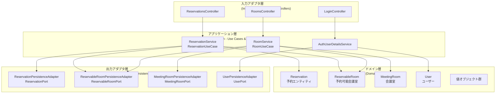

# 設計書

## 概要

会議室予約システム（MRS）は、ヘキサゴナルアーキテクチャ（ポート&アダプタパターン）を採用したWebアプリケーションです。本システムは、ドメイン駆動設計（DDD）の原則に基づき、ビジネスロジックをドメイン層に集約し、外部システムとの依存関係を最小化する設計となっています。

Spring Boot 3.3.2をベースとし、Spring Security、Spring Data JPA、Thymeleafを使用して実装されます。データベースは開発環境でH2、本番環境でPostgreSQLを使用します。

## アーキテクチャ

### ヘキサゴナルアーキテクチャ構成

本システムは以下の層で構成されます：



### パッケージ構造

```
mrs/
├── Application.java (メインクラス)
├── WebSecurityConfig.java (セキュリティ設定)
├── application/ (アプリケーション層)
│   ├── domain/ (ドメイン層)
│   │   └── model/
│   │       ├── auth/ (認証ドメイン)
│   │       │   ├── User.java
│   │       │   ├── UserId.java
│   │       │   ├── Password.java
│   │       │   ├── Name.java
│   │       │   └── RoleName.java
│   │       ├── reservation/ (予約ドメイン)
│   │       │   ├── Reservation.java
│   │       │   ├── ReservationId.java
│   │       │   ├── ReservationTimeSlot.java
│   │       │   ├── ReservableRoom.java
│   │       │   ├── ReservableRoomId.java
│   │       │   ├── ReservedDate.java
│   │       │   ├── ReservationList.java
│   │       │   └── ReservableRoomList.java
│   │       └── room/ (会議室ドメイン)
│   │           ├── MeetingRoom.java
│   │           ├── RoomId.java
│   │           └── RoomName.java
│   ├── port/ (ポート)
│   │   ├── in/ (入力ポート - ユースケース)
│   │   │   ├── ReservationUseCase.java
│   │   │   └── RoomUseCase.java
│   │   └── out/ (出力ポート - リポジトリ)
│   │       ├── ReservationPort.java
│   │       ├── ReservableRoomPort.java
│   │       ├── MeetingRoomPort.java
│   │       └── UserPort.java
│   └── service/ (アプリケーションサービス)
│       ├── reservation/
│       │   └── ReservationService.java
│       ├── room/
│       │   └── RoomService.java
│       └── auth/
│           ├── AuthUserDetailsService.java
│           └── AuthUserDetails.java
├── infrastructure/ (インフラストラクチャ層)
│   ├── in/ (入力アダプタ)
│   │   └── web/
│   │       ├── ReservationsController.java
│   │       ├── RoomsController.java
│   │       ├── LoginController.java
│   │       └── form/
│   │           └── ReservationForm.java
│   └── out/ (出力アダプタ)
│       └── persistence/
│           ├── ReservationPersistenceAdapter.java
│           ├── ReservableRoomPersistenceAdapter.java
│           ├── MeetingRoomPersistenceAdapter.java
│           ├── UserPersistenceAdapter.java
│           └── entity/ (JPAエンティティ)
│               ├── ReservationEntity.java
│               ├── ReservableRoomEntity.java
│               ├── MeetingRoomEntity.java
│               └── UserEntity.java
└── common/ (共通機能)
    └── validation/
        ├── ThirtyMinutesUnit.java
        ├── ThirtyMinutesUnitValidator.java
        ├── EndTimeMustBeAfterStartTime.java
        └── EndTimeMustBeAfterStartTimeValidator.java
```

## コンポーネントとインターフェース

### 入力ポート（ユースケース）

#### ReservationUseCase
予約機能の入力ポートインターフェース。

**メソッド:**
- `ReservationList findReservations(ReservableRoomId)`: 予約一覧取得
- `Reservation reserve(Reservation)`: 予約作成
- `void cancel(Reservation)`: 予約キャンセル
- `Reservation findOne(ReservationId)`: 予約取得

#### RoomUseCase
会議室機能の入力ポートインターフェース。

**メソッド:**
- `ReservableRoomList findReservableRooms(ReservedDate)`: 予約可能会議室一覧取得
- `MeetingRoom findMeetingRoom(RoomId)`: 会議室取得

### 出力ポート（リポジトリ）

#### ReservationPort
予約データアクセスの出力ポートインターフェース。

**メソッド:**
- `List<Reservation> findByReservableRoom_ReservableRoomIdOrderByStartTimeAsc(ReservableRoomId)`: 予約一覧取得
- `void save(Reservation)`: 予約保存
- `void delete(Reservation)`: 予約削除
- `Reservation findById(Integer)`: ID検索

#### ReservableRoomPort
予約可能会議室データアクセスの出力ポートインターフェース。

**メソッド:**
- `ReservableRoom findOneForUpdateByReservableRoomId(ReservableRoomId)`: 悲観的ロックで取得
- `ReservableRoomList findByReservableRoomId_reservedDateOrderByReservableRoomId_roomIdAsc(ReservedDate)`: 日付で検索

#### MeetingRoomPort
会議室データアクセスの出力ポートインターフェース。

**メソッド:**
- `MeetingRoom findById(RoomId)`: ID検索
- `List<MeetingRoom> findAll()`: 全件取得

#### UserPort
ユーザーデータアクセスの出力ポートインターフェース。

**メソッド:**
- `User findById(UserId)`: ID検索
- `void save(User)`: ユーザー保存
- `void delete(User)`: ユーザー削除

### Webコントローラー

#### ReservationsController
予約機能のWebコントローラー。

**エンドポイント:**
- `GET /reservations/{date}/{roomId}`: 予約フォーム表示
- `POST /reservations/{date}/{roomId}`: 予約作成
- `POST /reservations/{reservationId}`: 予約キャンセル

#### RoomsController
会議室一覧のWebコントローラー。

**エンドポイント:**
- `GET /rooms`: 当日の会議室一覧表示
- `GET /rooms/{date}`: 指定日の会議室一覧表示

#### LoginController
ログイン画面のWebコントローラー。

**エンドポイント:**
- `GET /loginForm`: ログインフォーム表示

## データモデル

### ドメインモデル

#### 認証ドメイン

**User (ユーザーエンティティ)**
- userId: UserId - ユーザー識別子
- password: Password - パスワード（BCrypt暗号化）
- name: Name - 氏名
- roleName: RoleName - 権限（ADMIN/USER）

**UserId (値オブジェクト)**
- value: String - ユーザーID文字列（最大255文字）

**Password (値オブジェクト)**
- value: String - パスワード文字列
- isEncoded(): boolean - BCrypt暗号化済みか判定

**Name (値オブジェクト)**
- firstName: String - 名
- lastName: String - 姓
- getFullName(): String - フルネーム取得（姓 名）

**RoleName (列挙型)**
- ADMIN - 管理者
- USER - 一般ユーザー

#### 予約ドメイン

**Reservation (予約エンティティ)**
- reservationId: ReservationId - 予約識別子
- reservationTimeSlot: ReservationTimeSlot - 予約時間帯
- reservableRoom: ReservableRoom - 予約可能会議室
- user: User - 予約者
- overlap(Reservation): boolean - 予約重複判定

**ReservationTimeSlot (値オブジェクト)**
- startTime: LocalTime - 開始時刻
- endTime: LocalTime - 終了時刻
- overlap(ReservationTimeSlot): boolean - 時間帯重複判定

**ReservableRoom (エンティティ)**
- reservableRoomId: ReservableRoomId - 予約可能会議室識別子
- meetingRoom: MeetingRoom - 会議室

**ReservableRoomId (値オブジェクト)**
- roomId: RoomId - 会議室ID
- reservedDate: ReservedDate - 予約日

**ReservedDate (値オブジェクト)**
- value: LocalDate - 予約日

**ReservationList (コレクション)**
- reservations: List<Reservation> - 予約リスト

**ReservableRoomList (コレクション)**
- reservableRooms: List<ReservableRoom> - 予約可能会議室リスト

#### 会議室ドメイン

**MeetingRoom (会議室エンティティ)**
- roomId: RoomId - 会議室識別子
- roomName: RoomName - 会議室名

**RoomId (値オブジェクト)**
- value: Integer - 会議室ID

**RoomName (値オブジェクト)**
- value: String - 会議室名（最大255文字）

### データベーススキーマ

#### usr (ユーザーテーブル)
```sql
CREATE TABLE usr (
    user_id    VARCHAR(255) NOT NULL PRIMARY KEY,
    first_name VARCHAR(255) NOT NULL,
    last_name  VARCHAR(255) NOT NULL,
    password   VARCHAR(255) NOT NULL,
    role_name  VARCHAR(255) NOT NULL
);
```

#### meeting_room (会議室テーブル)
```sql
CREATE TABLE meeting_room (
    room_id   SERIAL       NOT NULL PRIMARY KEY,
    room_name VARCHAR(255) NOT NULL
);
```

#### reservable_room (予約可能会議室テーブル)
```sql
CREATE TABLE reservable_room (
    reserved_date DATE NOT NULL,
    room_id       INT4 NOT NULL,
    PRIMARY KEY (reserved_date, room_id),
    FOREIGN KEY (room_id) REFERENCES meeting_room
);
```

#### reservation (予約テーブル)
```sql
CREATE TABLE reservation (
    reservation_id SERIAL       NOT NULL PRIMARY KEY,
    start_time     TIME         NOT NULL,
    end_time       TIME         NOT NULL,
    reserved_date  DATE         NOT NULL,
    room_id        INT4         NOT NULL,
    user_id        VARCHAR(255) NOT NULL,
    FOREIGN KEY (reserved_date, room_id) REFERENCES reservable_room,
    FOREIGN KEY (user_id) REFERENCES usr
);
```


## 正確性プロパティ

*プロパティとは、システムのすべての有効な実行において真であるべき特性または動作です。本質的には、システムが何をすべきかについての形式的な記述です。プロパティは、人間が読める仕様と機械で検証可能な正確性保証との橋渡しとなります。*

### プロパティ1: 有効な認証情報での認証成功

*任意の*有効なユーザー認証情報に対して、システムは認証を成功させ、有効なセッションを確立する必要があります。

**検証: 要件 1.1**

### プロパティ2: 無効な認証情報での認証拒否

*任意の*無効なユーザー認証情報（存在しないユーザーまたは間違ったパスワード）に対して、システムは認証を拒否し、適切なエラーメッセージを表示する必要があります。

**検証: 要件 1.2**

### プロパティ3: セッション状態の維持

*任意の*認証済みユーザーのリクエストシーケンスに対して、セッションがタイムアウトするまで認証状態が維持される必要があります。

**検証: 要件 1.4**

### プロパティ4: 日付指定での会議室一覧取得

*任意の*日付に対して、システムはその日付に予約可能なすべての会議室を返す必要があります。

**検証: 要件 2.2**

### プロパティ5: 会議室一覧のソート順

*任意の*会議室リストに対して、会議室は会議室識別子の昇順でソートされている必要があります。

**検証: 要件 2.5**

### プロパティ6: 有効なパラメータでの予約作成

*任意の*有効な予約パラメータ（会議室、日付、時間帯、ユーザー）に対して、重複がない場合、システムは予約を作成し、ユーザーに関連付ける必要があります。

**検証: 要件 3.1**

### プロパティ7: 予約重複の検出と拒否

*任意の*既存の予約と時間的に重複する新規予約に対して、システムは予約を拒否し、競合メッセージを表示する必要があります。

**検証: 要件 3.2**

### プロパティ8: 予約不可能な組み合わせの拒否

*任意の*予約不可能な会議室と日付の組み合わせに対して、システムは予約を拒否し、エラーメッセージを表示する必要があります。

**検証: 要件 3.3**

### プロパティ9: 30分単位時刻の検証

*任意の*予約時刻入力に対して、30分単位でない時刻はシステムによって拒否される必要があります。

**検証: 要件 3.5, 9.3**

### プロパティ10: 同時予約の排他制御

*任意の*同じ時間枠への複数の同時予約試行に対して、悲観的ロックにより1つの予約のみが成功する必要があります。

**検証: 要件 3.6, 10.1**

### プロパティ11: 予約一覧の取得と表示

*任意の*会議室と日付に対して、システムはその会議室のその日付のすべての予約を返す必要があります。

**検証: 要件 4.1**

### プロパティ12: 予約一覧のソート順

*任意の*予約リストに対して、予約は開始時刻の昇順でソートされている必要があります。

**検証: 要件 4.2**

### プロパティ13: 予約表示内容の完全性

*任意の*予約表示に対して、開始時刻、終了時刻、予約者名が含まれている必要があります。

**検証: 要件 4.3**

### プロパティ14: 自分の予約のキャンセル

*任意の*ユーザー自身の予約に対して、キャンセルが成功し、時間枠が利用可能になる必要があります。

**検証: 要件 5.1**

### プロパティ15: 他人の予約キャンセルの拒否

*任意の*他のユーザーの予約に対して、一般ユーザーのキャンセル試行は拒否され、アクセス拒否メッセージが表示される必要があります。

**検証: 要件 5.2**

### プロパティ16: 管理者による任意の予約キャンセル

*任意の*予約に対して、管理者権限を持つユーザーはキャンセルでき、時間枠が利用可能になる必要があります。

**検証: 要件 5.3, 6.2**

### プロパティ17: キャンセル後の状態更新

*任意の*予約キャンセルに対して、会議室の空き状況が即座に更新される必要があります（キャンセル→検索のラウンドトリップで確認）。

**検証: 要件 5.4**

### プロパティ18: CSRFトークンの包含

*任意の*フォーム生成に対して、CSRFトークンが含まれている必要があります。

**検証: 要件 8.1**

### プロパティ19: パスワードのBCrypt暗号化

*任意の*パスワード保存に対して、BCryptハッシュ形式で保存される必要があります。

**検証: 要件 8.2**

### プロパティ20: 保護リソースへのアクセス制御

*任意の*保護されたリソースへのアクセスに対して、有効で認証済みのセッションが必要です。

**検証: 要件 8.3**

### プロパティ21: 必須フィールドの検証

*任意の*フォーム送信に対して、すべての必須フィールドが存在することが検証される必要があります。

**検証: 要件 9.1**

### プロパティ22: フィールド固有エラーメッセージ

*任意の*無効なデータ送信に対して、フィールド固有のエラーメッセージが表示される必要があります。

**検証: 要件 9.2**

### プロパティ23: 終了時刻の検証

*任意の*予約時間帯に対して、終了時刻は開始時刻より後である必要があります。

**検証: 要件 9.4**

### プロパティ24: 日付形式の検証

*任意の*日付入力に対して、YYYY-MM-DD形式であることが検証される必要があります。

**検証: 要件 9.5**

### プロパティ25: 競合時のトランザクションロールバック

*任意の*予約競合検出に対して、トランザクションがロールバックされ、ユーザーに通知される必要があります。

**検証: 要件 10.3**

### プロパティ26: 時間枠重複検出アルゴリズム

*任意の*2つの予約時間枠に対して、重複は式 `target.endTime > this.startTime AND this.endTime > target.startTime` で正しく検出される必要があります。

**検証: 要件 10.4**

## エラー処理

### 例外クラス

**AlreadyReservedException**
- 発生条件: 予約時間帯が既存の予約と重複する場合
- メッセージ: "入力の時間帯はすでに予約済みです。"
- HTTPステータス: 409 Conflict

**UnavailableReservationException**
- 発生条件: 予約不可能な会議室と日付の組み合わせで予約を試みた場合
- メッセージ: "入力の日付・部屋の組合わせは予約できません。"
- HTTPステータス: 400 Bad Request

**AccessDeniedException (Spring Security)**
- 発生条件: 権限のない操作を試みた場合（他人の予約キャンセルなど）
- メッセージ: "アクセスが拒否されました。"
- HTTPステータス: 403 Forbidden

**UsernameNotFoundException (Spring Security)**
- 発生条件: 存在しないユーザーでログインを試みた場合
- メッセージ: "{username} is not found."
- HTTPステータス: 401 Unauthorized

### バリデーションエラー

**Bean Validation**
- `@NotNull`: 必須フィールドの検証
- `@NotEmpty`: 空文字列の検証
- `@ThirtyMinutesUnit`: 30分単位の時刻検証（カスタムバリデータ）
- `@EndTimeMustBeAfterStartTime`: 終了時刻が開始時刻より後であることの検証（カスタムバリデータ）

### エラーハンドリング戦略

1. **ドメイン例外**: ビジネスルール違反はドメイン層でカスタム例外をスロー
2. **バリデーション例外**: 入力検証エラーはBean Validationで処理
3. **セキュリティ例外**: 認証・認可エラーはSpring Securityで処理
4. **グローバルエラーハンドラ**: `@ControllerAdvice`で統一的なエラーレスポンス

## テスト戦略

### 単体テスト

**ドメインモデルテスト**
- 値オブジェクトの不変条件検証
- エンティティのビジネスロジック検証
- 予約重複判定ロジックのテスト

**サービス層テスト**
- モックを使用したビジネスロジックの検証
- トランザクション境界の確認
- 例外処理の検証

**バリデーションテスト**
- カスタムバリデータの動作確認
- Bean Validationの統合テスト

### 統合テスト

**リポジトリテスト**
- `@DataJpaTest`を使用したデータアクセス層のテスト
- 悲観的ロックの動作確認
- クエリメソッドの検証

**コントローラテスト**
- `@WebMvcTest`を使用したWeb層のテスト
- リクエスト/レスポンスの検証
- セキュリティ統合の確認

**セキュリティテスト**
- `@WithMockUser`を使用した認証テスト
- 権限チェックの検証
- CSRF保護の確認

### プロパティベーステスト

プロパティベーステストは、正確性プロパティセクションで定義された各プロパティを検証するために使用されます。

**テストフレームワーク**: JUnit 5 + jqwik（Java用プロパティベーステストライブラリ）

**テスト設定**:
- 各プロパティテストは最低100回の反復実行
- ランダムデータ生成による広範な入力空間のカバレッジ
- 失敗時の反例の自動縮小

**ジェネレータ戦略**:
- **ユーザージェネレータ**: ランダムなユーザーID、パスワード、名前、ロールを生成
- **日付ジェネレータ**: 過去1日から未来30日の範囲でランダムな日付を生成
- **時刻ジェネレータ**: 30分単位の時刻を生成（9:00-18:00の範囲）
- **予約ジェネレータ**: 有効な予約パラメータの組み合わせを生成
- **重複予約ジェネレータ**: 意図的に重複する予約を生成

**プロパティテストの例**:

```java
@Property
void property7_overlappingReservationsAreRejected(
    @ForAll("validReservation") Reservation existing,
    @ForAll("overlappingReservation") Reservation overlapping
) {
    // Given: 既存の予約が存在する
    reservationService.reserve(existing);
    
    // When & Then: 重複する予約は拒否される
    assertThrows(AlreadyReservedException.class, 
        () -> reservationService.reserve(overlapping));
}
```

**プロパティテストタグ**:
各プロパティベーステストには、対応する設計書のプロパティを明示的に参照するコメントタグを付けます。

形式: `// Feature: meeting-room-reservation-system, Property {番号}: {プロパティテキスト}`

例:
```java
// Feature: meeting-room-reservation-system, Property 7: 予約重複の検出と拒否
@Property
void property7_overlappingReservationsAreRejected(...) { ... }
```

### エンドツーエンドテスト

**シナリオテスト**
- ログイン→会議室検索→予約→キャンセルの一連の流れ
- 複数ユーザーの同時操作シナリオ
- エラーケースのシナリオ

**テストデータ**
- Flywayマイグレーションによる初期データ投入
- テスト用ユーザー（一般ユーザー、管理者）
- テスト用会議室と予約可能日

### テストカバレッジ目標

- **行カバレッジ**: 80%以上
- **分岐カバレッジ**: 75%以上
- **ドメイン層**: 90%以上（ビジネスロジックの重要性）

### 継続的インテグレーション

- すべてのテストはGitプッシュ時に自動実行
- テストカバレッジレポートの自動生成（JaCoCo）
- テスト失敗時のビルド停止

## セキュリティ設計

### 認証

**認証方式**: フォームベース認証（Spring Security）

**認証フロー**:
1. ユーザーがログインフォームに認証情報を入力
2. Spring Securityが`AuthUserDetailsService`を呼び出し
3. `UserPort`経由でユーザー情報を取得
4. パスワードをBCryptで検証
5. 認証成功時にセッションを確立

**パスワード暗号化**:
- アルゴリズム: BCrypt
- ストレングス: デフォルト（10ラウンド）
- ソルト: BCryptが自動生成

### 認可

**ロールベースアクセス制御（RBAC）**:
- `ROLE_USER`: 一般ユーザー（自分の予約の作成・キャンセル）
- `ROLE_ADMIN`: 管理者（すべての予約の管理）

**メソッドレベルセキュリティ**:
```java
@PreAuthorize("hasRole('ADMIN') or #reservation.user.userId.value == principal.user.userId.value")
public void cancel(@P("reservation") Reservation reservation)
```

**URLベースアクセス制御**:
- `/loginForm`: 認証不要
- `/css/**`, `/js/**`, `/images/**`: 認証不要（静的リソース）
- その他すべて: 認証必須

### セッション管理

**セッション設定**:
- セッションタイムアウト: 30分（デフォルト）
- セッション固定攻撃対策: Spring Securityのデフォルト保護
- 同時セッション制御: 無制限（必要に応じて設定可能）

### CSRF保護

**CSRF対策**:
- すべてのPOSTリクエストにCSRFトークンが必要
- Thymeleafが自動的にCSRFトークンをフォームに挿入
- Spring Securityが自動的にトークンを検証

### HTTPSの強制

**本番環境設定**:
- すべての通信をHTTPSで暗号化
- HSTSヘッダーの設定（推奨）
- セキュアクッキーの使用

## パフォーマンス設計

### データベース最適化

**インデックス戦略**:
- `reservable_room`: 複合主キー（reserved_date, room_id）
- `reservation`: 外部キーに自動インデックス
- クエリパフォーマンスの定期的な監視

**クエリ最適化**:
- N+1問題の回避（必要に応じてJOIN FETCH使用）
- ページネーション（将来の拡張）
- クエリ結果のキャッシング（必要に応じて）

### 同時実行制御

**悲観的ロック**:
```java
@Lock(LockModeType.PESSIMISTIC_WRITE)
ReservableRoom findOneForUpdateByReservableRoomId(ReservableRoomId reservableRoomId);
```

**トランザクション分離レベル**: READ_COMMITTED（デフォルト）

### キャッシング戦略

**現在の実装**: キャッシングなし（シンプルさ優先）

**将来の拡張**:
- 会議室マスタデータのキャッシング
- 予約可能日のキャッシング
- Spring Cacheの導入検討

## デプロイメント設計

### 環境構成

**開発環境**:
- データベース: H2（インメモリ、PostgreSQLモード）
- アプリケーションサーバー: Spring Boot組み込みTomcat
- ポート: 8080

**本番環境**:
- データベース: PostgreSQL 16
- アプリケーションサーバー: Spring Boot組み込みTomcat
- ポート: 8080（リバースプロキシ経由）
- HTTPS: 必須

### データベースマイグレーション

**Flyway設定**:
- マイグレーションファイル: `src/main/resources/db/migration/{env}/`
- 命名規則: `V{version}__{description}.sql`
- 開発環境: `db/migration/dev/`
- 本番環境: `db/migration/prd/`

**マイグレーション戦略**:
1. スキーマ変更は常にFlywayマイグレーションで管理
2. ロールバックスクリプトの準備（必要に応じて）
3. 本番適用前のステージング環境での検証

### ログ設定

**ログレベル**:
- 開発環境: DEBUG
- 本番環境: INFO

**ログ出力**:
- アプリケーションログ: 標準出力
- SQLログ: DEBUG（開発環境のみ）
- セキュリティイベント: INFO

**ログフォーマット**:
- タイムスタンプ
- ログレベル
- スレッド名
- ロガー名
- メッセージ

### モニタリング

**Spring Boot Actuator**:
- ヘルスチェックエンドポイント: `/actuator/health`
- メトリクスエンドポイント: `/actuator/metrics`
- 本番環境では適切なアクセス制御が必要

**監視項目**:
- アプリケーションの稼働状態
- データベース接続プール
- JVMメモリ使用量
- HTTPリクエスト統計

## 拡張性の考慮

### 将来の拡張ポイント

**機能拡張**:
- 会議室の設備情報管理
- 予約の繰り返し設定
- メール通知機能
- 予約承認ワークフロー

**技術的拡張**:
- RESTful API の提供
- マイクロサービス化
- イベント駆動アーキテクチャへの移行
- キャッシング層の追加

### アーキテクチャの利点

**ヘキサゴナルアーキテクチャの利点**:
- ドメインロジックの独立性
- テスタビリティの向上
- 外部システムの交換容易性
- 段階的なリファクタリングの実現

**ポート&アダプタパターンの利点**:
- データベースの切り替えが容易
- Web層の変更がドメイン層に影響しない
- モックを使用したテストが容易
