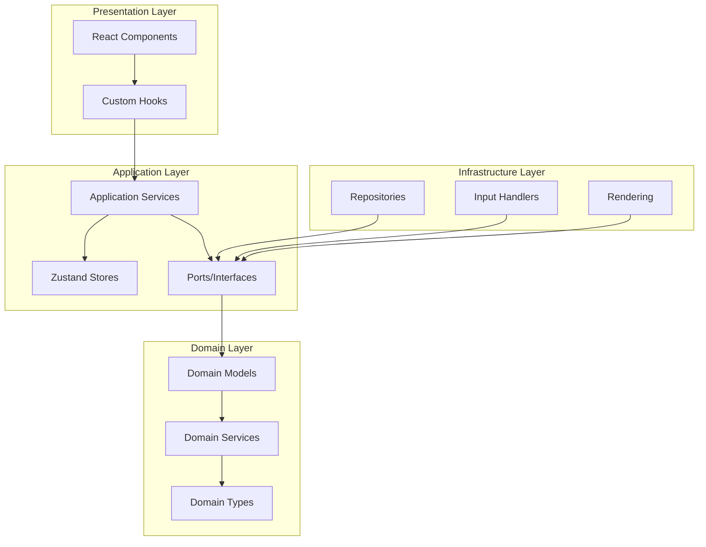
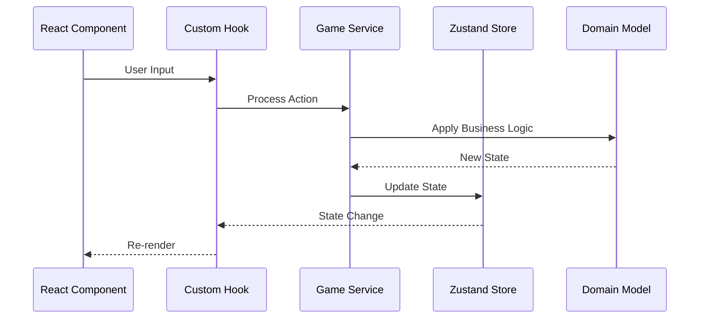

# Design Document

## Overview

ぷよぷよゲームは、ヘキサゴナルアーキテクチャ（ポート・アダプターパターン）を採用したWebアプリケーションとして設計されます。React 19とTypeScript 5を使用し、関数型プログラミングの原則に従って実装されます。

### 設計原則

- **関心の分離**: ドメインロジック、アプリケーションロジック、インフラストラクチャを明確に分離
- **依存性逆転**: 外部依存に対してインターフェースを定義し、テスタビリティを向上
- **不変性**: 状態の直接変更を避け、純粋関数を使用
- **型安全性**: TypeScriptの厳密モードを活用し、実行時エラーを防止

## Architecture

### ヘキサゴナルアーキテクチャ構成

```
src/
├── domain/                 # ドメイン層（ビジネスロジック）
│   ├── models/            # ドメインモデル
│   │   ├── Puyo.ts       # ぷよエンティティ
│   │   ├── GameField.ts  # ゲームフィールド
│   │   ├── GameState.ts  # ゲーム状態
│   │   └── Score.ts      # スコア計算
│   ├── services/          # ドメインサービス
│   │   ├── ChainCalculator.ts    # 連鎖計算
│   │   ├── PuyoMatcher.ts        # ぷよマッチング
│   │   └── GameRuleEngine.ts     # ゲームルール
│   └── types/             # ドメイン型定義
│       ├── PuyoColor.ts
│       ├── Direction.ts
│       └── GameEvent.ts
├── application/            # アプリケーション層
│   ├── ports/             # インターフェース定義
│   │   ├── GameRepository.ts     # ゲーム状態永続化
│   │   ├── InputHandler.ts       # 入力処理
│   │   └── GameRenderer.ts       # 描画処理
│   ├── services/          # ユースケース
│   │   ├── GameService.ts        # ゲーム管理
│   │   ├── InputService.ts       # 入力管理
│   │   └── RenderService.ts      # 描画管理
│   └── stores/            # 状態管理（Zustand）
│       ├── gameStore.ts          # ゲーム状態
│       └── uiStore.ts            # UI状態
├── infrastructure/         # インフラストラクチャ層
│   ├── repositories/      # データ永続化実装
│   │   └── LocalStorageGameRepository.ts
│   ├── input/             # 入力処理実装
│   │   ├── KeyboardInputHandler.ts
│   │   └── TouchInputHandler.ts
│   └── rendering/         # 描画処理実装
│       └── CanvasGameRenderer.ts
└── presentation/           # プレゼンテーション層
    ├── components/        # UIコンポーネント
    │   ├── GameBoard.tsx         # ゲームボード
    │   ├── ScoreDisplay.tsx      # スコア表示
    │   ├── NextPuyoDisplay.tsx   # 次のぷよ表示
    │   ├── GameControls.tsx      # ゲーム操作UI
    │   ├── NewGameButton.tsx     # 新しいゲームボタン
    │   ├── ChainDisplay.tsx      # 連鎖数表示
    │   └── GameOverDialog.tsx    # ゲームオーバーダイアログ
    ├── hooks/             # カスタムフック
    │   ├── useGameState.ts       # ゲーム状態管理
    │   ├── useInputHandler.ts    # 入力処理
    │   └── useGameLoop.ts        # ゲームループ
    └── pages/             # ページコンポーネント
        └── GamePage.tsx          # メインゲームページ
```

### アーキテクチャ図



## Components and Interfaces

### ドメインモデル

#### Puyo（ぷよエンティティ）
```typescript
interface Puyo {
  readonly id: string;
  readonly color: PuyoColor;
  readonly position: Position;
  readonly isFixed: boolean;
}

type PuyoColor = 'red' | 'blue' | 'green' | 'yellow' | 'purple';

interface Position {
  readonly x: number;
  readonly y: number;
}
```

#### GameField（ゲームフィールド）
```typescript
interface GameField {
  readonly width: number;
  readonly height: number;
  readonly puyos: ReadonlyArray<ReadonlyArray<Puyo | null>>;
  
  placePuyo(puyo: Puyo, position: Position): GameField;
  removePuyos(positions: ReadonlyArray<Position>): GameField;
  applyGravity(): GameField;
  findConnectedPuyos(position: Position): ReadonlyArray<Position>;
}
```

#### GameState（ゲーム状態）
```typescript
interface GameState {
  readonly field: GameField;
  readonly currentPuyoPair: PuyoPair;
  readonly nextPuyoPair: PuyoPair;
  readonly score: Score;
  readonly isGameOver: boolean;
  readonly chainCount: number;
  readonly isPlaying: boolean;
  readonly gameStarted: boolean;
}

interface PuyoPair {
  readonly main: Puyo;
  readonly sub: Puyo;
  readonly position: Position;
  readonly rotation: Rotation;
  readonly canMove: boolean;
  readonly isFixed: boolean;
}

type Rotation = 0 | 90 | 180 | 270;

interface Score {
  readonly current: number;
  readonly lastChainBonus: number;
  readonly allClearBonus: number;
  readonly totalBonus: number;
}
```

### アプリケーションサービス

#### GameService（ゲーム管理サービス）
```typescript
interface GameService {
  startNewGame(): Promise<GameState>;
  movePuyo(direction: Direction): Promise<GameState>;
  rotatePuyo(): Promise<GameState>;
  dropPuyo(): Promise<GameState>;
  tick(): Promise<GameState>;
  pauseGame(): Promise<GameState>;
  resumeGame(): Promise<GameState>;
  resetGame(): Promise<GameState>;
  checkGameOver(): boolean;
  processChain(): Promise<GameState>;
  initializeField(): GameField;
  generatePuyoPair(): PuyoPair;
  fixPuyoPair(puyoPair: PuyoPair, field: GameField): GameField;
}

type Direction = 'left' | 'right' | 'down';

enum GameAction {
  MoveLeft = 'MOVE_LEFT',
  MoveRight = 'MOVE_RIGHT',
  Rotate = 'ROTATE',
  Drop = 'DROP',
  StartGame = 'START_GAME',
  PauseGame = 'PAUSE_GAME',
  ResumeGame = 'RESUME_GAME',
  ResetGame = 'RESET_GAME'
}

// 設計決定：
// - initializeField(): 新しいゲーム開始時のフィールド初期化（要件1.2）
// - generatePuyoPair(): 最初の組ぷよ生成（要件1.4）
// - fixPuyoPair(): ぷよ固定処理（要件3.2）
// - ResetGame アクション追加（要件7.4のリスタート機能）
```

#### InputService（入力管理サービス）
```typescript
interface InputService {
  handleKeyboardInput(event: KeyboardEvent): Promise<void>;
  handleTouchInput(event: TouchEvent): Promise<void>;
  handleSwipeGesture(gesture: SwipeGesture): Promise<void>;
  registerInputHandlers(): void;
  unregisterInputHandlers(): void;
  isInputEnabled(): boolean;
  enableInput(): void;
  disableInput(): void;
}

interface SwipeGesture {
  readonly direction: 'up' | 'down' | 'left' | 'right';
  readonly startPosition: Position;
  readonly endPosition: Position;
  readonly velocity: number;
}

interface TouchGesture {
  readonly type: 'tap' | 'swipe';
  readonly position: Position;
  readonly direction?: 'up' | 'down' | 'left' | 'right';
}
```

### インフラストラクチャ実装

#### KeyboardInputHandler
```typescript
class KeyboardInputHandler implements InputHandler {
  private readonly keyMappings: Map<string, GameAction>;
  
  constructor() {
    this.keyMappings = new Map([
      ['ArrowLeft', GameAction.MoveLeft],
      ['ArrowRight', GameAction.MoveRight],
      ['ArrowUp', GameAction.Rotate],
      ['ArrowDown', GameAction.Drop],
      [' ', GameAction.Rotate]
    ]);
  }
  
  handleInput(event: KeyboardEvent): GameAction | null {
    return this.keyMappings.get(event.key) || null;
  }
  
  isValidInput(event: KeyboardEvent): boolean {
    return this.keyMappings.has(event.key);
  }
}
```

#### TouchInputHandler
```typescript
class TouchInputHandler implements InputHandler {
  private touchStartPosition: Position | null = null;
  private readonly swipeThreshold = 50; // ピクセル
  private readonly tapThreshold = 10; // ピクセル
  
  handleTouchStart(event: TouchEvent): void {
    const touch = event.touches[0];
    this.touchStartPosition = { x: touch.clientX, y: touch.clientY };
  }
  
  handleTouchEnd(event: TouchEvent): TouchGesture | null {
    if (!this.touchStartPosition) return null;
    
    const touch = event.changedTouches[0];
    const endPosition = { x: touch.clientX, y: touch.clientY };
    const deltaX = endPosition.x - this.touchStartPosition.x;
    const deltaY = endPosition.y - this.touchStartPosition.y;
    const distance = Math.sqrt(deltaX * deltaX + deltaY * deltaY);
    
    if (distance < this.tapThreshold) {
      return { type: 'tap', position: endPosition };
    }
    
    if (distance > this.swipeThreshold) {
      const direction = this.getSwipeDirection(deltaX, deltaY);
      return { 
        type: 'swipe', 
        position: this.touchStartPosition,
        direction 
      };
    }
    
    return null;
  }
  
  private getSwipeDirection(deltaX: number, deltaY: number): 'up' | 'down' | 'left' | 'right' {
    if (Math.abs(deltaX) > Math.abs(deltaY)) {
      return deltaX > 0 ? 'right' : 'left';
    } else {
      return deltaY > 0 ? 'down' : 'up';
    }
  }
}
```

## Game Mechanics Design

### ゲーム初期化・制御システム設計
```typescript
interface GameInitializationSystem {
  initializeNewGame(): GameState;
  resetGameField(): GameField;
  resetScore(): Score;
  generateInitialPuyoPair(): PuyoPair;
  setupGameControls(): void;
}

interface GameControlSystem {
  handleNewGameRequest(): Promise<void>;
  handleGameOverState(): Promise<void>;
  showRestartOption(): void;
  processRestart(): Promise<void>;
}

// 設計決定：
// - initializeNewGame(): 新しいゲーム開始時の完全な初期化（要件1.1, 1.2, 1.3, 1.4）
// - handleGameOverState(): ゲームオーバー時の演出と最終スコア表示（要件7.2, 7.3）
// - showRestartOption(): ゲームオーバー演出完了後のリスタート提供（要件7.4）
// - 明確な状態遷移による確実なゲーム制御
```

### ゲームフィールド仕様
- **フィールドサイズ**: 12行×6列（要件10.1に対応）
- **ぷよ色**: 5色（赤、青、緑、黄、紫）を使用
- **消去条件**: 同じ色のぷよが縦横に4つ以上隣接した場合に消去

### 落下システム設計
```typescript
interface FallSystem {
  readonly fallSpeed: number; // ミリ秒単位
  readonly fastDropMultiplier: number; // 高速落下時の倍率
  
  calculateFallInterval(level: number): number;
  applyGravity(field: GameField): GameField;
  checkLanding(puyoPair: PuyoPair, field: GameField): boolean;
  autoFall(gameState: GameState): GameState;
  fixPuyoOnLanding(puyoPair: PuyoPair, field: GameField): GameField;
  generateNextPuyoPair(): PuyoPair;
}

// 設計決定：
// - autoFall(): 一定間隔での自動落下処理（要件3.1）
// - fixPuyoOnLanding(): 着地時のぷよ固定処理（要件3.2）
// - generateNextPuyoPair(): 新しい組ぷよ生成（要件3.3）
// - 重力システムによる空白への落下処理（要件3.4）
```

### 連鎖計算システム
```typescript
interface ChainSystem {
  calculateChainBonus(chainCount: number): number;
  calculateColorBonus(colors: PuyoColor[]): number;
  calculateAllClearBonus(): number;
  processChainReaction(field: GameField): ChainResult;
  displayChainCount(chainCount: number): void;
  resetChainDisplay(): void;
  handleMultiColorErase(erasedGroups: PuyoGroup[]): number;
  
  // 連鎖倍率テーブル
  readonly chainMultipliers: ReadonlyArray<number>;
}

interface ChainResult {
  readonly newField: GameField;
  readonly chainCount: number;
  readonly scoreGained: number;
  readonly isAllClear: boolean;
  readonly erasedPuyos: ReadonlyArray<Position>;
}

interface PuyoGroup {
  readonly color: PuyoColor;
  readonly positions: ReadonlyArray<Position>;
}

// 連鎖倍率の設計決定：
// 1連鎖: 1倍, 2連鎖: 8倍, 3連鎖: 16倍, 4連鎖: 32倍...
// この設計により戦略的なプレイを促進

// 設計決定：
// - processChainReaction(): 連鎖反応の処理（要件4.4）
// - displayChainCount(): 連鎖数の画面表示（要件5.2）
// - resetChainDisplay(): 連鎖終了時の表示リセット（要件5.3）
// - handleMultiColorErase(): 複数色同時消去の1連鎖扱い（要件5.4）
```

### スコア計算設計
```typescript
interface ScoreCalculation {
  readonly baseScore: number; // 基本点数（ぷよ1個あたり）
  readonly chainBonus: number; // 連鎖ボーナス
  readonly colorBonus: number; // 色数ボーナス
  readonly allClearBonus: number; // 全消しボーナス
  
  calculateTotalScore(): number;
}

// スコア計算式の設計決定：
// 総スコア = (消去ぷよ数 × 基本点数) × (連鎖倍率 + 色数ボーナス) + 全消しボーナス
// この設計により多様な戦略でスコアを獲得可能
```

### アニメーション設計
```typescript
interface AnimationSystem {
  readonly puyoFallDuration: number; // ぷよ落下アニメーション時間
  readonly puyoEraseDuration: number; // ぷよ消去アニメーション時間
  readonly chainEffectDuration: number; // 連鎖エフェクト時間
  readonly allClearEffectDuration: number; // 全消しエフェクト時間
  
  playFallAnimation(puyo: Puyo, fromPosition: Position, toPosition: Position): Promise<void>;
  playEraseAnimation(puyos: Puyo[]): Promise<void>;
  playChainEffect(chainCount: number): Promise<void>;
  playAllClearEffect(): Promise<void>;
}

// アニメーション設計決定：
// - Framer Motionを使用してパフォーマンスを最適化
// - 60FPS維持のため、アニメーション時間を適切に調整
// - ユーザビリティを損なわない範囲でエフェクトを実装
```

## Data Models

### 状態管理（Zustand）

#### gameStore
```typescript
interface GameStore {
  gameState: GameState;
  isPlaying: boolean;
  gameStarted: boolean;
  lastScoreUpdate: number;
  chainDisplayTimeout: number | null;
  
  // Actions
  startGame: () => void;
  pauseGame: () => void;
  resumeGame: () => void;
  updateGameState: (newState: GameState) => void;
  resetGame: () => void;
  setScoreHighlight: (score: number) => void;
  clearScoreHighlight: () => void;
  setChainDisplay: (chainCount: number) => void;
  clearChainDisplay: () => void;
}
```

#### uiStore
```typescript
interface UIStore {
  showNextPuyo: boolean;
  showScore: boolean;
  animationSpeed: number;
  showChainCount: boolean;
  showGameOverDialog: boolean;
  showAllClearEffect: boolean;
  scoreHighlight: boolean;
  showNewGameButton: boolean;
  showRestartOption: boolean;
  
  // Actions
  toggleNextPuyoDisplay: () => void;
  toggleScoreDisplay: () => void;
  setAnimationSpeed: (speed: number) => void;
  showChainCountDisplay: (show: boolean) => void;
  showGameOverScreen: (show: boolean) => void;
  triggerAllClearEffect: () => void;
  highlightScore: (highlight: boolean) => void;
  enableNewGameButton: () => void;
  enableRestartOption: () => void;
  disableRestartOption: () => void;
}

// 設計決定：
// - showNewGameButton: 新しいゲーム開始ボタンの表示制御（要件1.1）
// - showRestartOption: ゲームオーバー後のリスタートオプション表示（要件7.4）
// - enableRestartOption(): ゲームオーバー演出完了後のリスタート有効化（要件7.4）
```

### データフロー



## UI/UX Design

### レスポンシブデザイン設計
```typescript
interface ResponsiveDesign {
  readonly breakpoints: {
    mobile: string;    // 768px未満
    tablet: string;    // 768px-1024px
    desktop: string;   // 1024px以上
  };
  
  readonly gameFieldSizes: {
    mobile: { width: number; height: number };
    tablet: { width: number; height: number };
    desktop: { width: number; height: number };
  };
}

// 設計決定：
// - モバイルファーストアプローチを採用
// - タッチ操作とキーボード操作の両方をサポート
// - 画面サイズに応じてゲームフィールドサイズを調整
```

### タッチ操作設計
```typescript
interface TouchControls {
  readonly gestureMapping: {
    tap: GameAction.Rotate;
    swipeLeft: GameAction.MoveLeft;
    swipeRight: GameAction.MoveRight;
    swipeDown: GameAction.Drop;
  };
  
  readonly touchAreas: {
    gameField: DOMRect;
    controlButtons: DOMRect;
  };
}

// 設計決定：
// - 直感的なジェスチャーマッピング
// - 誤操作を防ぐための適切なタッチ領域設定
// - キーボード操作との併用をサポート
```

### アクセシビリティ設計
```typescript
interface AccessibilityFeatures {
  readonly keyboardNavigation: boolean;
  readonly screenReaderSupport: boolean;
  readonly colorBlindSupport: boolean;
  readonly reducedMotionSupport: boolean;
  
  // ARIA属性の設計
  readonly ariaLabels: {
    gameField: string;
    currentScore: string;
    nextPuyo: string;
    gameControls: string;
  };
}

// 設計決定：
// - WCAG 2.1 AA準拠を目標
// - 色だけでなく形状でもぷよを区別可能
// - キーボードのみでの操作をサポート
// - スクリーンリーダー対応
```

### ゲーム状態表示設計
```typescript
interface GameStateDisplay {
  readonly scoreDisplay: {
    current: number;
    highlight: boolean;
    lastUpdate: number;
  };
  
  readonly chainDisplay: {
    count: number;
    visible: boolean;
    animating: boolean;
  };
  
  readonly gameOverDisplay: {
    visible: boolean;
    finalScore: number;
    restartAvailable: boolean;
  };
  
  readonly gameControlsDisplay: {
    newGameButton: boolean;
    pauseButton: boolean;
    resetButton: boolean;
  };
}

// 設計決定：
// - リアルタイムスコア更新（要件8.1, 8.2）
// - 連鎖数の視覚的フィードバック（要件5.2）
// - ゲームオーバー時の適切な情報表示（要件7.2, 7.3, 7.4）
// - 新しいゲーム開始ボタンの提供（要件1.1）
// - リスタートオプションの提供（要件7.4）
```

## Input Handling Design

### 入力システムアーキテクチャ
```typescript
interface InputSystem {
  readonly handlers: {
    keyboard: KeyboardInputHandler;
    touch: TouchInputHandler;
  };
  
  readonly inputQueue: GameAction[];
  readonly inputEnabled: boolean;
  
  processInput(action: GameAction): Promise<void>;
  validateInput(action: GameAction, gameState: GameState): boolean;
  enableInput(): void;
  disableInput(): void;
}
```

### 入力検証設計
```typescript
interface InputValidation {
  canMovePuyo(direction: Direction, puyoPair: PuyoPair, field: GameField): boolean;
  canRotatePuyo(puyoPair: PuyoPair, field: GameField): boolean;
  isGameInputEnabled(gameState: GameState): boolean;
}

// 設計決定：
// - 無効な操作は事前に検証して実行を防ぐ（要件2.5, 2.6）
// - ゲーム状態に応じて入力の有効/無効を制御
// - 連鎖中やアニメーション中は入力を無効化
```

### ゲームオーバー判定システム設計
```typescript
interface GameOverDetectionSystem {
  checkGameOverCondition(field: GameField, nextPuyoPair: PuyoPair): boolean;
  canPlacePuyoPair(puyoPair: PuyoPair, field: GameField): boolean;
  triggerGameOverSequence(): Promise<void>;
  displayFinalScore(score: Score): void;
  showGameOverAnimation(): Promise<void>;
  enableRestartAfterGameOver(): void;
}

interface GameOverState {
  readonly isGameOver: boolean;
  readonly finalScore: number;
  readonly gameOverAnimationComplete: boolean;
  readonly restartAvailable: boolean;
}

// 設計決定：
// - checkGameOverCondition(): 新しい組ぷよが配置できない場合の判定（要件7.1）
// - triggerGameOverSequence(): ゲーム終了演出の開始（要件7.2）
// - displayFinalScore(): 最終スコアの表示（要件7.3）
// - enableRestartAfterGameOver(): 演出完了後のリスタートオプション提供（要件7.4）

### 同時入力処理設計
```typescript
interface ConcurrentInputHandling {
  readonly inputPriority: {
    keyboard: number;
    touch: number;
  };
  
  handleConcurrentInput(keyboardAction: GameAction, touchAction: GameAction): GameAction;
  mergeInputSources(): void;
}

// 設計決定：
// - キーボードとタッチの同時入力をサポート（要件9.4）
// - 入力の優先順位を設定してコンフリクトを解決
// - 最後の有効な入力を採用する戦略
```

## Error Handling

### エラー分類

1. **ドメインエラー**: ビジネスルール違反
   - InvalidMoveError: 無効な移動操作
   - GameOverError: ゲーム終了状態での操作

2. **アプリケーションエラー**: システムレベルのエラー
   - StateUpdateError: 状態更新失敗
   - InputProcessingError: 入力処理エラー

3. **インフラストラクチャエラー**: 外部依存のエラー
   - StorageError: ローカルストレージアクセスエラー
   - RenderingError: 描画処理エラー

### エラーハンドリング戦略

```typescript
// Result型を使用したエラーハンドリング
type Result<T, E = Error> = 
  | { success: true; data: T }
  | { success: false; error: E };

// ドメインサービスでの使用例
class GameRuleEngine {
  validateMove(gameState: GameState, direction: Direction): Result<boolean, InvalidMoveError> {
    try {
      // バリデーションロジック
      return { success: true, data: true };
    } catch (error) {
      return { success: false, error: new InvalidMoveError(error.message) };
    }
  }
}
```

## Testing Strategy

### テスト構成

1. **単体テスト（Vitest）**
   - ドメインモデルのテスト
   - ドメインサービスのテスト
   - ユーティリティ関数のテスト

2. **統合テスト（React Testing Library）**
   - コンポーネントとフックの統合テスト
   - ストアとサービスの統合テスト

3. **E2Eテスト（Playwright）**
   - ゲームプレイフローのテスト
   - ユーザーインタラクションのテスト

### テスト例

```typescript
// ドメインモデルのテスト
describe('GameField', () => {
  describe('findConnectedPuyos', () => {
    it('同じ色のぷよが4つ以上隣接している場合、すべての接続されたぷよを返す', () => {
      // Arrange
      const field = createTestField([
        [red, red, null],
        [red, red, null],
        [null, null, null]
      ]);
      
      // Act
      const connected = field.findConnectedPuyos({ x: 0, y: 0 });
      
      // Assert
      expect(connected).toHaveLength(4);
      expect(connected).toContainEqual({ x: 0, y: 0 });
      expect(connected).toContainEqual({ x: 1, y: 0 });
      expect(connected).toContainEqual({ x: 0, y: 1 });
      expect(connected).toContainEqual({ x: 1, y: 1 });
    });
  });
});

// コンポーネントのテスト
describe('GameBoard', () => {
  it('ゲーム状態に基づいてぷよを正しく表示する', () => {
    // Arrange
    const gameState = createTestGameState();
    
    // Act
    render(<GameBoard gameState={gameState} />);
    
    // Assert
    expect(screen.getByTestId('game-field')).toBeInTheDocument();
    expect(screen.getAllByTestId('puyo')).toHaveLength(gameState.field.puyos.flat().filter(Boolean).length);
  });
});
```

### テストカバレッジ目標

- ドメイン層: 95%以上
- アプリケーション層: 90%以上
- インフラストラクチャ層: 80%以上
- プレゼンテーション層: 85%以上

### パフォーマンス考慮事項

1. **メモ化**: React.memoとuseMemoを適切に使用
2. **仮想化**: 大きなゲームフィールドでの描画最適化
3. **バッチ更新**: 連鎖処理での状態更新の最適化
4. **Web Workers**: 重い計算処理の分離（将来的な拡張）

### 60FPS維持戦略
```typescript
interface PerformanceOptimization {
  readonly targetFPS: 60;
  readonly frameTime: number; // 16.67ms
  
  // アニメーション最適化
  useRequestAnimationFrame(): void;
  batchStateUpdates(): void;
  optimizeRenderCycles(): void;
  
  // メモリ管理
  cleanupUnusedPuyos(): void;
  optimizeGameFieldUpdates(): void;
}

// パフォーマンス設計決定：
// - requestAnimationFrameを使用した滑らかなアニメーション
// - 状態更新のバッチ処理で不要な再レンダリングを防止
// - メモリリークを防ぐための適切なクリーンアップ
// - Canvas APIの使用を検討（大量のぷよ描画時）
```

### モバイル最適化
```typescript
interface MobileOptimization {
  readonly touchResponseTime: number; // 100ms以下を目標
  readonly gestureRecognitionAccuracy: number; // 95%以上
  
  optimizeTouchHandling(): void;
  reduceMemoryUsage(): void;
  optimizeBatteryUsage(): void;
}

// モバイル最適化の設計決定：
// - タッチイベントの適切なデバウンス処理
// - バッテリー消費を抑えるためのアニメーション最適化
// - メモリ使用量の監視と最適化
```

## Visual Display System Design

### ゲームフィールド表示システム
```typescript
interface GameFieldDisplaySystem {
  renderGameField(field: GameField): void;
  renderPuyo(puyo: Puyo, position: Position): void;
  renderPuyoPair(puyoPair: PuyoPair): void;
  renderNextPuyoPreview(nextPuyo: PuyoPair): void;
  updateFieldDisplay(field: GameField): void;
}

interface PuyoVisualProperties {
  readonly color: PuyoColor;
  readonly size: number;
  readonly borderRadius: number;
  readonly shadowEffect: boolean;
  readonly colorMapping: {
    red: string;
    blue: string;
    green: string;
    yellow: string;
    purple: string;
  };
}

// 設計決定：
// - 12×6フィールドの正確な表示（要件10.1）
// - ぷよの色による視覚的区別（要件10.2）
// - NEXTぷよの予告表示（要件10.3）
// - 消去アニメーションの実装（要件10.4）
```

### スコア表示システム詳細設計
```typescript
interface ScoreDisplaySystem {
  displayCurrentScore(score: number): void;
  updateScoreRealtime(newScore: number): void;
  highlightScoreUpdate(gainedPoints: number): void;
  showChainBonus(chainCount: number, bonus: number): void;
  showAllClearBonus(bonus: number): void;
  clearScoreHighlight(): void;
}

interface ScoreAnimationConfig {
  readonly updateDuration: number; // スコア更新アニメーション時間
  readonly highlightDuration: number; // ハイライト表示時間
  readonly countUpSpeed: number; // カウントアップ速度
  readonly bonusDisplayTime: number; // ボーナス表示時間
}

// 設計決定：
// - 常時スコア表示（要件8.1）
// - リアルタイム更新（要件8.2）
// - 獲得ポイントの強調表示（要件8.3）
// - 滑らかなアニメーションによるユーザビリティ向上
```

## 設計決定の根拠

### アーキテクチャ選択理由
1. **ヘキサゴナルアーキテクチャ**: ビジネスロジックの独立性とテスタビリティを確保
2. **関数型プログラミング**: 状態の予測可能性と副作用の制御
3. **TypeScript厳密モード**: 実行時エラーの事前防止と開発効率向上

### 技術スタック選択理由
1. **React 19**: 最新の機能とパフォーマンス最適化
2. **Zustand**: Reduxより軽量で学習コストが低い状態管理
3. **Tailwind CSS**: 高速な開発とデザインシステムの一貫性
4. **Framer Motion**: 宣言的で高性能なアニメーション

### ゲーム設計選択理由
1. **12×6フィールド**: 標準的なぷよぷよ仕様に準拠
2. **5色システム**: 適度な難易度と戦略性のバランス
3. **連鎖倍率設計**: 戦略的プレイを促進する報酬システム

この設計により、要件で定義されたすべての機能を満たし、保守性が高く、テスト可能で、拡張性のあるぷよぷよゲームアプリケーションを構築できます。

### 要件カバレッジの確認

**完全に対応済みの要件:**
- **要件1**: ゲーム開始機能 - GameInitializationSystemとGameControlSystemで実装
- **要件2**: ぷよ操作機能 - InputSystemとInputValidationで実装
- **要件3**: ぷよ落下システム - FallSystemで実装
- **要件4**: ぷよ消去システム - PuyoMatcherとChainSystemで実装
- **要件5**: 連鎖システム - ChainSystemとChainResultで実装
- **要件6**: 全消しボーナス - ChainSystemのcalculateAllClearBonusで実装
- **要件7**: ゲームオーバー判定 - GameOverDetectionSystemで実装
- **要件8**: スコア表示システム - ScoreDisplaySystemで実装
- **要件9**: タッチ操作対応 - TouchInputHandlerとConcurrentInputHandlingで実装
- **要件10**: ゲームフィールド表示 - GameFieldDisplaySystemで実装

特に、ゲーム開始・終了の制御、タッチ操作対応、リアルタイムスコア表示、連鎖システム、全消しボーナス、視覚的フィードバックなど、すべての要件に対応した包括的な設計となっています。ヘキサゴナルアーキテクチャにより、各機能が適切に分離され、テスト可能で保守性の高い実装が可能です。