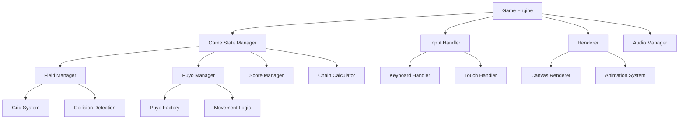
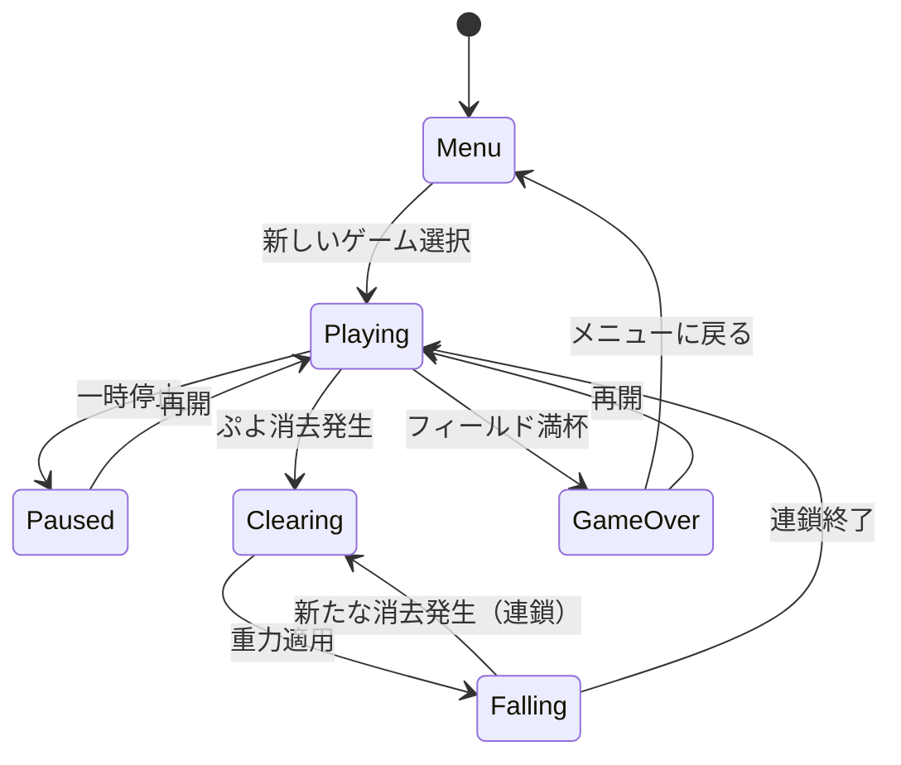

# 設計書

## 概要

ぷよぷよゲームは、HTML5 CanvasとJavaScriptを使用したWebベースのアプリケーションとして実装されます。このアプローチにより、クロスプラットフォーム互換性が確保され、プロジェクトの教育的焦点と一致します。ゲームは、ゲームロジック、レンダリング、入力処理、状態管理の間で明確な関心の分離を持つモジュラーアーキテクチャを特徴とします。

コアゲームプレイは、色付きのぷよのペアが上から落下する12×6のグリッドを中心に展開されます。プレイヤーは、キーボードまたはタッチ操作を通じてこれらの落下するピースを操作し、戦略的な配置を作成します。同じ色のぷよが4つ以上つながると、それらは消失し、より高いスコアのための潜在的な連鎖反応をトリガーします。

## アーキテクチャ

### 高レベルアーキテクチャ



### コアコンポーネント

1. **ゲームエンジン**: ゲームループとコンポーネント間の相互作用を管理する中央コーディネーター
2. **ゲーム状態マネージャー**: ゲーム状態（メニュー、プレイ中、一時停止、ゲームオーバー）を処理
3. **メニューシステム**: 新しいゲーム開始、設定、ゲームオーバー画面を管理
4. **フィールドマネージャー**: 12×6のプレイグリッドとぷよの配置を管理
5. **ぷよマネージャー**: ぷよの作成、移動、回転、物理を処理
6. **入力ハンドラー**: キーボードとタッチ入力を処理
7. **レンダラー**: HTML5 Canvasを使用してすべての視覚出力を管理
8. **連鎖計算機**: 連鎖反応とスコアリングを計算
9. **スコアマネージャー**: スコア計算、全消しボーナス、連鎖倍率を管理
10. **オーディオマネージャー**: 効果音とバックグラウンドミュージックを処理

## コンポーネントとインターフェース

### ゲームエンジンインターフェース

```javascript
class GameEngine {
    constructor(canvasElement)
    start()
    pause()
    resume()
    restart()
    update(deltaTime)
    render()
    handleInput(inputEvent)
}
```

### フィールドマネージャーインターフェース

```javascript
class FieldManager {
    constructor(width = 6, height = 12)
    getCell(x, y)
    setCell(x, y, puyo)
    isValidPosition(x, y)
    clearCell(x, y)
    applyGravity()
    findConnectedGroups()
    clearGroups(groups)
    isGameOver()
}
```

### ぷよマネージャーインターフェース

```javascript
class PuyoManager {
    constructor(fieldManager)
    spawnPuyoPair()
    movePair(direction)
    rotatePair()
    dropPair()
    fixPairToField()
    getCurrentPair()
    getNextPair()
}
```

### 入力ハンドラーインターフェース

```javascript
class InputHandler {
    constructor(gameEngine)
    bindKeyboardEvents()
    bindTouchEvents()
    handleKeyDown(event)
    handleKeyUp(event)
    handleTouchStart(event)
    handleTouchMove(event)
    handleTouchEnd(event)
    
    // 具体的なキーマッピング
    // 左矢印キー: 左移動
    // 右矢印キー: 右移動  
    // 上矢印キー/スペースバー: 時計回り回転
    // 下矢印キー: 高速落下
    
    // タッチマッピング
    // 画面左側タップ: 左移動
    // 画面右側タップ: 右移動
    // ぷよペアタップ: 回転
    // 下スワイプ: 高速落下
}
```

### レンダラーインターフェース

```javascript
class Renderer {
    constructor(canvas, context)
    renderField(field)
    renderPuyo(puyo, x, y)
    renderUI(score, chains, nextPuyo)
    renderGameOver()
    renderAnimation(animation)
    renderMenu()
    renderNextPuyoPreview(nextPair)
    renderZenkeshiEffect()
    clear()
    
    // パフォーマンス要件: 16ms以内での更新（60fps）
    // フレームレート監視とパフォーマンス最適化を含む
}
```

## データモデル

### ぷよモデル

```javascript
class Puyo {
    constructor(color, x = 0, y = 0) {
        this.color = color;      // 'red', 'blue', 'green', 'yellow', 'purple'
        this.x = x;              // Grid x position
        this.y = y;              // Grid y position
        this.state = 'falling';  // 'falling', 'fixed', 'clearing'
        this.animationFrame = 0; // For animation states
    }
}
```

### ぷよペアモデル

```javascript
class PuyoPair {
    constructor(puyo1, puyo2) {
        this.puyo1 = puyo1;      // Primary puyo (pivot)
        this.puyo2 = puyo2;      // Secondary puyo (rotates around primary)
        this.rotation = 0;       // 0, 1, 2, 3 (0°, 90°, 180°, 270°)
        this.x = 2;              // Center position (grid coordinates)
        this.y = 0;              // Top position
        this.fallSpeed = 1;      // Cells per second
        this.fastDrop = false;   // Accelerated falling state
    }
}
```

### ゲーム状態モデル

```javascript
class GameState {
    constructor() {
        this.field = new Array(12).fill(null).map(() => new Array(6).fill(null));
        this.score = 0;
        this.level = 1;
        this.currentPair = null;
        this.nextPair = null;
        this.gameStatus = 'playing'; // 'playing', 'paused', 'gameOver'
        this.chainCount = 0;
        this.lastClearTime = 0;
    }
}
```

### 連鎖モデル

```javascript
class Chain {
    constructor() {
        this.links = [];         // Array of chain links
        this.totalScore = 0;     // Total score for this chain
        this.multiplier = 1;     // Current chain multiplier
        this.isActive = false;   // Whether chain is currently processing
    }
}
```

### スコアマネージャーモデル

```javascript
class ScoreManager {
    constructor() {
        this.currentScore = 0;
        this.chainCount = 0;
        this.lastChainScore = 0;
        this.zenkeshiBonus = 10000; // 全消しボーナス点数
    }
    
    calculateClearScore(puyoCount, chainLevel) {
        // 基本点数 + 連鎖倍率計算
        const baseScore = puyoCount * 10;
        const chainMultiplier = Math.pow(2, chainLevel - 1);
        return baseScore * chainMultiplier;
    }
    
    awardZenkeshiBonus() {
        // 全消し達成時の大幅ボーナス
        this.currentScore += this.zenkeshiBonus;
        return this.zenkeshiBonus;
    }
    
    isZenkeshi(field) {
        // フィールドが完全に空かどうかチェック
        return field.every(row => row.every(cell => cell === null));
    }
}
```

### メニューシステムモデル

```javascript
class MenuSystem {
    constructor() {
        this.currentMenu = 'main';  // 'main', 'game', 'gameOver'
        this.selectedOption = 0;
    }
    
    showMainMenu() {
        // 新しいゲーム開始オプションを表示
    }
    
    startNewGame() {
        // 要件1: 新しいゲーム初期化
        // - 12×6フィールドクリア
        // - スコアリセット
        // - 最初のぷよペア生成
        // - 次のぷよペアプレビュー表示
    }
    
    showGameOverScreen(finalScore) {
        // 要件9: ゲームオーバー画面
        // - 最終スコア表示
        // - 再開/メニュー戻りオプション
    }
}
```

## ゲームフローと状態遷移

### ゲーム初期化フロー（要件1対応）

1. **新しいゲーム開始**
   - 12×6フィールドを空の状態で初期化
   - スコアを0にリセット
   - フィールド上部中央（x=2, y=0）に最初のぷよペアを生成
   - プレビューエリアに次のぷよペアを表示

### ゲームプレイフロー

1. **ぷよ操作フェーズ**
   - プレイヤー入力による移動・回転処理
   - 自動落下タイマーによる下降
   - 着地検出と固定処理

2. **消去判定フェーズ**
   - 4つ以上の同色接続グループ検出
   - 消去アニメーション実行
   - スコア計算と加算

3. **重力適用フェーズ**
   - 空きスペースへのぷよ落下
   - 新たな接続グループ形成チェック
   - 連鎖反応の継続判定

4. **次ペア生成フェーズ**
   - 新しいぷよペアの生成
   - ゲームオーバー条件チェック
   - プレビュー更新

### 状態遷移図



## エラーハンドリング

### 入力検証

- 処理前にすべてのユーザー入力を検証
- 無効な移動を無視（例：フィールド境界外へのぷよ移動）
- ゲーム状態を破綻させることなく、高速入力シーケンスを適切に処理

### ゲーム状態の一貫性

```javascript
class ErrorHandler {
    static validateMove(puyoPair, direction, field) {
        try {
            // Validate move is within bounds and doesn't collide
            return this.isValidMove(puyoPair, direction, field);
        } catch (error) {
            console.warn('Invalid move attempted:', error);
            return false;
        }
    }
    
    static recoverFromInvalidState(gameState) {
        // Reset to last known good state if corruption detected
        if (!this.isValidGameState(gameState)) {
            return this.createDefaultGameState();
        }
        return gameState;
    }
}
```

### パフォーマンスエラーハンドリング

- **60fps要件**: 16ms以内での画面更新を保証するフレームレート監視を実装
- パフォーマンスが低下した場合、視覚効果を適切に劣化
- 古いデバイス用のフォールバックレンダリングモードを提供
- requestAnimationFrameを使用した最適化されたレンダリングループ

```javascript
class PerformanceMonitor {
    constructor() {
        this.frameTime = 0;
        this.lastFrameTime = 0;
        this.targetFrameTime = 16; // 60fps = 16.67ms per frame
    }
    
    checkPerformance(currentTime) {
        this.frameTime = currentTime - this.lastFrameTime;
        if (this.frameTime > this.targetFrameTime * 1.5) {
            // パフォーマンス劣化を検出
            this.degradeVisualEffects();
        }
        this.lastFrameTime = currentTime;
    }
    
    degradeVisualEffects() {
        // アニメーション品質を下げる
        // パーティクル効果を減らす
        // フレームスキップを実装
    }
}
```

## テスト戦略

### ユニットテスト

**コアロジックテスト:**
- フィールド操作（配置、消去、重力）
- ぷよペアの移動と回転ロジック
- 連鎖検出とスコアリングアルゴリズム
- 入力検証とサニタイゼーション

**テストフレームワーク:** JavaScriptユニットテスト用のJest

```javascript
describe('FieldManager', () => {
    test('should detect connected groups correctly', () => {
        const field = new FieldManager();
        // Set up test scenario with connected puyo
        const groups = field.findConnectedGroups();
        expect(groups.length).toBe(expectedGroupCount);
    });
    
    test('should apply gravity correctly after clearing', () => {
        const field = new FieldManager();
        // Test gravity application
        field.applyGravity();
        expect(field.getCell(x, y)).toBe(expectedPuyo);
    });
});
```

### 統合テスト

**ゲームフローテスト:**
- 開始からゲームオーバーまでの完全なゲームセッション
- 複数の消去を伴う連鎖反応シーケンス
- 異なるデバイスとブラウザでの入力処理
- 状態遷移（メニュー → ゲーム → ゲームオーバー）

### ビジュアルテスト

**レンダリングテスト:**
- 異なる画面サイズでのCanvas レンダリング精度
- アニメーションの滑らかさとタイミング
- UI要素の配置と応答性
- 色のアクセシビリティとコントラスト検証

### パフォーマンステスト

**ベンチマーク:**
- 複雑な連鎖反応中のフレームレート一貫性
- 長時間プレイセッション中のメモリ使用量
- 入力遅延測定
- 読み込み時間最適化

### ブラウザ互換性テスト

**対象ブラウザ:**
- Chrome 90+
- Firefox 88+
- Safari 14+
- Edge 90+
- モバイルブラウザ（iOS Safari、Chrome Mobile）

### 自動テストパイプライン

```javascript
// Example test configuration
module.exports = {
    testEnvironment: 'jsdom',
    setupFilesAfterEnv: ['<rootDir>/src/test/setup.js'],
    testMatch: ['**/__tests__/**/*.test.js'],
    collectCoverageFrom: [
        'src/**/*.js',
        '!src/test/**',
        '!src/assets/**'
    ],
    coverageThreshold: {
        global: {
            branches: 80,
            functions: 80,
            lines: 80,
            statements: 80
        }
    }
};
```

### 手動テストシナリオ

1. **基本ゲームプレイフロー**
   - 新しいゲーム開始 → ぷよ配置 → 連鎖作成 → ゲームオーバー
   - すべての操作が正しく動作することを確認
   - 一時停止/再開機能のテスト

2. **エッジケース**
   - 高速入力シーケンス
   - 同時多色消去
   - 最大連鎖シナリオ
   - フィールドオーバーフロー条件

3. **アクセシビリティテスト**
   - キーボードのみのナビゲーション
   - スクリーンリーダー互換性
   - 色覚異常に配慮した色スキーム
   - タッチターゲットサイズ検証

4. **パフォーマンスストレステスト**
   - 長時間プレイセッション（30分以上）
   - 複雑な連鎖反応（10連鎖以上）
   - 複数のブラウザタブを開いた状態
   - 低スペックデバイステスト