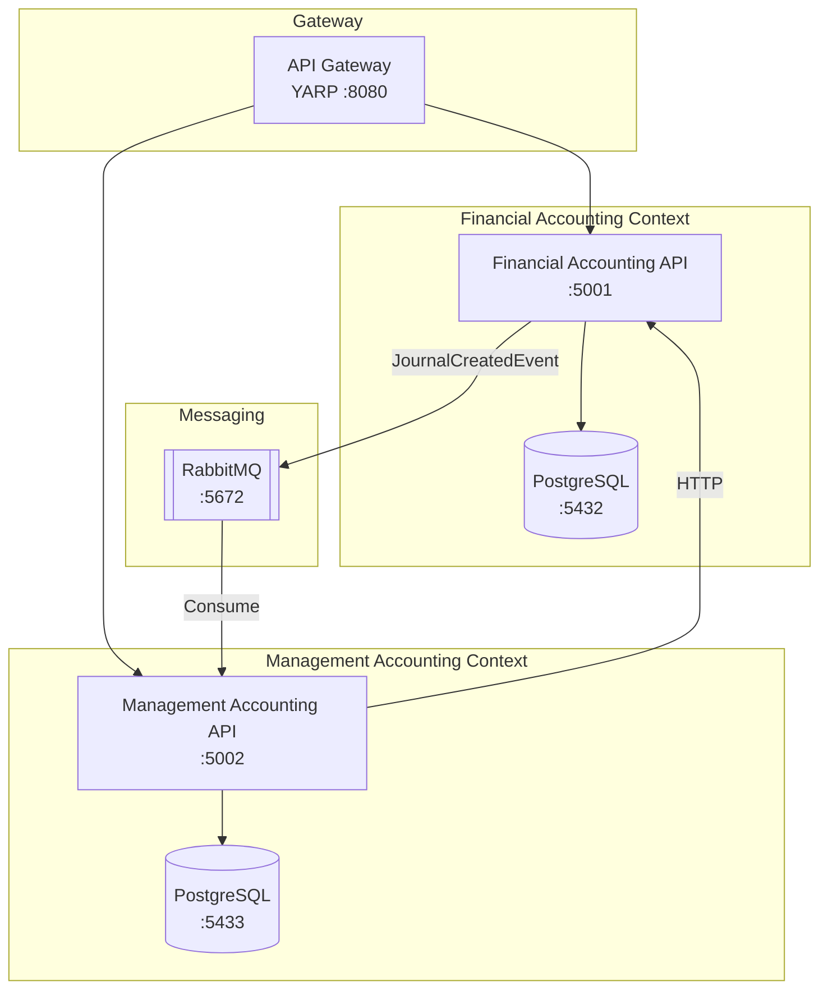
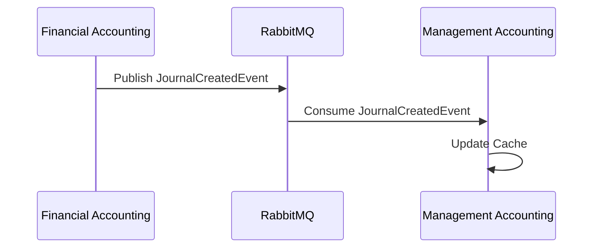

# Accounting System - Microservices Architecture

境界付けられたコンテキスト（Bounded Context）パターンを適用したマイクロサービスアーキテクチャの会計システム。

## アーキテクチャ概要



## 境界付けられたコンテキスト

| コンテキスト | 責務 | 主要エンティティ |
|-------------|------|-----------------|
| Financial Accounting | 財務会計（仕訳、勘定科目） | Journal, Account |
| Management Accounting | 管理会計（財務分析） | FinancialAnalysisResult |

## プロジェクト構成

```
app/csharp-ms/
├── ApiGateway/                          # YARP リバースプロキシ
│   └── ApiGateway/
├── FinancialAccounting/                 # 財務会計サービス
│   ├── FinancialAccounting.Api/         # REST API
│   ├── FinancialAccounting.Application/ # ユースケース
│   ├── FinancialAccounting.Domain/      # ドメインモデル
│   └── FinancialAccounting.Infrastructure/ # 永続化・メッセージング
├── ManagementAccounting/                # 管理会計サービス
│   ├── ManagementAccounting.Api/
│   ├── ManagementAccounting.Application/
│   ├── ManagementAccounting.Domain/
│   └── ManagementAccounting.Infrastructure/
├── FinancialAccounting.Tests/           # 財務会計テスト
├── ManagementAccounting.Tests/          # 管理会計テスト
├── Integration.Tests/                   # 統合テスト
├── AccountingSystem.sln                 # ソリューションファイル
└── docker-compose.yml                   # Docker Compose 設定
```

## 技術スタック

- **.NET 10** - アプリケーションフレームワーク
- **YARP** - API Gateway（リバースプロキシ）
- **PostgreSQL 16** - データベース
- **Dapper** - マイクロ ORM
- **FluentMigrator** - データベースマイグレーション
- **RabbitMQ** - メッセージブローカー
- **MassTransit** - メッセージングフレームワーク
- **Refit** - HTTP クライアント生成
- **Testcontainers** - 統合テスト用コンテナ

## 開発環境セットアップ

### 前提条件

- .NET 10 SDK
- Docker Desktop
- IDE（Rider / Visual Studio / VS Code）

### ローカル実行

1. **インフラストラクチャ起動**

```bash
docker compose up -d financial-db management-db rabbitmq
```

2. **サービス起動**

```bash
# 財務会計サービス
dotnet run --project FinancialAccounting/FinancialAccounting.Api

# 管理会計サービス（別ターミナル）
dotnet run --project ManagementAccounting/ManagementAccounting.Api

# API Gateway（別ターミナル）
dotnet run --project ApiGateway/ApiGateway
```

### Docker Compose で全サービス起動

```bash
docker compose up --build
```

## API エンドポイント

### API Gateway 経由（推奨）

| メソッド | パス | 説明 |
|---------|------|------|
| GET | `http://localhost:8080/api/journals?fiscalYear=2024` | 仕訳一覧取得 |
| GET | `http://localhost:8080/api/journals/{id}` | 仕訳取得 |
| POST | `http://localhost:8080/api/journals` | 仕訳作成 |
| GET | `http://localhost:8080/api/financial-analysis/{fiscalYear}` | 財務分析取得 |

### 直接アクセス

| サービス | ベース URL |
|---------|-----------|
| Financial Accounting | `http://localhost:5001` |
| Management Accounting | `http://localhost:5002` |

## テスト実行

```bash
# 全テスト実行
dotnet test

# 統合テストのみ
dotnet test Integration.Tests/

# カバレッジ付き
dotnet test --collect:"XPlat Code Coverage"
```

## サービス間連携

### 同期通信（HTTP）

Management Accounting は Financial Accounting の API を呼び出して仕訳データを取得。
Anti-Corruption Layer（ACL）パターンを適用し、外部モデルを内部モデルに変換。

```
ManagementAccounting.Infrastructure/
└── Adapters/External/
    ├── IFinancialAccountingApi.cs  # Refit インターフェース
    ├── FinancialAccountingClient.cs # ACL 実装
    └── JournalDto.cs               # 外部 DTO
```

### 非同期通信（RabbitMQ）

Financial Accounting で仕訳が作成されると `JournalCreatedEvent` を発行。
Management Accounting がイベントを消費してキャッシュを更新。



## 環境変数

| 変数名 | デフォルト値 | 説明 |
|--------|-------------|------|
| `ConnectionStrings__FinancialAccounting` | - | 財務会計 DB 接続文字列 |
| `ConnectionStrings__ManagementAccounting` | - | 管理会計 DB 接続文字列 |
| `RabbitMQ__Host` | `localhost` | RabbitMQ ホスト |
| `RabbitMQ__Username` | `guest` | RabbitMQ ユーザー名 |
| `RabbitMQ__Password` | `guest` | RabbitMQ パスワード |
| `FinancialAccountingService__BaseUrl` | - | 財務会計サービス URL |

## ポート一覧

| サービス | ポート |
|---------|--------|
| API Gateway | 8080 |
| Financial Accounting API | 5001 |
| Management Accounting API | 5002 |
| PostgreSQL (Financial) | 5432 |
| PostgreSQL (Management) | 5433 |
| RabbitMQ AMQP | 5672 |
| RabbitMQ Management UI | 15672 |
