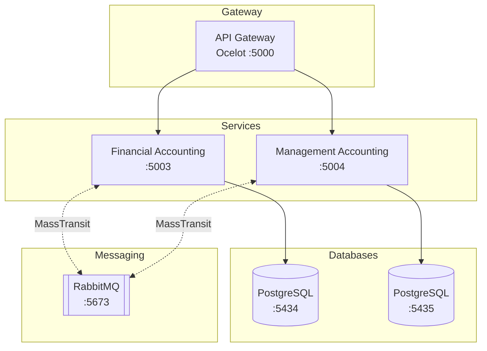
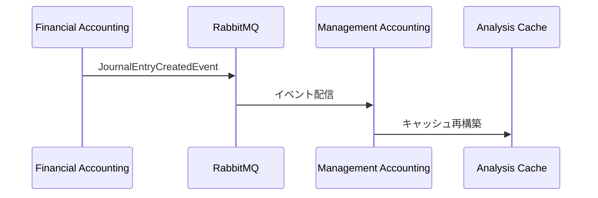

# F# Microservices - 会計システム

F# で実装されたマイクロサービスアーキテクチャの会計システムです。財務会計サービスと管理会計サービスを RabbitMQ によるイベント駆動で連携させています。

## アーキテクチャ



## プロジェクト構成

```
fsharp-ms/
├── src/
│   ├── ApiGateway/                    # Ocelot API Gateway
│   ├── FinancialAccounting.Api/       # 財務会計 API
│   ├── FinancialAccounting.Application/
│   ├── FinancialAccounting.Domain/
│   ├── FinancialAccounting.Infrastructure/
│   ├── ManagementAccounting.Api/      # 管理会計 API
│   ├── ManagementAccounting.Application/
│   ├── ManagementAccounting.Domain/
│   ├── ManagementAccounting.Infrastructure/
│   └── Shared.Contracts/              # サービス間共有コントラクト
├── tests/
│   ├── FinancialAccounting.Tests/     # 財務会計単体テスト
│   ├── ManagementAccounting.Tests/    # 管理会計単体テスト
│   └── ServiceIntegration.Tests/      # サービス統合テスト
├── script-lab/                        # Excel Script Lab クライアント
│   ├── journals-bulk-operations.yaml  # 仕訳一括操作
│   └── financial-analysis-operations.yaml # 財務分析操作
└── docker-compose.yml
```

## 技術スタック

- **言語**: F# (.NET 9)
- **Web フレームワーク**: ASP.NET Core Minimal API
- **API Gateway**: Ocelot
- **データベース**: PostgreSQL 16
- **メッセージング**: RabbitMQ (MassTransit)
- **ORM**: Dapper
- **テスト**: xUnit, Testcontainers

## 前提条件

- Docker Desktop
- .NET 9 SDK

## 起動方法

### Docker Compose (推奨)

```bash
cd app/fsharp-ms
docker-compose up -d
```

サービスが起動すると以下のエンドポイントが利用可能になります:

| サービス | URL |
|---------|-----|
| API Gateway | http://localhost:5000 |
| 財務会計 API | http://localhost:5003 |
| 管理会計 API | http://localhost:5004 |
| RabbitMQ 管理画面 | http://localhost:15673 |

### ローカル開発

データベースとメッセージングのみ Docker で起動:

```bash
docker-compose up -d financial-db management-db rabbitmq
```

各サービスを個別に起動:

```bash
# 財務会計サービス
cd src/FinancialAccounting.Api
dotnet run --urls="http://localhost:5115"

# 管理会計サービス
cd src/ManagementAccounting.Api
dotnet run --urls="http://localhost:5116"

# API Gateway
cd src/ApiGateway
dotnet run --urls="http://localhost:5200"
```

## API エンドポイント

### 財務会計サービス

| メソッド | パス | 説明 |
|---------|------|------|
| GET | `/api/accounts` | 勘定科目一覧取得 |
| GET | `/api/accounts/{code}` | 勘定科目詳細取得 |
| POST | `/api/accounts` | 勘定科目作成 |
| GET | `/api/journals` | 仕訳一覧取得 |
| GET | `/api/journals/{id}` | 仕訳詳細取得 |
| POST | `/api/journals` | 仕訳作成 |

### 管理会計サービス

| メソッド | パス | 説明 |
|---------|------|------|
| GET | `/api/financial-analysis/{fiscalYear}` | 財務分析実行 |
| GET | `/api/financial-analysis/{fiscalYear}/cached` | キャッシュ済み分析取得 |
| DELETE | `/api/financial-analysis/{fiscalYear}/cache` | 分析キャッシュ削除 |

## テスト実行

```bash
# 全テスト実行
dotnet test

# 単体テストのみ
dotnet test tests/FinancialAccounting.Tests
dotnet test tests/ManagementAccounting.Tests

# 統合テスト (Docker 必須)
dotnet test tests/ServiceIntegration.Tests
```

## Script Lab (Excel クライアント)

`script-lab/` ディレクトリには Excel の Script Lab で使用できる TypeScript クライアントが含まれています。

### 使用方法

1. Excel を開き、Script Lab アドインを有効化
2. Script Lab の Code タブを開く
3. YAML ファイルの内容をインポート
4. 各機能ボタンをクリックして実行

### 機能

**journals-bulk-operations.yaml**:
- 仕訳一覧取得 → 「仕訳一覧」シート
- 勘定科目取得 → 「勘定科目」シート
- 仕訳入力/登録 → 「仕訳入力」シート

**financial-analysis-operations.yaml**:
- 財務分析実行 → 「財務分析」シート
- 年度比較分析 → 「年度比較」シート

## イベント駆動アーキテクチャ

仕訳が作成されると、財務会計サービスから `JournalEntryCreatedEvent` が発行され、管理会計サービスがこのイベントを購読して財務分析キャッシュを再構築します。


