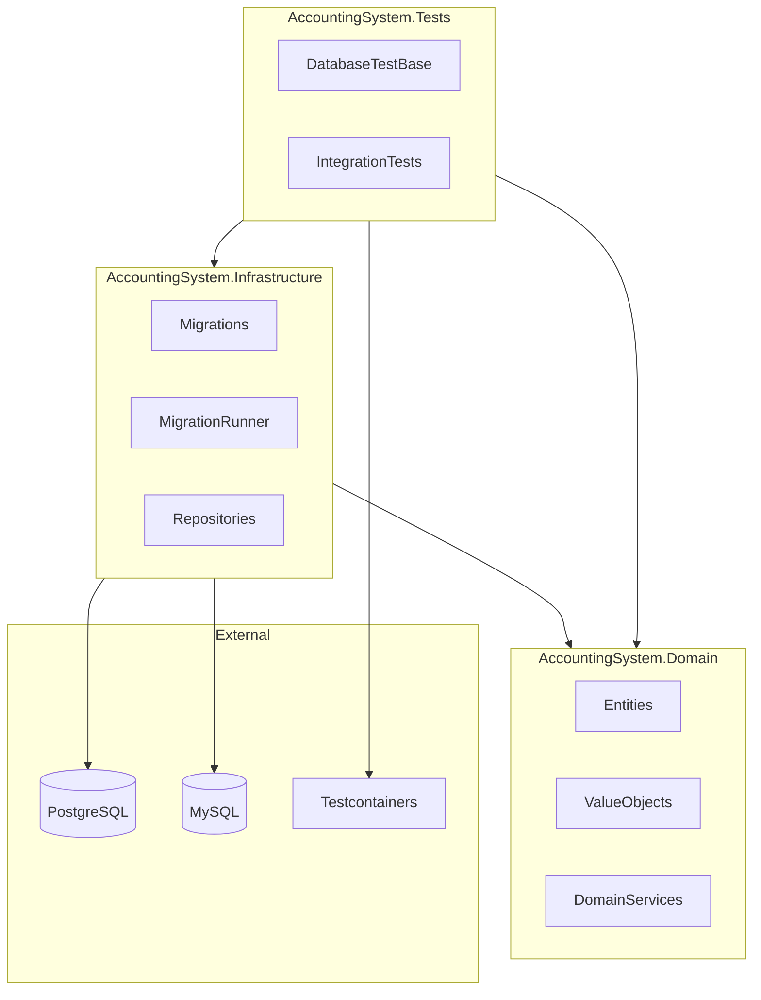

# F# 財務会計システム - TDD でデータベース設計

テスト駆動開発（TDD）の原則をデータベース設計に応用し、財務会計システムを段階的に構築するプロジェクトです。

## アーキテクチャ



## 技術スタック

| カテゴリ | 技術 |
|---------|------|
| 言語 | F# / .NET 9.0 |
| データベース | PostgreSQL 16 / MySQL 8.0 |
| ORM | Dapper 2.1 |
| マイグレーション | FluentMigrator 6.2 |
| テスト | xUnit / FsUnit / Testcontainers |
| 静的解析 | FSharpLint |
| ビルド | Cake 6.0 |
| コンテナ | Docker / Docker Compose |

## 前提条件

- .NET SDK 9.0 以上
- Docker & Docker Compose
- Git

## クイックスタート

### 1. 依存関係のインストール

```bash
# ツールの復元
dotnet tool restore

# パッケージの復元
dotnet restore
```

### 2. データベースの起動

```bash
# PostgreSQL を起動
docker compose up -d postgres

# または MySQL を起動
docker compose up -d mysql

# すべてのサービスを起動（PostgreSQL + MySQL + Adminer）
docker compose up -d
```

### 3. ビルドとテスト

```bash
# Cake を使用（推奨）
dotnet cake

# または dotnet コマンドを直接使用
dotnet build
dotnet test
```

## Cake タスク

| タスク | コマンド | 説明 |
|--------|---------|------|
| Default | `dotnet cake` | Build + Test |
| Clean | `dotnet cake --target=Clean` | ビルド成果物のクリーンアップ |
| Restore | `dotnet cake --target=Restore` | パッケージ復元 |
| Build | `dotnet cake --target=Build` | ビルド |
| Test | `dotnet cake --target=Test` | テスト実行 |
| Lint | `dotnet cake --target=Lint` | FSharpLint 静的解析 |
| Test-Coverage | `dotnet cake --target=Test-Coverage` | カバレッジ測定 |
| Coverage-Report | `dotnet cake --target=Coverage-Report` | カバレッジレポート生成 |
| CI | `dotnet cake --target=CI` | CI パイプライン |
| Migrate | `dotnet cake --target=Migrate` | マイグレーション実行 |
| Docker-Up | `dotnet cake --target=Docker-Up` | Docker 起動 |
| Docker-Down | `dotnet cake --target=Docker-Down` | Docker 停止 |

## プロジェクト構造

```
app/fsharp/
├── AccountingSystem.sln              # ソリューションファイル
├── AccountingSystem.Domain/          # ドメイン層
│   ├── AccountingSystem.Domain.fsproj
│   └── Library.fs
├── AccountingSystem.Infrastructure/  # インフラストラクチャ層
│   ├── AccountingSystem.Infrastructure.fsproj
│   ├── Migrations/                   # FluentMigrator マイグレーション
│   │   └── Migration_20250106_001_InitialSetup.fs
│   ├── MigrationRunner.fs
│   ├── Program.fs
│   └── appsettings.json
├── AccountingSystem.Tests/           # テストプロジェクト
│   ├── AccountingSystem.Tests.fsproj
│   ├── DatabaseTestBase.fs           # Testcontainers 基底クラス
│   ├── IntegrationTests/
│   │   └── DatabaseConnectionTests.fs
│   └── appsettings.Test.json
├── docker-compose.yml                # Docker Compose 設定
├── docker/
│   ├── postgres/init/                # PostgreSQL 初期化スクリプト
│   └── mysql/                        # MySQL 設定
├── build.cake                        # Cake ビルドスクリプト
├── cake.sh                           # シェルラッパー
├── fsharplint.json                   # FSharpLint 設定
└── .env.example                      # 環境変数サンプル
```

## データベース接続

### Adminer（データベース管理ツール）

- URL: http://localhost:8080

**PostgreSQL 接続:**
- システム: PostgreSQL
- サーバ: postgres
- ユーザ名: postgres
- パスワード: postgres
- データベース: accounting_system

**MySQL 接続:**
- システム: MySQL
- サーバ: mysql
- ユーザ名: user
- パスワード: password
- データベース: accounting_system

## マイグレーション

```bash
# マイグレーション実行
dotnet cake --target=Migrate

# または直接実行
cd AccountingSystem.Infrastructure
dotnet run
```

## テスト

テストは Testcontainers を使用して、Docker コンテナ上で PostgreSQL を起動して実行します。

```bash
# すべてのテストを実行
dotnet test

# カバレッジ付きテスト
dotnet cake --target=Test-Coverage

# カバレッジレポート生成
dotnet cake --target=Coverage-Report
# レポート: coverage/index.html
```

## 静的解析

```bash
# FSharpLint をインストール（初回のみ）
dotnet tool install -g dotnet-fsharplint

# Lint 実行
dotnet cake --target=Lint

# または直接実行
dotnet fsharplint lint AccountingSystem.sln
```

## Docker コマンド

```bash
# コンテナ起動
docker compose up -d

# コンテナ停止
docker compose down

# ログ確認
docker compose logs -f postgres

# コンテナに接続
docker compose exec postgres psql -U postgres -d accounting_system

# ボリューム含めて削除
docker compose down -v
```

## 開発フロー（TDD）

1. **Red**: 失敗するテストを書く
2. **Green**: テストを通す最小限のコードを書く
3. **Refactor**: コードをリファクタリング

```fsharp
// 1. テストを書く（Red）
[<Fact>]
member this.``勘定科目を作成できる``() =
    task {
        // Arrange
        let account = { Code = "1100"; Name = "現金" }

        // Act
        let! result = repository.Create(account)

        // Assert
        result |> should be (greaterThan 0L)
    }

// 2. 実装を書く（Green）
// 3. リファクタリング（Refactor）
```

## トラブルシューティング

### Testcontainers エラー

Docker Desktop が起動していることを確認してください。Windows では以下の環境変数が自動設定されます：

```bash
DOCKER_HOST=npipe://./pipe/docker_engine
```

### ポート競合

`.env` ファイルでポートを変更できます：

```bash
cp .env.example .env
# .env を編集
POSTGRES_PORT=5433
```

## 参考資料

- [F# 公式ドキュメント](https://docs.microsoft.com/ja-jp/dotnet/fsharp/)
- [FluentMigrator](https://fluentmigrator.github.io/)
- [Testcontainers for .NET](https://dotnet.testcontainers.org/)
- [Cake Build](https://cakebuild.net/)
- [FSharpLint](https://fsprojects.github.io/FSharpLint/)
