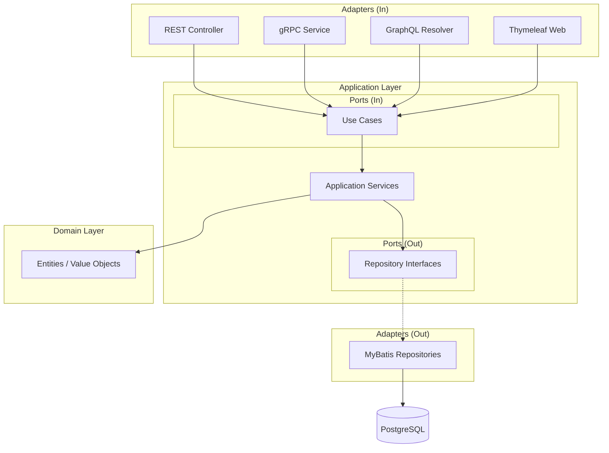

# Production Management System

生産管理システムの Java 実装です。Hexagonal Architecture（ポート＆アダプタ）に基づいた設計で、REST API、gRPC、GraphQL を提供します。

## アーキテクチャ



## プロジェクト構成

```
app/java/
├── src/
│   ├── main/
│   │   ├── java/com/example/production/
│   │   │   ├── domain/                    # ドメイン層
│   │   │   │   ├── model/                 # エンティティ、値オブジェクト
│   │   │   │   └── exception/             # ドメイン例外
│   │   │   ├── application/               # アプリケーション層
│   │   │   │   ├── port/in/               # 入力ポート（ユースケース）
│   │   │   │   ├── port/out/              # 出力ポート（リポジトリIF）
│   │   │   │   └── service/               # アプリケーションサービス
│   │   │   └── infrastructure/            # インフラ層
│   │   │       ├── in/                    # 入力アダプタ
│   │   │       │   ├── rest/              # REST コントローラ
│   │   │       │   ├── grpc/              # gRPC サービス
│   │   │       │   ├── graphql/           # GraphQL リゾルバ
│   │   │       │   └── web/               # Thymeleaf コントローラ
│   │   │       ├── out/                   # 出力アダプタ
│   │   │       │   └── persistence/       # MyBatis リポジトリ
│   │   │       └── config/                # 設定クラス
│   │   ├── resources/
│   │   │   ├── db/migration/              # Flyway マイグレーション
│   │   │   ├── graphql/                   # GraphQL スキーマ
│   │   │   └── templates/                 # Thymeleaf テンプレート
│   │   └── proto/                         # Protocol Buffers 定義
│   └── test/                              # テストコード
├── config/                                # 静的解析設定
│   ├── checkstyle/
│   ├── pmd/
│   └── spotbugs/
├── docker-compose.yml                     # Docker Compose 設定
└── build.gradle.kts                       # Gradle ビルド設定
```

## 技術スタック

| カテゴリ | 技術 |
|---------|------|
| 言語 | Java 25 |
| フレームワーク | Spring Boot 4.0 |
| Web | Spring MVC + Thymeleaf |
| API | REST / gRPC / GraphQL |
| ORM | MyBatis |
| データベース | PostgreSQL 16 |
| マイグレーション | Flyway |
| ビルド | Gradle (Kotlin DSL) |
| コード分析 | Checkstyle, PMD, SpotBugs |
| テスト | JUnit 5, Testcontainers |
| カバレッジ | JaCoCo |

## 前提条件

- [Java 25](https://jdk.java.net/25/)
- [Docker Desktop](https://www.docker.com/products/docker-desktop/)
- [IntelliJ IDEA](https://www.jetbrains.com/idea/) （推奨）

## セットアップ

### 1. データベースの起動

```bash
cd app/java
docker-compose up -d
```

PostgreSQL が `localhost:5432` で起動します。

- ユーザー: `postgres`
- パスワード: `postgres`
- データベース: `production_management`

### 2. アプリケーションの起動

```bash
./gradlew bootRun
```

Docker Compose が自動で起動し、Flyway によるマイグレーションが実行されます。

## エンドポイント

| サービス | URL |
|----------|-----|
| REST API | http://localhost:8080/api |
| Swagger UI | http://localhost:8080/swagger-ui.html |
| GraphQL Playground | http://localhost:8080/graphiql |
| gRPC | localhost:9090 |
| Web UI | http://localhost:8080 |

## テストの実行

```bash
# 全テスト実行
./gradlew test

# カバレッジレポート生成
./gradlew jacocoTestReport
# レポート: build/reports/jacoco/test/html/index.html
```

## 静的解析

```bash
# Checkstyle
./gradlew checkstyleMain checkstyleTest

# PMD
./gradlew pmdMain pmdTest

# SpotBugs
./gradlew spotbugsMain spotbugsTest

# 全ての検証を実行
./gradlew check
```

## 主な機能

| 機能 | 説明 |
|------|------|
| 品目管理 | 製品、部品、原材料の登録・管理 |
| BOM 管理 | 部品表の構成管理、正展開・逆展開 |
| 在庫管理 | 在庫照会、入出庫処理 |
| 発注管理 | 発注書作成、発注状況管理 |
| 製造指示 | 作業指示の作成・進捗管理 |
| MRP | 所要量計算、調達計画立案 |
| 取引先管理 | 仕入先・得意先の登録・管理 |
| 原価管理 | 原価計算、原価分析 |

## API 一覧

### REST API

| メソッド | パス | 説明 |
|----------|------|------|
| GET | /api/items | 品目一覧取得 |
| POST | /api/items | 品目登録 |
| GET | /api/bom/{itemCode}/explode | BOM 正展開 |
| POST | /api/mrp/execute | MRP 実行 |

### GraphQL

```graphql
query {
  items(category: PRODUCT) {
    itemCode
    itemName
    itemCategory
  }
}

mutation {
  createItem(input: { ... }) {
    itemCode
  }
}

subscription {
  mrpProgress {
    progress
    message
  }
}
```

### gRPC

| サービス | メソッド | 説明 |
|----------|----------|------|
| ItemService | GetItems | 品目一覧取得 |
| BomService | ExplodeBom | BOM 展開（Streaming） |
| MrpService | ExecuteMrp | MRP 実行 |

## 開発ガイドライン

- コードスタイル: Google Java Style Guide 準拠（Checkstyle）
- アーキテクチャ: Hexagonal Architecture に従った依存関係
- テスト: TDD サイクルに基づく開発
- カバレッジ: JaCoCo による計測

## ライセンス

このプロジェクトは学習・演習目的で作成されています。
