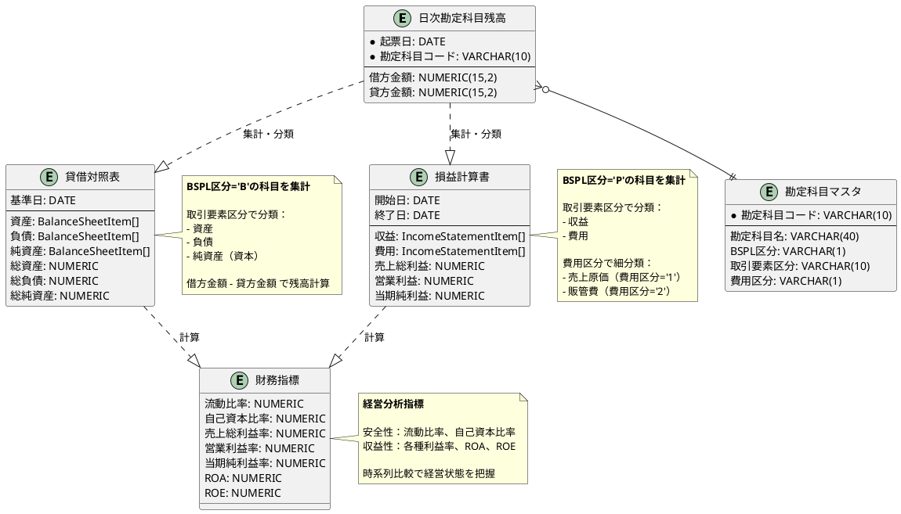
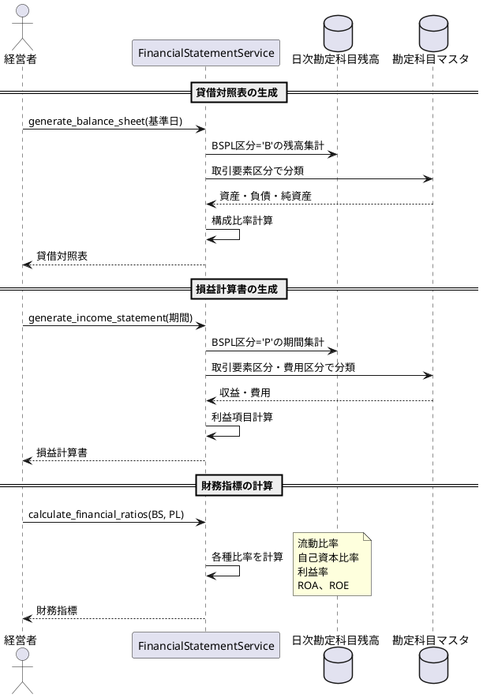

# 財務諸表生成アーキテクチャ

## 概要

財務会計システムにおける財務諸表生成の仕組みを説明します。

## ER図：財務諸表の生成フロー



## シーケンス図：財務諸表生成のプロセス



## 主要コンポーネント

### 1. FinancialStatementService

財務諸表の生成を担当するサービスクラス。

**責務:**
- 日次勘定科目残高テーブルからデータを集計
- BSPL区分と取引要素区分による自動分類
- 構成比率や財務指標の計算

**実装ファイル:**
- `app/services/financial_statement_service.rb`

**主要メソッド:**
- `generate_balance_sheet(as_of_date)` - 貸借対照表を生成
- `generate_income_statement(from_date, to_date)` - 損益計算書を生成
- `calculate_financial_ratios(balance_sheet, income_statement)` - 財務指標を計算

### 2. PORO（Plain Old Ruby Object）モデル

ActiveRecordに依存しないドメインモデル。

**BalanceSheet（貸借対照表）:**
- `app/models/balance_sheet.rb`
- `app/models/balance_sheet_item.rb`

**IncomeStatement（損益計算書）:**
- `app/models/income_statement.rb`
- `app/models/income_statement_item.rb`

**FinancialRatios（財務指標）:**
- `app/models/financial_ratios.rb`

### 3. データベーステーブル

**daily_account_balances（日次勘定科目残高）:**
- 複合主キー: (entry_date, account_code, sub_account_code, department_code, project_code, settlement_flag)
- 仕訳入力時に自動更新（UPSERT）

**accounts（勘定科目マスタ）:**
- BSPL区分（B=貸借対照表、P=損益計算書）
- 取引要素区分（1=資産、2=負債、3=純資産、4=収益、5=費用）
- 費用区分（売上原価、販管費の分類）

## データフロー

1. **仕訳入力** → BalanceService がdaily_account_balances を更新
2. **財務諸表生成** → FinancialStatementService がデータを集計・分類
3. **財務分析** → 財務指標を計算して経営状態を可視化

## 設計の特徴

### 貸借平均の原則

貸借対照表では必ず以下の等式が成立：

```
資産合計 = 負債合計 + 純資産合計
```

### 自動分類

BSPL区分と取引要素区分により、勘定科目を自動的に分類：

- **貸借対照表（B）:** 資産・負債・純資産
- **損益計算書（P）:** 収益・費用

### 構成比率

各項目の構成比率を自動計算：

- **貸借対照表:** 総資産に対する比率
- **損益計算書:** 売上高に対する比率（対売上比）

### 財務指標

7つの主要な財務指標を自動計算：

1. **流動比率** - 短期的な支払能力
2. **自己資本比率** - 財務の安全性
3. **売上総利益率** - 粗利益率
4. **営業利益率** - 本業の収益性
5. **当期純利益率** - 最終的な収益性
6. **ROA** - 総資産利益率
7. **ROE** - 自己資本利益率

## テスト戦略

### 単体テスト

- `spec/services/financial_statement_service_spec.rb` - 84テストケース
- TDDサイクル（Red-Green-Refactor）で実装
- 各財務諸表の生成と計算ロジックを検証

### テストデータ

FactoryBotを使用したテストデータ生成：
- 勘定科目マスタ
- 日次勘定科目残高

### 検証項目

1. 貸借平均の原則の成立
2. BSPL区分による正しい分類
3. 取引要素区分による正しい分類
4. 構成比率の正確な計算
5. 財務指標の正確な計算

## まとめ

財務諸表生成システムは以下の特徴を持つ：

1. **データ駆動設計** - マスタデータによる自動分類
2. **疎結合** - PORO による ActiveRecord からの分離
3. **テスタビリティ** - TDD による高品質実装
4. **保守性** - 単一責任の原則に基づく設計
5. **拡張性** - 新しい財務指標の追加が容易
