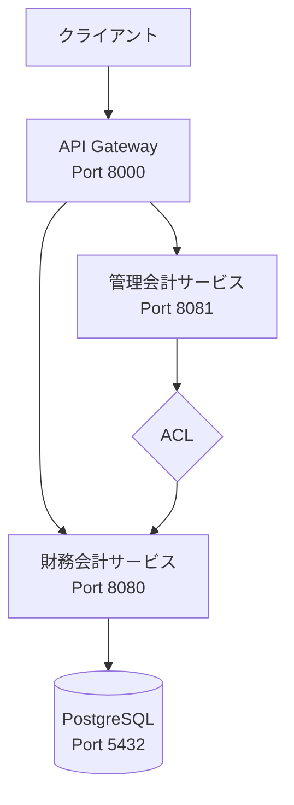

# Scala マイクロサービス - 財務会計システム

境界付けられたコンテキスト（Bounded Context）に基づくマイクロサービスアーキテクチャの実装です。

## アーキテクチャ概要



## 技術スタック

| コンポーネント | 技術 |
|---------------|------|
| HTTP サーバー | Http4s + Ember |
| API 定義 | Tapir |
| JSON 処理 | Circe |
| 副作用管理 | Cats Effect IO |
| DB アクセス | ScalikeJDBC |
| マイグレーション | Flyway |
| コンテナ化 | Docker + docker-compose |

## プロジェクト構成

```
scala-ms/
├── build.sbt                  # ルート build.sbt
├── docker-compose.yml         # Docker Compose 設定
├── justfile                   # タスクランナー
├── common/                    # 共有ライブラリ
│   └── src/main/scala/
│       └── com/example/common/
│           ├── domain/        # 共通ドメイン型
│           └── json/          # JSON コーデック
├── financial-accounting-service/  # 財務会計サービス
│   ├── Dockerfile
│   └── src/
│       ├── main/scala/com/example/financial/
│       │   ├── domain/        # ドメインモデル
│       │   ├── application/   # アプリケーション層
│       │   ├── adapter/       # アダプター層
│       │   │   ├── api/       # HTTP エンドポイント
│       │   │   └── repository/ # リポジトリ実装
│       │   ├── config/        # 設定
│       │   └── seed/          # シードデータ
│       └── test/
├── management-accounting-service/  # 管理会計サービス
│   ├── Dockerfile
│   └── src/
│       ├── main/scala/com/example/management/
│       │   ├── domain/        # ドメインモデル
│       │   ├── application/   # アプリケーション層
│       │   └── adapter/
│       │       ├── api/       # HTTP エンドポイント
│       │       └── client/    # 財務会計クライアント (ACL)
│       └── test/
└── api-gateway/               # API Gateway
    ├── Dockerfile
    └── src/main/scala/com/example/gateway/
```

## 境界付けられたコンテキスト

### 財務会計コンテキスト（Financial Accounting Context）
- **責務**: 会計基準に基づく正確な財務記録と報告
- **主要エンティティ**: Account（勘定科目）、Journal（仕訳）、AccountBalance（残高）
- **ユビキタス言語**: 仕訳を切る、勘定科目残高、会計期間

### 管理会計コンテキスト（Management Accounting Context）
- **責務**: 経営判断のための財務分析と意思決定支援
- **主要概念**: FinancialData（財務データ）、FinancialRatios（財務比率）
- **ユビキタス言語**: 営業利益率、総資産回転率、自己資本比率

### 腐敗防止層（ACL: Anti-Corruption Layer）
`FinancialAccountingClient` が ACL として機能し、財務会計コンテキストのモデル変更から管理会計コンテキストを保護します。

## クイックスタート

### 前提条件
- JDK 21+
- sbt 1.9+
- Docker & Docker Compose
- just (タスクランナー)

### ローカル開発

```bash
# データベースを起動
just db-up

# 財務会計サービスを起動
just run-financial

# 別ターミナルで管理会計サービスを起動
just run-management

# 別ターミナルで API Gateway を起動
just run-gateway

# シードデータを投入
just seed
```

### Docker で起動

```bash
# すべてのサービスをビルド＆起動
just docker-build
just docker-up

# ログを確認
just docker-logs

# 停止
just docker-down
```

## API エンドポイント

### 財務会計サービス (Port 8080)

| メソッド | パス | 説明 |
|---------|------|------|
| GET | /api/v1/accounts | 勘定科目一覧 |
| GET | /api/v1/accounts/{code} | 勘定科目取得 |
| POST | /api/v1/accounts | 勘定科目作成 |
| PUT | /api/v1/accounts/{code} | 勘定科目更新 |
| DELETE | /api/v1/accounts/{code} | 勘定科目削除 |
| GET | /api/v1/journals?fiscalYear={year} | 仕訳一覧 |
| GET | /api/v1/journals/{id} | 仕訳取得 |
| POST | /api/v1/journals | 仕訳作成 |
| DELETE | /api/v1/journals/{id} | 仕訳削除 |

Swagger UI: http://localhost:8080/docs

### 管理会計サービス (Port 8081)

| メソッド | パス | 説明 |
|---------|------|------|
| GET | /api/v1/financial-analysis/{year} | 財務分析 |
| GET | /api/v1/financial-analysis/compare?fromYear={from}&toYear={to} | 比較分析 |
| GET | /api/v1/financial-analysis/data/{year} | 財務データ取得 |

Swagger UI: http://localhost:8081/docs

### API Gateway (Port 8000)

| メソッド | パス | 説明 |
|---------|------|------|
| GET | /health | ヘルスチェック |
| * | /api/v1/accounts/* | → 財務会計サービス |
| * | /api/v1/journals/* | → 財務会計サービス |
| GET | /api/v1/financial-analysis/* | → 管理会計サービス |

## テスト

```bash
# すべてのテストを実行
just test

# 特定のサービスのテストを実行
just test-financial
just test-management
```

## API テスト例

```bash
# 勘定科目一覧を取得
just get-accounts

# 仕訳一覧を取得
just get-journals 2024

# 財務分析を実行
just analyze 2024

# 複数年度の比較分析
just compare 2023 2024
```

## 今後の拡張

1. **イベント駆動**: Kafka によるサービス間非同期通信
2. **分散トレーシング**: OpenTelemetry の導入
3. **サービスメッシュ**: Istio/Linkerd との統合
4. **CI/CD**: GitHub Actions による自動デプロイ
5. **監視**: Prometheus + Grafana
