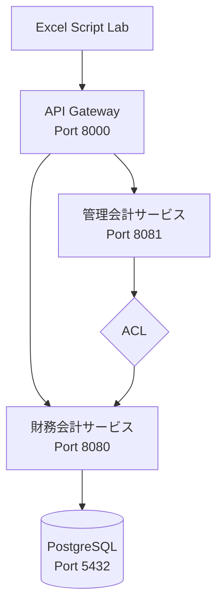

# Script Lab API クライアント (Scala Microservices)

Scala マイクロサービス版会計システムの REST API を Excel Script Lab から利用するための TypeScript クライアントです。

## 前提条件

- Microsoft Excel（デスクトップ版または Excel Online）
- Script Lab アドイン（Excel アドインストアからインストール）
- Scala マイクロサービス API が起動していること

## API サーバーの起動

### Docker Compose で全サービス起動（推奨）

```bash
cd app/scala-ms
docker compose up -d
```

### 個別起動（開発時）

```bash
cd app/scala-ms

# データベースを起動
just db-up

# 財務会計サービスを起動
just run-financial

# 別ターミナルで管理会計サービスを起動
just run-management

# 別ターミナルで API Gateway を起動
just run-gateway
```

API Gateway は `http://localhost:8000` で起動します。

## Script Lab のセットアップ

### 1. Script Lab アドインのインストール

1. Excel を開く
2. `挿入` タブ → `アドインを取得` をクリック
3. 「Script Lab」を検索してインストール
4. `ホーム` タブに Script Lab のアイコンが追加される

### 2. YAML ファイルのインポート

1. Script Lab の `Code` ボタンをクリック
2. メニューから `Import` を選択
3. YAML ファイルの内容をコピーして貼り付け
4. `Import` をクリック

## 提供ツール

### 仕訳入力ツール (`journal-entry.yaml`)

仕訳の一覧取得、入力、登録、財務分析を Excel から実行します。

**機能**:
- 仕訳一覧を取得（年度別）
- 仕訳入力シートを作成
- 仕訳を登録（貸借チェック付き）
- 財務分析を取得（管理会計サービス経由）

**使用方法**:

**仕訳一覧取得**:
1. 「決算期（年度）」に年度を入力（例: 2024）
2. 「仕訳一覧を取得」ボタンをクリック
3. 「仕訳一覧_{年度}」シートに仕訳一覧が出力される

**仕訳入力**:
1. 「入力シート作成」ボタンをクリック
2. 「仕訳入力」シートが作成される
3. 仕訳ヘッダー（日付、決算期、摘要）を入力
4. 仕訳明細（勘定科目コード、金額）を入力
5. 貸借差額が 0 であることを確認
6. 「仕訳登録」ボタンをクリック

**財務分析**:
1. 「決算期（年度）」に年度を入力
2. 「財務分析を取得」ボタンをクリック
3. 「財務分析_{年度}」シートに分析結果が出力される

**出力されるシート**:

| シート名 | 説明 |
|---------|------|
| 仕訳一覧_{年度} | 指定年度の仕訳一覧 |
| 仕訳入力 | 仕訳入力用シート |
| 財務分析_{年度} | 財務分析結果（収益性・効率性・安全性） |

## トラブルシューティング

### CORS エラーが発生する場合

API Gateway が CORS を許可していることを確認してください。開発環境では全てのオリジンを許可しています。

### API に接続できない場合

1. API サーバーが起動しているか確認
2. ファイアウォールの設定を確認
3. API Gateway の URL が正しいか確認（デフォルト: `http://localhost:8000`）

### データが見つからない場合

Seed データが投入されているか確認してください：

```bash
just seed
```

## API エンドポイント

### 財務会計サービス（API Gateway 経由）

| メソッド | パス | 説明 |
|---------|------|------|
| GET | `/api/v1/journals?fiscalYear=2024` | 仕訳一覧（年度別） |
| GET | `/api/v1/journals/{id}` | 仕訳詳細 |
| POST | `/api/v1/journals` | 仕訳登録 |
| DELETE | `/api/v1/journals/{id}` | 仕訳削除 |
| GET | `/api/v1/accounts` | 勘定科目一覧 |
| GET | `/api/v1/accounts/{code}` | 勘定科目詳細 |

### 管理会計サービス（API Gateway 経由）

| メソッド | パス | 説明 |
|---------|------|------|
| GET | `/api/v1/financial-analysis/{fiscalYear}` | 財務分析 |
| GET | `/api/v1/financial-analysis/compare?fromYear={from}&toYear={to}` | 比較分析 |
| GET | `/api/v1/financial-analysis/data/{fiscalYear}` | 財務データ取得 |

## ファイル構成

```
script-lab/
├── README.md              # このファイル
└── journal-entry.yaml     # 仕訳入力ツール
```

## C# マイクロサービス版との違い

| 項目 | C# マイクロサービス版 (`app/csharp-ms`) | Scala マイクロサービス版 (`app/scala-ms`) |
|------|----------------------------------------|------------------------------------------|
| API Gateway URL | `http://localhost:8080` | `http://localhost:8000` |
| 仕訳一覧 | `/api/journals` | `/api/v1/journals` |
| 財務分析 | `/api/financial-analysis/{year}` | `/api/v1/financial-analysis/{year}` |
| 技術スタック | ASP.NET Core, Dapper | Http4s, Tapir, ScalikeJDBC |

## アーキテクチャ


