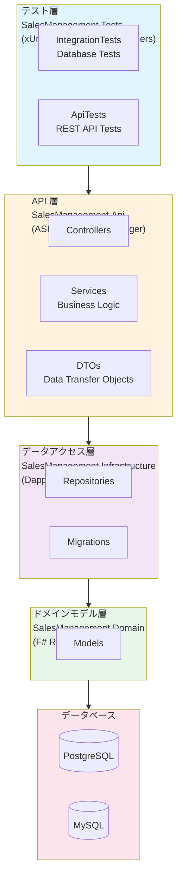
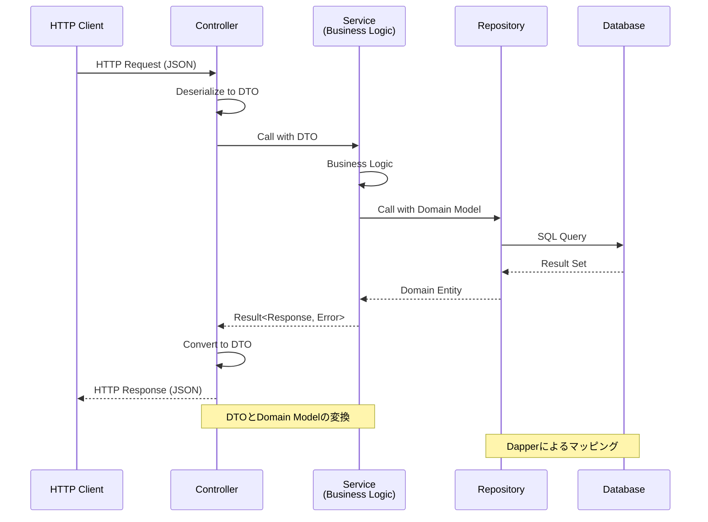

# 販売管理システム（F# 版）

テスト駆動開発（TDD）で育てる販売管理システムのデータベース設計 + REST API プロジェクト（F# 版）

## 技術スタック

- **言語**: F# 9.0 (.NET 9.0)
- **Web フレームワーク**: ASP.NET Core 9.0
- **API ドキュメント**: Swagger/OpenAPI (Swashbuckle.AspNetCore)
- **ORM**: Dapper 2.1.35（マイクロ ORM）
- **マイグレーション**: FluentMigrator 6.2.0
- **データベース**: PostgreSQL 16 / MySQL 8.0
- **テスト**: xUnit 2.9.3 + FsUnit 6.0.1 + Testcontainers 4.1.0 + ASP.NET Core Integration Tests
- **コード品質**: FSharpLint
- **ビルド自動化**: Cake 5.1.0

## プロジェクト構造

```
db/fsharp/
├── SalesManagement.sln               # ソリューションファイル
├── build.cake                         # Cake ビルドスクリプト
├── fsharplint.json                    # FSharpLint 設定
├── docker-compose.yml                 # Docker Compose 設定
├── .env.example                       # 環境変数テンプレート
│
├── SalesManagement.Domain/            # ドメインモデル層
│   ├── SalesManagement.Domain.fsproj
│   ├── Models/                        # ドメインモデル
│   │   └── Product.fs
│   └── Library.fs
│
├── SalesManagement.Infrastructure/    # データアクセス層
│   ├── SalesManagement.Infrastructure.fsproj
│   ├── appsettings.json              # 開発用設定
│   ├── Program.fs                     # マイグレーション実行
│   ├── MigrationRunner.fs             # マイグレーションロジック
│   ├── Repositories/                  # リポジトリ
│   │   └── ProductRepository.fs
│   └── Migrations/                    # マイグレーションファイル
│       └── Migration_20250106_*.fs
│
├── SalesManagement.Api/               # API 層（REST API）
│   ├── SalesManagement.Api.fsproj
│   ├── appsettings.json              # API 設定
│   ├── Program.fs                     # API エントリポイント
│   ├── Controllers/                   # API コントローラー
│   │   └── ProductController.fs
│   ├── Services/                      # ビジネスロジック
│   │   └── ProductService.fs
│   └── Dtos/                          # データ転送オブジェクト
│       └── ProductDto.fs
│
├── SalesManagement.Tests/             # テスト層
│   ├── SalesManagement.Tests.fsproj
│   ├── appsettings.Test.json         # テスト用設定
│   ├── DatabaseTestBase.fs            # テスト基底クラス
│   ├── IntegrationTests/              # データベーステスト
│   │   ├── DatabaseConnectionTests.fs
│   │   └── ProductTests.fs
│   ├── ApiTests/                      # API 統合テスト
│   │   └── ProductControllerTests.fs
│   └── Tests.fs
│
└── docker/                            # Docker 設定
    ├── postgres/init/01-init.sql
    └── mysql/
        ├── init/01-init.sql
        └── conf.d/my.cnf
```

## セットアップ

### 前提条件

- .NET SDK 9.0 以上
- Docker & Docker Compose（推奨）
- Git

### 1. リポジトリのクローン

```bash
git clone <repository-url>
cd db/fsharp
```

### 2. 環境変数の設定

```bash
cp .env.example .env
```

`.env` ファイルを編集してデータベース設定を変更できます。

### 3. Docker コンテナの起動

```bash
# PostgreSQL を起動
docker-compose up -d postgres

# または MySQL を起動
docker-compose up -d mysql

# すべてのサービス（PostgreSQL + MySQL + Adminer）を起動
docker-compose up -d
```

### 4. パッケージの復元とビルド

```bash
dotnet restore
dotnet build
```

### 5. マイグレーションの実行

```bash
cd SalesManagement.Infrastructure
dotnet run
cd ..
```

## 開発

### ビルド

```bash
dotnet build
```

### REST API の起動

```bash
cd SalesManagement.Api
dotnet run
```

API が起動したら、以下の URL でアクセスできます：

- **Swagger UI**: https://localhost:5001/swagger
- **API Base URL**: https://localhost:5001/api

#### 利用可能な API エンドポイント

**Product API:**
- `POST /api/products` - 商品を作成
- `GET /api/products` - すべての商品を取得
- `GET /api/products/{productCode}` - 商品を取得
- `PUT /api/products/{productCode}` - 商品を更新
- `DELETE /api/products/{productCode}` - 商品を削除

Swagger UI では、すべての API エンドポイントの詳細なドキュメント、リクエスト/レスポンスのサンプル、および実際に API をテストする機能が利用できます。

### OpenAPI 仕様の生成

OpenAPI 仕様（openapi.yml）は以下の方法で生成できます：

#### 自動生成（Release ビルド時）

```bash
dotnet build SalesManagement.Api -c Release
```

Release ビルド時に `SalesManagement.Api/openapi.yml` が自動生成されます。

#### 手動生成（開発時）

**Windows (PowerShell):**
```powershell
.\generate-openapi.ps1
```

**Linux/macOS (Bash):**
```bash
./generate-openapi.sh
```

**または直接コマンド実行:**
```bash
dotnet swagger tofile --output SalesManagement.Api/openapi.yml --yaml SalesManagement.Api/bin/Debug/net9.0/SalesManagement.Api.dll v1
```

生成された `openapi.yml` は、Swagger Editor や他の OpenAPI ツールで利用できます。

### テストの実行

```bash
# すべてのテスト
dotnet test

# API テストのみ
dotnet test --filter "FullyQualifiedName~ProductControllerTests"

# データベーステストのみ
dotnet test --filter "FullyQualifiedName~IntegrationTests"

# カバレッジ付きテスト
dotnet test --collect:"XPlat Code Coverage"
```

### マイグレーションの実行

```bash
cd SalesManagement.Infrastructure
dotnet run
cd ..
```

### FSharpLint の実行

```bash
# グローバルインストール（初回のみ）
dotnet tool install -g dotnet-fsharplint

# Lint 実行
dotnet fsharplint lint SalesManagement.sln
```

## Cake タスク

Cake を使用して各種タスクを実行できます：

```bash
# デフォルト（ビルド + テスト）
dotnet cake

# 特定のタスク実行
dotnet cake --target=Clean           # クリーンアップ
dotnet cake --target=Build           # ビルド
dotnet cake --target=Test            # テスト実行
dotnet cake --target=Lint            # FSharpLint 実行
dotnet cake --target=Test-Coverage   # カバレッジ測定
dotnet cake --target=Coverage-Report # レポート生成
dotnet cake --target=CI              # CI 用完全チェック
dotnet cake --target=Migrate         # マイグレーション実行
dotnet cake --target=Docker-Up       # Docker 起動
dotnet cake --target=Docker-Down     # Docker 停止

# シェルラッパー（Unix/Linux/macOS）
./cake.sh Build
./cake.sh Test
```

## データベース管理

### Adminer（Web UI）

Docker Compose でサービスを起動すると、Adminer が利用可能になります：

- URL: http://localhost:8080

**PostgreSQL の場合:**
- システム: PostgreSQL
- サーバ: postgres
- ユーザ名: postgres
- パスワード: postgres
- データベース: sales_management_fsharp

**MySQL の場合:**
- システム: MySQL
- サーバ: mysql
- ユーザ名: user
- パスワード: password
- データベース: sales_management_fsharp

### Docker Compose コマンド

```bash
# コンテナの起動
docker-compose up -d

# コンテナの停止
docker-compose stop

# コンテナの停止と削除
docker-compose down

# ボリュームも削除
docker-compose down -v

# ログの確認
docker-compose logs -f postgres
docker-compose logs -f mysql

# コンテナに接続
docker-compose exec postgres psql -U postgres -d sales_management_fsharp
docker-compose exec mysql mysql -u user -p sales_management_fsharp
```

## テスト

このプロジェクトは Testcontainers を使用して、Docker コンテナ上でデータベーステストと API 統合テストを実行します。

### テストの特徴

- **独立性**: 各テストクラスが独自のデータベースコンテナを使用
- **環境の一貫性**: 開発者のローカル環境、CI/CD 環境で同じデータベースバージョンを使用
- **クリーンな状態**: テスト実行後にコンテナを破棄し、次回は新しいコンテナで実行
- **並列実行**: 複数のテストが異なるコンテナで並列実行可能
- **API 統合テスト**: WebApplicationFactory を使用した、実際の HTTP リクエスト/レスポンステスト

### テストの種類

#### 1. データベーステスト (`IntegrationTests/`)
- リポジトリ層の CRUD 操作テスト
- データベース制約のテスト
- トランザクション処理のテスト

#### 2. API 統合テスト (`ApiTests/`)
- REST API エンドポイントのテスト
- リクエスト/レスポンスの検証
- HTTP ステータスコードの検証
- JSON シリアライゼーション/デシリアライゼーションのテスト
- エラーハンドリングのテスト

### テストの実行

```bash
# すべてのテスト
dotnet test

# API テストのみ
dotnet test --filter "FullyQualifiedName~ProductControllerTests"

# データベーステストのみ
dotnet test --filter "FullyQualifiedName~IntegrationTests"

# 詳細表示
dotnet test -v n

# カバレッジレポート生成
dotnet cake --target=Coverage-Report
# レポート: coverage/index.html
```

### API テストの例

```fsharp
[<Fact>]
member _.``POST api/products - 商品を作成できる`` () = task {
    // Arrange
    use factory = new ApiTestFactory(db.ConnectionString)
    use client = factory.CreateClient()
    let product = TestHelpers.createTestProduct "PROD001" "テスト商品1"
    let content = TestHelpers.createJsonContent product

    // Act
    let! response = client.PostAsync("/api/products", content)
    let! body = response.Content.ReadAsStringAsync()

    // Assert
    response.StatusCode |> should equal HttpStatusCode.Created
    let result = TestHelpers.fromJson<ProductResponse>(body)
    result.ProductCode |> should equal "PROD001"
}
```

## アーキテクチャ

### レイヤー構成



### データフロー



### F# の特徴を活かした設計

- **型システムの安全性**: ドメインモデルを型で表現し、コンパイル時にエラーを検出
- **不変性（Immutability）**: データの変更を明示的に扱い、予期しない副作用を防止
- **パイプライン処理**: データ変換を読みやすく表現
- **パターンマッチング**: 状態遷移やビジネスルールを網羅的に処理
- **簡潔な表現**: 定型コードが少なく、本質的なロジックに集中

## CI/CD

### GitHub Actions の例

```yaml
name: CI

on: [push, pull_request]

jobs:
  build:
    runs-on: ubuntu-latest
    steps:
      - uses: actions/checkout@v3
      - uses: actions/setup-dotnet@v3
        with:
          dotnet-version: '9.0.x'
      - name: Run CI checks
        run: dotnet cake --target=CI
```

## トラブルシューティング

### ビルドエラー

```bash
# クリーンビルド
dotnet clean
dotnet build
```

### テスト失敗

```bash
# Docker が起動しているか確認
docker ps

# Testcontainers のログを確認
dotnet test -v n
```

### マイグレーションエラー

```bash
# 接続文字列を確認
cat SalesManagement.Infrastructure/appsettings.json

# データベースが起動しているか確認
docker-compose ps
```

## 参考資料

### 言語・フレームワーク
- [F# 公式ドキュメント](https://learn.microsoft.com/ja-jp/dotnet/fsharp/)
- [ASP.NET Core](https://learn.microsoft.com/ja-jp/aspnet/core/)
- [Swagger/OpenAPI](https://swagger.io/docs/)

### データアクセス
- [Dapper](https://github.com/DapperLib/Dapper)
- [FluentMigrator](https://fluentmigrator.github.io/)

### テスト
- [Testcontainers](https://dotnet.testcontainers.org/)
- [xUnit](https://xunit.net/)
- [FsUnit](https://fsprojects.github.io/FsUnit/)
- [ASP.NET Core Integration Tests](https://learn.microsoft.com/ja-jp/aspnet/core/test/integration-tests)

### ビルド・品質
- [Cake](https://cakebuild.net/)
- [FSharpLint](https://fsprojects.github.io/FSharpLint/)

## ライセンス

MIT License
