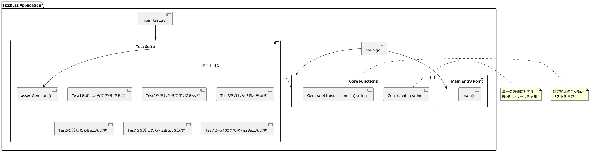
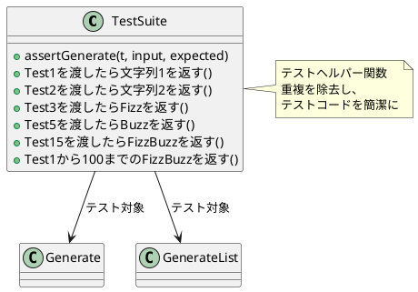
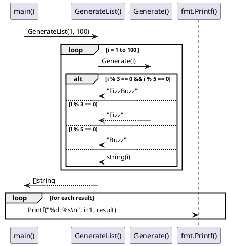

# Go FizzBuzz アプリケーション アーキテクチャ概要

## プロジェクト概要

このプロジェクトは、テスト駆動開発（TDD）によって実装されたGoのFizzBuzzアプリケーションです。Ruby入門のテスト駆動開発の手法を参考にし、Goの特性を活かして実装されています。

## 技術スタック

- **プログラミング言語**: Go 1.21
- **テストフレームワーク**: Go標準ライブラリ（testing）
- **ビルドツール**: Go modules（go.mod）

## アプリケーション構成

```
app/
├── go.mod          # Goモジュール定義
├── main.go         # プロダクトコード
└── main_test.go    # テストコード
```

## システム構成図



## コンポーネント詳細

### 1. Core Functions（コア機能）

#### Generate関数
- **責務**: 単一の数値に対するFizzBuzzルールの適用
- **入力**: `int` - 変換対象の数値
- **出力**: `string` - FizzBuzzルールに従った文字列
- **ロジック**:
  - 3と5の両方の倍数 → "FizzBuzz"
  - 3の倍数 → "Fizz"
  - 5の倍数 → "Buzz"
  - その他 → 数値を文字列に変換

#### GenerateList関数
- **責務**: 指定された範囲のFizzBuzzリストの生成
- **入力**: `start, end int` - 開始と終了の数値
- **出力**: `[]string` - FizzBuzzルールに従った文字列のスライス
- **ロジック**: 指定範囲の各数値に対してGenerate関数を適用

### 2. Test Suite（テストスイート）

#### テスト戦略
- **テストファースト**: プロダクトコードより先にテストを作成
- **三角測量**: 複数のテストケースで一般化を促進
- **リファクタリング**: テスト成功後のコード改善

#### テストケース構成


## データフロー



## TDDサイクルの実装

### Red-Green-Refactor パターン

1. **Red（レッド）**: 失敗するテストを作成
   ```go
   func Test1を渡したら文字列1を返す(t *testing.T) {
       assertGenerate(t, 1, "1")
   }
   ```

2. **Green（グリーン）**: 最小限の実装でテスト通過
   ```go
   func Generate(number int) string {
       return "1"  // 仮実装
   }
   ```

3. **Refactor（リファクタリング）**: コードの改善
   ```go
   func Generate(number int) string {
       return fmt.Sprintf("%d", number)  // 一般化
   }
   ```

## 設計原則

### 1. 単一責任の原則
- `Generate`: 単一数値の変換のみ
- `GenerateList`: リスト生成のみ
- `main`: エントリーポイントのみ

### 2. テスタビリティ
- 純粋関数による実装
- 副作用のない設計
- ヘルパー関数による重複除去

### 3. 段階的な実装
- TODOリストによる仕様分解
- テストファーストによる確実な実装
- 三角測量による一般化

## 実行例

```bash
$ go run main.go
FizzBuzz Go implementation
1から100までのFizzBuzz:
1: 1
2: 2
3: Fizz
4: 4
5: Buzz
...
15: FizzBuzz
...
100: Buzz
```

## テスト実行

```bash
$ go test -v
=== RUN   Test1を渡したら文字列1を返す
--- PASS: Test1を渡したら文字列1を返す (0.00s)
=== RUN   Test2を渡したら文字列2を返す
--- PASS: Test2を渡したら文字列2を返す (0.00s)
...
PASS
ok      fizzbuzz        0.004s
```

## 今後の拡張性

### 考慮される拡張ポイント
1. **カスタマイズ可能なルール**: 3,5以外の倍数への対応
2. **出力形式の選択**: JSON、XML等の出力フォーマット
3. **パフォーマンス最適化**: 大きな範囲での処理効率化
4. **並行処理**: ゴルーチンを活用した並列処理
5. **CLI引数**: コマンドライン引数による範囲指定

この設計により、シンプルでテスタブル、かつ拡張可能なFizzBuzzアプリケーションを実現しています。
