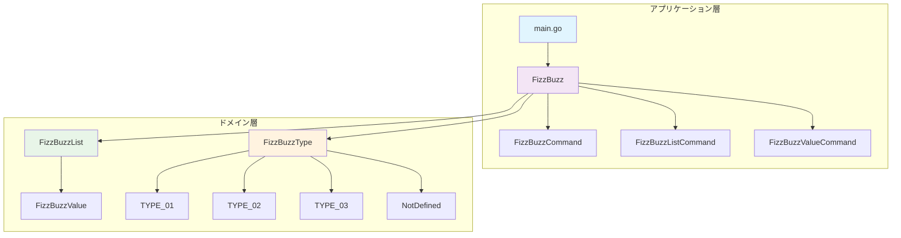
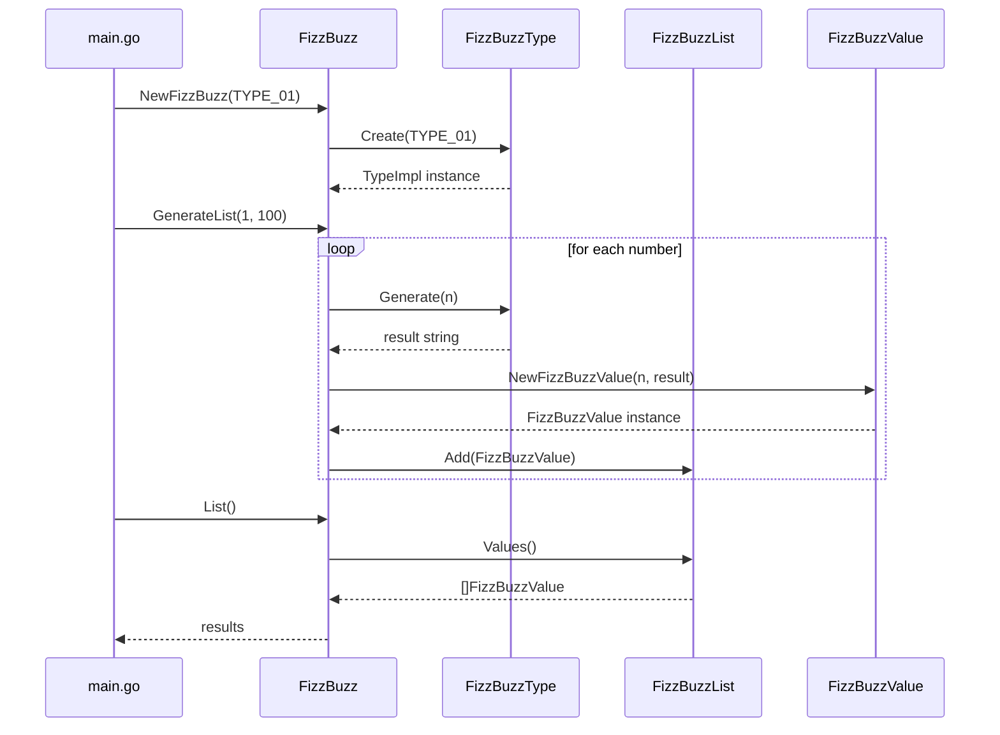

# Go FizzBuzz アーキテクチャ概要

## アーキテクチャ設計方針

このプロジェクトは、ドメイン駆動設計（DDD）とクリーンアーキテクチャの原則に基づいて設計されています。レイヤー分離により、ビジネスロジックの独立性と拡張性を確保しています。

## システム構成図



## レイヤー構成

### 1. エントリーポイント層
- **main.go**: アプリケーションの起動点
- **責任**: プログラムの初期化と実行制御

### 2. アプリケーション層
- **FizzBuzz**: メインのアプリケーションクラス
- **FizzBuzzCommand系**: コマンドパターンによる操作の抽象化
- **責任**: ユースケースの実行とドメイン層の調整

### 3. ドメイン層
#### モデル (domain/model)
- **FizzBuzzList**: FizzBuzz値のコレクション
- **FizzBuzzValue**: 個別のFizzBuzz値の表現

#### タイプ (domain/type)
- **FizzBuzzType**: タイプ共通インターフェース
- **具象タイプ**: TYPE_01, TYPE_02, TYPE_03
- **NotDefined**: 未定義タイプのハンドリング

## コンポーネント詳細

### FizzBuzzメインクラス

```go
type FizzBuzz struct {
    list         *model.FizzBuzzList
    fizzBuzzType int
    typeImpl     fizzbuzztype.FizzBuzzType
}
```

**主要メソッド**:
- `NewFizzBuzz(fizzBuzzType int)`: コンストラクタ
- `GenerateList(start, end int)`: 指定範囲のリスト生成
- `List()`: 生成されたリストの取得

### ドメインモデル

#### FizzBuzzList
- FizzBuzz値のコレクション管理
- リストの追加、取得、操作機能

#### FizzBuzzValue
- 個別のFizzBuzz値の表現
- 数値とその変換結果の保持

### タイプシステム

#### FizzBuzzTypeインターフェース
```go
type FizzBuzzType interface {
    Generate(n int) string
}
```

#### 具象実装
- **TYPE_01**: 基本FizzBuzz（3→Fizz, 5→Buzz, 15→FizzBuzz）
- **TYPE_02**: カスタムルールの実装
- **TYPE_03**: 拡張ルールの実装
- **NotDefined**: エラーハンドリング

## データフロー図



## 設計パターンの適用

### 1. ファクトリーパターン
- `FizzBuzzTypeBase.Create()`: タイプインスタンスの生成
- 新しいタイプの追加が容易

### 2. ストラテジーパターン
- `FizzBuzzType`インターフェース: アルゴリズムの切り替え
- 実行時のタイプ変更が可能

### 3. コマンドパターン
- `FizzBuzzCommand`系: 操作の抽象化
- アンドゥ・リドゥ機能の実装基盤

## 拡張性の考慮

### 新しいFizzBuzzタイプの追加
1. `FizzBuzzType`インターフェースを実装
2. `FizzBuzzTypeBase.Create()`に新タイプを追加
3. 既存コードの変更は不要

### 新しい出力形式の追加
1. `FizzBuzzValue`に新しい表現メソッドを追加
2. 出力フォーマッターの実装
3. レイヤー間の独立性により影響範囲を限定

## テスト設計

### ユニットテスト構成
- 各レイヤーの独立テスト
- モックオブジェクトによる依存関係の分離
- カバレッジ計測による品質保証

### テスト駆動開発の実践
- Red-Green-Refactorサイクル
- 小さな単位での機能追加
- リファクタリングの安全性確保

このアーキテクチャにより、保守性、拡張性、テスタビリティを兼ね備えたFizzBuzzアプリケーションを実現しています。
