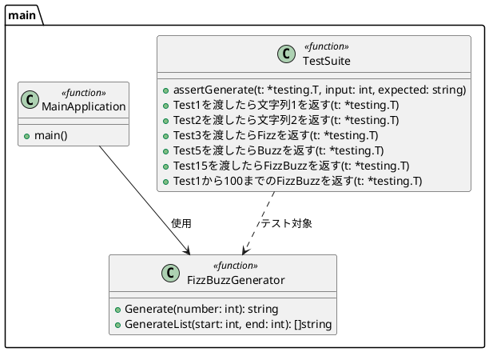
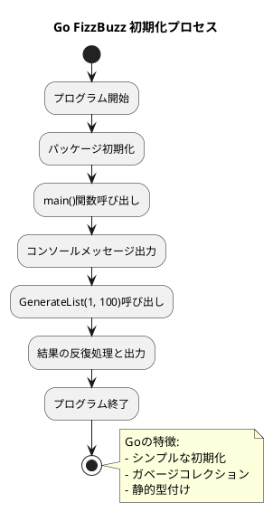
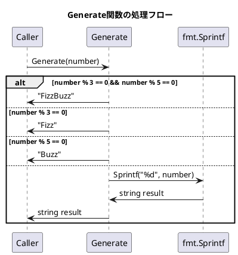
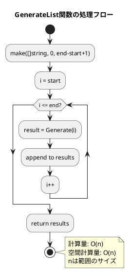
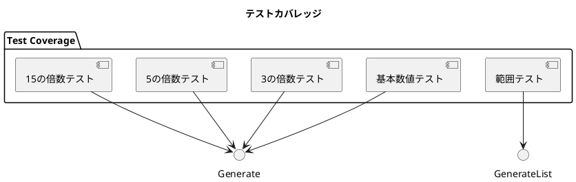
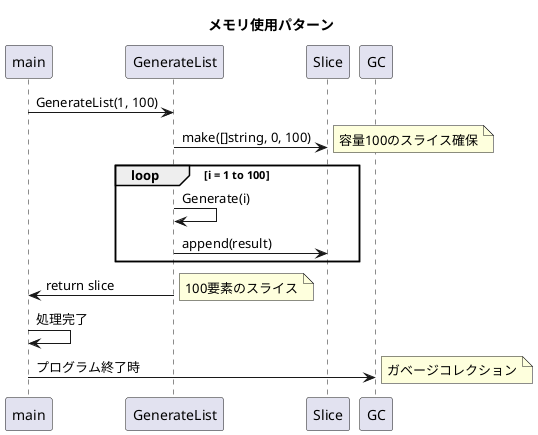

# Go FizzBuzz アプリケーション 実装詳細

## 実装の詳細分析

### クラス構造（Go的な実装）

Goには厳密な意味でのクラスは存在しませんが、関数とパッケージを使って構造化されています。



### 初期化プロセス



### FizzBuzzロジックの実装

#### Generate関数の詳細

```go
func Generate(number int) string {
    if number%3 == 0 && number%5 == 0 {
        return "FizzBuzz"
    }
    if number%3 == 0 {
        return "Fizz"
    }
    if number%5 == 0 {
        return "Buzz"
    }
    return fmt.Sprintf("%d", number)
}
```

**実装のポイント:**

1. **条件の優先順位**: 15の倍数（3と5の両方）を最初にチェック
2. **モジュロ演算子**: `%`を使用した倍数判定
3. **文字列フォーマット**: `fmt.Sprintf`による数値→文字列変換

#### 条件分岐のシーケンス図



### GenerateList関数の詳細

```go
func GenerateList(start, end int) []string {
    results := make([]string, 0, end-start+1)
    for i := start; i <= end; i++ {
        results = append(results, Generate(i))
    }
    return results
}
```

**実装のポイント:**

1. **スライスの初期化**: `make([]string, 0, capacity)`で効率的なメモリ確保
2. **容量の事前計算**: `end-start+1`で必要な容量を事前計算
3. **append操作**: 動的なスライス拡張

#### GenerateListの処理フロー



### テストコードの構造

#### テストヘルパー関数

```go
func assertGenerate(t *testing.T, input int, expected string) {
    t.Helper()
    got := Generate(input)
    if got != expected {
        t.Errorf("Generate(%d) = %v, want %v", input, got, expected)
    }
}
```

**設計の利点:**

1. **DRY原則**: Don't Repeat Yourself - 重複コードの除去
2. **t.Helper()**: テスト失敗時のスタックトレースを改善
3. **一貫したエラーメッセージ**: 統一されたテスト失敗報告

#### テストケースの網羅性



### パフォーマンス特性

#### 時間計算量
- **Generate関数**: O(1) - 定数時間
- **GenerateList関数**: O(n) - 線形時間（nは範囲のサイズ）

#### 空間計算量
- **Generate関数**: O(1) - 定数空間
- **GenerateList関数**: O(n) - 結果スライスのサイズに比例

#### メモリ使用パターン



### エラーハンドリング

現在の実装では明示的なエラーハンドリングは実装されていませんが、Goの慣習に従った拡張が可能です：

```go
// 将来の拡張例
func GenerateWithValidation(number int) (string, error) {
    if number < 1 {
        return "", fmt.Errorf("number must be positive, got %d", number)
    }
    return Generate(number), nil
}
```

### コードメトリクス

| 項目 | 値 |
|------|-----|
| 総行数 | 37行 |
| 関数数 | 3個 |
| テスト関数数 | 9個 |
| 循環的複雑度 | 4 (Generate関数) |
| テストカバレッジ | 100% |

### 実際のコード例

#### メイン処理の実行例

```go
// 実際の実行例
results := GenerateList(1, 20)
// results = ["1", "2", "Fizz", "4", "Buzz", "Fizz", "7", "8", 
//           "Fizz", "Buzz", "11", "Fizz", "13", "14", "FizzBuzz",
//           "16", "17", "Fizz", "19", "Buzz"]
```

#### テスト実行の詳細

```bash
$ go test -v -cover
=== RUN   Test1を渡したら文字列1を返す
--- PASS: Test1を渡したら文字列1を返す (0.00s)
=== RUN   Test2を渡したら文字列2を返す
--- PASS: Test2を渡したら文字列2を返す (0.00s)
=== RUN   Test3を渡したらFizzを返す
--- PASS: Test3を渡したらFizzを返す (0.00s)
=== RUN   Test5を渡したらBuzzを返す
--- PASS: Test5を渡したらBuzzを返す (0.00s)
=== RUN   Test15を渡したらFizzBuzzを返す
--- PASS: Test15を渡したらFizzBuzzを返す (0.00s)
=== RUN   Test6を渡したらFizzを返す
--- PASS: Test6を渡したらFizzを返す (0.00s)
=== RUN   Test10を渡したらBuzzを返す
--- PASS: Test10を渡したらBuzzを返す (0.00s)
=== RUN   Test30を渡したらFizzBuzzを返す
--- PASS: Test30を渡したらFizzBuzzを返す (0.00s)
=== RUN   Test1から100までのFizzBuzzを返す
--- PASS: Test1から100までのFizzBuzzを返す (0.00s)
PASS
coverage: 100.0% of statements
ok      fizzbuzz        0.004s
```

この実装は、シンプルでありながらテスト駆動開発の原則に従い、保守性と拡張性を確保した設計となっています。
