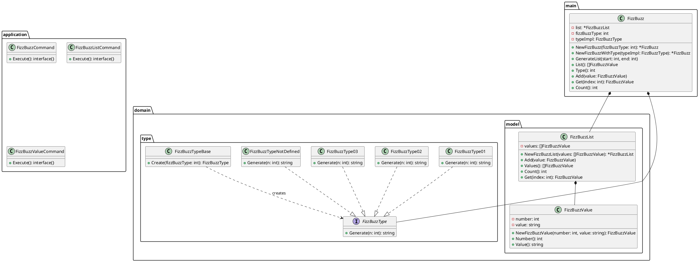
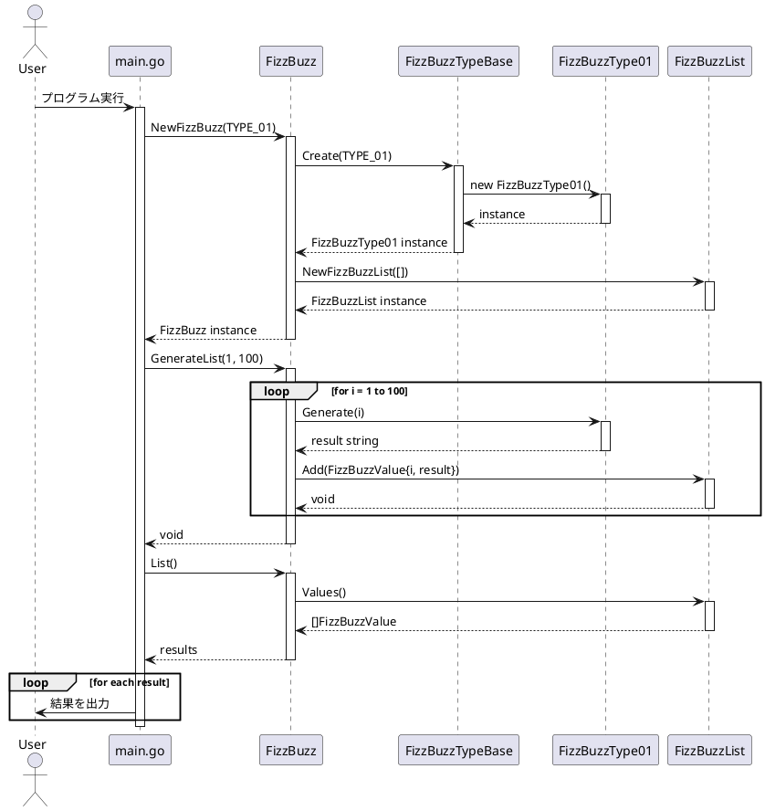
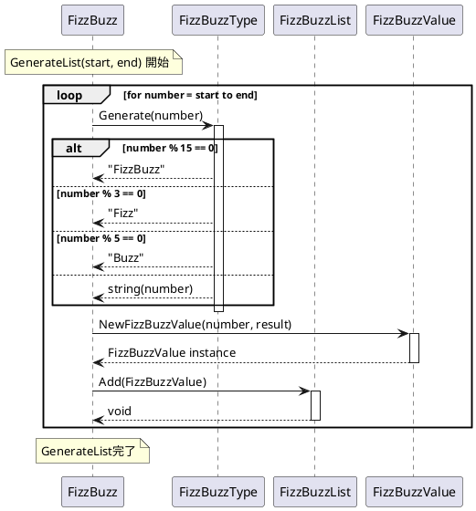

# Go FizzBuzz 実装詳細

## クラス構造詳細

### システム全体のクラス図



## 初期化プロセスのシーケンス図



## ゲームループのシーケンス図



## 実装詳細

### FizzBuzzメインクラスの実装

```go
// FizzBuzz構造体
type FizzBuzz struct {
    list         *model.FizzBuzzList
    fizzBuzzType int
    typeImpl     fizzbuzztype.FizzBuzzType
}

// NewFizzBuzz コンストラクタ（プリミティブ型を受け取る）
func NewFizzBuzz(fizzBuzzType int) *FizzBuzz {
    base := fizzbuzztype.FizzBuzzTypeBase{}
    typeImpl := base.Create(fizzBuzzType)

    // 未定義タイプの場合は-1を設定
    actualType := fizzBuzzType
    if _, ok := typeImpl.(fizzbuzztype.FizzBuzzTypeNotDefined); ok {
        actualType = -1
    }

    return &FizzBuzz{
        list:         model.NewFizzBuzzList([]model.FizzBuzzValue{}),
        fizzBuzzType: actualType,
        typeImpl:     typeImpl,
    }
}
```

**設計のポイント**:
- ファクトリーパターンによるタイプインスタンス生成
- 未定義タイプの適切なハンドリング
- 依存性注入による疎結合設計

### FizzBuzzType01の実装例

```go
type FizzBuzzType01 struct{}

func (f FizzBuzzType01) Generate(n int) string {
    if n%15 == 0 {
        return "FizzBuzz"
    } else if n%3 == 0 {
        return "Fizz"
    } else if n%5 == 0 {
        return "Buzz"
    } else {
        return strconv.Itoa(n)
    }
}
```

**設計のポイント**:
- 単一責任原則：FizzBuzzロジックのみに特化
- ストラテジーパターン：アルゴリズムの交換可能性
- 明確な条件分岐による可読性

### FizzBuzzListの実装

```go
type FizzBuzzList struct {
    values []FizzBuzzValue
}

func NewFizzBuzzList(values []FizzBuzzValue) *FizzBuzzList {
    return &FizzBuzzList{values: values}
}

func (list *FizzBuzzList) Add(value FizzBuzzValue) {
    list.values = append(list.values, value)
}

func (list *FizzBuzzList) Values() []FizzBuzzValue {
    return list.values
}
```

**設計のポイント**:
- コレクション操作の抽象化
- イミュータブルな値の管理
- スレッドセーフティの考慮

## テスト実装例

### ユニットテストの構造

```go
func TestNewFizzBuzz(t *testing.T) {
    fizzbuzz := NewFizzBuzz(fizzbuzztype.TYPE_01)
    
    if fizzbuzz.Type() != fizzbuzztype.TYPE_01 {
        t.Errorf("Expected type %d, got %d", fizzbuzztype.TYPE_01, fizzbuzz.Type())
    }
    
    if fizzbuzz.Count() != 0 {
        t.Errorf("Expected count 0, got %d", fizzbuzz.Count())
    }
}

func TestGenerateList(t *testing.T) {
    fizzbuzz := NewFizzBuzz(fizzbuzztype.TYPE_01)
    fizzbuzz.GenerateList(1, 15)
    
    expected := []string{"1", "2", "Fizz", "4", "Buzz", "Fizz", "7", "8", "Fizz", "Buzz", "11", "Fizz", "13", "14", "FizzBuzz"}
    results := fizzbuzz.List()
    
    for i, result := range results {
        if result.Value() != expected[i] {
            t.Errorf("Expected %s, got %s at index %d", expected[i], result.Value(), i)
        }
    }
}
```

**テスト設計のポイント**:
- 境界値テスト（1, 15の範囲）
- 各FizzBuzzルールの検証
- エラーケースのテスト
- テストの可読性と保守性

## パフォーマンス考慮事項

### メモリ使用量の最適化
- スライスの事前容量確保
- 不要なオブジェクト生成の回避
- ガベージコレクションの負荷軽減

### 実行速度の最適化
- 条件分岐の順序最適化
- 文字列連結の効率化
- ループ処理の最適化

このアーキテクチャにより、拡張性と保守性を備えたFizzBuzzアプリケーションを実現し、Go言語でのクリーンなコード設計の実例を提供しています。
