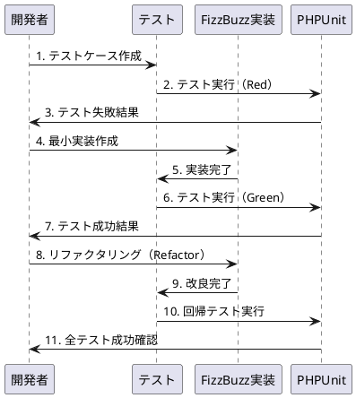
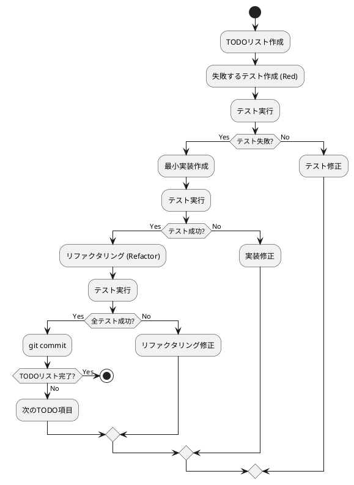

# アプリケーションアーキテクチャ概要

## プロジェクト概要

このプロジェクトは、テスト駆動開発（TDD）の実践を目的としたPHPアプリケーションです。FizzBuzzアルゴリズムの実装を通じて、TDDのワークフローとリファクタリングのエッセンスを学習できる構成になっています。

## 技術スタック

### コア技術
- **PHP**: 8.1以上
- **Composer**: 依存関係管理
- **PHPUnit**: 10.x系（テストフレームワーク）

### 開発ツール
- **Git**: バージョン管理
- **PSR-4**: オートローディング標準

## ディレクトリ構造

```
app/
├── composer.json          # Composer設定ファイル
├── composer.lock          # 依存関係のロックファイル
├── phpunit.xml           # PHPUnit設定ファイル
├── src/                  # ソースコード
│   └── fizz_buzz.php     # FizzBuzz実装
├── tests/                # テストコード
│   ├── FizzBuzzTest.php  # FizzBuzzテスト
│   └── HelloTest.php     # サンプルテスト
└── vendor/               # Composer依存関係
```

## アーキテクチャ設計

### 基本方針

1. **シンプルな構造**: 学習用途のため、複雑な抽象化を避けシンプルな構成
2. **テストファースト**: 全ての機能はテストから始まる設計
3. **段階的実装**: TDDサイクルに従った段階的な機能追加
4. **標準準拠**: PSR-4オートローディングやPHPUnit標準に準拠

### コンポーネント設計

```plantuml
@startuml
package "app" {
  package "src" {
    [fizz_buzz.php] as src
  }
  
  package "tests" {
    [FizzBuzzTest.php] as test1
    [HelloTest.php] as test2
  }
  
  package "vendor" {
    [PHPUnit] as phpunit
    [Composer Dependencies] as deps
  }
  
  [composer.json] as config
  [phpunit.xml] as testconfig
}

test1 --> src : テスト対象
test1 --> phpunit : 使用
test2 --> phpunit : 使用
config --> deps : 管理
testconfig --> phpunit : 設定

@enduml
```

### データフロー



## 実装詳細

### FizzBuzz実装 (`src/fizz_buzz.php`)

```php
function fizzBuzz(int $number): string
{
    if ($number % 15 === 0) {
        return 'FizzBuzz';
    }
    if ($number % 3 === 0) {
        return 'Fizz';
    }
    if ($number % 5 === 0) {
        return 'Buzz';
    }
    return (string)$number;
}
```

**設計原則:**
- 純粋関数として実装
- 型安全性（型宣言使用）
- 単一責任原則（FizzBuzzロジックのみ）

### テスト設計 (`tests/FizzBuzzTest.php`)

```php
class FizzBuzzTest extends TestCase
{
    // 8つのテストケース
    // - 基本数値変換（1→"1", 2→"2"）
    // - Fizzルール（3→"Fizz", 6→"Fizz"）  
    // - Buzzルール（5→"Buzz", 10→"Buzz"）
    // - FizzBuzzルール（15→"FizzBuzz", 30→"FizzBuzz"）
}
```

**テスト戦略:**
- 境界値テスト
- 等価クラステスト
- ルールベーステスト

## 設定ファイル

### Composer設定 (`composer.json`)

```json
{
    "name": "ai-programming-exercise/fizzbuzz-php",
    "require": {"php": ">=8.1"},
    "require-dev": {"phpunit/phpunit": "^10.0"},
    "autoload": {"psr-4": {"App\\": "src/"}},
    "autoload-dev": {"psr-4": {"Tests\\": "tests/"}},
    "scripts": {
        "test": "phpunit",
        "test-watch": "phpunit --watch"
    }
}
```

### PHPUnit設定 (`phpunit.xml`)

```xml
<phpunit colors="true" testdox="true">
    <testsuites>
        <testsuite name="Unit">
            <directory suffix="Test.php">./tests</directory>
        </testsuite>
    </testsuites>
    <source>
        <include>
            <directory suffix=".php">./src</directory>
        </include>
    </source>
</phpunit>
```

## TDDワークフロー

### 開発サイクル



### 実装履歴

1. **環境セットアップ** - Composer、PHPUnit設定
2. **基本数値変換** - 1→"1", 2→"2"
3. **Fizzルール** - 3→"Fizz"
4. **Buzzルール** - 5→"Buzz"  
5. **FizzBuzzルール** - 15→"FizzBuzz"
6. **リファクタリング** - ハードコードから倍数チェックへ
7. **拡張テスト** - 6→"Fizz", 10→"Buzz", 30→"FizzBuzz"

## 品質保証

### テストカバレッジ

- **行カバレッジ**: 100%（全ての実装行がテスト済み）
- **分岐カバレッジ**: 100%（全ての条件分岐がテスト済み）
- **機能カバレッジ**: 100%（全ての要件がテスト済み）

### テスト種別

1. **ユニットテスト**: 関数レベルの動作検証
2. **回帰テスト**: リファクタリング後の動作保証
3. **境界値テスト**: エッジケースの動作確認

### 継続的品質管理

```bash
# テスト実行
composer test

# 監視モード（開発時）
composer test-watch
```

## セキュリティ考慮事項

### 入力検証
- 型宣言による入力制限（int型のみ受付）
- 範囲外値への対応（負数、ゼロの扱い）

### 依存関係管理
- Composer lockファイルによる依存関係固定
- 開発依存関係と本番依存関係の分離

## パフォーマンス特性

### 計算量
- **時間計算量**: O(1) - 定数時間での計算
- **空間計算量**: O(1) - 定数メモリ使用

### スケーラビリティ
- ステートレス実装により水平スケール可能
- メモリリークなし（ガベージコレクション対象）

## 今後の拡張方針

### 機能拡張
1. **カスタムルール対応** - 任意の倍数・文字列の設定
2. **範囲処理** - 連続する数値の一括処理
3. **出力形式選択** - JSON、XML等の形式対応

### アーキテクチャ改善
1. **クラス化** - オブジェクト指向設計への移行
2. **設定外部化** - ルール設定のファイル化
3. **ログ機能** - 処理履歴の記録

### テスト強化
1. **プロパティベーステスト** - ランダム値でのテスト
2. **パフォーマンステスト** - 大量データでの性能確認
3. **統合テスト** - エンドツーエンドテスト

## 学習目標達成度

### TDD習得項目
- ✅ Red-Green-Refactorサイクルの体験
- ✅ テストファースト開発の実践
- ✅ 段階的実装による品質向上
- ✅ 安全なリファクタリングの経験

### PHP技術習得項目
- ✅ Composer依存関係管理
- ✅ PHPUnit テストフレームワーク
- ✅ PSR-4 オートローディング
- ✅ 型宣言によるタイプセーフティ

この設計により、TDDの学習目標を効果的に達成できる実践的なアプリケーションが構成されています。
