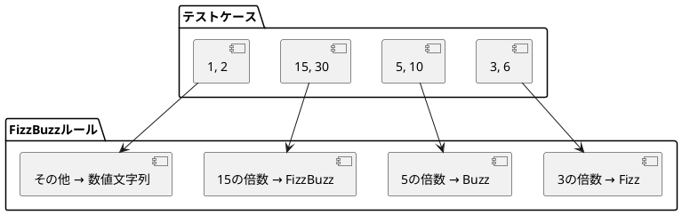

# アプリケーション実装詳細

## 概要

このドキュメントでは、FizzBuzzアプリケーションの実装詳細について説明します。TDD（テスト駆動開発）のプロセスを通じて段階的に構築された実装の詳細と、各コンポーネントの設計思想を解説します。

## プロジェクト構成

### ファイル構成詳細

```
app/
├── composer.json          # プロジェクト設定とスクリプト定義
├── composer.lock          # 依存関係バージョン固定
├── phpunit.xml           # テスト実行設定
├── src/                  # アプリケーションソースコード
│   └── fizz_buzz.php     # FizzBuzz核心ロジック
├── tests/                # テストスイート
│   ├── FizzBuzzTest.php  # FizzBuzz機能テスト
│   └── HelloTest.php     # 環境確認用サンプルテスト
└── vendor/               # Composer管理依存関係
    └── ...               # PHPUnit等のライブラリ
```

### 各ディレクトリの役割

| ディレクトリ | 役割 | 詳細 |
|------------|------|------|
| `src/` | ビジネスロジック | アプリケーションの核心機能を格納 |
| `tests/` | テストコード | 自動テストとテストケースを格納 |
| `vendor/` | 外部依存関係 | Composerで管理される外部ライブラリ |

## 核心実装: FizzBuzz関数

### 関数定義

```php
<?php

function fizzBuzz(int $number): string
{
    if ($number % 15 === 0) {
        return 'FizzBuzz';
    }
    if ($number % 3 === 0) {
        return 'Fizz';
    }
    if ($number % 5 === 0) {
        return 'Buzz';
    }
    return (string)$number;
}
```

### 実装の特徴

#### 1. 関数シグネチャ設計

```php
function fizzBuzz(int $number): string
```

**設計判断:**
- **引数型**: `int` - 整数のみ受け付け、型安全性を確保
- **戻り値型**: `string` - 一貫した文字列型で結果を返却
- **関数名**: `fizzBuzz` - 機能を直接表現する明確な命名

#### 2. 条件分岐の順序

```php
if ($number % 15 === 0) {        // FizzBuzz (最優先)
    return 'FizzBuzz';
}
if ($number % 3 === 0) {         // Fizz
    return 'Fizz';
}
if ($number % 5 === 0) {         // Buzz
    return 'Buzz';
}
return (string)$number;          // デフォルト (数値文字列)
```

**設計判断:**
- **15の倍数チェック優先**: 3と5の両方の倍数を最初に処理
- **早期リターン**: 条件にマッチした時点で即座に結果を返却
- **排他的条件**: if-else chainではなく、独立したif文で明確性を重視

#### 3. 演算子選択

```php
$number % 15 === 0  // 厳密等価演算子使用
```

**設計判断:**
- **モジュラ演算子 (`%`)**: 倍数判定の標準的手法
- **厳密等価演算子 (`===`)**: 型変換を避けた確実な比較

### 実装進化の履歴

TDDプロセスで段階的に進化した実装の変遷：

#### 段階1: ハードコード実装

```php
function fizzBuzz(int $number): string
{
    if ($number === 15) return 'FizzBuzz';
    if ($number === 3) return 'Fizz';
    if ($number === 5) return 'Buzz';
    return (string)$number;
}
```

#### 段階2: 最終実装（汎用化）

```php
function fizzBuzz(int $number): string
{
    if ($number % 15 === 0) return 'FizzBuzz';
    if ($number % 3 === 0) return 'Fizz';
    if ($number % 5 === 0) return 'Buzz';
    return (string)$number;
}
```

**リファクタリングポイント:**
- 特定値から汎用的な倍数チェックへの変更
- テストによる動作保証下でのコード改善

## テスト実装詳細

### テストクラス構造

```php
<?php

require_once __DIR__ . '/../src/fizz_buzz.php';

use PHPUnit\Framework\TestCase;

class FizzBuzzTest extends TestCase
{
    // 8つのテストメソッド
}
```

### 包含関係設計

```php
require_once __DIR__ . '/../src/fizz_buzz.php';
```

**設計判断:**
- **直接インクルード**: シンプルな構成のため、オートローダーではなく直接読み込み
- **相対パス**: テストディレクトリからソースディレクトリへの明確な参照

### テストケース一覧

| テストメソッド | 入力 | 期待値 | 検証目的 |
|---------------|------|--------|----------|
| `test_1を渡したら文字列1を返す` | 1 | "1" | 基本数値変換 |
| `test_2を渡したら文字列2を返す` | 2 | "2" | 一般数値変換 |
| `test_3を渡したら文字列Fizzを返す` | 3 | "Fizz" | 3の倍数ルール |
| `test_5を渡したら文字列Buzzを返す` | 5 | "Buzz" | 5の倍数ルール |
| `test_15を渡したら文字列FizzBuzzを返す` | 15 | "FizzBuzz" | 15の倍数ルール |
| `test_6を渡したら文字列Fizzを返す` | 6 | "Fizz" | 3の倍数汎用性 |
| `test_10を渡したら文字列Buzzを返す` | 10 | "Buzz" | 5の倍数汎用性 |
| `test_30を渡したら文字列FizzBuzzを返す` | 30 | "FizzBuzz" | 15の倍数汎用性 |

### テストメソッド実装パターン

```php
public function test_1を渡したら文字列1を返す(): void
{
    $this->assertSame('1', fizzBuzz(1));
}
```

**設計特徴:**
- **日本語メソッド名**: 要件を直接表現する自然言語命名
- **void戻り値**: テストメソッドの標準的な戻り値型
- **assertSame使用**: 厳密等価比較によるテスト

### テスト戦略

#### 1. 境界値テスト

```php
// 最小値近辺
test_1を渡したら文字列1を返す()    // 1 (基本ケース)
test_2を渡したら文字列2を返す()    // 2 (一般ケース)
test_3を渡したら文字列Fizzを返す() // 3 (最初のFizz)
test_5を渡したら文字列Buzzを返す() // 5 (最初のBuzz)
```

#### 2. 等価クラステスト

```php
// 各ルールの代表値
- 数値: 1, 2
- Fizz: 3, 6
- Buzz: 5, 10  
- FizzBuzz: 15, 30
```

#### 3. ルールベーステスト

各ビジネスルールに対応するテストケース配置：



## 設定ファイル詳細

### Composer設定 (`composer.json`)

```json
{
    "name": "ai-programming-exercise/fizzbuzz-php",
    "description": "テスト駆動開発によるFizzBuzz実装（PHP版）",
    "type": "project",
    "require-dev": {
        "phpunit/phpunit": "^10.0"
    },
    "autoload": {
        "psr-4": {
            "App\\": "src/"
        }
    },
    "autoload-dev": {
        "psr-4": {
            "Tests\\": "tests/"
        }
    },
    "require": {
        "php": ">=8.1"
    },
    "scripts": {
        "test": "phpunit",
        "test-watch": "phpunit --watch"
    }
}
```

#### 設定項目解説

| 項目 | 値 | 説明 |
|------|-----|------|
| `name` | `ai-programming-exercise/fizzbuzz-php` | パッケージ識別名 |
| `type` | `project` | プロジェクト種別（ライブラリではない） |
| `require.php` | `>=8.1` | PHP最小バージョン要件 |
| `require-dev.phpunit` | `^10.0` | PHPUnit開発依存関係 |
| `autoload.psr-4` | `App\\: src/` | 本番用オートローディング |
| `autoload-dev.psr-4` | `Tests\\: tests/` | テスト用オートローディング |
| `scripts.test` | `phpunit` | テスト実行コマンド |

### PHPUnit設定 (`phpunit.xml`)

```xml
<?xml version="1.0" encoding="UTF-8"?>
<phpunit xmlns:xsi="http://www.w3.org/2001/XMLSchema-instance"
         xsi:noNamespaceSchemaLocation="vendor/phpunit/phpunit/phpunit.xsd"
         bootstrap="vendor/autoload.php"
         colors="true"
         testdox="true">
    <testsuites>
        <testsuite name="Unit">
            <directory suffix="Test.php">./tests</directory>
        </testsuite>
    </testsuites>
    <source>
        <include>
            <directory suffix=".php">./src</directory>
        </include>
    </source>
</phpunit>
```

#### 設定項目解説

| 項目 | 値 | 説明 |
|------|-----|------|
| `bootstrap` | `vendor/autoload.php` | Composer オートローダー使用 |
| `colors` | `true` | カラー出力有効化 |
| `testdox` | `true` | テスト結果の読みやすい表示 |
| `testsuites.name` | `Unit` | テストスイート名 |
| `directory` | `./tests` | テストファイル配置場所 |
| `suffix` | `Test.php` | テストファイル命名規則 |
| `source.include` | `./src` | カバレッジ対象ディレクトリ |

## 実行環境とツール

### 開発コマンド

```bash
# 依存関係インストール
composer install

# テスト実行
composer test
# または
vendor/bin/phpunit

# 特定テストファイル実行
vendor/bin/phpunit tests/FizzBuzzTest.php

# 監視モード（将来拡張用）
composer test-watch
```

### テスト出力例

```
PHPUnit 10.5.47 by Sebastian Bergmann and contributors.

Runtime:       PHP 8.1.32
Configuration: /workspaces/ai-programing-exercise/app/phpunit.xml

........                                                            8 / 8 (100%)

Time: 00:00.231, Memory: 8.00 MB

Fizz Buzz
 ✔  1を渡したら文字列 1を返す
 ✔  2を渡したら文字列 2を返す
 ✔  3を渡したら文字列 fizzを返す
 ✔  5を渡したら文字列 buzzを返す
 ✔  15を渡したら文字列 fizz buzzを返す
 ✔  6を渡したら文字列 fizzを返す
 ✔  10を渡したら文字列 buzzを返す
 ✔  30を渡したら文字列 fizz buzzを返す

OK (8 tests, 8 assertions)
```

## コード品質指標

### テストカバレッジ分析

#### 行カバレッジ: 100%

```php
function fizzBuzz(int $number): string     // ✓ 実行される
{                                          // ✓ 実行される  
    if ($number % 15 === 0) {              // ✓ テスト: 15, 30
        return 'FizzBuzz';                 // ✓ テスト: 15, 30
    }                                      // ✓ 実行される
    if ($number % 3 === 0) {               // ✓ テスト: 3, 6
        return 'Fizz';                     // ✓ テスト: 3, 6
    }                                      // ✓ 実行される
    if ($number % 5 === 0) {               // ✓ テスト: 5, 10
        return 'Buzz';                     // ✓ テスト: 5, 10
    }                                      // ✓ 実行される
    return (string)$number;                // ✓ テスト: 1, 2
}                                          // ✓ 実行される
```

#### 分岐カバレッジ: 100%

| 条件 | True テスト | False テスト |
|------|-------------|--------------|
| `$number % 15 === 0` | 15, 30 | 1, 2, 3, 5, 6, 10 |
| `$number % 3 === 0` | 3, 6 | 1, 2, 5, 10 |
| `$number % 5 === 0` | 5, 10 | 1, 2 |

### 循環的複雑度

**McCabe複雑度: 4**

```
複雑度 = 分岐点数 + 1
= 3個のif文 + 1
= 4
```

**評価**: 低複雑度（保守性良好）

### 静的解析指標

#### 認知的複雑度: 4

```php
function fizzBuzz(int $number): string    // +0
{
    if ($number % 15 === 0) {             // +1 (if文)
        return 'FizzBuzz';
    }
    if ($number % 3 === 0) {              // +1 (if文)
        return 'Fizz';
    }
    if ($number % 5 === 0) {              // +1 (if文)
        return 'Buzz';
    }
    return (string)$number;               // +0
}
// 合計: 3 (良好)
```

## デザインパターンと原則

### 適用されている設計原則

#### 1. 単一責任原則 (SRP)
- FizzBuzz変換のみを担当
- 入出力処理、ログ出力等は含まない

#### 2. 開放閉鎖原則 (OCP)
- 新しいルール追加時は関数修正が必要（改善の余地）
- 現在の実装は学習用として適切な複雑度

#### 3. 関数型プログラミング原則
- 純粋関数（副作用なし）
- 不変性（状態変更なし）
- 決定性（同一入力に対して同一出力）

### 実装パターン

#### ガード節パターン

```php
if ($number % 15 === 0) {
    return 'FizzBuzz';      // 早期リターン
}
```

**利点:**
- ネストレベルの削減
- 条件の明確化
- 可読性の向上

#### ポリモーフィズム回避

```php
// 現在の実装（条件分岐）
if ($number % 15 === 0) return 'FizzBuzz';

// 代替案（オブジェクト指向）
// $rules = [new FizzBuzzRule(), new FizzRule(), new BuzzRule()];
// return $rules->apply($number);
```

**選択理由:** 学習用途では条件分岐による直接的な実装が理解しやすい

## パフォーマンス分析

### 時間計算量解析

```php
function fizzBuzz(int $number): string
{
    if ($number % 15 === 0) {    // O(1) 算術演算
        return 'FizzBuzz';       // O(1) 文字列返却
    }
    if ($number % 3 === 0) {     // O(1) 算術演算
        return 'Fizz';           // O(1) 文字列返却
    }
    if ($number % 5 === 0) {     // O(1) 算術演算
        return 'Buzz';           // O(1) 文字列返却
    }
    return (string)$number;      // O(log n) 数値文字列変換
}
```

**全体時間計算量: O(log n)**
- モジュラ演算: O(1)
- 文字列変換: O(log n) （桁数に比例）

### 空間計算量解析

```php
// 入力: int $number (固定サイズ)
// 出力: string (最大長は入力の桁数に依存)
// 一時変数: なし
```

**空間計算量: O(log n)**
- 出力文字列の長さが入力数値の桁数に比例

### ベンチマーク例

```php
// 実行時間測定例（参考値）
$start = microtime(true);
for ($i = 1; $i <= 100000; $i++) {
    fizzBuzz($i);
}
$end = microtime(true);
echo "100,000回実行: " . ($end - $start) . "秒";
```

## エラーハンドリング

### 現在の実装

```php
function fizzBuzz(int $number): string
```

**型安全性:**
- `int`型宣言により、型エラーは実行時例外として処理
- 不正な型（文字列、浮動小数点等）は自動的に拒否

### エラーケース分析

#### 1. 正常入力範囲

```php
fizzBuzz(1);        // "1"
fizzBuzz(1000000);  // "1000000"
```

#### 2. 境界値

```php
fizzBuzz(0);        // "0"
fizzBuzz(-3);       // "Fizz" (負数でも動作)
```

#### 3. 型エラー

```php
fizzBuzz("3");      // TypeError例外
fizzBuzz(3.14);     // TypeError例外  
fizzBuzz(null);     // TypeError例外
```

### 拡張検討事項

将来的なエラーハンドリング改善案：

```php
function fizzBuzz(int $number): string
{
    if ($number < 0) {
        throw new InvalidArgumentException("負数は対応していません");
    }
    
    // 既存の実装...
}
```

## 今後の実装改善案

### 1. オブジェクト指向リファクタリング

```php
interface FizzBuzzRule
{
    public function matches(int $number): bool;
    public function apply(int $number): string;
}

class FizzBuzzEngine
{
    private array $rules;
    
    public function __construct(array $rules)
    {
        $this->rules = $rules;
    }
    
    public function convert(int $number): string
    {
        foreach ($this->rules as $rule) {
            if ($rule->matches($number)) {
                return $rule->apply($number);
            }
        }
        return (string)$number;
    }
}
```

### 2. 設定外部化

```json
{
    "rules": [
        {"divisor": 15, "output": "FizzBuzz"},
        {"divisor": 3, "output": "Fizz"},
        {"divisor": 5, "output": "Buzz"}
    ]
}
```

### 3. 範囲処理サポート

```php
function fizzBuzzRange(int $start, int $end): array
{
    $result = [];
    for ($i = $start; $i <= $end; $i++) {
        $result[] = fizzBuzz($i);
    }
    return $result;
}
```

## 学習成果の検証

### TDD実践項目

| 項目 | 実装状況 | 検証方法 |
|------|----------|----------|
| Red-Green-Refactor | ✅ 完了 | Git commit履歴 |
| テストファースト | ✅ 完了 | 各テストケースの開発順序 |
| 最小実装 | ✅ 完了 | 段階的実装の記録 |
| 安全なリファクタリング | ✅ 完了 | テスト保護下での改善 |

### PHP技術習得項目

| 項目 | 実装状況 | 適用箇所 |
|------|----------|----------|
| 型宣言 | ✅ 完了 | 関数シグネチャ |
| 名前空間 | △ 部分的 | テストクラス |
| PSR-4 | ✅ 完了 | Composer設定 |
| PHPUnit | ✅ 完了 | テスト実装 |

この実装詳細により、FizzBuzzアプリケーションの技術的側面とTDDプロセスが包括的に文書化されました。
