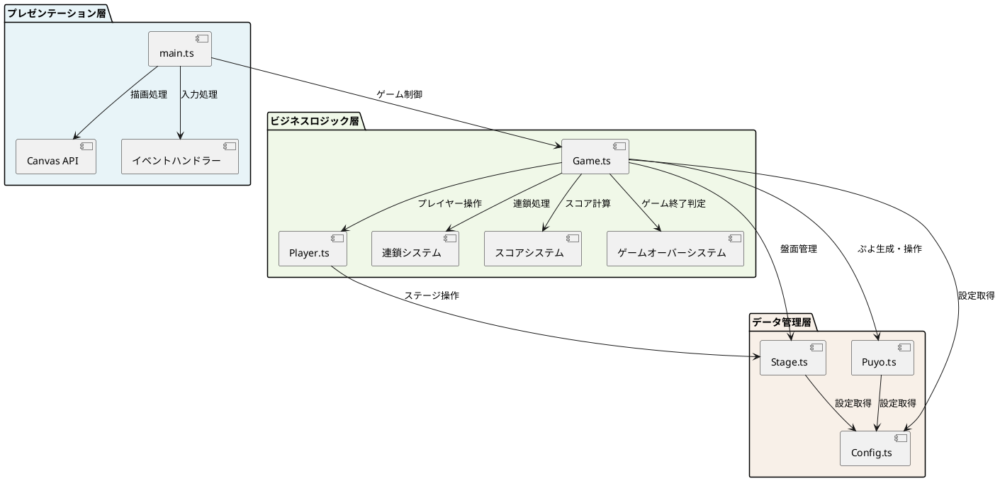
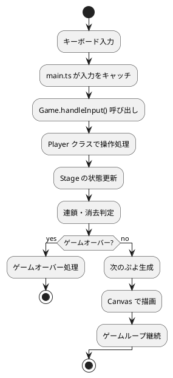
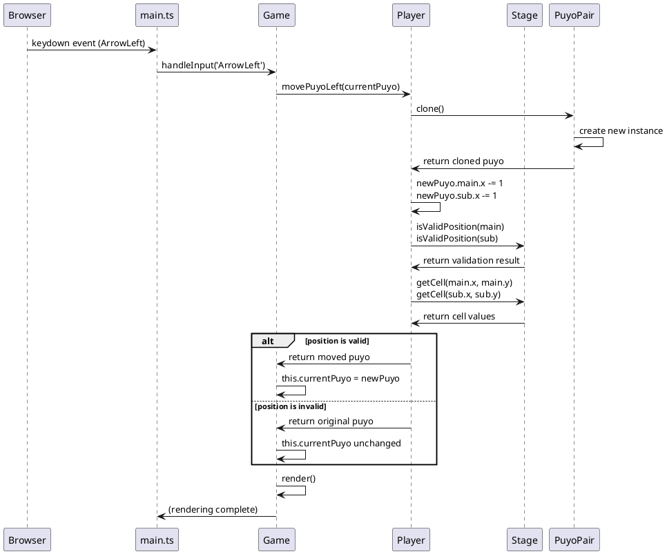
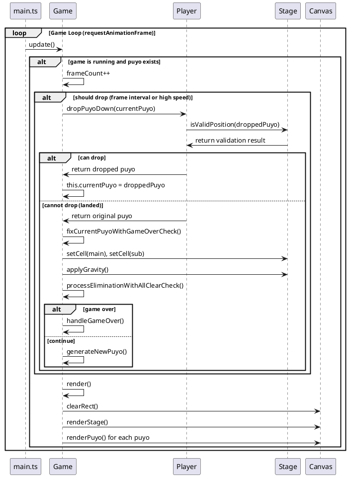
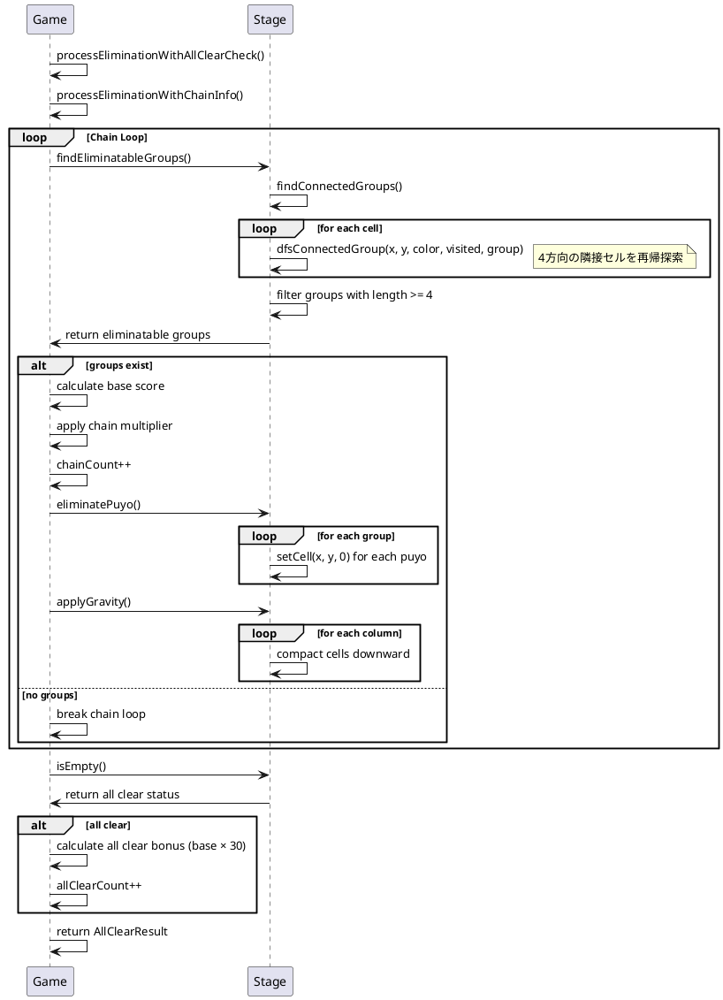
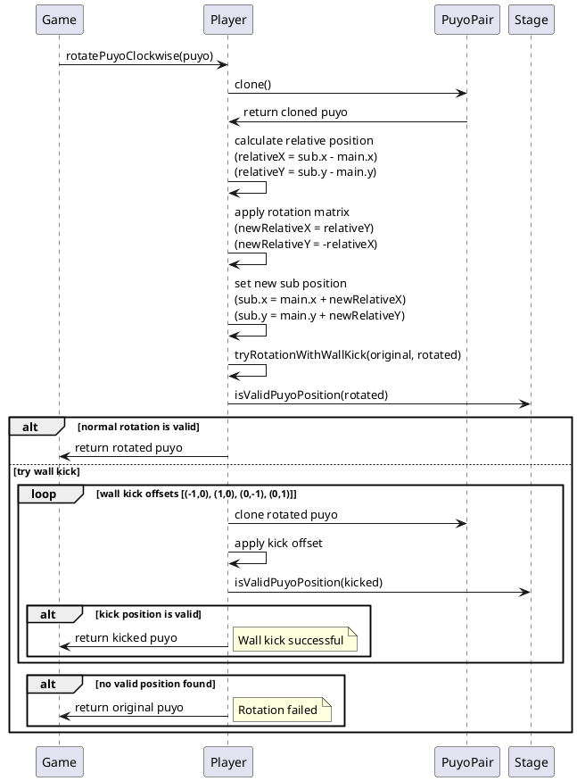

# ぷよぷよアプリケーション アーキテクチャ

## アーキテクチャ概要

本ぷよぷよアプリケーションは、オブジェクト指向設計を基盤とした**レイヤードアーキテクチャ（3層）**を採用しています。プレゼンテーション層、ビジネスロジック層、データ管理層が明確に分離され、保守性と拡張性を重視した設計となっています。

## 各層の詳細

### プレゼンテーション層

**責務**: ユーザーインターフェース、入力処理、画面描画

- **main.ts**: アプリケーションのエントリーポイント
  - Canvas要素の初期化
  - ゲームインスタンスの生成
  - キーボードイベントリスナーの設定（keydown/keyup）
  - ゲームループの開始

- **Canvas API**: HTML5 Canvas による描画
  - ぷよの描画（色、位置）
  - ステージ枠線の描画
  - リアルタイム描画更新

### ビジネスロジック層

**責務**: ゲームロジック、ルール制御、状態管理

- **Game.ts**: 中核となるゲーム制御クラス
  - ゲーム状態管理（実行中、ゲームオーバー）
  - ゲームループ処理（update, render）
  - 入力処理ディスパッチ
  - スコア管理
  - 連鎖システム統合
  - 全消しボーナス処理
  - ゲームオーバー判定・処理

- **Player.ts**: プレイヤー操作処理
  - ぷよの移動（左右、落下）
  - ぷよの回転（時計回り、反時計回り）
  - 衝突判定
  - 壁キック処理

- **連鎖システム**: 高度なゲームメカニクス
  - 連鎖判定と実行
  - 連鎖倍率計算
  - 連鎖詳細情報管理
  - スコア倍率適用

- **スコアシステム**: 得点計算
  - 基本スコア計算（消去数 × 10）
  - グループサイズボーナス（5個以上で追加）
  - 連鎖ボーナス（倍率適用）
  - 全消しボーナス（30倍）

- **ゲームオーバーシステム**: 終了条件管理
  - ゲームオーバー判定
  - 終了演出制御
  - リスタート機能

### データ管理層

**責務**: データ構造、状態管理、設定管理

- **Stage.ts**: ゲーム盤面管理
  - 2次元グリッド管理
  - セル状態管理（空、色付きぷよ）
  - 連結グループ検出（DFS）
  - 消去可能グループ判定
  - 重力適用（落下処理）
  - 全消し判定

- **Puyo.ts**: ぷよオブジェクト
  - 単体ぷよ（座標、色）
  - ぷよペア（メイン・サブ）
  - 回転状態管理
  - クローン機能

- **Config.ts**: ゲーム設定
  - ステージサイズ定義
  - ぷよサイズ定義
  - 色定義
  - ゲーム速度設定

## アーキテクチャパターンの適用

### トランザクションスクリプトパターン
本アプリケーションは**トランザクションスクリプトパターン**を採用しています：

- **適用理由**: ゲームロジックが比較的明確で、データ構造が複雑すぎない
- **Game.ts**: 各ゲーム操作を独立したメソッドとして実装
- **手続き的処理**: 入力 → 処理 → 状態更新 → 描画の明確な流れ

### レイヤードアーキテクチャ（3層）
永続化が単純（メモリ内状態管理のみ）のため3層構造を採用：

1. **プレゼンテーション層**: UI・入力処理
2. **ビジネスロジック層**: ゲームルール・状態管理
3. **データ管理層**: データ構造・設定管理

## 設計原則の適用

### 単一責任原則（SRP）
- Game: ゲーム全体制御
- Stage: 盤面管理
- Player: プレイヤー操作
- Puyo: ぷよデータ

### オープン・クローズド原則（OCP）
- 新しいゲームモードや機能を追加する際の拡張性を考慮
- インターフェース定義による抽象化

### 依存関係逆転原則（DIP）
- 上位層が下位層に依存する明確な構造
- 設定値はConfigクラス経由で注入

## データフロー

## オブジェクト相互作用

### キーボード入力処理のシーケンス

### ゲームループ処理のシーケンス

### 連鎖処理のシーケンス

### ぷよ回転処理のシーケンス

## 状態管理

### ゲーム状態
- `running`: ゲーム実行中フラグ
- `gameOverState`: ゲームオーバー状態
- `currentPuyo`: 現在操作中のぷよペア
- `score`: 現在スコア
- `allClearCount`: 全消し回数

### ステージ状態
- `grid`: 2次元配列による盤面表現
- `isEmpty()`: 全消し判定
- `applyGravity()`: 重力による落下処理

## パフォーマンス考慮事項

### 効率的な処理
- **DFS探索**: 連結グループ検出で最適化されたアルゴリズム
- **フレームベース更新**: 60FPS対応のゲームループ
- **イベント駆動**: 必要時のみ再描画

### メモリ管理
- オブジェクトの適切な生成・破棄
- 配列操作の最適化
- クローン処理の効率化

## 拡張性

### 将来の拡張ポイント
1. **新ゲームモード**: Game クラスの継承で対応
2. **AI対戦**: Player インターフェース化で対応
3. **ネットワーク対戦**: 状態同期機能の追加
4. **保存機能**: 永続化層の追加（4層アーキテクチャへ）

### 設計上の配慮
- 疎結合な設計による変更容易性
- インターフェース分離による拡張性
- 設定の外部化による調整可能性