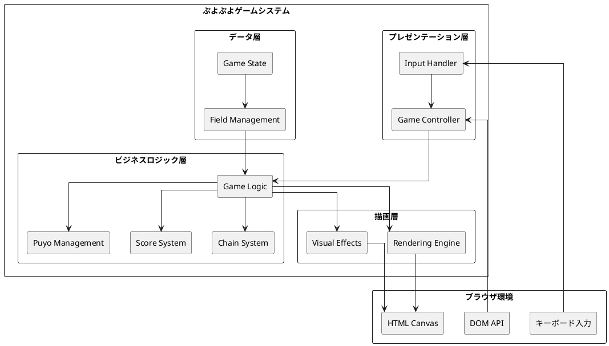
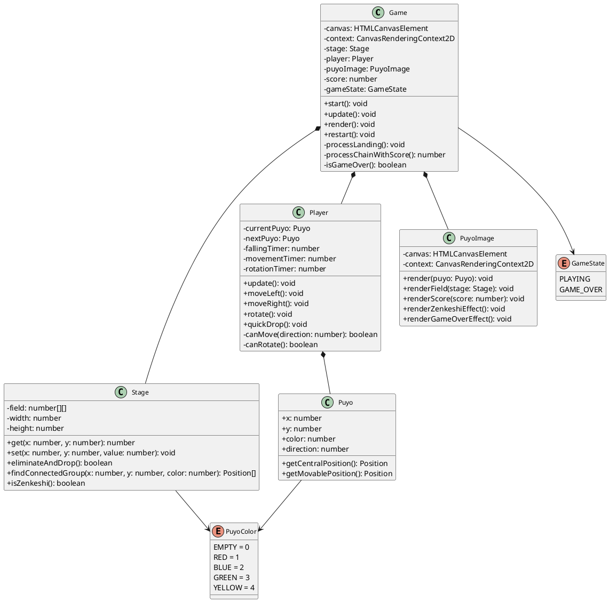
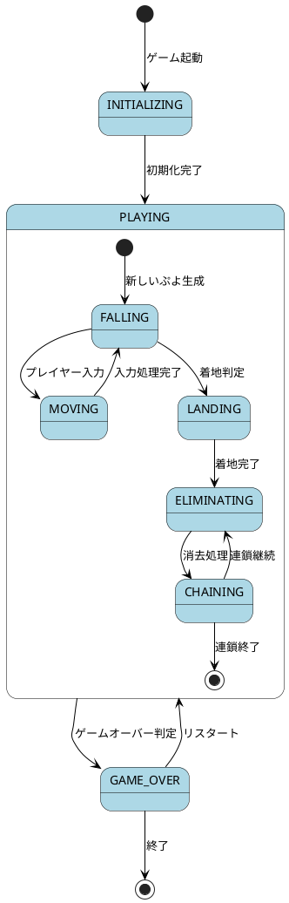

# ぷよぷよアプリケーション アーキテクチャ

## 概要

このドキュメントでは、TypeScriptで実装されたぷよぷよゲームアプリケーションのアーキテクチャについて説明します。本アプリケーションは、テスト駆動開発（TDD）とクリーンアーキテクチャの原則に従って設計されています。

## システムアーキテクチャ

### 全体構成

## クラス設計

### 主要クラス構成

## アーキテクチャパターン

### レイヤードアーキテクチャ

本アプリケーションは4層のレイヤードアーキテクチャを採用しています：

1. **プレゼンテーション層** (Presentation Layer)
   - ユーザー入力の処理
   - ゲーム状態の表示制御
   - Canvas APIとの直接的なインターフェース

2. **ビジネスロジック層** (Business Logic Layer)
   - ゲームルールの実装
   - ぷよの移動・回転・消去処理
   - スコア計算・連鎖処理

3. **データアクセス層** (Data Access Layer)
   - ゲーム状態の管理
   - フィールド情報の永続化
   - 設定データの管理

4. **インフラストラクチャ層** (Infrastructure Layer)
   - Canvas描画エンジン
   - キーボード入力処理
   - ブラウザAPI統合

## 状態管理

### ゲーム状態遷移

## テストアーキテクチャ

### テスト戦略

本プロジェクトでは260個の包括的なテストケースによって、以下のテスト戦略を実現：

1. **Unit Tests**
   - Game Test (160テストケース) - メインロジック
   - Stage Test (43テストケース) - フィールド管理
   - Player Test (18テストケース) - プレイヤー操作
   - Puyo Test (24テストケース) - ぷよエンティティ
   - PuyoImage Test (15テストケース) - 描画システム

2. **Test Infrastructure**
   - Mock Canvas API - 描画コールの検証
   - Mock Keyboard Events - 入力パターンのテスト
   - Test Utilities - テストヘルパー関数

3. **TDD Cycle**
   - Red-Green-Refactor サイクルの完全実践
   - 8イテレーション継続的な品質向上

## パフォーマンス設計

### 描画最適化

- **60FPS維持**: 効率的なCanvas描画
- **変更検出**: 不要な描画のスキップ
- **メモリ効率**: オブジェクトプールによる再利用

### メモリ管理

- **2次元配列**: 効率的なフィールド表現
- **ガベージコレクション最小化**: 大量オブジェクト生成の回避
- **状態管理**: 適切なライフサイクル管理

## セキュリティ設計

### 入力検証

- キーボード入力の妥当性検証
- 不正な状態遷移の防止
- Canvas APIの安全な使用

### エラーハンドリング

- 例外処理の適切な実装
- ゲーム状態の整合性保証
- ユーザーフレンドリーなエラー表示

## 拡張性設計

### 将来的な機能拡張

1. **入力システム拡張**
   - タッチ操作対応
   - ゲームパッド対応

2. **描画システム拡張**
   - WebGL対応
   - アニメーション強化

3. **ゲームモード拡張**
   - AI対戦モード
   - マルチプレイヤー対応

4. **システム拡張**
   - サウンド対応
   - 設定システム

## まとめ

このアーキテクチャは以下の特徴を持ちます：

1. **保守性**: レイヤードアーキテクチャによる関心事の分離
2. **テスタビリティ**: TDD対応の包括的なテスト戦略  
3. **拡張性**: プラグインアーキテクチャによる機能追加対応
4. **パフォーマンス**: 効率的な描画システムとメモリ管理
5. **品質**: TypeScript型安全性とエラーハンドリング

これらの設計原則により、高品質で保守しやすいゲームアプリケーションを実現しています。