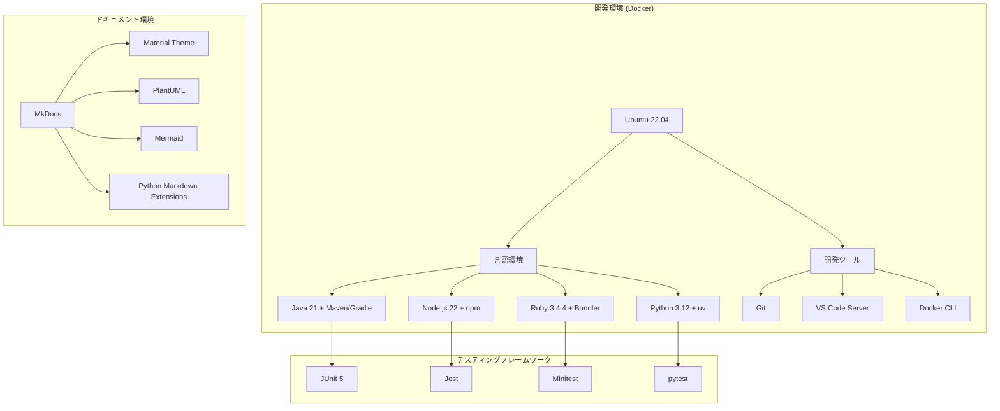
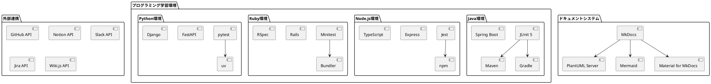
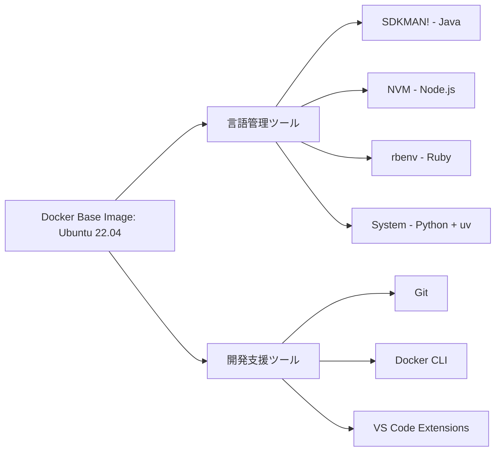
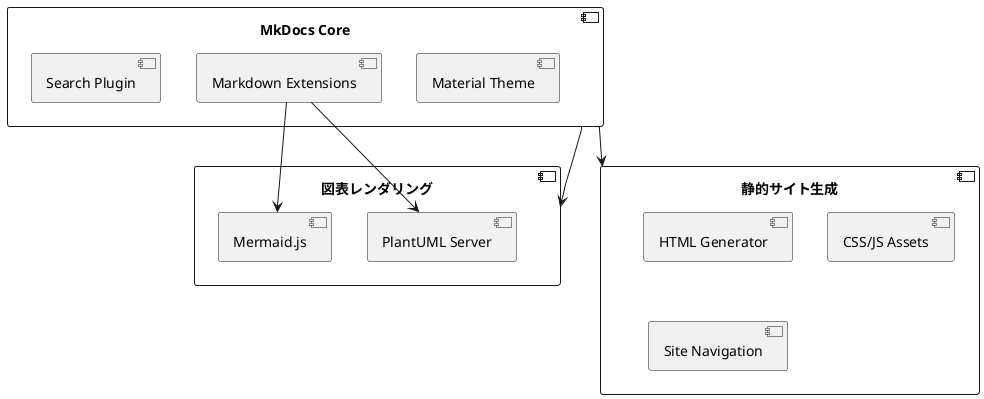
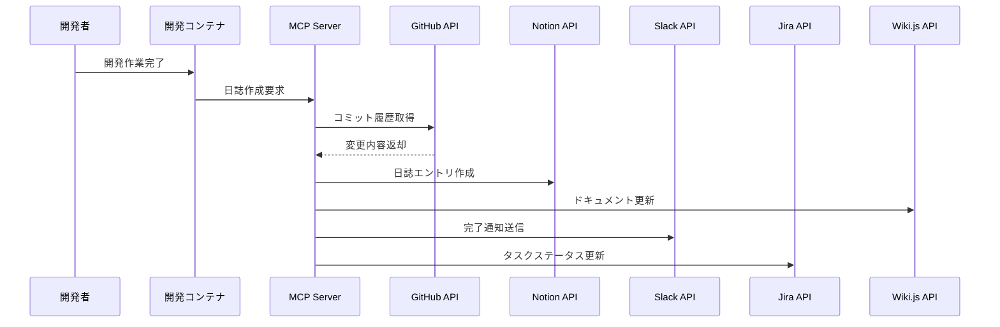
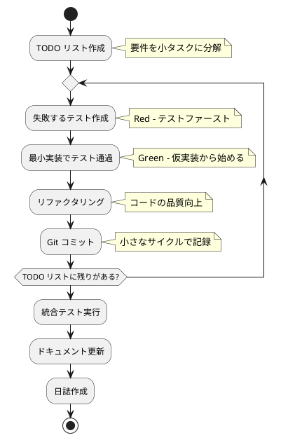
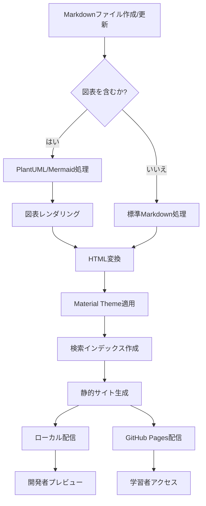
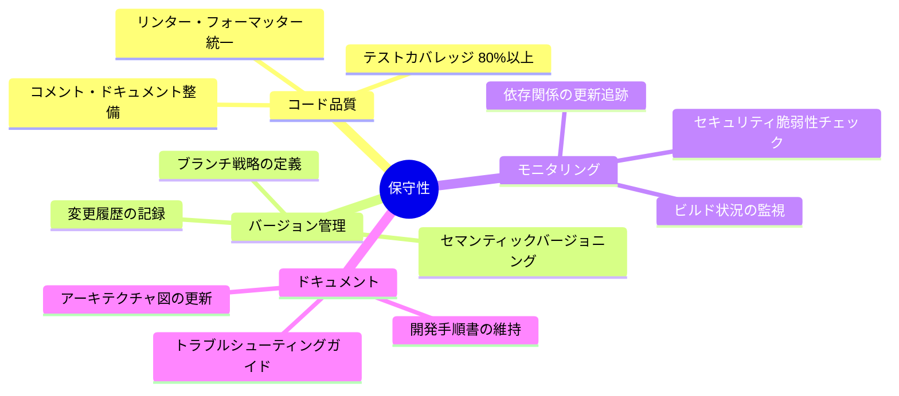
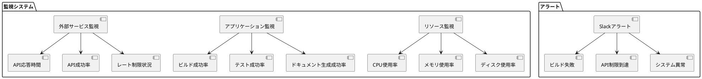

# アーキテクチャ概要

## プロジェクト概要

「実践 AIプログラミング」は、複数のプログラミング言語を使用したテスト駆動開発（TDD）学習環境を提供するプロジェクトです。Docker化された開発環境と包括的なドキュメント管理システムを通じて、実践的なプログラミング学習体験を提供します。

## システムアーキテクチャ

### 全体構成

```plantuml
@startuml
!include https://raw.githubusercontent.com/plantuml-stdlib/C4-PlantUML/master/C4_Container.puml

LAYOUT_WITH_LEGEND()

title システム構成図

Person(learner, "学習者", "プログラミング学習者")
Person(developer, "開発者", "プロジェクト開発者")

System_Boundary(aiPrograming, "AI Programming Exercise") {
    Container(devContainer, "開発コンテナ", "Docker", "Ubuntu 22.04ベースの統合開発環境")
    Container(docsContainer, "ドキュメントコンテナ", "MkDocs", "ドキュメント生成・配信システム")
    Container(webBrowser, "Webブラウザ", "HTML/CSS/JavaScript", "ドキュメント閲覧インターフェース")
}

System_Ext(github, "GitHub", "ソースコード管理・CI/CD")
System_Ext(githubPages, "GitHub Pages", "静的サイトホスティング")
System_Ext(notion, "Notion", "プロジェクト管理・日誌")
System_Ext(slack, "Slack", "チームコミュニケーション")
System_Ext(jira, "Jira", "タスク管理")

Rel(learner, devContainer, "学習・開発")
Rel(developer, devContainer, "開発・実装")
Rel(learner, webBrowser, "ドキュメント閲覧")
Rel(developer, webBrowser, "ドキュメント管理")

Rel(devContainer, docsContainer, "ドキュメント生成")
Rel(docsContainer, webBrowser, "HTML配信", "HTTP")

Rel(devContainer, github, "ソースコード管理", "Git")
Rel(docsContainer, githubPages, "静的サイト配信")
Rel(developer, notion, "日誌・プロジェクト管理", "API")
Rel(developer, slack, "通知・コミュニケーション", "API")
Rel(developer, jira, "タスク管理", "API")

@enduml
```

### 技術スタック

#### 開発環境層


```mermaid
graph TB
    subgraph "開発環境 (Docker)"
        A[Ubuntu 22.04] --> B[言語環境]
        B --> C[Java 21 + Maven/Gradle]
        B --> D[Node.js 22 + npm]
        B --> E[Ruby 3.4.4 + Bundler]
        B --> F[Python 3.12 + uv]
        
        A --> G[開発ツール]
        G --> H[Git]
        G --> I[VS Code Server]
        G --> J[Docker CLI]
    end
    
    subgraph "テスティングフレームワーク"
        C --> K[JUnit 5]
        D --> L[Jest]
        E --> M[Minitest]
        F --> N[pytest]
    end
    
    subgraph "ドキュメント環境"
        O[MkDocs] --> P[Material Theme]
        O --> Q[PlantUML]
        O --> R[Mermaid]
        O --> S[Python Markdown Extensions]
    end
```

#### アプリケーション層


```plantuml
@startuml
package "プログラミング学習環境" {
    package "Java環境" {
        [JUnit 5] as junit
        [Maven] as maven
        [Gradle] as gradle
        [Spring Boot] as spring
    }
    
    package "Node.js環境" {
        [Jest] as jest
        [npm] as npm
        [Express] as express
        [TypeScript] as typescript
    }
    
    package "Ruby環境" {
        [Minitest] as minitest
        [Bundler] as bundler
        [Rails] as rails
        [RSpec] as rspec
    }
    
    package "Python環境" {
        [pytest] as pytest
        [uv] as uv
        [FastAPI] as fastapi
        [Django] as django
    }
}

package "ドキュメントシステム" {
    [MkDocs] as mkdocs
    [PlantUML Server] as plantuml
    [Mermaid] as mermaid
    [Material for MkDocs] as material
}

package "外部連携" {
    [GitHub API] as github_api
    [Notion API] as notion_api
    [Slack API] as slack_api
    [Jira API] as jira_api
    [Wiki.js API] as wikijs_api
}

mkdocs --> plantuml
mkdocs --> mermaid
mkdocs --> material

junit --> maven
junit --> gradle
jest --> npm
minitest --> bundler
pytest --> uv

@enduml
```

## コンポーネント設計

### 1. 開発環境コンテナ

**責務**: 統合開発環境の提供
- 複数言語のランタイム管理
- パッケージマネージャーの統合
- 開発ツールの統一

**技術構成**:

```mermaid
graph LR
    A[Docker Base Image: Ubuntu 22.04] --> B[言語管理ツール]
    B --> C[SDKMAN! - Java]
    B --> D[NVM - Node.js]
    B --> E[rbenv - Ruby]
    B --> F[System - Python + uv]
    
    A --> G[開発支援ツール]
    G --> H[Git]
    G --> I[Docker CLI]
    G --> J[VS Code Extensions]
```

### 2. ドキュメントシステム

**責務**: 学習コンテンツの管理・配信
- Markdownベースのドキュメント作成
- 図表の自動レンダリング
- 検索・ナビゲーション機能

**技術構成**:

```plantuml
@startuml
component "MkDocs Core" as mkdocs {
    component "Material Theme" as theme
    component "Markdown Extensions" as extensions
    component "Search Plugin" as search
}

component "図表レンダリング" as diagrams {
    component "PlantUML Server" as plantuml
    component "Mermaid.js" as mermaid
}

component "静的サイト生成" as generation {
    component "HTML Generator" as html
    component "CSS/JS Assets" as assets
    component "Site Navigation" as nav
}

mkdocs --> diagrams
mkdocs --> generation
extensions --> plantuml
extensions --> mermaid

@enduml
```

### 3. 外部サービス連携層

**責務**: プロジェクト管理・コミュニケーション支援
- Git操作の自動化
- プロジェクト管理システムとの連携
- 開発日誌の自動生成

**API統合**:

```mermaid
sequenceDiagram
    participant Dev as 開発者
    participant Container as 開発コンテナ
    participant MCP as MCP Server
    participant GitHub as GitHub API
    participant Notion as Notion API
    participant Slack as Slack API
    participant Jira as Jira API
    participant WikiJS as Wiki.js API
    
    Dev->>Container: 開発作業完了
    Container->>MCP: 日誌作成要求
    MCP->>GitHub: コミット履歴取得
    GitHub-->>MCP: 変更内容返却
    MCP->>Notion: 日誌エントリ作成
    MCP->>WikiJS: ドキュメント更新
    MCP->>Slack: 完了通知送信
    MCP->>Jira: タスクステータス更新
```

## データフロー

### TDD学習サイクル


```plantuml
@startuml
start

:TODO リスト作成;
note right: 要件を小タスクに分解

repeat
    :失敗するテスト作成;
    note right: Red - テストファースト
    
    :最小実装でテスト通過;
    note right: Green - 仮実装から始める
    
    :リファクタリング;
    note right: コードの品質向上
    
    :Git コミット;
    note right: 小さなサイクルで記録
    
repeat while (TODO リストに残りがある?)

:統合テスト実行;
:ドキュメント更新;
:日誌作成;

stop
@enduml
```

### ドキュメント生成フロー


```mermaid
flowchart TD
    A[Markdownファイル作成/更新] --> B{図表を含むか?}
    
    B -->|はい| C[PlantUML/Mermaid処理]
    B -->|いいえ| D[標準Markdown処理]
    
    C --> E[図表レンダリング]
    E --> F[HTML変換]
    D --> F
    
    F --> G[Material Theme適用]
    G --> H[検索インデックス作成]
    H --> I[静的サイト生成]
    
    I --> J[ローカル配信]
    I --> K[GitHub Pages配信]
    
    J --> L[開発者プレビュー]
    K --> M[学習者アクセス]
```

## ディレクトリ構造

```
ai-programing-exercise/
├── app/                    # メインアプリケーション
│   └── main.py            # Python実装（FizzBuzz等）
├── docs/                  # ドキュメント
│   ├── index.md          # メインページ
│   ├── architecture.md   # アーキテクチャ概要
│   ├── journal/          # 開発日誌
│   └── wiki/             # 技術ドキュメント
│       ├── 記事/         # 技術記事
│       ├── 日誌/         # 作業記録
│       ├── テンプレート/   # ドキュメントテンプレート
│       ├── 参照/         # リファレンス
│       └── 読書メモ/     # 学習記録
├── script/               # ユーティリティスクリプト
│   ├── journal.js        # 日誌管理スクリプト
│   └── mkdocs.js         # ドキュメント管理スクリプト
├── site/                 # 生成されたサイト
├── docker-compose.yml    # Docker構成定義
├── Dockerfile           # 開発環境イメージ
├── mkdocs.yml           # ドキュメント設定
├── package.json         # Node.js依存関係
├── pyproject.toml       # Python依存関係
└── README.md            # プロジェクト概要
```

## セキュリティ考慮事項

### アクセス制御

```plantuml
@startuml
!include https://raw.githubusercontent.com/plantuml-stdlib/C4-PlantUML/master/C4_Component.puml

title セキュリティアーキテクチャ

Container_Boundary(security, "セキュリティ層") {
    Component(auth, "認証システム", "OAuth 2.0", "GitHub認証ベース")
    Component(api_gateway, "API Gateway", "MCP Server", "外部API統合")
    Component(secrets, "機密情報管理", "環境変数", "API Key等の管理")
}

Container_Boundary(external, "外部サービス") {
    Component(github, "GitHub", "API", "認証プロバイダー")
    Component(notion, "Notion", "API", "プロジェクト管理")
    Component(slack, "Slack", "API", "コミュニケーション")
    Component(jira, "Jira", "API", "タスク管理")
}

auth --> github : "OAuth認証"
api_gateway --> notion : "API Key認証"
api_gateway --> slack : "Bot Token認証"
api_gateway --> jira : "API Token認証"
secrets --> api_gateway : "認証情報提供"

@enduml
```

### データ保護

1. **機密情報の暗号化**
   - API Keyの環境変数管理
   - Git履歴からの機密情報除外

2. **アクセス制限**
   - 開発コンテナの分離実行
   - 最小権限の原則

3. **監査証跡**
   - Git操作ログの記録
   - API呼び出し履歴の保持

## 非機能要件

### パフォーマンス

| 項目 | 要件 | 測定方法 |
|------|------|----------|
| ドキュメント生成時間 | 5分以内 | MkDocs buildコマンド実行時間 |
| テスト実行時間 | 言語別30秒以内 | 各言語のテスト実行時間 |
| コンテナ起動時間 | 2分以内 | docker-compose up完了まで |

### 可用性

| 項目 | 要件 | 対策 |
|------|------|------|
| 開発環境の稼働率 | 99% | Dockerによる環境の再現性確保 |
| ドキュメントサイトの稼働率 | 99.9% | GitHub Pagesの信頼性活用 |
| 外部API連携の障害対応 | エラーハンドリング実装 | リトライ機構・タイムアウト設定 |

### 保守性


```mermaid
mindmap
  root((保守性))
    コード品質
      テストカバレッジ 80%以上
      リンター・フォーマッター統一
      コメント・ドキュメント整備
    バージョン管理
      セマンティックバージョニング
      変更履歴の記録
      ブランチ戦略の定義
    モニタリング
      ビルド状況の監視
      依存関係の更新追跡
      セキュリティ脆弱性チェック
    ドキュメント
      アーキテクチャ図の更新
      開発手順書の維持
      トラブルシューティングガイド
```

## 拡張計画

### 短期目標（3ヶ月）

1. **言語サポート拡張**
   - Go言語環境の追加
   - Rust言語環境の追加

2. **CI/CD強化**
   - GitHub Actionsによる自動テスト
   - 自動デプロイパイプライン

### 中期目標（6ヶ月）

1. **学習支援機能**
   - 進捗トラッキングシステム
   - 学習パス推奨機能

2. **コラボレーション機能**
   - リアルタイム共同編集
   - ペアプログラミングサポート

### 長期目標（1年）

1. **AI統合**
   - コード生成支援
   - 自動レビュー機能

2. **マルチプラットフォーム対応**
   - クラウド開発環境
   - モバイルアプリ連携

## 運用監視

### 監視項目


```plantuml
@startuml
package "監視システム" {
    [リソース監視] --> [CPU使用率]
    [リソース監視] --> [メモリ使用率]
    [リソース監視] --> [ディスク使用率]
    
    [アプリケーション監視] --> [ビルド成功率]
    [アプリケーション監視] --> [テスト成功率]
    [アプリケーション監視] --> [ドキュメント生成成功率]
    
    [外部サービス監視] --> [API応答時間]
    [外部サービス監視] --> [API成功率]
    [外部サービス監視] --> [レート制限状況]
}

package "アラート" {
    [Slackアラート] --> [ビルド失敗]
    [Slackアラート] --> [API制限到達]
    [Slackアラート] --> [システム異常]
}

@enduml
```

### ログ管理

1. **開発活動ログ**
   - Gitコミット履歴
   - テスト実行結果
   - ビルド実行履歴

2. **システムログ**
   - コンテナ実行ログ
   - API呼び出しログ
   - エラー発生ログ

3. **利用状況ログ**
   - ドキュメントアクセス履歴
   - 機能利用統計
   - パフォーマンス測定結果

## まとめ

この包括的なアーキテクチャにより、スケーラブルで保守性の高いAIプログラミング学習環境を提供し、継続的な改善と拡張を支援します。

### 主要な特徴

- **マルチ言語対応**: Java、Node.js、Ruby、Pythonでの一貫したTDD体験
- **統合開発環境**: Dockerによる再現可能な開発環境
- **ドキュメント駆動**: MkDocsとWiki.jsによる知識管理
- **外部サービス連携**: プロジェクト管理とコミュニケーションの効率化
- **継続的学習**: 日誌とナレッジベースによる学習の振り返りと改善
