# ぷよぷよアプリケーション 設計ドキュメント

## 設計概要

本ぷよぷよアプリケーションは、**テスト駆動開発（TDD）**を基盤とし、**オブジェクト指向設計原則**に従って設計されています。全8イテレーションを通じて段階的に機能を拡張し、保守性と拡張性を重視した設計を実現しています。

## 設計原則

### 1. SOLID原則の適用

#### Single Responsibility Principle (SRP)
各クラスは単一の責任を持つように設計：

- **Game**: ゲーム全体の制御と状態管理
- **Stage**: ゲーム盤面の管理
- **Player**: プレイヤー操作の処理
- **Puyo/PuyoPair**: ぷよデータの管理
- **Config**: 設定値の管理

#### Open/Closed Principle (OCP)
拡張に対して開かれ、修正に対して閉じられた設計：

- インターフェース型定義による抽象化
- 新機能追加時のクラス継承による拡張
- 既存コードの変更を最小限に抑制

#### Dependency Inversion Principle (DIP)
上位モジュールが下位モジュールに依存しない設計：

- Game → Player, Stage への依存
- Player → Stage への依存
- 全クラス → Config への依存

### 2. 設計パターンの活用

#### Strategy Pattern
- 連鎖システムでの倍率計算
- スコア計算ロジックの切り替え可能性

#### Template Method Pattern
- ゲームループの基本構造（update → render）
- 消去処理の基本フロー（検出 → 消去 → 重力適用）

#### Observer Pattern の準備
- ゲーム状態変更時の通知機構（将来拡張用）

## クラス設計

### Game クラス

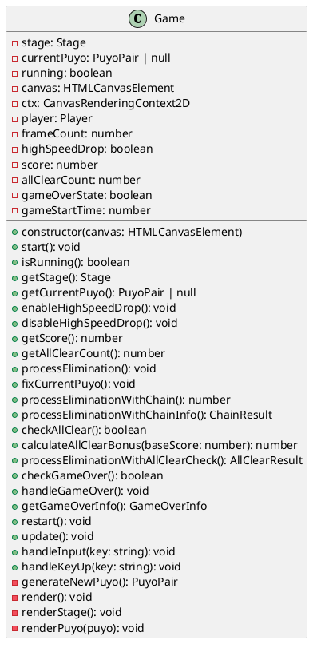

#### 設計上の考慮点
1. **状態管理の一元化**: ゲーム全体の状態を一箇所で管理
2. **描画処理の分離**: renderメソッド群による描画責任の分離
3. **入力処理の抽象化**: handleInput/handleKeyUpによる入力の統一処理
4. **エラーハンドリング**: Canvas初期化時の例外処理

### Stage クラス

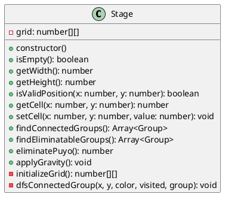

#### 設計上の考慮点
1. **データ構造の最適化**: 2次元配列による効率的な盤面管理
2. **アルゴリズムの実装**: DFS による連結グループ検出
3. **境界チェック**: 範囲外アクセスの防止
4. **物理演算**: 重力適用による自然な落下処理

### Player クラス

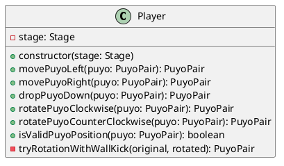

#### 設計上の考慮点
1. **イミュータブル操作**: 元のぷよを変更せず新しいインスタンスを返却
2. **壁キック機能**: 回転時の柔軟な位置調整
3. **バリデーション**: 移動・回転の妥当性チェック
4. **Stage との協調**: 盤面状態を考慮した運動制御

### Puyo/PuyoPair クラス

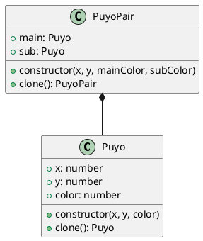

#### 設計上の考慮点
1. **値オブジェクト**: 不変性を重視したデータクラス
2. **クローン機能**: 回転状態を保持する深いコピー
3. **構成関係**: PuyoPairがPuyoを包含する自然な関係
4. **初期配置**: サブぷよをメインぷよの上に配置する設計

## 型定義設計

### インターフェース群

```typescript
// 連鎖システム
export interface ChainDetail {
  eliminatedGroups: Array<Array<{x: number, y: number, color: number}>>
  score: number
  multiplier: number
}

export interface ChainResult {
  chainCount: number
  totalScore: number
  chainDetails: ChainDetail[]
}

// 全消しシステム
export interface AllClearResult {
  isAllClear: boolean
  chainCount: number
  allClearBonus: number
  totalScore: number
  chainDetails: ChainDetail[]
}

// ゲームオーバーシステム
export interface GameOverInfo {
  isGameOver: boolean
  finalScore: number
  allClearCount: number
  playTime: number
}
```

#### 設計上の考慮点
1. **型安全性**: TypeScriptの型システムを活用した堅牢性
2. **構造化データ**: 複雑な処理結果を構造化して管理
3. **拡張性**: 将来の機能追加に対応可能な設計
4. **可読性**: 明確な命名による理解しやすさ

## ゲームロジック設計

### 連鎖システム

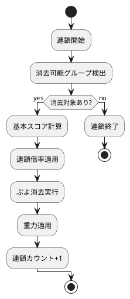

#### 連鎖倍率設計
- 1回目: 1倍
- 2回目: 2倍
- 3回目: 4倍
- 4回目: 8倍
- 以降: 倍々で増加（上限128倍）

### スコアシステム設計

#### 基本スコア計算
- 消去数 × 10 = 基本スコア
- 5個以上グループ: (個数 - 4) × 20 のボーナス

#### 連鎖ボーナス
- 各連鎖で基本スコア × 連鎖倍率

#### 全消しボーナス
- 基本スコア × 30倍

### ゲームオーバー判定設計

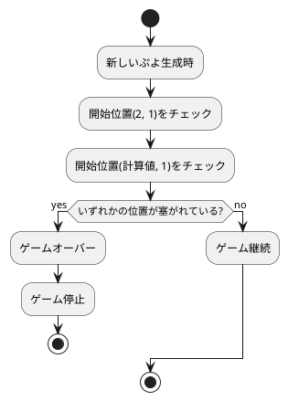

## 入力システム設計

### キーボード入力マッピング

| キー | 機能 | 処理方式 |
|------|------|----------|
| ←, A | 左移動 | keydown |
| →, D | 右移動 | keydown |
| ↓, S | 高速落下 | keydown/keyup |
| ↑, X | 時計回り回転 | keydown |
| Z | 反時計回り回転 | keydown |

#### 設計上の考慮点
1. **重複キー対応**: 矢印キーとWASDキーの両対応
2. **継続入力対応**: 高速落下のkeydown/keyup処理
3. **入力の分離**: keydownとkeyupの責任分離
4. **レスポンス性**: リアルタイムな入力応答

## レンダリング設計

### 描画フロー

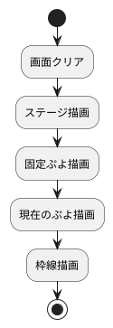

## オブジェクトインタラクション設計

### ユーザー操作からレンダリングまでの完全シーケンス

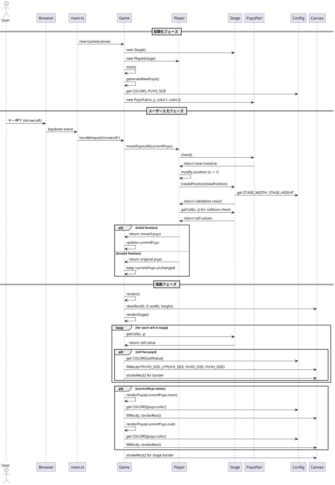

### TDD開発サイクルのオブジェクト相互作用

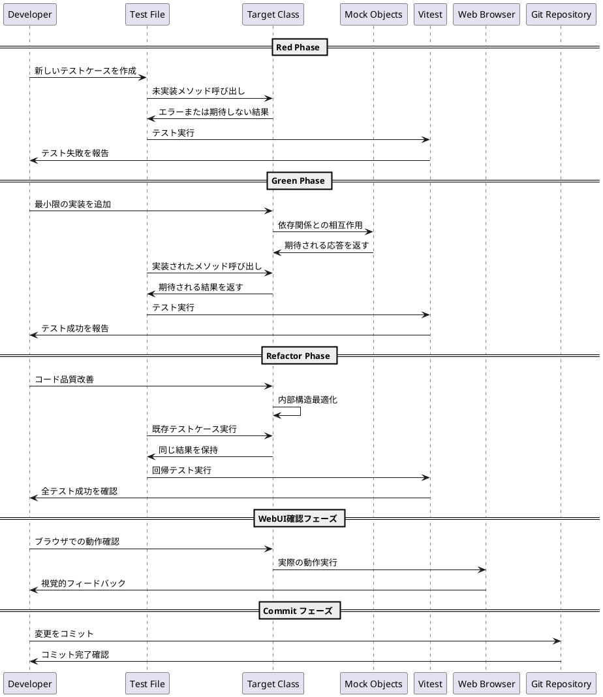

### 連鎖システムの詳細オブジェクト相互作用

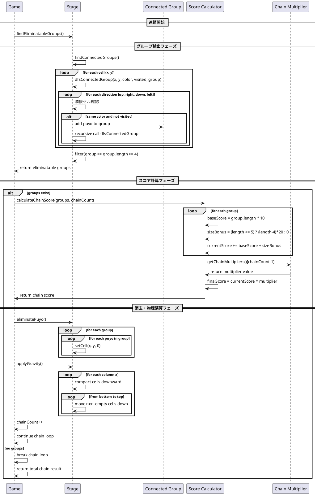

### 状態管理とエラーハンドリングの相互作用

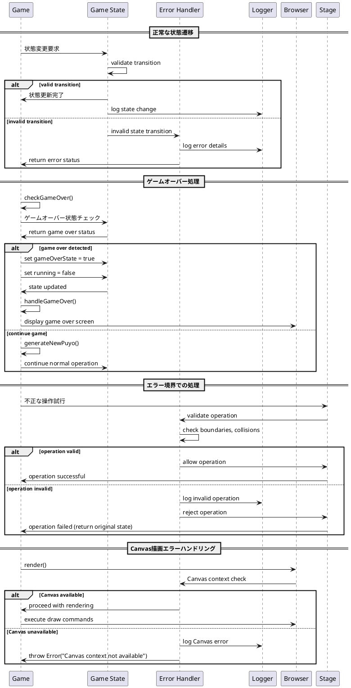

#### Canvas描画最適化
1. **クリア処理**: clearRectによる効率的な画面消去
2. **色管理**: Config.COLORSによる一元的な色管理
3. **サイズ管理**: Config.PUYO_SIZEによる統一サイズ
4. **枠線描画**: strokeRectによる明確な境界表示

## テスト戦略設計

### TDDサイクル
1. **Red**: 失敗するテストを書く
2. **Green**: テストが通る最小限の実装
3. **Refactor**: コードの改善とリファクタリング

### テスト分類
- **ユニットテスト**: 各クラスの単体機能テスト
- **統合テスト**: クラス間の連携テスト
- **ゲームロジックテスト**: ルール・メカニクスの検証

### テストカバレッジ戦略
- 境界値テスト（盤面端、回転限界）
- 異常系テスト（無効入力、ゲームオーバー後操作）
- 状態遷移テスト（ゲーム状態の変化）

## パフォーマンス設計

### 計算量の最適化
- **DFS探索**: O(n)での連結グループ検出
- **重力処理**: O(width × height)での効率的な落下処理
- **描画更新**: 必要時のみのrender呼び出し

### メモリ使用量の最適化
- **オブジェクトプール**: 将来の拡張でのぷよインスタンス再利用
- **配列操作**: 無駄なコピーの削減
- **状態管理**: 必要最小限の状態保持

## 拡張性設計

### 将来の機能拡張ポイント

#### ゲームモード拡張
- **対戦モード**: Player クラスの継承
- **AIモード**: AI Player の実装
- **タイムアタック**: Game クラスの継承

#### UI/UX拡張
- **アニメーション**: 描画システムの拡張
- **サウンド**: 音響システムの追加
- **エフェクト**: 視覚効果システムの追加

#### データ拡張
- **保存機能**: 永続化層の追加
- **統計機能**: プレイデータの蓄積・分析
- **設定機能**: カスタマイズ可能な設定システム

### 設計原則の維持
1. **関心の分離**: 各レイヤーの責任明確化を維持
2. **疎結合**: クラス間の依存関係を最小限に保持
3. **高凝集**: 各クラス内の機能の関連性を高く保持
4. **拡張容易性**: 新機能追加時のコード変更を最小化