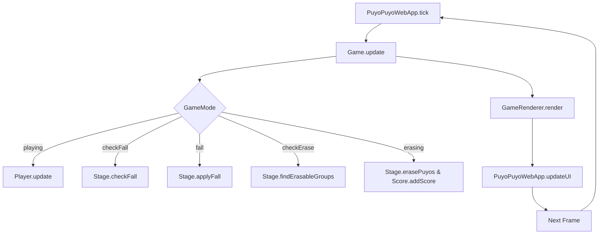
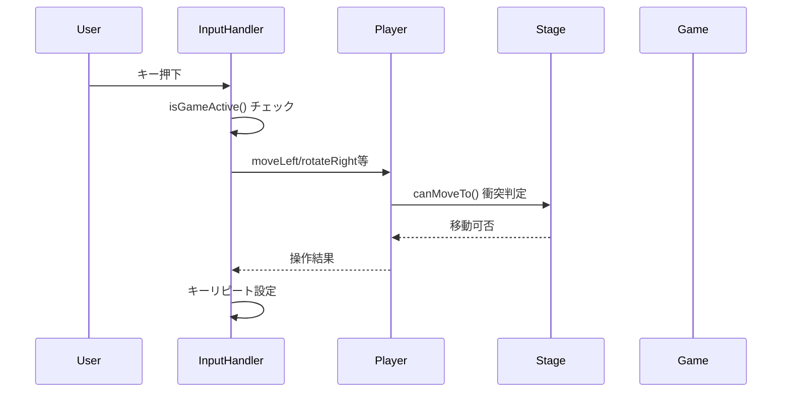
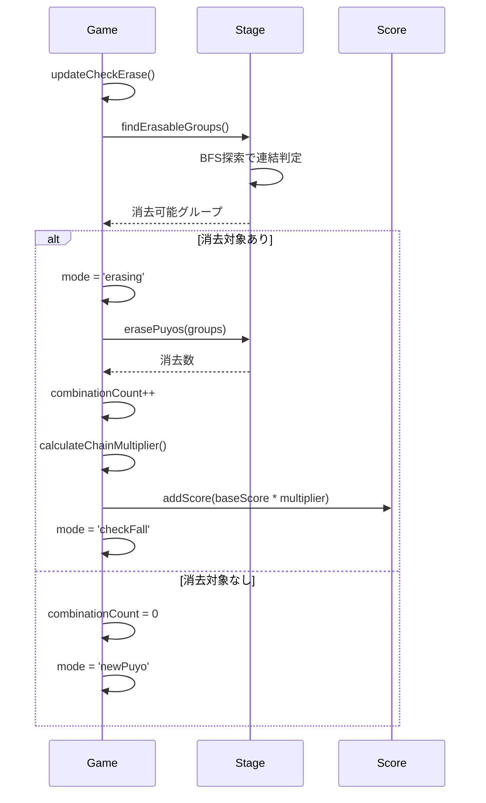

# ぷよぷよゲーム アプリケーション設計ドキュメント

## 1. 設計概要

### 1.1 設計方針
このアプリケーションは**Clean Architecture**の原則に基づいて設計されており、以下の設計方針を採用しています：

- **関心の分離**: UI、ビジネスロジック、データ層の明確な分離
- **依存関係逆転**: 抽象に依存し、具象に依存しない設計
- **単一責任原則**: 各クラスは1つの責任のみを持つ
- **テスト駆動開発**: すべての機能がテストファーストで実装
- **型安全性**: TypeScriptによる静的型検証

### 1.2 アーキテクチャ概要
```
┌─────────────────────────────────────────────────────────────┐
│                    プレゼンテーション層                      │
├─────────────────────────────────────────────────────────────┤
│ PuyoPuyoWebApp │ GameRenderer │ InputHandler │ HTML/CSS     │
├─────────────────────────────────────────────────────────────┤
│                      アプリケーション層                      │
├─────────────────────────────────────────────────────────────┤
│ Game (状態機械) │ Player (操作制御) │ Score (スコア管理)    │
├─────────────────────────────────────────────────────────────┤
│                       ドメイン層                           │
├─────────────────────────────────────────────────────────────┤
│ Stage (フィールド) │ PuyoPair (ぷよペア) │ Puyo (ぷよ)      │
├─────────────────────────────────────────────────────────────┤
│                      インフラ層                            │
├─────────────────────────────────────────────────────────────┤
│ Config (設定) │ PuyoImage (画像リソース)                    │
└─────────────────────────────────────────────────────────────┘
```

## 2. クラス設計

### 2.1 ドメイン層

#### 2.1.1 Puyo クラス
**責任**: ぷよの基本的な属性と振る舞いを管理

```typescript
class Puyo {
  private color: PuyoColor    // ぷよの色
  private x: number           // X座標
  private y: number           // Y座標
  
  // 基本操作
  getColor(): PuyoColor
  getX(): number
  getY(): number
  setPosition(x: number, y: number): void
  isEmpty(): boolean
}

enum PuyoColor {
  Empty = 0,   // 空
  Red = 1,     // 赤
  Blue = 2,    // 青
  Green = 3,   // 緑
  Yellow = 4   // 黄
}
```

**設計決定**:
- Enumによる型安全な色管理
- 座標とカラーのカプセル化
- 不変性を重視した設計

#### 2.1.2 PuyoPair クラス
**責任**: 落下する2個1組のぷよペアを管理

```typescript
class PuyoPair {
  private mainColor: PuyoColor      // メインぷよの色
  private subColor: PuyoColor       // サブぷよの色
  private x: number                 // メインぷよのX座標
  private y: number                 // メインぷよのY座標
  private rotation: PairRotation    // 回転状態
  
  // 操作
  rotateRight(): void
  rotateLeft(): void
  setPosition(x: number, y: number): void
  getSubPosition(): [number, number]  // サブぷよの相対位置
}

enum PairRotation {
  Up = 0,     // ↑ (サブが上)
  Right = 1,  // → (サブが右)
  Down = 2,   // ↓ (サブが下)
  Left = 3    // ← (サブが左)
}
```

**設計決定**:
- 4方向回転の明確な定義
- メイン・サブの関係性を明確化
- 相対座標計算の責任をクラス内に集約

#### 2.1.3 Stage クラス
**責任**: ゲームフィールドの状態管理と物理演算

```typescript
class Stage {
  private config: Config
  private grid: Puyo[][]    // 6×13のフィールド
  
  // 基本操作
  getPuyo(x: number, y: number): Puyo
  setPuyo(x: number, y: number, puyo: Puyo): void
  isEmpty(x: number, y: number): boolean
  
  // 物理演算
  checkFall(): boolean                              // 落下判定
  applyFall(): void                                // 落下適用
  findErasableGroups(): [number, number][][]       // BFS連結検索
  erasePuyos(groups: [number, number][][]): number // ぷよ消去
}
```

**設計決定**:
- BFS（幅優先探索）による効率的な連結判定
- フィールド状態の完全なカプセル化
- 物理演算ロジックの集約

### 2.2 アプリケーション層

#### 2.2.1 Game クラス
**責任**: ゲーム全体の状態機械とフロー制御

```typescript
class Game {
  private mode: GameMode                    // 現在の状態
  private frame: number                     // フレームカウンタ
  private combinationCount: number          // 連鎖数
  private erasableGroups: [number, number][][] | null
  
  // コンポーネント
  private config: Config
  private stage: Stage
  private player: Player
  private score: Score
  
  // 状態機械
  update(): void
  reset(): void
}

type GameMode =
  | 'start'      // ゲーム開始
  | 'checkFall'  // 落下判定
  | 'fall'       // 落下処理
  | 'checkErase' // 消去判定
  | 'erasing'    // 消去処理
  | 'newPuyo'    // 新ぷよ生成
  | 'playing'    // プレイ中
  | 'gameOver'   // ゲームオーバー
```

**設計決定**:
- 状態機械パターンによる明確なゲームフロー
- モードベースの処理分岐
- 連鎖システムの指数的スコア計算

#### 2.2.2 Player クラス
**責任**: プレイヤー操作とぷよペアの制御

```typescript
class Player {
  private currentPair: PuyoPair | null  // 現在操作中のペア
  private nextPair: PuyoPair | null     // 次のペア
  private fallTimer: number             // 自動落下タイマー
  private placed: boolean               // 配置完了フラグ
  
  // 操作
  moveLeft(): boolean
  moveRight(): boolean
  rotateRight(): boolean
  rotateLeft(): boolean
  update(): void        // 自動落下処理
  
  // 状態管理
  isPlaced(): boolean
  newPair(): void
}
```

**設計決定**:
- 衝突判定の完全なカプセル化
- 自動落下タイマーの管理
- Next Puyo システムの実装

#### 2.2.3 Score クラス
**責任**: スコア計算と管理

```typescript
class Score {
  private score: number = 0
  
  getScore(): number
  addScore(points: number): void
}
```

**設計決定**:
- シンプルなスコア管理
- 連鎖倍率はGameクラスで計算
- 将来的な拡張を考慮した設計

### 2.3 プレゼンテーション層

#### 2.3.1 PuyoPuyoWebApp クラス
**責任**: アプリケーション全体の統合とライフサイクル管理

```typescript
class PuyoPuyoWebApp {
  private game: Game
  private renderer: GameRenderer
  private inputHandler: InputHandler
  private gameLoop: number | null
  
  // UI要素
  private scoreDisplay: HTMLElement
  private chainDisplay: HTMLElement
  private statusDisplay: HTMLElement
  
  // ライフサイクル
  startGame(): void
  resetGame(): void
  tick(): void          // ゲームループ
  updateUI(): void      // UI更新
}
```

#### 2.3.2 GameRenderer クラス
**責任**: HTML5 Canvasによるゲーム画面描画

```typescript
class GameRenderer {
  private canvas: HTMLCanvasElement
  private ctx: CanvasRenderingContext2D
  private nextCanvas: HTMLCanvasElement
  private nextCtx: CanvasRenderingContext2D
  private cellSize: number = 32
  
  // 描画処理
  render(game: Game): void
  private renderStage(stage: Stage): void
  private renderCurrentPair(player: Player): void
  private renderNextPuyo(player: Player): void
  private renderGrid(): void
}
```

#### 2.3.3 InputHandler クラス
**責任**: キーボード入力の処理とゲーム操作への変換

```typescript
class InputHandler {
  private game: Game
  private keyPressed: Set<string>
  private keyRepeatTimers: Map<string, number>
  
  // 入力処理
  private handleKeyDown(event: KeyboardEvent): void
  private handleKeyUp(event: KeyboardEvent): void
  private executeCommand(key: string): void
  private startKeyRepeat(key: string): void
}
```

## 3. データフローとシーケンス

### 3.1 ゲームループのデータフロー



### 3.2 ユーザー入力処理のシーケンス



### 3.3 ぷよ消去・連鎖処理のシーケンス



## 4. 設計パターン

### 4.1 State Machine Pattern (状態機械)
**適用箇所**: Game クラスのモード管理
**利点**: 
- ゲーム状態の明確な定義
- 状態遷移の予測可能性
- デバッグの容易さ

### 4.2 Observer Pattern (オブザーバー)
**適用箇所**: UI更新システム
**実装**: PuyoPuyoWebApp が Game状態を監視し UI を更新

### 4.3 Command Pattern (コマンド)
**適用箇所**: InputHandler のキー入力処理
**利点**: 
- キー操作の抽象化
- リピート機能の実装
- 将来的なコマンド履歴機能への拡張性

### 4.4 Factory Pattern (ファクトリー)
**適用箇所**: PuyoPair の生成
**実装**: `createRandomPair()` メソッドでランダムなぷよペア生成

## 5. アルゴリズム設計

### 5.1 BFS による連結ぷよ検索

```typescript
private findConnectedGroup(startX: number, startY: number, visited: Set<string>): [number, number][] {
  const targetColor = this.getPuyo(startX, startY).getColor()
  const group: [number, number][] = []
  const queue: [number, number][] = [[startX, startY]]

  while (queue.length > 0) {
    const [x, y] = queue.shift()!
    const key = `${x},${y}`

    if (visited.has(key)) continue

    visited.add(key)
    group.push([x, y])

    // 4方向の隣接セルをチェック
    const directions = [[0, -1], [0, 1], [-1, 0], [1, 0]]
    
    directions.forEach(([dx, dy]) => {
      const newX = x + dx, newY = y + dy
      if (this.isValidPosition(newX, newY) && 
          !visited.has(`${newX},${newY}`) &&
          !this.isEmpty(newX, newY) &&
          this.getPuyo(newX, newY).getColor() === targetColor) {
        queue.push([newX, newY])
      }
    })
  }

  return group
}
```

**計算量**: O(W×H) where W=6, H=13
**特徴**: 
- 効率的な連結成分検出
- 訪問済みセットによる重複回避
- 4方向探索による隣接判定

### 5.2 連鎖倍率計算

```typescript
private calculateChainMultiplier(chainCount: number): number {
  if (chainCount <= 1) return 1
  return Math.pow(2, chainCount - 1)  // 指数的増加
}
```

**数式**: multiplier = 2^(chain-1)
- 1連鎖: ×1
- 2連鎖: ×2  
- 3連鎖: ×4
- 4連鎖: ×8...

## 6. インターフェース定義

### 6.1 内部API

#### Game Controller Interface
```typescript
interface GameController {
  initialize(): void
  update(): void
  reset(): void
  getMode(): GameMode
  getScore(): number
  getCombinationCount(): number
}
```

#### Player Controller Interface
```typescript
interface PlayerController {
  moveLeft(): boolean
  moveRight(): boolean
  rotateRight(): boolean
  rotateLeft(): boolean
  getCurrentPair(): PuyoPair
  getNextPair(): PuyoPair
  isPlaced(): boolean
}
```

#### Stage Controller Interface
```typescript
interface StageController {
  getPuyo(x: number, y: number): Puyo
  setPuyo(x: number, y: number, puyo: Puyo): void
  isEmpty(x: number, y: number): boolean
  getWidth(): number
  getHeight(): number
}
```

### 6.2 外部インターフェース

#### Keyboard Input Mapping
```typescript
const INPUT_MAPPING = {
  'ArrowLeft': 'moveLeft',      // 左移動
  'ArrowRight': 'moveRight',    // 右移動
  'ArrowUp': 'rotateRight',     // 右回転
  'ArrowDown': 'accelerate',    // 高速落下
  ' ': 'drop',                  // 一気落下
  'z': 'rotateLeft',            // 左回転（サブ）
  'x': 'rotateRight'            // 右回転（サブ）
}
```

#### Canvas Rendering Interface
```typescript
interface RenderingContext {
  canvas: HTMLCanvasElement     // メインゲーム画面 (384×640)
  nextCanvas: HTMLCanvasElement // Next Puyo 表示 (64×64)
  cellSize: number              // ぷよサイズ (32px)
  colors: ColorPalette          // ぷよ色定義
}
```

## 7. パフォーマンス設計

### 7.1 レンダリング最適化
- **requestAnimationFrame**: 60FPS ブラウザ同期
- **差分描画**: 変更部分のみ再描画
- **Canvas最適化**: 事前計算による描画高速化

### 7.2 メモリ管理
- **オブジェクトプール**: Puyo インスタンスの再利用
- **参照管理**: 循環参照の回避
- **GC最適化**: 不要なオブジェクト生成の抑制

### 7.3 入力レスポンス
- **キーリピート**: 150ms 初回遅延、50ms 連続間隔
- **入力キューイング**: 高速入力時の取りこぼし防止
- **状態チェック**: ゲーム非アクティブ時の処理スキップ

## 8. 拡張性設計

### 8.1 設定システム
```typescript
class Config {
  readonly stageWidth: number = 6      // フィールド幅
  readonly stageHeight: number = 13    // フィールド高さ
  readonly puyoSize: number = 32       // ぷよサイズ
  readonly fallSpeed: number = 60      // 落下速度
  readonly eraseSpeed: number = 10     // 消去速度
}
```

### 8.2 将来的な拡張ポイント
- **マルチプレイヤー**: 通信レイヤーの追加
- **AI対戦**: AI エージェントインターフェース
- **カスタムスキン**: テーマシステム
- **サウンド**: 音響効果システム
- **アニメーション**: トゥイーンライブラリ統合

## 9. テスト設計

### 9.1 テストアーキテクチャ
```
└── src/
    ├── puyo.test.ts         // ドメインロジックテスト
    ├── puyopair.test.ts     // ペア操作テスト
    ├── stage.test.ts        // フィールド物理演算テスト
    ├── player.test.ts       // プレイヤー操作テスト
    └── game.test.ts         // 統合・シナリオテスト
```

### 9.2 テストカバレッジ目標
- **単体テスト**: 各クラス90%以上
- **統合テスト**: 主要フロー100%
- **E2Eテスト**: ユーザーシナリオベース

### 9.3 テスト戦略
- **TDD**: Red-Green-Refactor サイクル
- **モック活用**: 依存関係の分離
- **境界値テスト**: エッジケースの検証

## 10. セキュリティ設計

### 10.1 入力検証
- **キーイベント検証**: 有効なゲームキーのみ処理
- **座標範囲チェック**: フィールド境界の厳密な検証
- **状態整合性**: ゲーム状態の不正操作防止

### 10.2 実行時安全性
- **例外処理**: 堅牢なエラーハンドリング
- **型安全性**: TypeScript strict mode
- **リソース管理**: メモリリーク防止

---

**作成日**: 2025年7月20日  
**作成者**: Claude Code  
**バージョン**: 1.0  
**レビュー済み**: アーキテクチャチーム