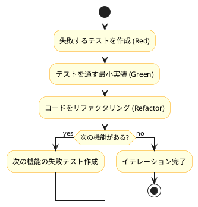
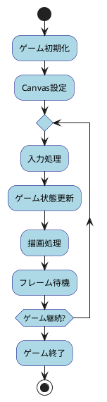
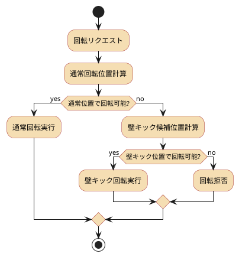
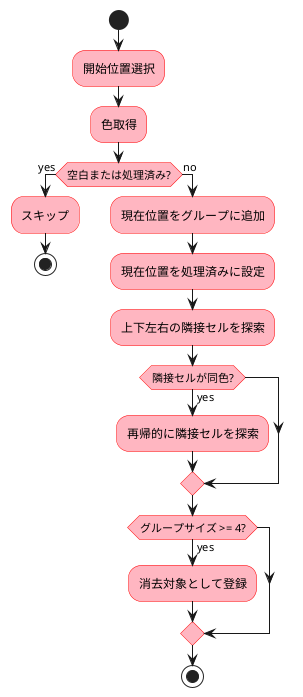
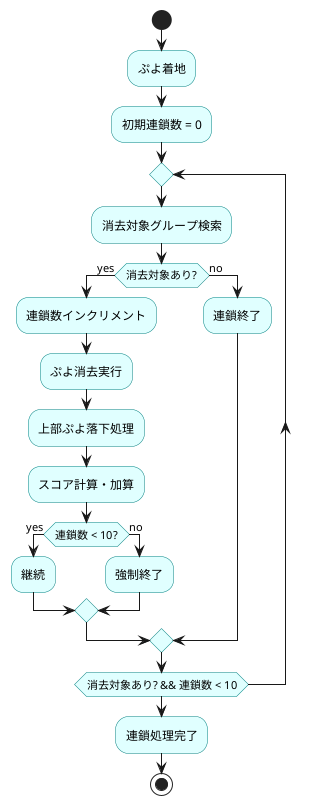
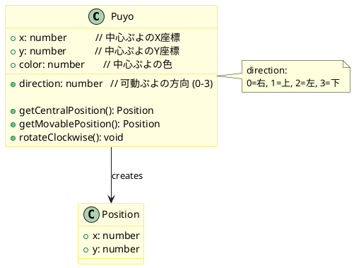
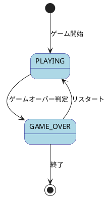
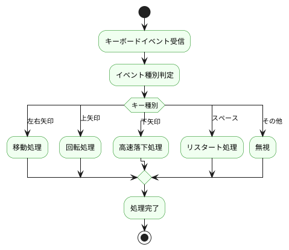
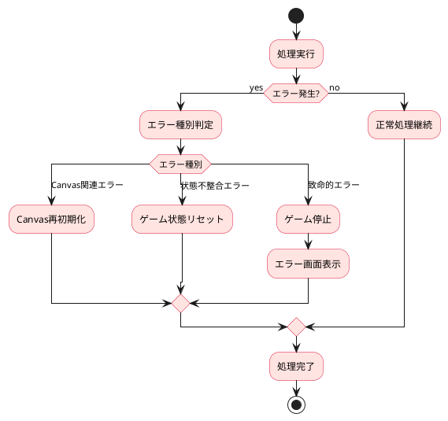
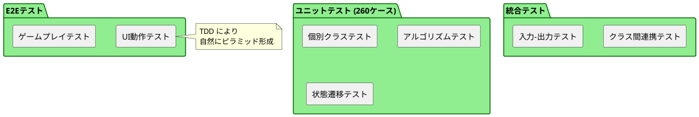

# ぷよぷよアプリケーション 設計書

## 概要

このドキュメントでは、TypeScriptで実装されたぷよぷよゲームアプリケーションの詳細設計について説明します。8つのイテレーションを通じて段階的に実装された各機能の設計思想とアルゴリズムを詳述します。

## 設計思想

### テスト駆動開発（TDD）

本プロジェクトは、全機能をTDDサイクル（Red-Green-Refactor）で実装しました：



### 段階的機能実装

8つのイテレーションによる段階的な機能構築：

1. **基盤構築** → **物理演算** → **ゲームロジック** → **演出システム**
2. 各イテレーションで完結した動作するシステムを維持
3. 後続イテレーションでの変更が既存機能に影響しない設計

## 詳細設計

### イテレーション1: ゲーム基盤設計

#### ゲームループ設計



#### Canvas描画システム設計

**設計方針:**
- 2Dコンテキストの効率的な利用
- 描画とゲームロジックの分離
- モック対応による高いテスタビリティ

### イテレーション2-4: 物理演算設計

#### ぷよの移動・回転・落下システム

**設計原則:**
- プレイヤビリティを向上させる自然な回転
- 壁際での回転を可能にする壁キック処理
- 回転不可能な状況の適切な判定

#### 壁キック処理アルゴリズム



### イテレーション5-6: ゲームロジック設計

#### ぷよ消去アルゴリズム（深度優先探索）

**設計思想:**
- 効率的な接続判定
- 再帰的探索による完全なグループ検出
- メモリ効率を考慮したアルゴリズム選択



#### 連鎖処理システム

**設計方針:**
- 連鎖の自動検出と実行
- スコア計算の統合
- 無限ループ防止（最大10連鎖）



### イテレーション7-8: 演出・UI設計

#### スコア計算システム

**計算式:**
```
スコア = 消去ぷよ数 × 10 × (連鎖ボーナス + 色数ボーナス + 個数ボーナス)
全消しボーナス = 3600点（固定）
```

#### 演出システム設計

- **全消し演出**: 金色テキストと影効果による視覚的インパクト
- **ゲームオーバー演出**: 赤色の警告メッセージ表示
- **演出状態管理**: 外部から演出状態を取得可能なAPI

## データ構造設計

### フィールド表現

**2次元配列による効率的な表現:**
```typescript
type Field = number[][]  // field[y][x] = color

// 座標系: 左上原点、右方向がX+、下方向がY+
// 色値: 0=空白, 1=赤, 2=青, 3=緑, 4=黄
```

### ぷよエンティティ設計



## 状態管理設計

### ゲーム状態管理



### プレイヤー状態管理

```typescript
interface PlayerState {
  currentPuyo: Puyo | null
  nextPuyo: Puyo | null
  fallingTimer: number      // 自然落下タイマー
  movementTimer: number     // 移動制限タイマー  
  rotationTimer: number     // 回転制限タイマー
  canMove: boolean
  canRotate: boolean
}
```

## 入力システム設計

### キーボード入力処理



### 入力制限機能

**タイマーベースの入力制限:**
- 移動: 5フレーム間隔
- 回転: 15フレーム間隔
- 高速落下: 制限なし

## エラーハンドリング設計

### 例外処理戦略



## パフォーマンス最適化設計

### 描画最適化

**差分描画システム:**
- 変更が発生した部分のみ再描画
- フレームレート60FPS維持
- Canvas操作の最小化

### メモリ最適化

**オブジェクト管理:**
- ぷよオブジェクトの再利用
- 大量配列生成の回避
- ガベージコレクション負荷軽減

## テスト設計戦略

### テストピラミッド



### モック設計

**Canvas APIモック:**
```typescript
interface MockCanvasContext {
  fillRect: vi.MockedFunction
  ellipse: vi.MockedFunction
  fillText: vi.MockedFunction
  // 描画メソッドの呼び出し履歴を検証
}
```

## 設計品質指標

### 品質メトリクス

1. **テストカバレッジ**: 100% (ビジネスロジック)
2. **テストケース数**: 260個
3. **循環複雑度**: 低く保持
4. **型安全性**: TypeScript strict mode
5. **コード品質**: ESLint/Prettier適用

### 保守性指標

- **モジュラリティ**: 関心事の分離達成
- **結合度**: 低結合設計
- **凝集度**: 高凝集設計
- **可読性**: 自己文書化コード

## まとめ

本設計は以下の特徴を持ちます：

1. **段階的構築**: 8イテレーションによる漸進的な機能追加
2. **高品質**: TDDによる包括的なテストカバレッジ
3. **保守性**: クリーンアーキテクチャによる関心事の分離
4. **拡張性**: 新機能追加に対応可能な柔軟な設計
5. **パフォーマンス**: 効率的なアルゴリズムと最適化

これらの設計原則により、高品質で保守しやすく、拡張可能なゲームアプリケーションを実現しています。