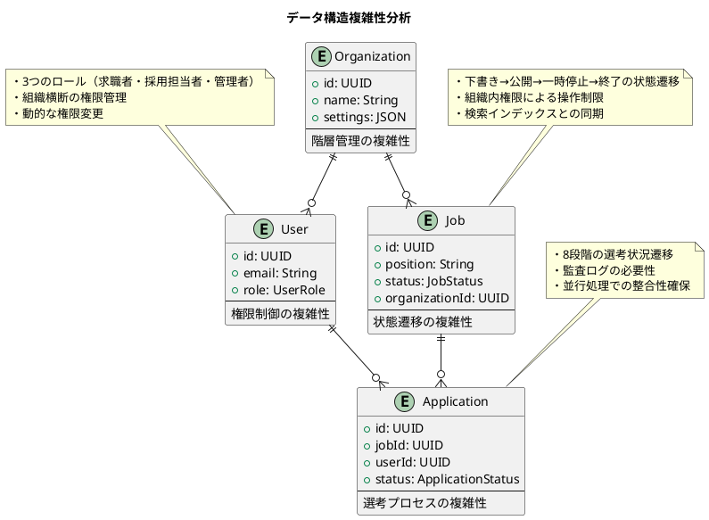
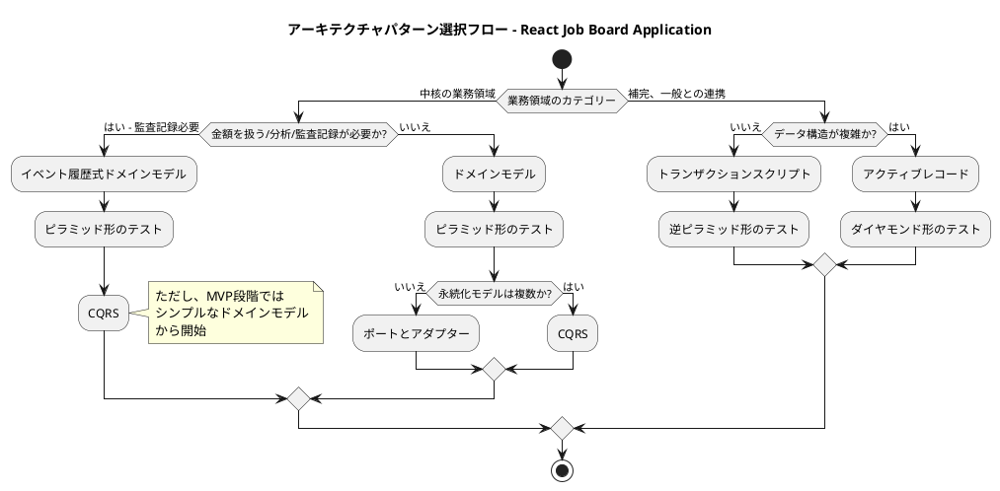
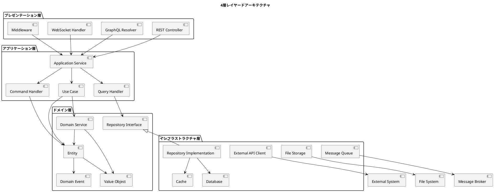
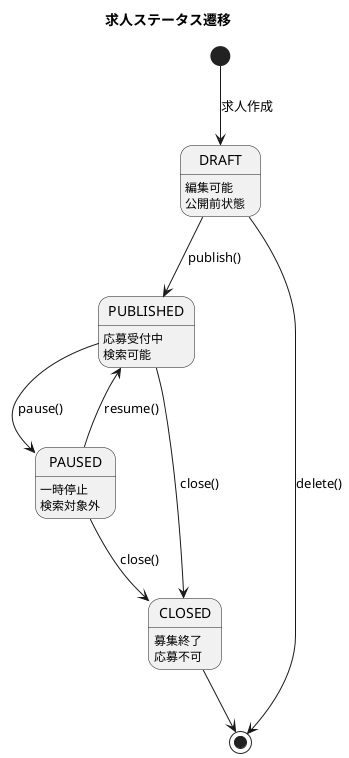
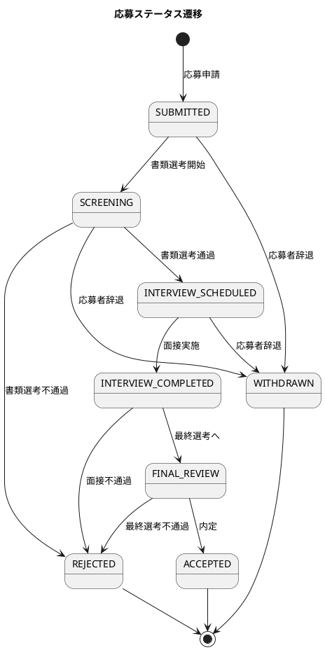
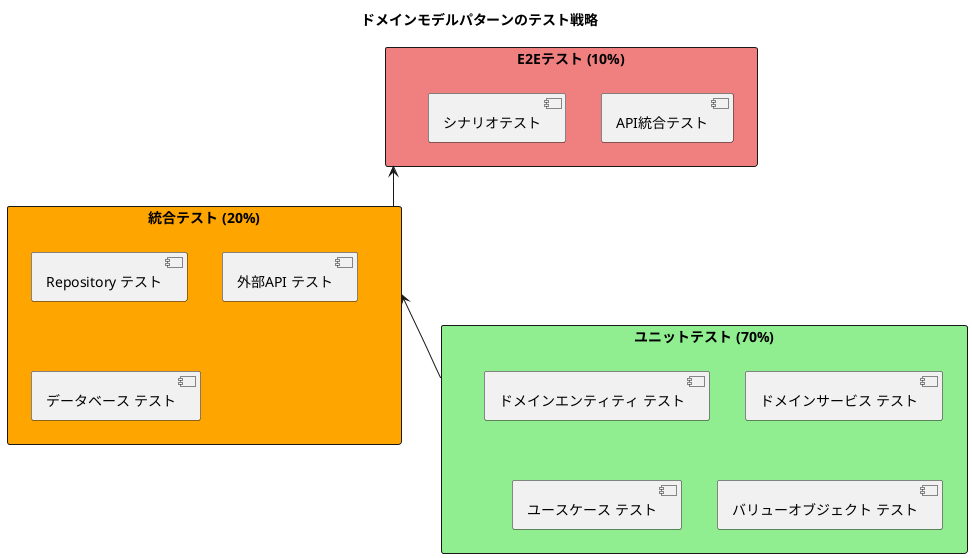
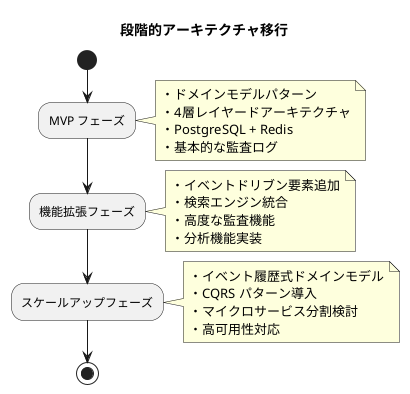

# バックエンドアーキテクチャ設計 - React Job Board Application

## アーキテクチャパターン選択

### 業務特性分析

#### 業務領域カテゴリー分析

| 機能領域 | カテゴリー | 理由 |
|----------|------------|------|
| **求人管理** | 中核の業務領域 | 組織の採用活動の中心機能、競争優位性を決定 |
| **応募管理** | 中核の業務領域 | 選考プロセスの透明性・効率性が組織価値に直結 |
| **組織管理** | 中核の業務領域 | 権限管理と組織運営の基盤機能 |
| **通知・レポート** | 補完・一般との連携 | 中核業務を支援する補助的機能 |

#### データ構造複雑性評価



**複雑性判定**: **複雑**
- エンティティ間の多様な関係性
- 複数の状態遷移管理
- 権限ベースアクセス制御
- 監査ログ要件

#### 特殊要件評価

| 要件 | 適用 | 詳細 |
|------|------|------|
| **金額を扱う** | ❌ | 給与情報は表示のみ、決済機能なし |
| **分析** | ⭕ | 求人・応募データの集計・分析 |
| **監査記録が必要** | ⭕ | 応募履歴・選考プロセスの完全な記録 |

### 選択されたアーキテクチャパターン

#### 主要パターン: **ドメインモデルパターン**



**MVP フェーズの判断**:
監査記録が必要だが、初期段階では**ドメインモデルパターン**から開始し、将来的に**イベント履歴式ドメインモデル**への移行を計画する。

#### アーキテクチャスタイル: **レイヤードアーキテクチャ（4層）**

永続化モデルが複数（RDBMS + Redis + File Storage）のため、4層構成を採用。

## アーキテクチャ設計詳細

### 1. レイヤー構成



### 2. レイヤー責務詳細

#### プレゼンテーション層
```java
// HTTP要求/応答の処理、認証・認可、入力検証
@RestController
@RequestMapping("/api/jobs")
public class JobController {
    private final CreateJobUseCase createJobUseCase;
    private final FindJobsQuery findJobsQuery;
    
    @PostMapping
    @PreAuthorize("hasRole('RECRUITER')")
    public ResponseEntity<JobResponse> createJob(
        @Valid @RequestBody CreateJobRequest request,
        Authentication auth
    ) {
        var command = CreateJobCommand.builder()
            .organizationId(extractOrganizationId(auth))
            .position(request.getPosition())
            .department(request.getDepartment())
            .location(request.getLocation())
            .info(request.getInfo())
            .build();
            
        var jobId = createJobUseCase.execute(command);
        var response = JobResponse.from(jobId);
        
        return ResponseEntity.status(HttpStatus.CREATED).body(response);
    }
    
    @GetMapping
    public ResponseEntity<JobListResponse> findJobs(
        @RequestParam(required = false) String position,
        @RequestParam(required = false) String location,
        @RequestParam(defaultValue = "0") int page,
        @RequestParam(defaultValue = "20") int size
    ) {
        var query = FindJobsQuery.builder()
            .position(position)
            .location(location)
            .page(page)
            .size(size)
            .build();
            
        var result = findJobsQuery.execute(query);
        return ResponseEntity.ok(JobListResponse.from(result));
    }
}
```

#### アプリケーション層
```java
// ユースケース制御、トランザクション境界の管理
@Service
@Transactional
public class CreateJobUseCase {
    private final JobRepository jobRepository;
    private final OrganizationRepository organizationRepository;
    private final JobDomainService jobDomainService;
    
    public JobId execute(CreateJobCommand command) {
        // 1. 組織の存在確認
        var organization = organizationRepository.findById(command.getOrganizationId())
            .orElseThrow(() -> new OrganizationNotFoundException(command.getOrganizationId()));
            
        // 2. ドメインサービスによる求人作成
        var job = jobDomainService.createJob(
            command.getOrganizationId(),
            command.getPosition(),
            command.getDepartment(),
            command.getLocation(),
            command.getInfo()
        );
        
        // 3. 永続化
        jobRepository.save(job);
        
        // 4. ドメインイベントの発行
        job.getUncommittedEvents().forEach(this::publishEvent);
        
        return job.getId();
    }
    
    private void publishEvent(DomainEvent event) {
        // イベント発行処理
    }
}
```

#### ドメイン層
```java
// ビジネスルール、不変条件、ドメインサービス
@Entity
public class Job {
    @Id
    private JobId id;
    private OrganizationId organizationId;
    private String position;
    private String department;
    private String location;
    private JobInfo info;
    private JobStatus status;
    private LocalDateTime createdAt;
    private LocalDateTime updatedAt;
    
    // ファクトリーメソッド
    public static Job create(
        JobId id,
        OrganizationId organizationId,
        String position,
        String department,
        String location,
        JobInfo info
    ) {
        validatePosition(position);
        validateDepartment(department);
        validateLocation(location);
        
        var job = new Job();
        job.id = id;
        job.organizationId = organizationId;
        job.position = position;
        job.department = department;
        job.location = location;
        job.info = info;
        job.status = JobStatus.DRAFT;
        job.createdAt = LocalDateTime.now();
        job.updatedAt = LocalDateTime.now();
        
        // ドメインイベント追加
        job.addEvent(new JobCreatedEvent(id, organizationId, position));
        
        return job;
    }
    
    // ビジネスルール
    public void publish() {
        if (status != JobStatus.DRAFT) {
            throw new IllegalJobStatusTransitionException(
                "下書き状態の求人のみ公開できます"
            );
        }
        
        if (!isValidForPublish()) {
            throw new InvalidJobForPublishException(
                "公開に必要な情報が不足しています"
            );
        }
        
        this.status = JobStatus.PUBLISHED;
        this.updatedAt = LocalDateTime.now();
        addEvent(new JobPublishedEvent(this.id));
    }
    
    public void pause() {
        if (status != JobStatus.PUBLISHED) {
            throw new IllegalJobStatusTransitionException(
                "公開中の求人のみ一時停止できます"
            );
        }
        
        this.status = JobStatus.PAUSED;
        this.updatedAt = LocalDateTime.now();
        addEvent(new JobPausedEvent(this.id));
    }
    
    private boolean isValidForPublish() {
        return StringUtils.hasText(position) &&
               StringUtils.hasText(department) &&
               StringUtils.hasText(location) &&
               info != null && info.isValid();
    }
    
    private static void validatePosition(String position) {
        if (!StringUtils.hasText(position)) {
            throw new IllegalArgumentException("職種名は必須です");
        }
        if (position.length() > 100) {
            throw new IllegalArgumentException("職種名は100文字以内で入力してください");
        }
    }
}

// ドメインサービス
@Service
public class JobDomainService {
    public Job createJob(
        OrganizationId organizationId,
        String position,
        String department,
        String location,
        JobInfo info
    ) {
        var jobId = JobId.generate();
        return Job.create(jobId, organizationId, position, department, location, info);
    }
    
    public boolean canUserEditJob(UserId userId, Job job) {
        // 編集権限のビジネスルール
        // - 組織内のユーザーのみ編集可能
        // - 採用担当者以上の権限が必要
        // - 求人が削除されていない
        return true; // 実装省略
    }
}
```

#### インフラストラクチャ層
```java
// 外部システム連携、永続化、技術的関心事
@Repository
public class JpaJobRepository implements JobRepository {
    private final SpringDataJobRepository jpaRepository;
    private final JobMapper mapper;
    
    @Override
    public Optional<Job> findById(JobId jobId) {
        return jpaRepository.findById(jobId.getValue())
            .map(mapper::toDomain);
    }
    
    @Override
    public List<Job> findByOrganizationId(OrganizationId organizationId) {
        return jpaRepository.findByOrganizationId(organizationId.getValue())
            .stream()
            .map(mapper::toDomain)
            .collect(Collectors.toList());
    }
    
    @Override
    public void save(Job job) {
        var entity = mapper.toEntity(job);
        jpaRepository.save(entity);
    }
    
    @Override
    public Page<Job> findBySearchCriteria(JobSearchCriteria criteria, Pageable pageable) {
        var specification = JobSpecifications.fromCriteria(criteria);
        var entityPage = jpaRepository.findAll(specification, pageable);
        
        return entityPage.map(mapper::toDomain);
    }
}

// 外部API連携
@Component
public class EmailNotificationService implements NotificationService {
    private final EmailServiceClient emailClient;
    
    @Override
    public void sendJobApplicationConfirmation(UserId userId, JobId jobId) {
        var template = EmailTemplate.JOB_APPLICATION_CONFIRMATION;
        var context = createEmailContext(userId, jobId);
        
        emailClient.sendEmail(template, context);
    }
}
```

### 3. ドメインモデル設計

#### 主要エンティティ

```plantuml
@startuml
title ドメインモデル

package "User Aggregate" {
  entity User {
    + id: UserId
    + email: EmailAddress
    + profile: UserProfile
    + role: UserRole
    + organizationId: OrganizationId?
    --
    + changeRole(UserRole): void
    + joinOrganization(OrganizationId): void
    + leaveOrganization(): void
  }
  
  value UserProfile {
    + firstName: String
    + lastName: String
    + phoneNumber: PhoneNumber
    + resumeFile: FileReference?
  }
  
  enum UserRole {
    JOB_SEEKER
    RECRUITER
    ORGANIZATION_ADMIN
  }
}

package "Organization Aggregate" {
  entity Organization {
    + id: OrganizationId
    + name: String
    + info: OrganizationInfo
    + settings: OrganizationSettings
    --
    + updateInfo(OrganizationInfo): void
    + inviteUser(EmailAddress, UserRole): void
    + removeUser(UserId): void
  }
  
  value OrganizationInfo {
    + industry: String
    + size: CompanySize
    + location: Address
    + description: String
    + logoFile: FileReference?
  }
}

package "Job Aggregate" {
  entity Job {
    + id: JobId
    + organizationId: OrganizationId
    + position: String
    + department: String
    + location: String
    + info: JobInfo
    + status: JobStatus
    + publishedAt: LocalDateTime?
    --
    + publish(): void
    + pause(): void
    + close(): void
    + canBeEditedBy(UserId): boolean
  }
  
  value JobInfo {
    + description: String
    + requirements: List<String>
    + benefits: List<String>
    + employmentType: EmploymentType
    + salaryRange: SalaryRange?
  }
  
  enum JobStatus {
    DRAFT
    PUBLISHED
    PAUSED
    CLOSED
  }
}

package "Application Aggregate" {
  entity Application {
    + id: ApplicationId
    + jobId: JobId
    + userId: UserId
    + applicationData: ApplicationData
    + status: ApplicationStatus
    + submittedAt: LocalDateTime
    + statusHistory: List<StatusChange>
    --
    + updateStatus(ApplicationStatus, String): void
    + addNote(String): void
    + canBeViewedBy(UserId): boolean
  }
  
  value ApplicationData {
    + coverLetter: String
    + resumeFile: FileReference
    + additionalInfo: String?
  }
  
  enum ApplicationStatus {
    SUBMITTED
    SCREENING
    INTERVIEW_SCHEDULED
    INTERVIEW_COMPLETED
    FINAL_REVIEW
    ACCEPTED
    REJECTED
    WITHDRAWN
  }
}

User ||--o{ Application
Job ||--o{ Application
Organization ||--o{ Job
Organization ||--o{ User

@enduml
```

#### 状態遷移管理





### 4. データアクセス戦略

#### 永続化モデルマッピング

| ドメインオブジェクト | 永続化方式 | 理由 |
|-------------------|------------|------|
| **User Aggregate** | RDBMS (PostgreSQL) | ACID特性、複雑なクエリ |
| **Organization Aggregate** | RDBMS (PostgreSQL) | 関係性管理、整合性保証 |
| **Job Aggregate** | RDBMS + Search Index | 永続化 + 高速検索 |
| **Application Aggregate** | RDBMS + File Storage | 構造化データ + ファイル |
| **Session Data** | Redis | 高速アクセス、TTL管理 |
| **Search Index** | Elasticsearch/Solr | 全文検索、ファジー検索 |

#### Repository実装パターン

```java
// 基底インターフェース
public interface Repository<T, ID> {
    Optional<T> findById(ID id);
    void save(T entity);
    void delete(T entity);
}

// ドメイン固有リポジトリ
public interface JobRepository extends Repository<Job, JobId> {
    List<Job> findByOrganizationId(OrganizationId organizationId);
    Page<Job> findBySearchCriteria(JobSearchCriteria criteria, Pageable pageable);
    List<Job> findPublishedJobsByLocation(String location);
    Optional<Job> findByIdAndOrganizationId(JobId jobId, OrganizationId organizationId);
}

// 検索特化リポジトリ
public interface JobSearchRepository {
    SearchResult<JobSummary> search(JobSearchQuery query);
    List<String> suggestPositions(String partial);
    Map<String, Long> aggregateByLocation();
}
```

### 5. 非機能要件対応

#### パフォーマンス対応

```java
// キャッシュ戦略
@Service
public class JobQueryService {
    private final JobRepository jobRepository;
    private final RedisTemplate<String, Object> redisTemplate;
    
    @Cacheable(value = "popular-jobs", key = "#location")
    public List<JobSummary> findPopularJobs(String location) {
        return jobRepository.findPopularJobsByLocation(location);
    }
    
    @CacheEvict(value = "popular-jobs", allEntries = true)
    public void clearJobCache() {
        // キャッシュクリア
    }
}

// データベース最適化
@Entity
@Table(name = "jobs", indexes = {
    @Index(name = "idx_organization_status", columnList = "organization_id, status"),
    @Index(name = "idx_location_position", columnList = "location, position"),
    @Index(name = "idx_published_at", columnList = "published_at")
})
public class JobEntity {
    // エンティティ定義
}
```

#### セキュリティ対応

```java
// 認証・認可
@Configuration
@EnableGlobalMethodSecurity(prePostEnabled = true)
public class SecurityConfig {
    
    @Bean
    public MethodSecurityExpressionHandler methodSecurityExpressionHandler() {
        return new JobBoardMethodSecurityExpressionHandler();
    }
}

// カスタム権限チェック
@Component
public class JobBoardMethodSecurityExpressionHandler extends DefaultMethodSecurityExpressionHandler {
    
    @PreAuthorize("@jobSecurityService.canEditJob(authentication.name, #jobId)")
    public void updateJob(JobId jobId, UpdateJobCommand command) {
        // 実装
    }
}

@Service
public class JobSecurityService {
    public boolean canEditJob(String username, JobId jobId) {
        // 編集権限チェックロジック
        return true;
    }
}
```

### 6. API設計

#### REST API エンドポイント

```yaml
# OpenAPI 3.0 仕様
paths:
  /api/jobs:
    get:
      summary: 求人検索
      parameters:
        - name: position
          in: query
          schema:
            type: string
        - name: location
          in: query
          schema:
            type: string
        - name: page
          in: query
          schema:
            type: integer
            default: 0
        - name: size
          in: query
          schema:
            type: integer
            default: 20
      responses:
        '200':
          description: 検索結果
          content:
            application/json:
              schema:
                $ref: '#/components/schemas/JobListResponse'
    
    post:
      summary: 求人作成
      security:
        - bearerAuth: []
      requestBody:
        required: true
        content:
          application/json:
            schema:
              $ref: '#/components/schemas/CreateJobRequest'
      responses:
        '201':
          description: 作成成功
          content:
            application/json:
              schema:
                $ref: '#/components/schemas/JobResponse'
        '403':
          description: 権限なし

  /api/jobs/{jobId}:
    get:
      summary: 求人詳細取得
      parameters:
        - name: jobId
          in: path
          required: true
          schema:
            type: string
            format: uuid
      responses:
        '200':
          description: 求人詳細
          content:
            application/json:
              schema:
                $ref: '#/components/schemas/JobDetailResponse'
        '404':
          description: 求人が見つからない

    put:
      summary: 求人更新
      security:
        - bearerAuth: []
      parameters:
        - name: jobId
          in: path
          required: true
          schema:
            type: string
            format: uuid
      requestBody:
        required: true
        content:
          application/json:
            schema:
              $ref: '#/components/schemas/UpdateJobRequest'
      responses:
        '200':
          description: 更新成功
        '403':
          description: 権限なし
        '404':
          description: 求人が見つからない

  /api/jobs/{jobId}/applications:
    get:
      summary: 応募一覧取得
      security:
        - bearerAuth: []
      parameters:
        - name: jobId
          in: path
          required: true
          schema:
            type: string
            format: uuid
      responses:
        '200':
          description: 応募一覧
          content:
            application/json:
              schema:
                $ref: '#/components/schemas/ApplicationListResponse'

    post:
      summary: 求人応募
      security:
        - bearerAuth: []
      parameters:
        - name: jobId
          in: path
          required: true
          schema:
            type: string
            format: uuid
      requestBody:
        required: true
        content:
          multipart/form-data:
            schema:
              $ref: '#/components/schemas/CreateApplicationRequest'
      responses:
        '201':
          description: 応募成功
        '409':
          description: 重複応募
```

### 7. テスト戦略

#### ピラミッド形テスト構成



#### テスト実装例

```java
// ドメインエンティティテスト
class JobTest {
    
    @Test
    void 求人を公開状態に変更できる() {
        // Given
        var job = Job.create(
            JobId.generate(),
            OrganizationId.of("org-1"),
            "Software Engineer",
            "Engineering",
            "Tokyo",
            JobInfo.builder()
                .description("Java developer position")
                .requirements(List.of("Java", "Spring Boot"))
                .build()
        );
        
        // When
        job.publish();
        
        // Then
        assertThat(job.getStatus()).isEqualTo(JobStatus.PUBLISHED);
        assertThat(job.getPublishedAt()).isNotNull();
    }
    
    @Test
    void 下書き状態以外の求人は公開できない() {
        // Given
        var job = createPublishedJob();
        
        // When & Then
        assertThatThrownBy(job::publish)
            .isInstanceOf(IllegalJobStatusTransitionException.class)
            .hasMessage("下書き状態の求人のみ公開できます");
    }
}

// ユースケーステスト
class CreateJobUseCaseTest {
    
    @Mock
    private JobRepository jobRepository;
    
    @Mock
    private OrganizationRepository organizationRepository;
    
    @InjectMocks
    private CreateJobUseCase useCase;
    
    @Test
    void 有効な組織IDで求人を作成できる() {
        // Given
        var organizationId = OrganizationId.of("org-1");
        var organization = Organization.create(organizationId, "Test Company");
        
        when(organizationRepository.findById(organizationId))
            .thenReturn(Optional.of(organization));
        
        var command = CreateJobCommand.builder()
            .organizationId(organizationId)
            .position("Software Engineer")
            .department("Engineering")
            .location("Tokyo")
            .info(createValidJobInfo())
            .build();
        
        // When
        var jobId = useCase.execute(command);
        
        // Then
        assertThat(jobId).isNotNull();
        verify(jobRepository).save(any(Job.class));
    }
}

// 統合テスト
@DataJpaTest
class JpaJobRepositoryTest {
    
    @Autowired
    private TestEntityManager entityManager;
    
    @Autowired
    private SpringDataJobRepository springDataRepository;
    
    private JpaJobRepository repository;
    
    @BeforeEach
    void setUp() {
        var mapper = new JobMapper();
        repository = new JpaJobRepository(springDataRepository, mapper);
    }
    
    @Test
    void 組織IDで求人を検索できる() {
        // Given
        var organizationId = OrganizationId.of("org-1");
        var job1 = createJobEntity(organizationId, "Engineer");
        var job2 = createJobEntity(organizationId, "Designer");
        var job3 = createJobEntity(OrganizationId.of("org-2"), "Manager");
        
        entityManager.persistAndFlush(job1);
        entityManager.persistAndFlush(job2);
        entityManager.persistAndFlush(job3);
        
        // When
        var jobs = repository.findByOrganizationId(organizationId);
        
        // Then
        assertThat(jobs)
            .hasSize(2)
            .extracting(Job::getPosition)
            .containsExactlyInAnyOrder("Engineer", "Designer");
    }
}
```

### 8. 運用監視

#### ログ戦略

```java
// 構造化ログ
@Slf4j
@Component
public class JobEventLogger {
    
    public void logJobCreated(JobId jobId, OrganizationId organizationId) {
        log.info("Job created: jobId={}, organizationId={}", 
            jobId.getValue(), organizationId.getValue());
    }
    
    public void logJobPublished(JobId jobId) {
        log.info("Job published: jobId={}", jobId.getValue());
    }
    
    public void logApplicationSubmitted(ApplicationId applicationId, JobId jobId, UserId userId) {
        log.info("Application submitted: applicationId={}, jobId={}, userId={}", 
            applicationId.getValue(), jobId.getValue(), userId.getValue());
    }
}

// 監査ログ
@Entity
@Table(name = "audit_logs")
public class AuditLog {
    @Id
    private String id;
    private String entityType;
    private String entityId;
    private String action;
    private String userId;
    private LocalDateTime timestamp;
    private String oldValue;
    private String newValue;
}
```

#### メトリクス監視

```java
// カスタムメトリクス
@Component
public class JobMetrics {
    private final MeterRegistry meterRegistry;
    private final Counter jobCreatedCounter;
    private final Counter applicationSubmittedCounter;
    private final Timer jobSearchTimer;
    
    public JobMetrics(MeterRegistry meterRegistry) {
        this.meterRegistry = meterRegistry;
        this.jobCreatedCounter = Counter.builder("jobs.created")
            .description("Number of jobs created")
            .register(meterRegistry);
        this.applicationSubmittedCounter = Counter.builder("applications.submitted")
            .description("Number of applications submitted")
            .register(meterRegistry);
        this.jobSearchTimer = Timer.builder("jobs.search.duration")
            .description("Time taken to search jobs")
            .register(meterRegistry);
    }
    
    public void incrementJobCreated() {
        jobCreatedCounter.increment();
    }
    
    public void incrementApplicationSubmitted() {
        applicationSubmittedCounter.increment();
    }
    
    public Timer.Sample startJobSearchTimer() {
        return Timer.start(meterRegistry);
    }
}
```

## 移行戦略

### MVP → フルシステム移行計画



### 技術的負債管理

1. **設計負債**
   - 定期的なアーキテクチャレビュー
   - リファクタリング計画の策定
   - 技術的意思決定の記録（ADR）

2. **パフォーマンス負債**
   - 継続的なパフォーマンス監視
   - ボトルネック特定と改善
   - キャッシュ戦略の最適化

3. **セキュリティ負債**
   - 定期的なセキュリティ監査
   - 脆弱性スキャンの自動化
   - セキュリティパッチの適用

## まとめ

React Job Board Application のバックエンドアーキテクチャは、以下の特徴を持つ設計としました：

### 採用アーキテクチャパターン
- **ドメインモデルパターン**: 中核業務領域の複雑なビジネスルールを適切に表現
- **4層レイヤードアーキテクチャ**: 複数の永続化モデルを統合管理
- **ピラミッド形テスト**: ドメインロジックの品質を重視

### 主要設計判断
1. **業務特性重視**: 求人・応募管理を中核領域として設計
2. **段階的成長**: MVP から本格システムへの移行を考慮
3. **品質確保**: 監査ログ・メトリクス・包括的テスト
4. **拡張性**: 将来のイベント履歴式への移行を視野

### 次のステップ
1. フロントエンドアーキテクチャ設計
2. API 仕様の詳細化
3. データベース設計
4. 技術スタック選定

このアーキテクチャにより、React Job Board Application は高品質で保守性の高いバックエンドシステムとして構築されます。