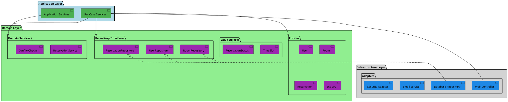

# バックエンドアーキテクチャ設計書 - 会議室予約システム

## 1. アーキテクチャ決定概要

### 1.1 業務領域分析結果

**業務領域カテゴリー**: 中核の業務領域
- **判定根拠**: 会議室予約は組織の日常業務において重要な位置を占める中核機能
- **競争優位性**: 効率的な予約システムは組織の生産性向上に直結

**データ構造複雑性**: 複雑
- **判定根拠**: 
  - エンティティ間の多重関係（ユーザー・会議室・予約・設備・利用履歴）
  - 複雑なビジネスルール（時間制約、重複チェック、キャンセル制約）
  - 状態管理の複雑性（予約状態遷移、会議室状態管理）

**特殊要件**: 
- ❌ 金額を扱わない（基本的な予約システムのため）
- ✅ 監査記録が必要（利用履歴、変更履歴の保持）

### 1.2 選択されたアーキテクチャパターン

**ドメインパターン**: ドメインモデルパターン
- **選択理由**: 中核業務領域で複雑なビジネスルールを持つが、金額計算等の特殊要件なし
- **特徴**: リッチなドメインモデルでビジネスロジックを集約

**アーキテクチャスタイル**: ポートとアダプターアーキテクチャ（ヘキサゴナル）
- **選択理由**: ドメインモデルありで永続化モデル単一の場合に最適
- **特徴**: 高いテスト容易性とドメインロジックの独立性を実現

**テスト戦略**: ピラミッド形テスト + BDD
- **構成**: ユニットテスト80%、統合テスト15%、E2Eテスト5%
- **BDD受け入れテスト**: Cucumber によるビジネス要件検証
- **重点**: ドメインロジックの徹底検証

## 2. アーキテクチャ詳細設計

### 2.1 レイヤー構成



### 2.2 ドメインモデル設計

#### 2.2.1 コアエンティティ

**User（会員）**
```java
public class User {
    private UserId id;
    private UserName name;
    private Email email;
    private UserStatus status;
    private List<Reservation> reservations;
    
    // ビジネスロジック
    public boolean canMakeReservation() {
        return status.isActive() && 
               getActiveReservationCount() < MAX_CONCURRENT_RESERVATIONS;
    }
    
    public Reservation makeReservation(Room room, TimeSlot timeSlot, Purpose purpose) {
        if (!canMakeReservation()) {
            throw new ReservationNotAllowedException();
        }
        return Reservation.create(this.id, room.getId(), timeSlot, purpose);
    }
}
```

**Room（会議室）**
```java
public class Room {
    private RoomId id;
    private RoomName name;
    private Capacity capacity;
    private List<Equipment> equipment;
    private RoomStatus status;
    
    // ビジネスロジック
    public boolean isAvailableAt(TimeSlot timeSlot) {
        return status.isBookable() && 
               !hasConflictingReservation(timeSlot) &&
               !isUnderMaintenance(timeSlot);
    }
    
    public Money calculateFee(TimeSlot timeSlot) {
        return feeCalculator.calculate(this.category, timeSlot);
    }
}
```

**Reservation（予約）**
```java
public class Reservation {
    private ReservationId id;
    private UserId userId;
    private RoomId roomId;
    private TimeSlot timeSlot;
    private Purpose purpose;
    private ReservationStatus status;
    private LocalDateTime createdAt;
    
    // ファクトリーメソッド
    public static Reservation create(UserId userId, RoomId roomId, 
                                   TimeSlot timeSlot, Purpose purpose) {
        validateTimeSlot(timeSlot);
        return new Reservation(
            ReservationId.generate(),
            userId, roomId, timeSlot, purpose,
            ReservationStatus.CONFIRMED,
            LocalDateTime.now()
        );
    }
    
    // ビジネスロジック
    public void cancel(CancellationPolicy policy) {
        if (!policy.canCancel(this.timeSlot)) {
            throw new CancellationNotAllowedException();
        }
        this.status = ReservationStatus.CANCELLED;
    }
    
    public boolean isModifiable() {
        return status.isConfirmed() && 
               timeSlot.isModifiableUntil(LocalDateTime.now());
    }
}
```

#### 2.2.2 値オブジェクト

**TimeSlot（時間枠）**
```java
public class TimeSlot {
    private final LocalDateTime startTime;
    private final LocalDateTime endTime;
    
    public TimeSlot(LocalDateTime startTime, LocalDateTime endTime) {
        validateTimeRange(startTime, endTime);
        this.startTime = startTime;
        this.endTime = endTime;
    }
    
    public boolean overlaps(TimeSlot other) {
        return this.startTime.isBefore(other.endTime) && 
               this.endTime.isAfter(other.startTime);
    }
    
    public boolean isWithinBusinessHours() {
        // 営業時間チェック（8:00-22:00）
        return startTime.getHour() >= 8 && endTime.getHour() <= 22;
    }
    
    public boolean isBookableFrom(LocalDateTime now) {
        // 2時間前ルール
        return startTime.isAfter(now.plusHours(2));
    }
}
```

#### 2.2.3 ドメインサービス

**ConflictChecker（重複チェックサービス）**
```java
@DomainService
public class ConflictChecker {
    private final ReservationRepository reservationRepository;
    
    public boolean hasConflict(RoomId roomId, TimeSlot timeSlot) {
        List<Reservation> existingReservations = 
            reservationRepository.findActiveByRoomAndTimeSlot(roomId, timeSlot);
        
        return existingReservations.stream()
            .anyMatch(r -> r.getTimeSlot().overlaps(timeSlot));
    }
    
    public List<TimeSlot> findAvailableSlots(RoomId roomId, LocalDate date) {
        // 利用可能時間枠の算出ロジック
        return calculateAvailableSlots(roomId, date);
    }
}
```

### 2.3 ポートとアダプターの実装

#### 2.3.1 入力ポート（ユースケース）

```java
// 入力ポート定義
public interface CreateReservationUseCase {
    ReservationId execute(CreateReservationCommand command);
}

public interface SearchRoomsUseCase {
    List<RoomSearchResult> execute(RoomSearchQuery query);
}

public interface CancelReservationUseCase {
    void execute(CancelReservationCommand command);
}

// ユースケース実装
@UseCase
public class CreateReservationService implements CreateReservationUseCase {
    private final UserRepository userRepository;
    private final RoomRepository roomRepository;
    private final ReservationRepository reservationRepository;
    private final ConflictChecker conflictChecker;
    
    @Override
    @Transactional
    public ReservationId execute(CreateReservationCommand command) {
        // 1. エンティティ取得
        User user = userRepository.findById(command.getUserId())
            .orElseThrow(() -> new UserNotFoundException());
        Room room = roomRepository.findById(command.getRoomId())
            .orElseThrow(() -> new RoomNotFoundException());
            
        // 2. ビジネスルール検証
        TimeSlot timeSlot = new TimeSlot(command.getStartTime(), command.getEndTime());
        if (!room.isAvailableAt(timeSlot)) {
            throw new RoomNotAvailableException();
        }
        if (conflictChecker.hasConflict(room.getId(), timeSlot)) {
            throw new ReservationConflictException();
        }
        
        // 3. 予約作成
        Reservation reservation = user.makeReservation(room, timeSlot, command.getPurpose());
        reservationRepository.save(reservation);
        
        return reservation.getId();
    }
}
```

#### 2.3.2 出力ポート（リポジトリインターフェース）

```java
// ドメイン層で定義されるリポジトリインターフェース
public interface ReservationRepository {
    void save(Reservation reservation);
    Optional<Reservation> findById(ReservationId id);
    List<Reservation> findByUserId(UserId userId);
    List<Reservation> findActiveByRoomAndTimeSlot(RoomId roomId, TimeSlot timeSlot);
    void delete(ReservationId id);
}

public interface RoomRepository {
    Optional<Room> findById(RoomId id);
    List<Room> findAvailable(RoomSearchCriteria criteria);
    List<Room> findAll();
    void save(Room room);
}

public interface UserRepository {
    Optional<User> findById(UserId id);
    Optional<User> findByEmail(Email email);
    void save(User user);
    void delete(UserId id);
}
```

#### 2.3.3 アダプター（インフラストラクチャ）

**Webアダプター**
```java
@RestController
@RequestMapping("/api/reservations")
public class ReservationController {
    private final CreateReservationUseCase createReservationUseCase;
    private final SearchReservationsUseCase searchReservationsUseCase;
    private final CancelReservationUseCase cancelReservationUseCase;
    
    @PostMapping
    public ResponseEntity<ReservationResponse> createReservation(
            @RequestBody @Valid CreateReservationRequest request,
            Authentication authentication) {
        
        var command = CreateReservationCommand.builder()
            .userId(UserId.from(authentication.getName()))
            .roomId(RoomId.from(request.getRoomId()))
            .startTime(request.getStartTime())
            .endTime(request.getEndTime())
            .purpose(Purpose.from(request.getPurpose()))
            .build();
            
        ReservationId reservationId = createReservationUseCase.execute(command);
        
        return ResponseEntity.ok(ReservationResponse.from(reservationId));
    }
}
```

**データベースアダプター**
```java
@Repository
public class JpaReservationRepository implements ReservationRepository {
    private final SpringDataReservationRepository jpaRepository;
    private final ReservationMapper mapper;
    
    @Override
    public void save(Reservation reservation) {
        ReservationEntity entity = mapper.toEntity(reservation);
        jpaRepository.save(entity);
    }
    
    @Override
    public Optional<Reservation> findById(ReservationId id) {
        return jpaRepository.findById(id.getValue())
            .map(mapper::toDomain);
    }
    
    @Override
    public List<Reservation> findActiveByRoomAndTimeSlot(RoomId roomId, TimeSlot timeSlot) {
        return jpaRepository.findActiveByRoomIdAndTimeRange(
                roomId.getValue(), 
                timeSlot.getStartTime(), 
                timeSlot.getEndTime())
            .stream()
            .map(mapper::toDomain)
            .collect(Collectors.toList());
    }
}
```

### 2.4 技術構成

#### 2.4.1 フレームワーク・ライブラリ

**基盤技術**
- **Java**: 21 LTS
- **Spring Boot**: 3.3.2
- **Spring Security**: JWT Bearer認証
- **Spring Data JPA**: データアクセス層

**データベース**
- **本番環境**: PostgreSQL 15
- **開発・テスト環境**: H2 Database (In-Memory)

**ビルド・テストツール**
- **Gradle**: 8.14 - 依存関係管理・ビルドツール（高速ビルド、増分ビルド）
- **JUnit 5**: ユニットテスト
- **Testcontainers**: 統合テスト
- **ArchUnit**: アーキテクチャテスト
- **Cucumber**: 7.18.0 - BDD受け入れテスト

#### 2.4.2 プロジェクト構成

```
src/main/java/
├── application/              # アプリケーション層
│   ├── usecase/             # ユースケース実装
│   ├── service/             # アプリケーションサービス
│   └── command/             # コマンド・クエリオブジェクト
├── domain/                  # ドメイン層
│   ├── model/               # エンティティ・値オブジェクト
│   ├── service/             # ドメインサービス
│   └── repository/          # リポジトリインターフェース
├── infrastructure/          # インフラストラクチャ層
│   ├── web/                 # Webアダプター（Controller）
│   ├── persistence/         # データベースアダプター
│   ├── external/            # 外部システム連携
│   └── config/              # 設定・Bean定義
└── shared/                  # 共通コンポーネント
    ├── exception/           # 例外定義
    ├── validation/          # バリデーション
    └── util/                # ユーティリティ
```

### 2.5 品質属性の実現

#### 2.5.1 保守性の確保

**依存関係の管理**
- ドメイン層は他の層に依存しない
- インフラストラクチャ層はドメインのインターフェースを実装
- 依存性注入によるテスト容易性の確保

**コード品質の維持**
- SonarQube による静的解析
- Checkstyle 10.12.3 による コーディング規約チェック
- PMD 7.0.0 による複雑度・コード品質分析（Java 21対応）
- SpotBugs 6.0.7 によるバグ検出
- JaCoCo 0.8.12 によるテストカバレッジ測定
- OWASP Dependency Check 8.4.0 による脆弱性チェック

#### 2.5.2 テスト戦略

**ユニットテスト**（80%）
```java
@ExtendWith(MockitoExtension.class)
class ReservationTest {
    @Test
    void shouldCreateReservationWhenValidInput() {
        // ドメインロジックの検証
        User user = UserFixture.activeUser();
        Room room = RoomFixture.availableRoom();
        TimeSlot timeSlot = TimeSlotFixture.validTimeSlot();
        
        Reservation reservation = user.makeReservation(room, timeSlot, Purpose.MEETING);
        
        assertThat(reservation.getStatus()).isEqualTo(ReservationStatus.CONFIRMED);
    }
}
```

**統合テスト**（15%）
```java
@SpringBootTest
@Testcontainers
class ReservationIntegrationTest {
    @Container
    static PostgreSQLContainer<?> postgres = new PostgreSQLContainer<>("postgres:15");
    
    @Test
    @Transactional
    void shouldCreateReservationWithDatabasePersistence() {
        // データベース連携を含むテスト
    }
}
```

**アーキテクチャテスト**
```java
@AnalyzeClasses(packagesOf = Application.class)
class ArchitectureTest {
    @Test
    void domainLayerShouldNotDependOnInfrastructure() {
        classes().that().resideInAPackage("..domain..")
            .should().onlyDependOnClassesIn(
                "..domain..", "java..", "org.springframework.stereotype.."
            );
    }
}
```

**BDD受け入れテスト**（Cucumber）
```gherkin
# language: ja
フィーチャ: 会議室予約機能
  会員として会議室の予約・確認・キャンセルを行いたい

  シナリオ: 正常な会議室予約
    前提 会員"田中太郎"としてログインしている
    もし "小会議室A"を"2025-01-15 14:00"から"2025-01-15 16:00"まで予約する
    ならば 予約が正常に完了する
    かつ 予約ステータスが"確定"である
```

```java
@CucumberContextConfiguration
@SpringBootTest
@ActiveProfiles("test")
public class CucumberSpringConfiguration { }

public class ReservationSteps {
    @前提("会員{string}としてログインしている")
    public void 会員としてログイン(String userName) {
        // 認証処理の実装
    }
    
    @もし("{string}を{string}から{string}まで予約する")
    public void 会議室を予約する(String roomName, String startTime, String endTime) {
        // 予約作成ロジックの実装
    }
}
```

### 2.6 セキュリティ設計

#### 2.6.1 認証・認可

**JWT認証**
```java
@Configuration
@EnableWebSecurity
public class SecurityConfig {
    @Bean
    public SecurityFilterChain filterChain(HttpSecurity http) throws Exception {
        return http
            .csrf().disable()
            .sessionManagement().sessionCreationPolicy(SessionCreationPolicy.STATELESS)
            .authorizeHttpRequests(auth -> auth
                .requestMatchers("/api/auth/**").permitAll()
                .requestMatchers("/api/rooms").hasAnyRole("USER", "STAFF")
                .requestMatchers("/api/admin/**").hasRole("ADMIN")
                .anyRequest().authenticated()
            )
            .oauth2ResourceServer().jwt()
            .and()
            .build();
    }
}
```

#### 2.6.2 データ保護

**入力検証**
```java
public class CreateReservationRequest {
    @NotNull
    @Pattern(regexp = "^room_[0-9]+$")
    private String roomId;
    
    @NotNull
    @Future
    private LocalDateTime startTime;
    
    @NotNull
    @ValidTimeSlot
    private LocalDateTime endTime;
    
    @Size(max = 500)
    private String purpose;
}
```

## 3. 実装ロードマップ

### 3.0 現在の実装状況（2025-09-12）

**✅ 完了済み**:
- ヘキサゴナルアーキテクチャの基盤設定
- パッケージ構造の完全実装（application, domain, infrastructure, shared）
- Spring Boot 3.3.2 + Java 21 環境構築
- 品質管理ツール統合（Gradle, JaCoCo, Checkstyle, PMD, SpotBugs）
- データベース設定（H2/PostgreSQL, Flyway）
- 基本テスト環境（JUnit 5, ArchUnit, Testcontainers）

**⏳ 実装待ち**:
- ドメインエンティティ・値オブジェクト
- ユースケース・ドメインサービス
- リポジトリ実装
- Web API エンドポイント
- セキュリティ設定

### 3.1 フェーズ1: コア機能（MVP）
- ドメインモデル基盤構築
- 基本的な予約機能（作成・確認・キャンセル）
- 簡易認証機能

### 3.2 フェーズ2: 管理機能
- スタッフ向け管理機能
- 会員管理機能
- お問い合わせ管理

### 3.3 フェーズ3: 高度な機能
- 繰り返し予約
- 通知機能
- レポート機能

## 4. 運用・監視

### 4.1 ログ戦略
- 構造化ログ（JSON形式）
- 分散トレーシング（Jaeger）
- メトリクス収集（Micrometer + Prometheus）

### 4.2 エラーハンドリング
- ドメイン例外の適切なHTTPステータスへのマッピング
- グローバル例外ハンドラーによる統一的なエラーレスポンス
- ログ相関IDによる問題追跡

この設計により、変更しやすく、テストしやすく、拡張しやすいバックエンドシステムを構築できます。