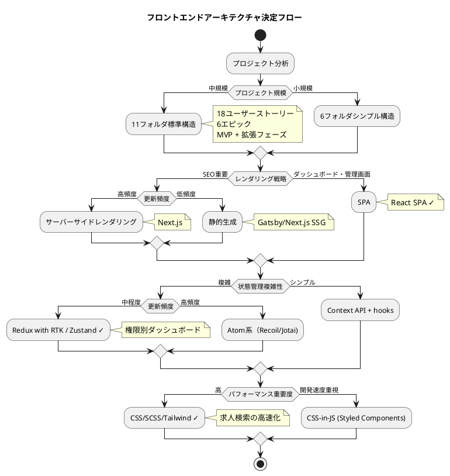
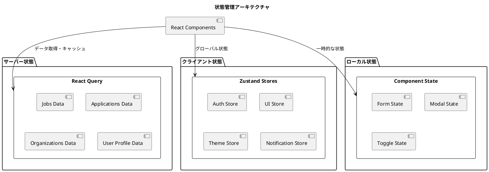
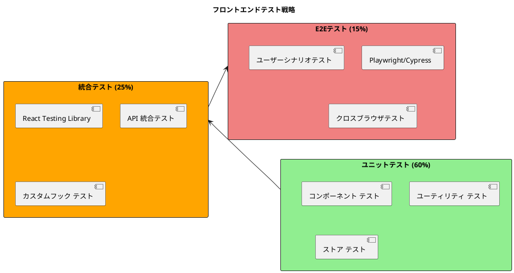

# フロントエンドアーキテクチャ設計 - React Job Board Application

## アーキテクチャ選択方針

### プロジェクト特性分析

#### 要件分析による技術選択



#### 選択結果

| 決定項目 | 選択技術 | 理由 |
|----------|----------|------|
| **プロジェクト構造** | 11フォルダ標準構造 | 中規模プロジェクト、将来拡張を見据えた構造 |
| **レンダリング戦略** | SPA (React) | 管理画面・ダッシュボード中心、インタラクティブ性重視 |
| **状態管理** | Zustand + React Query | 適度な複雑さ、サーバー状態とクライアント状態の分離 |
| **スタイリング** | Chakra UI + CSS Modules | パフォーマンス重視、一貫したデザインシステム |
| **型安全性** | TypeScript | 大規模開発での品質確保 |

## アーキテクチャ設計詳細

### 1. プロジェクト構造

#### フルフォルダ構成（11フォルダ標準）

```
src/
├── components/          # (1) 共通UIコンポーネント
│   ├── ui/             # 基本UIパーツ（Button, Input, Modal等）
│   │   ├── Button/
│   │   │   ├── Button.tsx
│   │   │   ├── Button.module.css
│   │   │   ├── Button.test.tsx
│   │   │   └── index.ts
│   │   ├── Input/
│   │   ├── Modal/
│   │   ├── LoadingSpinner/
│   │   └── index.ts    # 一括export
│   └── layout/         # レイアウトコンポーネント
│       ├── AppLayout/
│       ├── DashboardLayout/
│       ├── AuthLayout/
│       └── index.ts
├── config/             # (2) アプリケーション設定
│   ├── constants.ts    # 定数定義
│   ├── env.ts         # 環境変数管理
│   ├── api.ts         # API設定
│   └── routes.ts      # ルーティング設定
├── features/           # (3) フィーチャー単位のコンポーネント
│   ├── auth/          # 認証機能
│   │   ├── api/
│   │   │   ├── login.ts
│   │   │   ├── register.ts
│   │   │   └── logout.ts
│   │   ├── components/
│   │   │   ├── LoginForm/
│   │   │   ├── RegisterForm/
│   │   │   └── AuthGuard/
│   │   ├── hooks/
│   │   │   ├── useAuth.ts
│   │   │   └── useAuthRedirect.ts
│   │   ├── stores/
│   │   │   └── authStore.ts
│   │   ├── types/
│   │   │   └── auth.ts
│   │   └── index.ts
│   ├── jobs/          # 求人機能
│   │   ├── api/
│   │   │   ├── get-jobs.ts
│   │   │   ├── get-job.ts
│   │   │   ├── create-job.ts
│   │   │   ├── update-job.ts
│   │   │   └── delete-job.ts
│   │   ├── components/
│   │   │   ├── JobSearchForm/
│   │   │   ├── JobsList/
│   │   │   ├── JobDetail/
│   │   │   ├── CreateJobForm/
│   │   │   └── EditJobForm/
│   │   ├── hooks/
│   │   │   ├── useJobs.ts
│   │   │   ├── useCreateJob.ts
│   │   │   └── useJobSearch.ts
│   │   ├── stores/
│   │   │   └── jobStore.ts
│   │   ├── types/
│   │   │   └── job.ts
│   │   └── index.ts
│   ├── applications/  # 応募機能
│   │   ├── api/
│   │   ├── components/
│   │   ├── hooks/
│   │   ├── types/
│   │   └── index.ts
│   ├── dashboard/     # ダッシュボード
│   │   ├── components/
│   │   │   ├── JobSeekerDashboard/
│   │   │   ├── RecruiterDashboard/
│   │   │   └── AdminDashboard/
│   │   ├── hooks/
│   │   └── index.ts
│   └── organizations/ # 組織管理
│       ├── api/
│       ├── components/
│       ├── hooks/
│       ├── types/
│       └── index.ts
├── layouts/            # (4) アプリケーションレイアウト
│   ├── AppLayout.tsx
│   ├── AuthLayout.tsx
│   ├── DashboardLayout.tsx
│   └── index.ts
├── lib/               # (5) 外部ライブラリ設定・ユーティリティ
│   ├── auth.ts        # 認証ライブラリ設定
│   ├── api-client.ts  # API クライアント
│   ├── query-client.ts # React Query設定
│   ├── router.ts      # ルーター設定
│   └── utils.ts       # ヘルパー関数
├── pages/             # (6) ページコンポーネント（ルーティング）
│   ├── LoginPage/
│   ├── DashboardPage/
│   ├── JobsPage/
│   ├── JobDetailPage/
│   ├── ApplicationsPage/
│   └── index.ts
├── providers/         # (7) Context Provider
│   ├── AuthProvider.tsx
│   ├── ThemeProvider.tsx
│   ├── QueryProvider.tsx
│   ├── AppProviders.tsx
│   └── index.ts
├── stores/            # (8) 状態管理
│   ├── authStore.ts
│   ├── uiStore.ts
│   ├── themeStore.ts
│   └── index.ts
├── testing/           # (9) テスト用ユーティリティ
│   ├── setup.ts       # テスト環境設定
│   ├── mocks/         # モックデータ
│   │   ├── handlers.ts # MSW handlers
│   │   ├── data.ts    # テストデータ
│   │   └── server.ts  # Mock server
│   └── utils.ts       # テストヘルパー
├── types/             # (10) TypeScript型定義
│   ├── api.ts         # API型定義
│   ├── auth.ts        # 認証関連型
│   ├── common.ts      # 共通型定義
│   └── index.ts
└── utils/             # (11) 汎用ユーティリティ関数
    ├── format.ts      # フォーマット関数
    ├── validation.ts  # バリデーション
    ├── date.ts        # 日付操作
    ├── constants.ts   # ユーティリティ定数
    └── index.ts
```

### 2. コンポーネント設計パターン

#### Container/Presentational パターン

```tsx
// Container: ロジック担当 (features/jobs/components/JobsContainer.tsx)
import { useJobs } from '../hooks/useJobs';
import { JobsList } from './JobsList';
import { JobSearchForm } from './JobSearchForm';
import { LoadingSpinner } from '@/components/ui';
import type { JobSearchFilters } from '../types/job';

export function JobsContainer() {
  const { 
    jobs, 
    loading, 
    error, 
    searchFilters,
    updateSearchFilters,
    refetch 
  } = useJobs();

  const handleSearchChange = useCallback((filters: JobSearchFilters) => {
    updateSearchFilters(filters);
  }, [updateSearchFilters]);

  const handleRetry = useCallback(() => {
    refetch();
  }, [refetch]);

  if (loading) return <LoadingSpinner />;
  
  if (error) {
    return (
      <ErrorMessage 
        message="求人の取得に失敗しました" 
        onRetry={handleRetry} 
      />
    );
  }

  return (
    <div className="jobs-container">
      <JobSearchForm 
        filters={searchFilters}
        onFiltersChange={handleSearchChange}
      />
      <JobsList 
        jobs={jobs}
        loading={loading}
      />
    </div>
  );
}

// Presentational: UI担当 (features/jobs/components/JobsList.tsx)
import { memo } from 'react';
import { JobCard } from './JobCard';
import { EmptyState } from '@/components/ui';
import type { Job } from '../types/job';

interface JobsListProps {
  jobs: Job[];
  loading: boolean;
}

export const JobsList = memo<JobsListProps>(({ jobs, loading }) => {
  if (jobs.length === 0 && !loading) {
    return (
      <EmptyState 
        title="求人が見つかりませんでした"
        description="検索条件を変更して再度お試しください"
        icon="search"
      />
    );
  }

  return (
    <div className="jobs-list">
      <div className="jobs-list__header">
        <span className="jobs-list__count">
          {jobs.length}件の求人が見つかりました
        </span>
      </div>
      <div className="jobs-list__grid">
        {jobs.map(job => (
          <JobCard 
            key={job.id} 
            job={job}
          />
        ))}
      </div>
    </div>
  );
});

JobsList.displayName = 'JobsList';
```

#### Custom Hooks パターン

```tsx
// features/jobs/hooks/useJobs.ts
import { useState, useCallback } from 'react';
import { useQuery } from '@tanstack/react-query';
import { getJobs } from '../api/get-jobs';
import type { JobSearchFilters, Job } from '../types/job';

export function useJobs() {
  const [searchFilters, setSearchFilters] = useState<JobSearchFilters>({
    position: '',
    location: '',
    employmentType: '',
    salaryMin: null,
    salaryMax: null
  });

  const {
    data: jobs = [],
    isLoading: loading,
    error,
    refetch
  } = useQuery({
    queryKey: ['jobs', searchFilters],
    queryFn: () => getJobs(searchFilters),
    staleTime: 5 * 60 * 1000, // 5分間キャッシュ
    retry: 3
  });

  const updateSearchFilters = useCallback((filters: Partial<JobSearchFilters>) => {
    setSearchFilters(prev => ({
      ...prev,
      ...filters
    }));
  }, []);

  const clearFilters = useCallback(() => {
    setSearchFilters({
      position: '',
      location: '',
      employmentType: '',
      salaryMin: null,
      salaryMax: null
    });
  }, []);

  return {
    jobs,
    loading,
    error,
    searchFilters,
    updateSearchFilters,
    clearFilters,
    refetch
  };
}

// features/jobs/hooks/useCreateJob.ts
import { useMutation, useQueryClient } from '@tanstack/react-query';
import { createJob } from '../api/create-job';
import { useAuthStore } from '@/stores/authStore';
import { useNotificationStore } from '@/stores/notificationStore';
import type { CreateJobData } from '../types/job';

export function useCreateJob() {
  const queryClient = useQueryClient();
  const { user } = useAuthStore();
  const { showNotification } = useNotificationStore();

  const mutation = useMutation({
    mutationFn: (data: CreateJobData) => createJob(data),
    onSuccess: (newJob) => {
      // キャッシュの無効化
      queryClient.invalidateQueries({ queryKey: ['jobs'] });
      queryClient.invalidateQueries({ 
        queryKey: ['organization-jobs', user?.organizationId] 
      });
      
      // 成功通知
      showNotification({
        type: 'success',
        title: '求人が作成されました',
        message: `${newJob.position}の求人を作成しました`
      });
    },
    onError: (error) => {
      showNotification({
        type: 'error',
        title: '求人作成に失敗しました',
        message: error.message
      });
    }
  });

  return {
    createJob: mutation.mutate,
    isCreating: mutation.isPending,
    error: mutation.error
  };
}
```

### 3. 状態管理戦略

#### 状態分離アーキテクチャ



#### Zustand ストア実装

```tsx
// stores/authStore.ts
import { create } from 'zustand';
import { persist } from 'zustand/middleware';
import type { User, LoginCredentials } from '@/types/auth';

interface AuthState {
  user: User | null;
  token: string | null;
  isAuthenticated: boolean;
  isLoading: boolean;
}

interface AuthActions {
  login: (credentials: LoginCredentials) => Promise<void>;
  logout: () => void;
  setUser: (user: User) => void;
  setToken: (token: string) => void;
  clearAuth: () => void;
}

export const useAuthStore = create<AuthState & AuthActions>()(
  persist(
    (set, get) => ({
      // State
      user: null,
      token: null,
      isAuthenticated: false,
      isLoading: false,

      // Actions
      login: async (credentials) => {
        set({ isLoading: true });
        try {
          const response = await fetch('/api/auth/login', {
            method: 'POST',
            headers: { 'Content-Type': 'application/json' },
            body: JSON.stringify(credentials)
          });

          if (!response.ok) {
            throw new Error('ログインに失敗しました');
          }

          const { user, token } = await response.json();
          
          set({
            user,
            token,
            isAuthenticated: true,
            isLoading: false
          });
        } catch (error) {
          set({ isLoading: false });
          throw error;
        }
      },

      logout: () => {
        set({
          user: null,
          token: null,
          isAuthenticated: false
        });
      },

      setUser: (user) => set({ user }),
      setToken: (token) => set({ token }),
      clearAuth: () => set({
        user: null,
        token: null,
        isAuthenticated: false
      })
    }),
    {
      name: 'auth-storage',
      partialize: (state) => ({
        user: state.user,
        token: state.token,
        isAuthenticated: state.isAuthenticated
      })
    }
  )
);

// stores/uiStore.ts
import { create } from 'zustand';

interface UIState {
  sidebarOpen: boolean;
  theme: 'light' | 'dark';
  language: 'ja' | 'en';
  notifications: Notification[];
}

interface UIActions {
  toggleSidebar: () => void;
  setSidebarOpen: (open: boolean) => void;
  setTheme: (theme: 'light' | 'dark') => void;
  setLanguage: (language: 'ja' | 'en') => void;
  addNotification: (notification: Omit<Notification, 'id'>) => void;
  removeNotification: (id: string) => void;
  clearNotifications: () => void;
}

export const useUIStore = create<UIState & UIActions>((set) => ({
  // State
  sidebarOpen: true,
  theme: 'light',
  language: 'ja',
  notifications: [],

  // Actions
  toggleSidebar: () => set((state) => ({ 
    sidebarOpen: !state.sidebarOpen 
  })),
  
  setSidebarOpen: (open) => set({ sidebarOpen: open }),
  
  setTheme: (theme) => set({ theme }),
  
  setLanguage: (language) => set({ language }),
  
  addNotification: (notification) => set((state) => ({
    notifications: [
      ...state.notifications,
      { ...notification, id: Date.now().toString() }
    ]
  })),
  
  removeNotification: (id) => set((state) => ({
    notifications: state.notifications.filter(n => n.id !== id)
  })),
  
  clearNotifications: () => set({ notifications: [] })
}));
```

#### React Query 設定

```tsx
// lib/query-client.ts
import { QueryClient } from '@tanstack/react-query';

export const queryClient = new QueryClient({
  defaultOptions: {
    queries: {
      staleTime: 5 * 60 * 1000, // 5分
      gcTime: 10 * 60 * 1000,   // 10分（旧 cacheTime）
      retry: 3,
      retryDelay: (attemptIndex) => Math.min(1000 * 2 ** attemptIndex, 30000),
      refetchOnWindowFocus: false,
      refetchOnReconnect: true
    },
    mutations: {
      retry: 1,
      retryDelay: 1000
    }
  }
});

// providers/QueryProvider.tsx
import { QueryClientProvider } from '@tanstack/react-query';
import { ReactQueryDevtools } from '@tanstack/react-query-devtools';
import { queryClient } from '@/lib/query-client';

interface QueryProviderProps {
  children: React.ReactNode;
}

export function QueryProvider({ children }: QueryProviderProps) {
  return (
    <QueryClientProvider client={queryClient}>
      {children}
      {process.env.NODE_ENV === 'development' && (
        <ReactQueryDevtools initialIsOpen={false} />
      )}
    </QueryClientProvider>
  );
}
```

### 4. ルーティング設計

#### 権限ベースルーティング

```tsx
// config/routes.ts
export const ROUTES = {
  HOME: '/',
  LOGIN: '/login',
  REGISTER: '/register',
  DASHBOARD: '/dashboard',
  JOBS: '/jobs',
  JOB_DETAIL: '/jobs/:id',
  JOB_CREATE: '/jobs/new',
  JOB_EDIT: '/jobs/:id/edit',
  APPLICATIONS: '/applications',
  ORGANIZATION: '/organization',
  PROFILE: '/profile'
} as const;

export const PROTECTED_ROUTES = [
  ROUTES.DASHBOARD,
  ROUTES.JOB_CREATE,
  ROUTES.JOB_EDIT,
  ROUTES.APPLICATIONS,
  ROUTES.ORGANIZATION,
  ROUTES.PROFILE
];

export const RECRUITER_ROUTES = [
  ROUTES.JOB_CREATE,
  ROUTES.JOB_EDIT,
  ROUTES.APPLICATIONS
];

export const ADMIN_ROUTES = [
  ROUTES.ORGANIZATION
];

// components/routing/AuthGuard.tsx
import { Navigate, useLocation } from 'react-router-dom';
import { useAuthStore } from '@/stores/authStore';
import { LoadingSpinner } from '@/components/ui';

interface AuthGuardProps {
  children: React.ReactNode;
  requiredRole?: 'JOB_SEEKER' | 'RECRUITER' | 'ORGANIZATION_ADMIN';
}

export function AuthGuard({ children, requiredRole }: AuthGuardProps) {
  const { isAuthenticated, user, isLoading } = useAuthStore();
  const location = useLocation();

  if (isLoading) {
    return <LoadingSpinner />;
  }

  if (!isAuthenticated) {
    return <Navigate to="/login" state={{ from: location }} replace />;
  }

  if (requiredRole && user?.role !== requiredRole) {
    return <Navigate to="/dashboard" replace />;
  }

  return <>{children}</>;
}

// App.tsx
import { BrowserRouter, Routes, Route } from 'react-router-dom';
import { AuthGuard } from '@/components/routing/AuthGuard';
import { ROUTES } from '@/config/routes';

function App() {
  return (
    <BrowserRouter>
      <Routes>
        {/* 公開ルート */}
        <Route path={ROUTES.HOME} element={<HomePage />} />
        <Route path={ROUTES.LOGIN} element={<LoginPage />} />
        <Route path={ROUTES.REGISTER} element={<RegisterPage />} />
        <Route path={ROUTES.JOBS} element={<JobsPage />} />
        <Route path={ROUTES.JOB_DETAIL} element={<JobDetailPage />} />

        {/* 認証必須ルート */}
        <Route path={ROUTES.DASHBOARD} element={
          <AuthGuard>
            <DashboardPage />
          </AuthGuard>
        } />

        {/* 採用担当者限定ルート */}
        <Route path={ROUTES.JOB_CREATE} element={
          <AuthGuard requiredRole="RECRUITER">
            <CreateJobPage />
          </AuthGuard>
        } />

        <Route path={ROUTES.JOB_EDIT} element={
          <AuthGuard requiredRole="RECRUITER">
            <EditJobPage />
          </AuthGuard>
        } />

        {/* 組織管理者限定ルート */}
        <Route path={ROUTES.ORGANIZATION} element={
          <AuthGuard requiredRole="ORGANIZATION_ADMIN">
            <OrganizationPage />
          </AuthGuard>
        } />
      </Routes>
    </BrowserRouter>
  );
}
```

### 5. API 通信設計

#### API クライアント

```tsx
// lib/api-client.ts
import axios, { AxiosInstance, AxiosRequestConfig } from 'axios';
import { useAuthStore } from '@/stores/authStore';

class APIClient {
  private client: AxiosInstance;

  constructor() {
    this.client = axios.create({
      baseURL: process.env.REACT_APP_API_BASE_URL || '/api',
      timeout: 10000,
      headers: {
        'Content-Type': 'application/json'
      }
    });

    this.setupInterceptors();
  }

  private setupInterceptors() {
    // リクエストインターセプター（認証トークン追加）
    this.client.interceptors.request.use(
      (config) => {
        const { token } = useAuthStore.getState();
        if (token) {
          config.headers.Authorization = `Bearer ${token}`;
        }
        return config;
      },
      (error) => Promise.reject(error)
    );

    // レスポンスインターセプター（エラーハンドリング）
    this.client.interceptors.response.use(
      (response) => response,
      (error) => {
        if (error.response?.status === 401) {
          // 認証エラー時はログアウト
          useAuthStore.getState().clearAuth();
          window.location.href = '/login';
        }
        return Promise.reject(error);
      }
    );
  }

  async get<T>(url: string, config?: AxiosRequestConfig): Promise<T> {
    const response = await this.client.get<T>(url, config);
    return response.data;
  }

  async post<T>(url: string, data?: any, config?: AxiosRequestConfig): Promise<T> {
    const response = await this.client.post<T>(url, data, config);
    return response.data;
  }

  async put<T>(url: string, data?: any, config?: AxiosRequestConfig): Promise<T> {
    const response = await this.client.put<T>(url, data, config);
    return response.data;
  }

  async delete<T>(url: string, config?: AxiosRequestConfig): Promise<T> {
    const response = await this.client.delete<T>(url, config);
    return response.data;
  }
}

export const apiClient = new APIClient();

// features/jobs/api/get-jobs.ts
import { apiClient } from '@/lib/api-client';
import type { Job, JobSearchFilters } from '../types/job';

interface GetJobsResponse {
  data: Job[];
  total: number;
  page: number;
  limit: number;
}

export async function getJobs(filters: JobSearchFilters): Promise<Job[]> {
  const params = new URLSearchParams();
  
  if (filters.position) params.append('position', filters.position);
  if (filters.location) params.append('location', filters.location);
  if (filters.employmentType) params.append('employment_type', filters.employmentType);
  if (filters.salaryMin) params.append('salary_min', filters.salaryMin.toString());
  if (filters.salaryMax) params.append('salary_max', filters.salaryMax.toString());

  const response = await apiClient.get<GetJobsResponse>(`/jobs?${params}`);
  return response.data;
}

// features/jobs/api/create-job.ts
import { apiClient } from '@/lib/api-client';
import type { CreateJobData, Job } from '../types/job';

export async function createJob(data: CreateJobData): Promise<Job> {
  return apiClient.post<Job>('/jobs', data);
}
```

### 6. スタイリング設計

#### Chakra UI + CSS Modules ハイブリッド

```tsx
// components/ui/Button/Button.tsx
import { Button as ChakraButton, ButtonProps as ChakraButtonProps } from '@chakra-ui/react';
import { forwardRef } from 'react';
import styles from './Button.module.css';
import clsx from 'clsx';

interface ButtonProps extends ChakraButtonProps {
  variant?: 'primary' | 'secondary' | 'danger' | 'ghost';
  size?: 'sm' | 'md' | 'lg';
  fullWidth?: boolean;
}

export const Button = forwardRef<HTMLButtonElement, ButtonProps>(
  ({ variant = 'primary', size = 'md', fullWidth, className, children, ...props }, ref) => {
    return (
      <ChakraButton
        ref={ref}
        className={clsx(
          styles.button,
          styles[variant],
          styles[size],
          fullWidth && styles.fullWidth,
          className
        )}
        {...props}
      >
        {children}
      </ChakraButton>
    );
  }
);

Button.displayName = 'Button';

// components/ui/Button/Button.module.css
.button {
  font-weight: 600;
  border-radius: 8px;
  transition: all 0.2s;
  border: 2px solid transparent;
}

.button:focus {
  outline: none;
  box-shadow: 0 0 0 3px rgba(66, 153, 225, 0.6);
}

.primary {
  background: linear-gradient(135deg, #667eea 0%, #764ba2 100%);
  color: white;
}

.primary:hover:not(:disabled) {
  transform: translateY(-1px);
  box-shadow: 0 4px 12px rgba(102, 126, 234, 0.4);
}

.secondary {
  background: white;
  color: #4a5568;
  border-color: #e2e8f0;
}

.secondary:hover:not(:disabled) {
  border-color: #cbd5e0;
  background: #f7fafc;
}

.danger {
  background: #f56565;
  color: white;
}

.ghost {
  background: transparent;
  color: #4a5568;
}

.sm {
  padding: 0.5rem 1rem;
  font-size: 0.875rem;
}

.md {
  padding: 0.75rem 1.5rem;
  font-size: 1rem;
}

.lg {
  padding: 1rem 2rem;
  font-size: 1.125rem;
}

.fullWidth {
  width: 100%;
}
```

#### デザインシステム

```tsx
// config/theme.ts
import { extendTheme } from '@chakra-ui/react';

export const theme = extendTheme({
  colors: {
    brand: {
      50: '#f0f4ff',
      100: '#e0e7ff',
      500: '#667eea',
      600: '#5a67d8',
      700: '#4c51bf',
      800: '#434190',
      900: '#3c366b'
    }
  },
  fonts: {
    heading: '"Noto Sans JP", "Hiragino Kaku Gothic ProN", sans-serif',
    body: '"Noto Sans JP", "Hiragino Kaku Gothic ProN", sans-serif'
  },
  components: {
    Button: {
      defaultProps: {
        colorScheme: 'brand'
      }
    }
  }
});

// styles/globals.css
@import url('https://fonts.googleapis.com/css2?family=Noto+Sans+JP:wght@400;500;600;700&display=swap');

:root {
  --color-primary: #667eea;
  --color-secondary: #f7fafc;
  --color-success: #48bb78;
  --color-warning: #ed8936;
  --color-error: #f56565;
  --color-text: #2d3748;
  --color-text-light: #718096;
  --border-radius: 8px;
  --shadow: 0 1px 3px 0 rgba(0, 0, 0, 0.1);
  --shadow-lg: 0 10px 15px -3px rgba(0, 0, 0, 0.1);
}

* {
  box-sizing: border-box;
}

body {
  margin: 0;
  font-family: var(--font-body);
  line-height: 1.6;
  color: var(--color-text);
}
```

### 7. パフォーマンス最適化

#### コード分割とレイジーローディング

```tsx
// pages/index.ts - 動的インポート
import { lazy } from 'react';

export const HomePage = lazy(() => import('./HomePage'));
export const JobsPage = lazy(() => import('./JobsPage'));
export const JobDetailPage = lazy(() => import('./JobDetailPage'));
export const DashboardPage = lazy(() => import('./DashboardPage'));
export const CreateJobPage = lazy(() => import('./CreateJobPage'));
export const LoginPage = lazy(() => import('./LoginPage'));

// App.tsx - Suspense でラップ
import { Suspense } from 'react';
import { LoadingSpinner } from '@/components/ui';

function App() {
  return (
    <BrowserRouter>
      <Suspense fallback={<LoadingSpinner />}>
        <Routes>
          {/* ルート定義 */}
        </Routes>
      </Suspense>
    </BrowserRouter>
  );
}
```

#### メモ化戦略

```tsx
// components/optimization/VirtualizedJobList.tsx
import { FixedSizeList as List } from 'react-window';
import { memo, useMemo } from 'react';
import { JobCard } from '@/features/jobs/components';
import type { Job } from '@/features/jobs/types';

interface VirtualizedJobListProps {
  jobs: Job[];
  height: number;
  itemHeight: number;
}

const JobItem = memo<{ index: number; style: any; data: Job[] }>(
  ({ index, style, data }) => (
    <div style={style}>
      <JobCard job={data[index]} />
    </div>
  )
);

export const VirtualizedJobList = memo<VirtualizedJobListProps>(
  ({ jobs, height, itemHeight }) => {
    const itemData = useMemo(() => jobs, [jobs]);

    return (
      <List
        height={height}
        itemCount={jobs.length}
        itemSize={itemHeight}
        itemData={itemData}
        overscanCount={5}
      >
        {JobItem}
      </List>
    );
  }
);

// hooks/useDebounce.ts - 検索最適化
import { useState, useEffect } from 'react';

export function useDebounce<T>(value: T, delay: number): T {
  const [debouncedValue, setDebouncedValue] = useState<T>(value);

  useEffect(() => {
    const handler = setTimeout(() => {
      setDebouncedValue(value);
    }, delay);

    return () => {
      clearTimeout(handler);
    };
  }, [value, delay]);

  return debouncedValue;
}

// features/jobs/hooks/useJobSearch.ts
import { useMemo } from 'react';
import { useDebounce } from '@/hooks/useDebounce';
import { useJobs } from './useJobs';

export function useJobSearch() {
  const [searchTerm, setSearchTerm] = useState('');
  const debouncedSearchTerm = useDebounce(searchTerm, 300);
  
  const searchFilters = useMemo(() => ({
    position: debouncedSearchTerm
  }), [debouncedSearchTerm]);

  const { jobs, loading } = useJobs(searchFilters);

  return {
    jobs,
    loading,
    searchTerm,
    setSearchTerm
  };
}
```

### 8. テスト戦略

#### テスト構成



#### テスト実装例

```tsx
// testing/setup.ts
import '@testing-library/jest-dom';
import { server } from './mocks/server';

beforeAll(() => server.listen());
afterEach(() => server.resetHandlers());
afterAll(() => server.close());

// testing/mocks/handlers.ts
import { rest } from 'msw';
import { jobs } from './data';

export const handlers = [
  rest.get('/api/jobs', (req, res, ctx) => {
    const position = req.url.searchParams.get('position');
    const filteredJobs = position 
      ? jobs.filter(job => job.position.includes(position))
      : jobs;
    
    return res(
      ctx.status(200),
      ctx.json({
        data: filteredJobs,
        total: filteredJobs.length
      })
    );
  }),

  rest.post('/api/jobs', (req, res, ctx) => {
    return res(
      ctx.status(201),
      ctx.json({
        id: 'new-job-id',
        ...req.body
      })
    );
  })
];

// features/jobs/components/__tests__/JobsList.test.tsx
import { render, screen } from '@testing-library/react';
import { QueryClient, QueryClientProvider } from '@tanstack/react-query';
import { JobsList } from '../JobsList';
import { jobs } from '@/testing/mocks/data';

const createWrapper = () => {
  const queryClient = new QueryClient({
    defaultOptions: {
      queries: { retry: false },
      mutations: { retry: false }
    }
  });

  return ({ children }: { children: React.ReactNode }) => (
    <QueryClientProvider client={queryClient}>
      {children}
    </QueryClientProvider>
  );
};

describe('JobsList', () => {
  it('求人一覧を表示する', () => {
    render(<JobsList jobs={jobs} loading={false} />, {
      wrapper: createWrapper()
    });

    expect(screen.getByText('3件の求人が見つかりました')).toBeInTheDocument();
    expect(screen.getByText('Software Engineer')).toBeInTheDocument();
    expect(screen.getByText('UX Designer')).toBeInTheDocument();
  });

  it('求人が0件の場合は空状態を表示する', () => {
    render(<JobsList jobs={[]} loading={false} />, {
      wrapper: createWrapper()
    });

    expect(screen.getByText('求人が見つかりませんでした')).toBeInTheDocument();
    expect(screen.getByText('検索条件を変更して再度お試しください')).toBeInTheDocument();
  });
});

// features/jobs/hooks/__tests__/useJobs.test.tsx
import { renderHook, waitFor } from '@testing-library/react';
import { QueryClient, QueryClientProvider } from '@tanstack/react-query';
import { useJobs } from '../useJobs';

const createWrapper = () => {
  const queryClient = new QueryClient({
    defaultOptions: {
      queries: { retry: false },
      mutations: { retry: false }
    }
  });

  return ({ children }: { children: React.ReactNode }) => (
    <QueryClientProvider client={queryClient}>
      {children}
    </QueryClientProvider>
  );
};

describe('useJobs', () => {
  it('求人データを取得する', async () => {
    const { result } = renderHook(() => useJobs(), {
      wrapper: createWrapper()
    });

    await waitFor(() => {
      expect(result.current.loading).toBe(false);
    });

    expect(result.current.jobs).toHaveLength(3);
    expect(result.current.jobs[0].position).toBe('Software Engineer');
  });
});
```

### 9. 品質保証

#### TypeScript 型安全性

```tsx
// types/api.ts
export interface APIResponse<T> {
  data: T;
  status: 'success' | 'error';
  message?: string;
}

export interface PaginatedResponse<T> extends APIResponse<T[]> {
  pagination: {
    page: number;
    limit: number;
    total: number;
    totalPages: number;
  };
}

// types/common.ts
export type UserRole = 'JOB_SEEKER' | 'RECRUITER' | 'ORGANIZATION_ADMIN';

export interface BaseEntity {
  id: string;
  createdAt: string;
  updatedAt: string;
}

export interface User extends BaseEntity {
  email: string;
  firstName: string;
  lastName: string;
  role: UserRole;
  organizationId?: string;
}

// features/jobs/types/job.ts
export interface Job extends BaseEntity {
  position: string;
  department: string;
  location: string;
  description: string;
  requirements: string[];
  benefits: string[];
  employmentType: 'FULL_TIME' | 'PART_TIME' | 'CONTRACT' | 'INTERNSHIP';
  salaryRange?: {
    min: number;
    max: number;
    currency: string;
  };
  status: 'DRAFT' | 'PUBLISHED' | 'PAUSED' | 'CLOSED';
  organizationId: string;
  organization: {
    id: string;
    name: string;
    logo?: string;
  };
}

export interface JobSearchFilters {
  position?: string;
  location?: string;
  employmentType?: string;
  salaryMin?: number;
  salaryMax?: number;
  organizationId?: string;
}

export interface CreateJobData {
  position: string;
  department: string;
  location: string;
  description: string;
  requirements: string[];
  benefits: string[];
  employmentType: Job['employmentType'];
  salaryRange?: Job['salaryRange'];
}
```

#### ESLint/Prettier 設定

```json
// .eslintrc.json
{
  "extends": [
    "react-app",
    "react-app/jest",
    "@typescript-eslint/recommended",
    "prettier"
  ],
  "plugins": ["@typescript-eslint", "react-hooks"],
  "rules": {
    "react-hooks/rules-of-hooks": "error",
    "react-hooks/exhaustive-deps": "warn",
    "@typescript-eslint/no-unused-vars": "error",
    "@typescript-eslint/explicit-function-return-type": "off",
    "@typescript-eslint/explicit-module-boundary-types": "off",
    "prefer-const": "error",
    "no-var": "error"
  }
}

// .prettierrc
{
  "semi": true,
  "trailingComma": "es5",
  "singleQuote": true,
  "printWidth": 80,
  "tabWidth": 2,
  "useTabs": false
}
```

## デプロイメント戦略

### ビルド最適化

```json
// package.json
{
  "scripts": {
    "build": "react-scripts build",
    "build:analyze": "npm run build && npx bundle-analyzer build/static/js/*.js",
    "build:ci": "CI=true npm run build"
  }
}

// webpack.config.js (if ejected)
module.exports = {
  optimization: {
    splitChunks: {
      chunks: 'all',
      cacheGroups: {
        vendor: {
          test: /[\\/]node_modules[\\/]/,
          name: 'vendors',
          chunks: 'all',
        },
        common: {
          name: 'common',
          minChunks: 2,
          chunks: 'all',
          enforce: true,
        },
      },
    },
  },
};
```

### 環境別設定

```bash
# .env.development
REACT_APP_API_BASE_URL=http://localhost:8080/api
REACT_APP_ENV=development
REACT_APP_SENTRY_DSN=

# .env.staging
REACT_APP_API_BASE_URL=https://api-staging.jobboard.com
REACT_APP_ENV=staging
REACT_APP_SENTRY_DSN=your_staging_dsn

# .env.production
REACT_APP_API_BASE_URL=https://api.jobboard.com
REACT_APP_ENV=production
REACT_APP_SENTRY_DSN=your_production_dsn
```

## 監視・メトリクス

### エラー監視

```tsx
// lib/error-tracking.ts
import * as Sentry from '@sentry/react';

if (process.env.REACT_APP_SENTRY_DSN) {
  Sentry.init({
    dsn: process.env.REACT_APP_SENTRY_DSN,
    environment: process.env.REACT_APP_ENV,
    integrations: [
      new Sentry.BrowserTracing(),
    ],
    tracesSampleRate: 0.1,
  });
}

// components/ErrorBoundary.tsx
import { ErrorBoundary as SentryErrorBoundary } from '@sentry/react';
import { ErrorFallback } from '@/components/ui';

export function ErrorBoundary({ children }: { children: React.ReactNode }) {
  return (
    <SentryErrorBoundary fallback={ErrorFallback}>
      {children}
    </SentryErrorBoundary>
  );
}
```

### パフォーマンス監視

```tsx
// lib/analytics.ts
interface AnalyticsEvent {
  name: string;
  properties?: Record<string, any>;
}

export function trackEvent({ name, properties }: AnalyticsEvent) {
  // Google Analytics 4
  if (window.gtag) {
    window.gtag('event', name, properties);
  }
  
  // カスタム分析
  console.log('Analytics Event:', { name, properties });
}

// hooks/usePageTracking.ts
import { useEffect } from 'react';
import { useLocation } from 'react-router-dom';
import { trackEvent } from '@/lib/analytics';

export function usePageTracking() {
  const location = useLocation();

  useEffect(() => {
    trackEvent({
      name: 'page_view',
      properties: {
        page_path: location.pathname,
        page_title: document.title
      }
    });
  }, [location]);
}
```

## まとめ

React Job Board Application のフロントエンドアーキテクチャは、以下の特徴を持つ設計としました：

### 採用技術スタック
- **React**: メインフレームワーク
- **TypeScript**: 型安全性の確保
- **Zustand**: 軽量で直感的な状態管理
- **React Query**: サーバー状態の効率的な管理
- **Chakra UI**: 一貫したデザインシステム
- **React Router**: 権限ベースルーティング

### 主要設計判断
1. **フィーチャー駆動開発**: 機能単位での明確な責務分離
2. **状態管理分離**: サーバー状態とクライアント状態の適切な分離
3. **パフォーマンス重視**: コード分割・メモ化・仮想化による最適化
4. **型安全性**: TypeScript による開発時エラーの早期発見
5. **テスト戦略**: 60% ユニット・25% 統合・15% E2E の構成

### 品質保証
- 包括的なテストカバレッジ
- ESLint/Prettier による静的解析
- エラー監視とパフォーマンス追跡
- 継続的インテグレーション

このアーキテクチャにより、拡張性・保守性・パフォーマンスを兼ね備えた高品質なフロントエンドアプリケーションが構築されます。