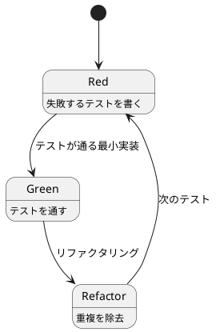
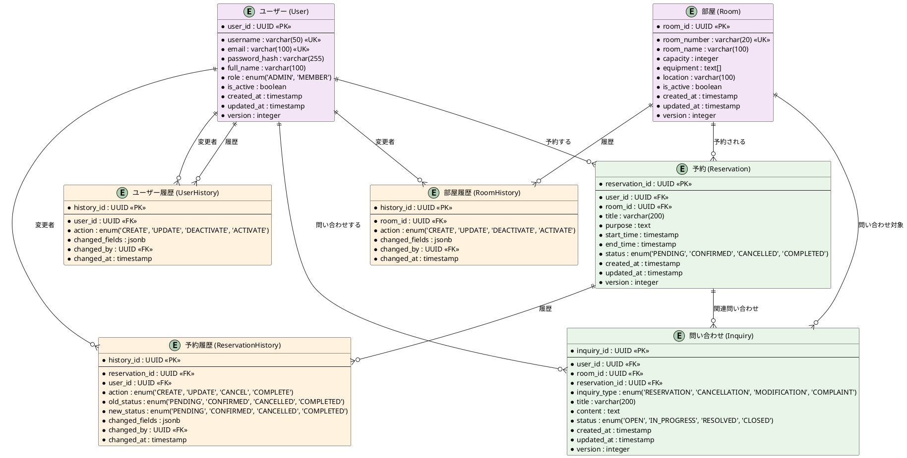
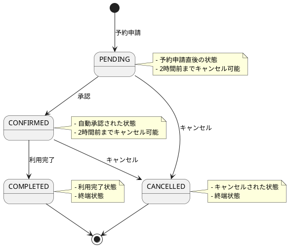
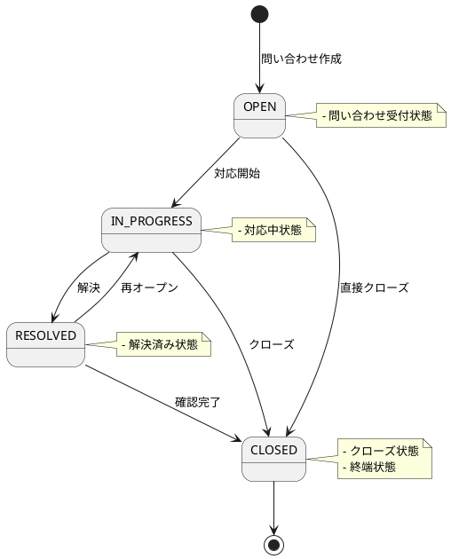
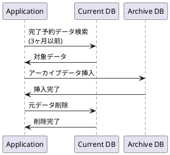

# データモデル設計書

## 概要

会議室予約システムのデータモデル設計を TDD アプローチに基づいて設計する。
ヘキサゴナルアーキテクチャとドメインモデルパターンを採用し、ビジネスロジックをドメイン層に集約する。

## 設計アプローチ

### TDD サイクル



### データモデル設計の観点

1. **マスタデータ**: 変更履歴管理が必要
2. **トランザクションデータ**: ヘッダー・ディテール形式
3. **監査ログ**: すべての変更を記録
4. **状態管理**: 予約・部屋の状態遷移

## エンティティ関係図



## 状態遷移図

### 予約状態遷移



### 問い合わせ状態遷移



## ビジネスルール

### 予約関連

1. **事前予約制限**: 2時間前まで予約・キャンセル可能
2. **同時予約制限**: 1ユーザーあたり同時に3件まで予約可能
3. **重複予約防止**: 同一時間帯・同一部屋の重複予約不可
4. **予約時間制限**: 最大連続4時間まで予約可能
5. **キャンセル制限**: 開始2時間前まで可能

### データ整合性

1. **楽観的ロック**: すべてのエンティティで version による楽観的ロック
2. **論理削除**: マスタデータは is_active フラグによる論理削除
3. **監査ログ**: すべての変更操作を履歴テーブルに記録
4. **外部キー制約**: 参照整合性を DB レベルで保証

## インデックス設計

### 主要インデックス

```sql
-- ユーザー検索
CREATE INDEX idx_user_username ON users(username);
CREATE INDEX idx_user_email ON users(email);
CREATE INDEX idx_user_active ON users(is_active);

-- 部屋検索
CREATE INDEX idx_room_number ON rooms(room_number);
CREATE INDEX idx_room_active ON rooms(is_active);
CREATE INDEX idx_room_capacity ON rooms(capacity);

-- 予約検索
CREATE INDEX idx_reservation_user_id ON reservations(user_id);
CREATE INDEX idx_reservation_room_id ON reservations(room_id);
CREATE INDEX idx_reservation_time_range ON reservations(start_time, end_time);
CREATE INDEX idx_reservation_status ON reservations(status);
CREATE INDEX idx_reservation_date ON reservations(DATE(start_time));

-- 複合インデックス
CREATE INDEX idx_reservation_conflict ON reservations(room_id, start_time, end_time, status) 
  WHERE status IN ('PENDING', 'CONFIRMED');

-- 履歴検索
CREATE INDEX idx_reservation_history_reservation_id ON reservation_histories(reservation_id);
CREATE INDEX idx_reservation_history_changed_at ON reservation_histories(changed_at);
```

## パフォーマンス考慮事項

### クエリ最適化

1. **予約競合チェック**: 部屋・時間・状態の複合インデックス使用
2. **ユーザー予約数チェック**: ユーザー・状態の複合インデックス使用
3. **空き部屋検索**: NOT EXISTS を使用した効率的なクエリ
4. **履歴検索**: パーティショニングによる大量データ対応

### データアーカイブ



## セキュリティ考慮事項

### データ保護

1. **個人情報暗号化**: email、full_name は暗号化して保存
2. **パスワードハッシュ**: bcrypt を使用した安全なハッシュ化
3. **監査ログ**: すべての操作を記録し、改竄防止
4. **アクセス制御**: ロールベースでのデータアクセス制限

## 実装段階

### Phase 1: 基本エンティティ

1. User エンティティの実装
2. Room エンティティの実装
3. 基本的な CRUD 操作

### Phase 2: 予約機能

1. Reservation エンティティの実装
2. 予約競合チェック
3. 状態遷移管理

### Phase 3: 問い合わせ機能

1. Inquiry エンティティの実装
2. 問い合わせ状態管理

### Phase 4: 監査・履歴機能

1. 履歴テーブルの実装
2. 変更追跡の自動化
3. アーカイブ機能

## TDD 実装例

### 予約競合チェックのテスト

```java
@Test
void 同一時間帯同一部屋の予約は競合する() {
    // Red: 失敗するテスト
    // Given
    Room room = createRoom("会議室A");
    User user1 = createUser("user1");
    User user2 = createUser("user2");
    
    LocalDateTime startTime = LocalDateTime.of(2024, 1, 1, 10, 0);
    LocalDateTime endTime = LocalDateTime.of(2024, 1, 1, 12, 0);
    
    // 既存予約
    Reservation existingReservation = createReservation(user1, room, startTime, endTime);
    
    // When & Then
    assertThrows(ReservationConflictException.class, () -> {
        createReservation(user2, room, startTime, endTime);
    });
}
```

## まとめ

このデータモデル設計は以下の特徴を持つ：

1. **ドメイン駆動**: ビジネスロジックをドメイン層に集約
2. **テスト駆動**: TDD サイクルによる段階的な実装
3. **履歴管理**: すべての変更を追跡可能
4. **状態管理**: 明確な状態遷移ルール
5. **パフォーマンス**: 適切なインデックス設計
6. **セキュリティ**: データ保護とアクセス制御

段階的な実装により、継続的にフィードバックを得ながら高品質なデータモデルを構築する。