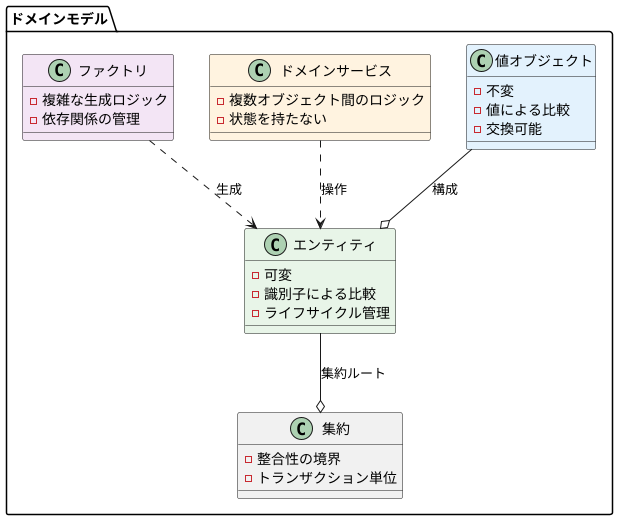
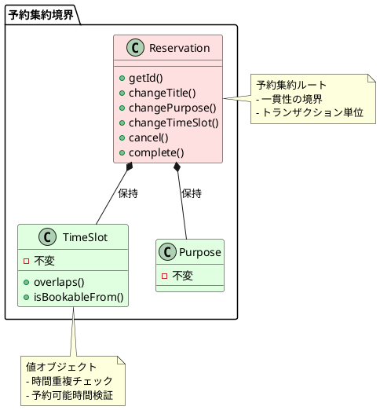
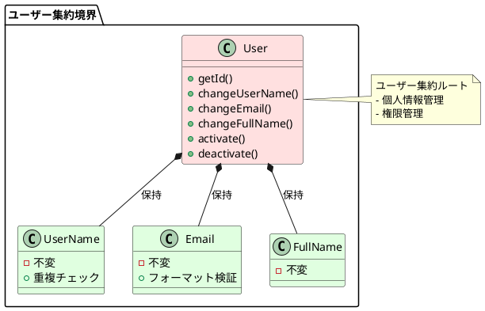
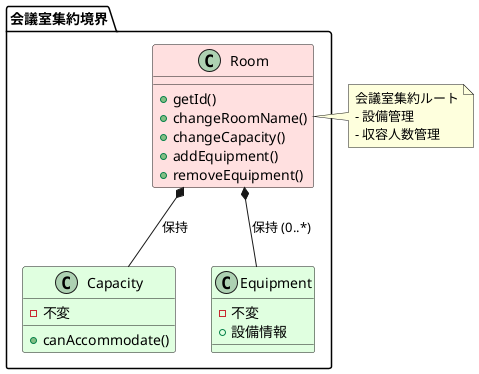

# ドメインモデル設計書 - 会議室予約システム

## 1. 概要

### 1.1 ドメインモデル設計方針

会議室予約システムのドメインモデルをドメイン駆動設計（DDD）に基づいて設計する。
ヘキサゴナルアーキテクチャを採用し、ビジネスロジックをドメイン層に集約して、変更を楽に安全にできて役に立つソフトウェアを実現する。

### 1.2 設計原則

1. **ビジネスロジックをドメインモデルに集約**
2. **依存関係を適切に管理**
3. **テスタビリティを確保**
4. **小さく始めて段階的に拡張**

### 1.3 モデリング要素



## 2. 値オブジェクト（Value Objects）

### 2.1 識別子系値オブジェクト

#### UserId（ユーザー識別子）
```java
public class UserId {
    private final UUID value;
    
    public UserId(UUID value) {
        this.value = Objects.requireNonNull(value, "ユーザーIDは必須です");
    }
    
    public UserId(String value) {
        try {
            this.value = UUID.fromString(Objects.requireNonNull(value));
        } catch (IllegalArgumentException e) {
            throw new IllegalArgumentException("不正なユーザーID形式です: " + value);
        }
    }
    
    public static UserId generate() {
        return new UserId(UUID.randomUUID());
    }
    
    public UUID getValue() {
        return value;
    }
    
    @Override
    public boolean equals(Object obj) {
        if (this == obj) return true;
        if (obj == null || getClass() != obj.getClass()) return false;
        UserId userId = (UserId) obj;
        return Objects.equals(value, userId.value);
    }
    
    @Override
    public int hashCode() {
        return Objects.hash(value);
    }
    
    @Override
    public String toString() {
        return value.toString();
    }
}
```

#### RoomId（会議室識別子）
```java
public class RoomId {
    private final UUID value;
    
    public RoomId(UUID value) {
        this.value = Objects.requireNonNull(value, "会議室IDは必須です");
    }
    
    public RoomId(String value) {
        try {
            this.value = UUID.fromString(Objects.requireNonNull(value));
        } catch (IllegalArgumentException e) {
            throw new IllegalArgumentException("不正な会議室ID形式です: " + value);
        }
    }
    
    public static RoomId generate() {
        return new RoomId(UUID.randomUUID());
    }
    
    public UUID getValue() {
        return value;
    }
    
    @Override
    public boolean equals(Object obj) {
        if (this == obj) return true;
        if (obj == null || getClass() != obj.getClass()) return false;
        RoomId roomId = (RoomId) obj;
        return Objects.equals(value, roomId.value);
    }
    
    @Override
    public int hashCode() {
        return Objects.hash(value);
    }
    
    @Override
    public String toString() {
        return value.toString();
    }
}
```

#### ReservationId（予約識別子）
```java
public class ReservationId {
    private final UUID value;
    
    public ReservationId(UUID value) {
        this.value = Objects.requireNonNull(value, "予約IDは必須です");
    }
    
    public ReservationId(String value) {
        try {
            this.value = UUID.fromString(Objects.requireNonNull(value));
        } catch (IllegalArgumentException e) {
            throw new IllegalArgumentException("不正な予約ID形式です: " + value);
        }
    }
    
    public static ReservationId generate() {
        return new ReservationId(UUID.randomUUID());
    }
    
    public UUID getValue() {
        return value;
    }
    
    @Override
    public boolean equals(Object obj) {
        if (this == obj) return true;
        if (obj == null || getClass() != obj.getClass()) return false;
        ReservationId reservationId = (ReservationId) obj;
        return Objects.equals(value, reservationId.value);
    }
    
    @Override
    public int hashCode() {
        return Objects.hash(value);
    }
    
    @Override
    public String toString() {
        return value.toString();
    }
}
```

### 2.2 基本属性系値オブジェクト

#### Email（メールアドレス）
```java
public class Email {
    private static final String EMAIL_PATTERN = 
        "^[a-zA-Z0-9._%+-]+@[a-zA-Z0-9.-]+\\.[a-zA-Z]{2,}$";
    private static final Pattern EMAIL_REGEX = Pattern.compile(EMAIL_PATTERN);
    
    private final String value;
    
    public Email(String value) {
        if (value == null || value.trim().isEmpty()) {
            throw new IllegalArgumentException("メールアドレスは必須です");
        }
        if (!EMAIL_REGEX.matcher(value).matches()) {
            throw new IllegalArgumentException("不正なメールアドレス形式です: " + value);
        }
        this.value = value.toLowerCase().trim();
    }
    
    public String getValue() {
        return value;
    }
    
    @Override
    public boolean equals(Object obj) {
        if (this == obj) return true;
        if (obj == null || getClass() != obj.getClass()) return false;
        Email email = (Email) obj;
        return Objects.equals(value, email.value);
    }
    
    @Override
    public int hashCode() {
        return Objects.hash(value);
    }
    
    @Override
    public String toString() {
        return value;
    }
}
```

#### UserName（ユーザー名）
```java
public class UserName {
    private static final int MIN_LENGTH = 3;
    private static final int MAX_LENGTH = 50;
    private static final String USERNAME_PATTERN = "^[a-zA-Z0-9_-]+$";
    private static final Pattern USERNAME_REGEX = Pattern.compile(USERNAME_PATTERN);
    
    private final String value;
    
    public UserName(String value) {
        if (value == null || value.trim().isEmpty()) {
            throw new IllegalArgumentException("ユーザー名は必須です");
        }
        if (value.length() < MIN_LENGTH || value.length() > MAX_LENGTH) {
            throw new IllegalArgumentException(
                "ユーザー名は" + MIN_LENGTH + "文字以上" + MAX_LENGTH + "文字以下である必要があります");
        }
        if (!USERNAME_REGEX.matcher(value).matches()) {
            throw new IllegalArgumentException(
                "ユーザー名には英数字、アンダースコア、ハイフンのみ使用できます: " + value);
        }
        this.value = value.toLowerCase().trim();
    }
    
    public String getValue() {
        return value;
    }
    
    @Override
    public boolean equals(Object obj) {
        if (this == obj) return true;
        if (obj == null || getClass() != obj.getClass()) return false;
        UserName userName = (UserName) obj;
        return Objects.equals(value, userName.value);
    }
    
    @Override
    public int hashCode() {
        return Objects.hash(value);
    }
    
    @Override
    public String toString() {
        return value;
    }
}
```

#### FullName（氏名）
```java
public class FullName {
    private static final int MAX_LENGTH = 100;
    
    private final String value;
    
    public FullName(String value) {
        if (value == null || value.trim().isEmpty()) {
            throw new IllegalArgumentException("氏名は必須です");
        }
        if (value.length() > MAX_LENGTH) {
            throw new IllegalArgumentException("氏名は" + MAX_LENGTH + "文字以下である必要があります");
        }
        this.value = value.trim();
    }
    
    public String getValue() {
        return value;
    }
    
    @Override
    public boolean equals(Object obj) {
        if (this == obj) return true;
        if (obj == null || getClass() != obj.getClass()) return false;
        FullName fullName = (FullName) obj;
        return Objects.equals(value, fullName.value);
    }
    
    @Override
    public int hashCode() {
        return Objects.hash(value);
    }
    
    @Override
    public String toString() {
        return value;
    }
}
```

### 2.3 ビジネス固有値オブジェクト

#### TimeSlot（時間枠）
```java
public class TimeSlot {
    private static final int BUSINESS_START_HOUR = 8;  // 8:00
    private static final int BUSINESS_END_HOUR = 22;   // 22:00
    private static final int MAX_DURATION_HOURS = 4;
    private static final int MIN_DURATION_MINUTES = 30;
    
    private final LocalDateTime startTime;
    private final LocalDateTime endTime;
    
    public TimeSlot(LocalDateTime startTime, LocalDateTime endTime) {
        validateTimeRange(startTime, endTime);
        this.startTime = startTime;
        this.endTime = endTime;
    }
    
    private void validateTimeRange(LocalDateTime startTime, LocalDateTime endTime) {
        if (startTime == null || endTime == null) {
            throw new IllegalArgumentException("開始時間と終了時間は必須です");
        }
        if (!startTime.isBefore(endTime)) {
            throw new IllegalArgumentException("開始時間は終了時間より前である必要があります");
        }
        
        Duration duration = Duration.between(startTime, endTime);
        if (duration.toMinutes() < MIN_DURATION_MINUTES) {
            throw new IllegalArgumentException("最小予約時間は" + MIN_DURATION_MINUTES + "分です");
        }
        if (duration.toHours() > MAX_DURATION_HOURS) {
            throw new IllegalArgumentException("最大予約時間は" + MAX_DURATION_HOURS + "時間です");
        }
        
        if (!isWithinBusinessHours(startTime, endTime)) {
            throw new IllegalArgumentException(
                "予約時間は営業時間内（" + BUSINESS_START_HOUR + ":00-" + BUSINESS_END_HOUR + ":00）である必要があります");
        }
    }
    
    private boolean isWithinBusinessHours(LocalDateTime start, LocalDateTime end) {
        return start.getHour() >= BUSINESS_START_HOUR && 
               end.getHour() <= BUSINESS_END_HOUR && 
               start.toLocalDate().equals(end.toLocalDate());
    }
    
    public boolean overlaps(TimeSlot other) {
        return this.startTime.isBefore(other.endTime) && 
               this.endTime.isAfter(other.startTime);
    }
    
    public boolean isBookableFrom(LocalDateTime now) {
        // 2時間前まで予約・キャンセル可能
        return startTime.isAfter(now.plusHours(2));
    }
    
    public boolean isModifiableUntil(LocalDateTime now) {
        // 開始2時間前まで変更可能
        return now.isBefore(startTime.minusHours(2));
    }
    
    public Duration getDuration() {
        return Duration.between(startTime, endTime);
    }
    
    public LocalDateTime getStartTime() {
        return startTime;
    }
    
    public LocalDateTime getEndTime() {
        return endTime;
    }
    
    @Override
    public boolean equals(Object obj) {
        if (this == obj) return true;
        if (obj == null || getClass() != obj.getClass()) return false;
        TimeSlot timeSlot = (TimeSlot) obj;
        return Objects.equals(startTime, timeSlot.startTime) && 
               Objects.equals(endTime, timeSlot.endTime);
    }
    
    @Override
    public int hashCode() {
        return Objects.hash(startTime, endTime);
    }
    
    @Override
    public String toString() {
        return startTime + " - " + endTime;
    }
}
```

#### Purpose（利用目的）
```java
public class Purpose {
    private static final int MAX_LENGTH = 500;
    
    private final String value;
    
    public Purpose(String value) {
        if (value == null || value.trim().isEmpty()) {
            throw new IllegalArgumentException("利用目的は必須です");
        }
        if (value.length() > MAX_LENGTH) {
            throw new IllegalArgumentException("利用目的は" + MAX_LENGTH + "文字以下である必要があります");
        }
        this.value = value.trim();
    }
    
    public String getValue() {
        return value;
    }
    
    @Override
    public boolean equals(Object obj) {
        if (this == obj) return true;
        if (obj == null || getClass() != obj.getClass()) return false;
        Purpose purpose = (Purpose) obj;
        return Objects.equals(value, purpose.value);
    }
    
    @Override
    public int hashCode() {
        return Objects.hash(value);
    }
    
    @Override
    public String toString() {
        return value;
    }
}
```

#### Capacity（収容人数）
```java
public class Capacity {
    private static final int MIN_CAPACITY = 1;
    private static final int MAX_CAPACITY = 100;
    
    private final int value;
    
    public Capacity(int value) {
        if (value < MIN_CAPACITY || value > MAX_CAPACITY) {
            throw new IllegalArgumentException(
                "収容人数は" + MIN_CAPACITY + "人以上" + MAX_CAPACITY + "人以下である必要があります");
        }
        this.value = value;
    }
    
    public int getValue() {
        return value;
    }
    
    public boolean canAccommodate(int requestedCapacity) {
        return this.value >= requestedCapacity;
    }
    
    @Override
    public boolean equals(Object obj) {
        if (this == obj) return true;
        if (obj == null || getClass() != obj.getClass()) return false;
        Capacity capacity = (Capacity) obj;
        return value == capacity.value;
    }
    
    @Override
    public int hashCode() {
        return Objects.hash(value);
    }
    
    @Override
    public String toString() {
        return String.valueOf(value);
    }
}
```

### 2.4 列挙型値オブジェクト

#### UserRole（ユーザー役割）
```java
public enum UserRole {
    ADMIN("管理者"),
    MEMBER("会員");
    
    private final String displayName;
    
    UserRole(String displayName) {
        this.displayName = displayName;
    }
    
    public String getDisplayName() {
        return displayName;
    }
    
    public boolean isAdmin() {
        return this == ADMIN;
    }
    
    public boolean isMember() {
        return this == MEMBER;
    }
}
```

#### ReservationStatus（予約状態）
```java
public enum ReservationStatus {
    PENDING("申請中"),
    CONFIRMED("確定"),
    CANCELLED("キャンセル"),
    COMPLETED("完了");
    
    private final String displayName;
    
    ReservationStatus(String displayName) {
        this.displayName = displayName;
    }
    
    public String getDisplayName() {
        return displayName;
    }
    
    public boolean isActive() {
        return this == PENDING || this == CONFIRMED;
    }
    
    public boolean isConfirmed() {
        return this == CONFIRMED;
    }
    
    public boolean isCancellable() {
        return this == PENDING || this == CONFIRMED;
    }
    
    public boolean isModifiable() {
        return this == PENDING || this == CONFIRMED;
    }
}
```

#### InquiryType（問い合わせ種別）
```java
public enum InquiryType {
    RESERVATION("予約関連"),
    CANCELLATION("キャンセル関連"),
    MODIFICATION("変更関連"),
    COMPLAINT("苦情・要望");
    
    private final String displayName;
    
    InquiryType(String displayName) {
        this.displayName = displayName;
    }
    
    public String getDisplayName() {
        return displayName;
    }
    
    public boolean isReservationRelated() {
        return this == RESERVATION || this == CANCELLATION || this == MODIFICATION;
    }
}
```

#### InquiryStatus（問い合わせ状態）
```java
public enum InquiryStatus {
    OPEN("受付"),
    IN_PROGRESS("対応中"),
    RESOLVED("解決"),
    CLOSED("クローズ");
    
    private final String displayName;
    
    InquiryStatus(String displayName) {
        this.displayName = displayName;
    }
    
    public String getDisplayName() {
        return displayName;
    }
    
    public boolean isActive() {
        return this == OPEN || this == IN_PROGRESS || this == RESOLVED;
    }
    
    public boolean canTransitionTo(InquiryStatus newStatus) {
        switch (this) {
            case OPEN:
                return newStatus == IN_PROGRESS || newStatus == CLOSED;
            case IN_PROGRESS:
                return newStatus == RESOLVED || newStatus == CLOSED;
            case RESOLVED:
                return newStatus == CLOSED || newStatus == IN_PROGRESS;
            case CLOSED:
                return false; // 終端状態
            default:
                return false;
        }
    }
}
```

## 3. エンティティ（Entities）

### 3.1 User（会員）
```java
public class User {
    private final UserId id;
    private UserName userName;
    private Email email;
    private FullName fullName;
    private UserRole role;
    private boolean active;
    private LocalDateTime createdAt;
    private LocalDateTime updatedAt;
    private int version;
    
    // コンストラクタ（新規作成用）
    public User(UserId id, UserName userName, Email email, FullName fullName, UserRole role) {
        this.id = Objects.requireNonNull(id, "ユーザーIDは必須です");
        this.userName = Objects.requireNonNull(userName, "ユーザー名は必須です");
        this.email = Objects.requireNonNull(email, "メールアドレスは必須です");
        this.fullName = Objects.requireNonNull(fullName, "氏名は必須です");
        this.role = Objects.requireNonNull(role, "役割は必須です");
        this.active = true;
        this.createdAt = LocalDateTime.now();
        this.updatedAt = LocalDateTime.now();
        this.version = 0;
    }
    
    // ファクトリーメソッド
    public static User createMember(UserName userName, Email email, FullName fullName) {
        return new User(UserId.generate(), userName, email, fullName, UserRole.MEMBER);
    }
    
    public static User createAdmin(UserName userName, Email email, FullName fullName) {
        return new User(UserId.generate(), userName, email, fullName, UserRole.ADMIN);
    }
    
    // ビジネスロジック
    public void changeUserName(UserName newUserName) {
        this.userName = Objects.requireNonNull(newUserName, "ユーザー名は必須です");
        this.updatedAt = LocalDateTime.now();
    }
    
    public void changeEmail(Email newEmail) {
        this.email = Objects.requireNonNull(newEmail, "メールアドレスは必須です");
        this.updatedAt = LocalDateTime.now();
    }
    
    public void changeFullName(FullName newFullName) {
        this.fullName = Objects.requireNonNull(newFullName, "氏名は必須です");
        this.updatedAt = LocalDateTime.now();
    }
    
    public void deactivate() {
        this.active = false;
        this.updatedAt = LocalDateTime.now();
    }
    
    public void activate() {
        this.active = true;
        this.updatedAt = LocalDateTime.now();
    }
    
    public boolean canMakeReservation() {
        return active && role.isMember() || role.isAdmin();
    }
    
    public boolean canManageUsers() {
        return active && role.isAdmin();
    }
    
    public boolean canManageRooms() {
        return active && role.isAdmin();
    }
    
    public boolean canHandleInquiries() {
        return active && role.isAdmin();
    }
    
    // getter メソッド
    public UserId getId() { return id; }
    public UserName getUserName() { return userName; }
    public Email getEmail() { return email; }
    public FullName getFullName() { return fullName; }
    public UserRole getRole() { return role; }
    public boolean isActive() { return active; }
    public LocalDateTime getCreatedAt() { return createdAt; }
    public LocalDateTime getUpdatedAt() { return updatedAt; }
    public int getVersion() { return version; }
    
    @Override
    public boolean equals(Object obj) {
        if (this == obj) return true;
        if (obj == null || getClass() != obj.getClass()) return false;
        User user = (User) obj;
        return Objects.equals(id, user.id);
    }
    
    @Override
    public int hashCode() {
        return Objects.hash(id);
    }
    
    @Override
    public String toString() {
        return "User{id=" + id + ", userName=" + userName + ", fullName=" + fullName + "}";
    }
}
```

### 3.2 Room（会議室）
```java
public class Room {
    private final RoomId id;
    private RoomNumber roomNumber;
    private RoomName roomName;
    private Capacity capacity;
    private List<Equipment> equipment;
    private Location location;
    private boolean active;
    private LocalDateTime createdAt;
    private LocalDateTime updatedAt;
    private int version;
    
    // コンストラクタ
    public Room(RoomId id, RoomNumber roomNumber, RoomName roomName, 
                Capacity capacity, Location location) {
        this.id = Objects.requireNonNull(id, "会議室IDは必須です");
        this.roomNumber = Objects.requireNonNull(roomNumber, "会議室番号は必須です");
        this.roomName = Objects.requireNonNull(roomName, "会議室名は必須です");
        this.capacity = Objects.requireNonNull(capacity, "収容人数は必須です");
        this.location = Objects.requireNonNull(location, "場所は必須です");
        this.equipment = new ArrayList<>();
        this.active = true;
        this.createdAt = LocalDateTime.now();
        this.updatedAt = LocalDateTime.now();
        this.version = 0;
    }
    
    // ファクトリーメソッド
    public static Room create(RoomNumber roomNumber, RoomName roomName, 
                             Capacity capacity, Location location) {
        return new Room(RoomId.generate(), roomNumber, roomName, capacity, location);
    }
    
    // ビジネスロジック
    public void changeRoomName(RoomName newRoomName) {
        this.roomName = Objects.requireNonNull(newRoomName, "会議室名は必須です");
        this.updatedAt = LocalDateTime.now();
    }
    
    public void changeCapacity(Capacity newCapacity) {
        this.capacity = Objects.requireNonNull(newCapacity, "収容人数は必須です");
        this.updatedAt = LocalDateTime.now();
    }
    
    public void changeLocation(Location newLocation) {
        this.location = Objects.requireNonNull(newLocation, "場所は必須です");
        this.updatedAt = LocalDateTime.now();
    }
    
    public void addEquipment(Equipment equipment) {
        if (!this.equipment.contains(equipment)) {
            this.equipment.add(equipment);
            this.updatedAt = LocalDateTime.now();
        }
    }
    
    public void removeEquipment(Equipment equipment) {
        if (this.equipment.contains(equipment)) {
            this.equipment.remove(equipment);
            this.updatedAt = LocalDateTime.now();
        }
    }
    
    public void deactivate() {
        this.active = false;
        this.updatedAt = LocalDateTime.now();
    }
    
    public void activate() {
        this.active = true;
        this.updatedAt = LocalDateTime.now();
    }
    
    public boolean isBookable() {
        return active;
    }
    
    public boolean canAccommodate(int requestedCapacity) {
        return capacity.canAccommodate(requestedCapacity);
    }
    
    public boolean hasEquipment(Equipment equipment) {
        return this.equipment.contains(equipment);
    }
    
    // getter メソッド
    public RoomId getId() { return id; }
    public RoomNumber getRoomNumber() { return roomNumber; }
    public RoomName getRoomName() { return roomName; }
    public Capacity getCapacity() { return capacity; }
    public List<Equipment> getEquipment() { return new ArrayList<>(equipment); }
    public Location getLocation() { return location; }
    public boolean isActive() { return active; }
    public LocalDateTime getCreatedAt() { return createdAt; }
    public LocalDateTime getUpdatedAt() { return updatedAt; }
    public int getVersion() { return version; }
    
    @Override
    public boolean equals(Object obj) {
        if (this == obj) return true;
        if (obj == null || getClass() != obj.getClass()) return false;
        Room room = (Room) obj;
        return Objects.equals(id, room.id);
    }
    
    @Override
    public int hashCode() {
        return Objects.hash(id);
    }
    
    @Override
    public String toString() {
        return "Room{id=" + id + ", roomNumber=" + roomNumber + ", roomName=" + roomName + "}";
    }
}
```

### 3.3 Reservation（予約）
```java
public class Reservation {
    private final ReservationId id;
    private final UserId userId;
    private final RoomId roomId;
    private ReservationTitle title;
    private Purpose purpose;
    private TimeSlot timeSlot;
    private ReservationStatus status;
    private LocalDateTime createdAt;
    private LocalDateTime updatedAt;
    private int version;
    
    // コンストラクタ
    private Reservation(ReservationId id, UserId userId, RoomId roomId, 
                       ReservationTitle title, Purpose purpose, TimeSlot timeSlot) {
        this.id = Objects.requireNonNull(id, "予約IDは必須です");
        this.userId = Objects.requireNonNull(userId, "ユーザーIDは必須です");
        this.roomId = Objects.requireNonNull(roomId, "会議室IDは必須です");
        this.title = Objects.requireNonNull(title, "タイトルは必須です");
        this.purpose = Objects.requireNonNull(purpose, "利用目的は必須です");
        this.timeSlot = Objects.requireNonNull(timeSlot, "時間枠は必須です");
        this.status = ReservationStatus.CONFIRMED; // 自動承認
        this.createdAt = LocalDateTime.now();
        this.updatedAt = LocalDateTime.now();
        this.version = 0;
    }
    
    // ファクトリーメソッド
    public static Reservation create(UserId userId, RoomId roomId, 
                                   ReservationTitle title, Purpose purpose, TimeSlot timeSlot) {
        validateReservationTime(timeSlot);
        return new Reservation(ReservationId.generate(), userId, roomId, title, purpose, timeSlot);
    }
    
    private static void validateReservationTime(TimeSlot timeSlot) {
        if (!timeSlot.isBookableFrom(LocalDateTime.now())) {
            throw new IllegalArgumentException("予約は開始時間の2時間前まで可能です");
        }
    }
    
    // ビジネスロジック
    public void changeTitle(ReservationTitle newTitle) {
        if (!isModifiable()) {
            throw new IllegalStateException("予約の変更は開始2時間前まで可能です");
        }
        this.title = Objects.requireNonNull(newTitle, "タイトルは必須です");
        this.updatedAt = LocalDateTime.now();
    }
    
    public void changePurpose(Purpose newPurpose) {
        if (!isModifiable()) {
            throw new IllegalStateException("予約の変更は開始2時間前まで可能です");
        }
        this.purpose = Objects.requireNonNull(newPurpose, "利用目的は必須です");
        this.updatedAt = LocalDateTime.now();
    }
    
    public void changeTimeSlot(TimeSlot newTimeSlot) {
        if (!isModifiable()) {
            throw new IllegalStateException("予約の変更は開始2時間前まで可能です");
        }
        if (!newTimeSlot.isBookableFrom(LocalDateTime.now())) {
            throw new IllegalArgumentException("新しい時間枠は2時間後以降である必要があります");
        }
        this.timeSlot = Objects.requireNonNull(newTimeSlot, "時間枠は必須です");
        this.updatedAt = LocalDateTime.now();
    }
    
    public void cancel() {
        if (!status.isCancellable()) {
            throw new IllegalStateException("この予約はキャンセルできません");
        }
        if (!timeSlot.isModifiableUntil(LocalDateTime.now())) {
            throw new IllegalStateException("予約のキャンセルは開始2時間前まで可能です");
        }
        this.status = ReservationStatus.CANCELLED;
        this.updatedAt = LocalDateTime.now();
    }
    
    public void complete() {
        if (status != ReservationStatus.CONFIRMED) {
            throw new IllegalStateException("確定した予約のみ完了できます");
        }
        if (LocalDateTime.now().isBefore(timeSlot.getEndTime())) {
            throw new IllegalStateException("予約終了時間前は完了できません");
        }
        this.status = ReservationStatus.COMPLETED;
        this.updatedAt = LocalDateTime.now();
    }
    
    public boolean isActive() {
        return status.isActive();
    }
    
    public boolean isModifiable() {
        return status.isModifiable() && timeSlot.isModifiableUntil(LocalDateTime.now());
    }
    
    public boolean isCancellable() {
        return status.isCancellable() && timeSlot.isModifiableUntil(LocalDateTime.now());
    }
    
    public boolean isInProgress() {
        LocalDateTime now = LocalDateTime.now();
        return status == ReservationStatus.CONFIRMED && 
               !now.isBefore(timeSlot.getStartTime()) && 
               now.isBefore(timeSlot.getEndTime());
    }
    
    public boolean overlaps(TimeSlot otherTimeSlot) {
        return this.timeSlot.overlaps(otherTimeSlot);
    }
    
    // getter メソッド
    public ReservationId getId() { return id; }
    public UserId getUserId() { return userId; }
    public RoomId getRoomId() { return roomId; }
    public ReservationTitle getTitle() { return title; }
    public Purpose getPurpose() { return purpose; }
    public TimeSlot getTimeSlot() { return timeSlot; }
    public ReservationStatus getStatus() { return status; }
    public LocalDateTime getCreatedAt() { return createdAt; }
    public LocalDateTime getUpdatedAt() { return updatedAt; }
    public int getVersion() { return version; }
    
    @Override
    public boolean equals(Object obj) {
        if (this == obj) return true;
        if (obj == null || getClass() != obj.getClass()) return false;
        Reservation reservation = (Reservation) obj;
        return Objects.equals(id, reservation.id);
    }
    
    @Override
    public int hashCode() {
        return Objects.hash(id);
    }
    
    @Override
    public String toString() {
        return "Reservation{id=" + id + ", title=" + title + ", timeSlot=" + timeSlot + ", status=" + status + "}";
    }
}
```

## 4. ドメインサービス（Domain Services）

### 4.1 ConflictChecker（重複チェックサービス）
```java
@DomainService
public class ConflictChecker {
    private final ReservationRepository reservationRepository;
    
    public ConflictChecker(ReservationRepository reservationRepository) {
        this.reservationRepository = Objects.requireNonNull(reservationRepository);
    }
    
    public boolean hasConflict(RoomId roomId, TimeSlot timeSlot) {
        List<Reservation> activeReservations = 
            reservationRepository.findActiveByRoomId(roomId);
        
        return activeReservations.stream()
            .anyMatch(reservation -> reservation.overlaps(timeSlot));
    }
    
    public boolean hasConflictExcluding(RoomId roomId, TimeSlot timeSlot, ReservationId excludeId) {
        List<Reservation> activeReservations = 
            reservationRepository.findActiveByRoomId(roomId);
        
        return activeReservations.stream()
            .filter(reservation -> !reservation.getId().equals(excludeId))
            .anyMatch(reservation -> reservation.overlaps(timeSlot));
    }
    
    public List<TimeSlot> findAvailableSlots(RoomId roomId, LocalDate date) {
        List<Reservation> dayReservations = 
            reservationRepository.findActiveByRoomIdAndDate(roomId, date);
        
        List<TimeSlot> busySlots = dayReservations.stream()
            .map(Reservation::getTimeSlot)
            .sorted((ts1, ts2) -> ts1.getStartTime().compareTo(ts2.getStartTime()))
            .collect(Collectors.toList());
        
        return calculateAvailableSlots(date, busySlots);
    }
    
    private List<TimeSlot> calculateAvailableSlots(LocalDate date, List<TimeSlot> busySlots) {
        List<TimeSlot> availableSlots = new ArrayList<>();
        
        LocalDateTime businessStart = date.atTime(8, 0); // 8:00
        LocalDateTime businessEnd = date.atTime(22, 0);  // 22:00
        LocalDateTime currentTime = businessStart;
        
        for (TimeSlot busySlot : busySlots) {
            if (currentTime.isBefore(busySlot.getStartTime())) {
                // 空き時間があるか確認
                LocalDateTime slotEnd = busySlot.getStartTime();
                if (Duration.between(currentTime, slotEnd).toMinutes() >= 30) {
                    availableSlots.add(new TimeSlot(currentTime, slotEnd));
                }
            }
            currentTime = busySlot.getEndTime();
        }
        
        // 最後の予約後から営業終了まで
        if (currentTime.isBefore(businessEnd)) {
            if (Duration.between(currentTime, businessEnd).toMinutes() >= 30) {
                availableSlots.add(new TimeSlot(currentTime, businessEnd));
            }
        }
        
        return availableSlots;
    }
}
```

### 4.2 ReservationLimitChecker（予約制限チェックサービス）
```java
@DomainService
public class ReservationLimitChecker {
    private static final int MAX_ACTIVE_RESERVATIONS_PER_USER = 3;
    
    private final ReservationRepository reservationRepository;
    
    public ReservationLimitChecker(ReservationRepository reservationRepository) {
        this.reservationRepository = Objects.requireNonNull(reservationRepository);
    }
    
    public boolean canUserMakeReservation(UserId userId) {
        long activeReservationCount = reservationRepository.countActiveByUserId(userId);
        return activeReservationCount < MAX_ACTIVE_RESERVATIONS_PER_USER;
    }
    
    public int getRemainingReservationCount(UserId userId) {
        long activeReservationCount = reservationRepository.countActiveByUserId(userId);
        return Math.max(0, MAX_ACTIVE_RESERVATIONS_PER_USER - (int) activeReservationCount);
    }
    
    public void validateUserCanMakeReservation(UserId userId) {
        if (!canUserMakeReservation(userId)) {
            throw new ReservationLimitExceededException(
                "同時予約可能数の上限（" + MAX_ACTIVE_RESERVATIONS_PER_USER + "件）を超えています");
        }
    }
}
```

### 4.3 UserDuplicationChecker（ユーザー重複チェックサービス）
```java
@DomainService
public class UserDuplicationChecker {
    private final UserRepository userRepository;
    
    public UserDuplicationChecker(UserRepository userRepository) {
        this.userRepository = Objects.requireNonNull(userRepository);
    }
    
    public boolean isUserNameDuplicated(UserName userName) {
        return userRepository.findByUserName(userName).isPresent();
    }
    
    public boolean isEmailDuplicated(Email email) {
        return userRepository.findByEmail(email).isPresent();
    }
    
    public boolean isUserNameDuplicatedExcluding(UserName userName, UserId excludeUserId) {
        return userRepository.findByUserName(userName)
            .filter(user -> !user.getId().equals(excludeUserId))
            .isPresent();
    }
    
    public boolean isEmailDuplicatedExcluding(Email email, UserId excludeUserId) {
        return userRepository.findByEmail(email)
            .filter(user -> !user.getId().equals(excludeUserId))
            .isPresent();
    }
    
    public void validateUserNameUniqueness(UserName userName) {
        if (isUserNameDuplicated(userName)) {
            throw new DuplicateUserNameException("ユーザー名「" + userName.getValue() + "」は既に使用されています");
        }
    }
    
    public void validateEmailUniqueness(Email email) {
        if (isEmailDuplicated(email)) {
            throw new DuplicateEmailException("メールアドレス「" + email.getValue() + "」は既に使用されています");
        }
    }
    
    public void validateUserNameUniquenessExcluding(UserName userName, UserId excludeUserId) {
        if (isUserNameDuplicatedExcluding(userName, excludeUserId)) {
            throw new DuplicateUserNameException("ユーザー名「" + userName.getValue() + "」は既に使用されています");
        }
    }
    
    public void validateEmailUniquenessExcluding(Email email, UserId excludeUserId) {
        if (isEmailDuplicatedExcluding(email, excludeUserId)) {
            throw new DuplicateEmailException("メールアドレス「" + email.getValue() + "」は既に使用されています");
        }
    }
}
```

## 5. 集約（Aggregates）

### 5.1 ReservationAggregate（予約集約）


### 5.2 UserAggregate（ユーザー集約）


### 5.3 RoomAggregate（会議室集約）


## 6. リポジトリインターフェース（Repository Interfaces）

### 6.1 UserRepository
```java
public interface UserRepository {
    Optional<User> findById(UserId id);
    Optional<User> findByUserName(UserName userName);
    Optional<User> findByEmail(Email email);
    List<User> findAll();
    List<User> findByRole(UserRole role);
    List<User> findActiveUsers();
    void save(User user);
    void delete(UserId id);
    boolean existsByUserName(UserName userName);
    boolean existsByEmail(Email email);
}
```

### 6.2 RoomRepository
```java
public interface RoomRepository {
    Optional<Room> findById(RoomId id);
    Optional<Room> findByRoomNumber(RoomNumber roomNumber);
    List<Room> findAll();
    List<Room> findActiveRooms();
    List<Room> findByMinimumCapacity(int minimumCapacity);
    List<Room> findByEquipment(Equipment equipment);
    void save(Room room);
    void delete(RoomId id);
    boolean existsByRoomNumber(RoomNumber roomNumber);
}
```

### 6.3 ReservationRepository
```java
public interface ReservationRepository {
    Optional<Reservation> findById(ReservationId id);
    List<Reservation> findByUserId(UserId userId);
    List<Reservation> findByRoomId(RoomId roomId);
    List<Reservation> findActiveByUserId(UserId userId);
    List<Reservation> findActiveByRoomId(RoomId roomId);
    List<Reservation> findActiveByRoomIdAndDate(RoomId roomId, LocalDate date);
    List<Reservation> findByUserIdAndDateRange(UserId userId, LocalDate startDate, LocalDate endDate);
    List<Reservation> findByRoomIdAndTimeSlot(RoomId roomId, TimeSlot timeSlot);
    long countActiveByUserId(UserId userId);
    void save(Reservation reservation);
    void delete(ReservationId id);
}
```

## 7. ファクトリー（Factories）

### 7.1 ReservationFactory
```java
public interface ReservationFactory {
    Reservation createReservation(UserId userId, RoomId roomId, 
                                ReservationTitle title, Purpose purpose, TimeSlot timeSlot);
}

@Component
public class ReservationFactoryImpl implements ReservationFactory {
    private final ConflictChecker conflictChecker;
    private final ReservationLimitChecker limitChecker;
    
    public ReservationFactoryImpl(ConflictChecker conflictChecker, 
                                 ReservationLimitChecker limitChecker) {
        this.conflictChecker = Objects.requireNonNull(conflictChecker);
        this.limitChecker = Objects.requireNonNull(limitChecker);
    }
    
    @Override
    public Reservation createReservation(UserId userId, RoomId roomId, 
                                        ReservationTitle title, Purpose purpose, TimeSlot timeSlot) {
        // ビジネスルール検証
        limitChecker.validateUserCanMakeReservation(userId);
        
        if (conflictChecker.hasConflict(roomId, timeSlot)) {
            throw new ReservationConflictException("指定時間は既に予約されています");
        }
        
        return Reservation.create(userId, roomId, title, purpose, timeSlot);
    }
}
```

### 7.2 UserFactory
```java
public interface UserFactory {
    User createMember(UserName userName, Email email, FullName fullName);
    User createAdmin(UserName userName, Email email, FullName fullName);
}

@Component
public class UserFactoryImpl implements UserFactory {
    private final UserDuplicationChecker duplicationChecker;
    
    public UserFactoryImpl(UserDuplicationChecker duplicationChecker) {
        this.duplicationChecker = Objects.requireNonNull(duplicationChecker);
    }
    
    @Override
    public User createMember(UserName userName, Email email, FullName fullName) {
        duplicationChecker.validateUserNameUniqueness(userName);
        duplicationChecker.validateEmailUniqueness(email);
        
        return User.createMember(userName, email, fullName);
    }
    
    @Override
    public User createAdmin(UserName userName, Email email, FullName fullName) {
        duplicationChecker.validateUserNameUniqueness(userName);
        duplicationChecker.validateEmailUniqueness(email);
        
        return User.createAdmin(userName, email, fullName);
    }
}
```

## 8. ドメイン例外（Domain Exceptions）

### 8.1 予約関連例外
```java
public class ReservationConflictException extends DomainException {
    public ReservationConflictException(String message) {
        super(message);
    }
}

public class ReservationLimitExceededException extends DomainException {
    public ReservationLimitExceededException(String message) {
        super(message);
    }
}

public class ReservationNotModifiableException extends DomainException {
    public ReservationNotModifiableException(String message) {
        super(message);
    }
}
```

### 8.2 ユーザー関連例外
```java
public class DuplicateUserNameException extends DomainException {
    public DuplicateUserNameException(String message) {
        super(message);
    }
}

public class DuplicateEmailException extends DomainException {
    public DuplicateEmailException(String message) {
        super(message);
    }
}

public class UserNotFoundException extends DomainException {
    public UserNotFoundException(String message) {
        super(message);
    }
}
```

### 8.3 会議室関連例外
```java
public class RoomNotFoundException extends DomainException {
    public RoomNotFoundException(String message) {
        super(message);
    }
}

public class RoomNotAvailableException extends DomainException {
    public RoomNotAvailableException(String message) {
        super(message);
    }
}
```

## 9. テスト戦略

### 9.1 値オブジェクトのテスト
```java
class TimeSlotTest {
    @Test
    void 有効な時間枠で作成できる() {
        LocalDateTime start = LocalDateTime.of(2024, 1, 1, 10, 0);
        LocalDateTime end = LocalDateTime.of(2024, 1, 1, 12, 0);
        
        TimeSlot timeSlot = new TimeSlot(start, end);
        
        assertThat(timeSlot.getStartTime()).isEqualTo(start);
        assertThat(timeSlot.getEndTime()).isEqualTo(end);
    }
    
    @Test
    void 営業時間外の場合は例外が発生する() {
        LocalDateTime start = LocalDateTime.of(2024, 1, 1, 7, 0);  // 営業時間前
        LocalDateTime end = LocalDateTime.of(2024, 1, 1, 9, 0);
        
        assertThatThrownBy(() -> new TimeSlot(start, end))
            .isInstanceOf(IllegalArgumentException.class)
            .hasMessageContaining("営業時間内");
    }
    
    @Test
    void 時間枠の重複を正しく判定する() {
        TimeSlot slot1 = new TimeSlot(
            LocalDateTime.of(2024, 1, 1, 10, 0),
            LocalDateTime.of(2024, 1, 1, 12, 0)
        );
        TimeSlot slot2 = new TimeSlot(
            LocalDateTime.of(2024, 1, 1, 11, 0),
            LocalDateTime.of(2024, 1, 1, 13, 0)
        );
        
        assertThat(slot1.overlaps(slot2)).isTrue();
        assertThat(slot2.overlaps(slot1)).isTrue();
    }
}
```

### 9.2 エンティティのテスト
```java
class ReservationTest {
    @Test
    void 予約を作成できる() {
        UserId userId = UserId.generate();
        RoomId roomId = RoomId.generate();
        ReservationTitle title = new ReservationTitle("会議");
        Purpose purpose = new Purpose("定例会議");
        TimeSlot timeSlot = createValidTimeSlot();
        
        Reservation reservation = Reservation.create(userId, roomId, title, purpose, timeSlot);
        
        assertThat(reservation.getId()).isNotNull();
        assertThat(reservation.getStatus()).isEqualTo(ReservationStatus.CONFIRMED);
        assertThat(reservation.getUserId()).isEqualTo(userId);
        assertThat(reservation.getRoomId()).isEqualTo(roomId);
    }
    
    @Test
    void 開始2時間前を過ぎた予約はキャンセルできない() {
        Reservation reservation = createReservationStartingInOneHour();
        
        assertThatThrownBy(reservation::cancel)
            .isInstanceOf(IllegalStateException.class)
            .hasMessageContaining("2時間前まで");
    }
    
    private TimeSlot createValidTimeSlot() {
        LocalDateTime start = LocalDateTime.now().plusDays(1).withHour(10).withMinute(0);
        LocalDateTime end = start.plusHours(2);
        return new TimeSlot(start, end);
    }
    
    private Reservation createReservationStartingInOneHour() {
        LocalDateTime start = LocalDateTime.now().plusHours(1);
        LocalDateTime end = start.plusHours(2);
        TimeSlot timeSlot = new TimeSlot(start, end);
        return Reservation.create(UserId.generate(), RoomId.generate(), 
                                 new ReservationTitle("会議"), new Purpose("会議"), timeSlot);
    }
}
```

### 9.3 ドメインサービスのテスト
```java
class ConflictCheckerTest {
    @Mock
    private ReservationRepository reservationRepository;
    
    private ConflictChecker conflictChecker;
    
    @BeforeEach
    void setUp() {
        conflictChecker = new ConflictChecker(reservationRepository);
    }
    
    @Test
    void 重複する予約がある場合はtrueを返す() {
        // Given
        RoomId roomId = RoomId.generate();
        TimeSlot newTimeSlot = new TimeSlot(
            LocalDateTime.of(2024, 1, 1, 10, 0),
            LocalDateTime.of(2024, 1, 1, 12, 0)
        );
        
        Reservation existingReservation = createReservation(
            LocalDateTime.of(2024, 1, 1, 11, 0),
            LocalDateTime.of(2024, 1, 1, 13, 0)
        );
        
        when(reservationRepository.findActiveByRoomId(roomId))
            .thenReturn(List.of(existingReservation));
        
        // When
        boolean hasConflict = conflictChecker.hasConflict(roomId, newTimeSlot);
        
        // Then
        assertThat(hasConflict).isTrue();
    }
    
    private Reservation createReservation(LocalDateTime start, LocalDateTime end) {
        TimeSlot timeSlot = new TimeSlot(start, end);
        return Reservation.create(UserId.generate(), RoomId.generate(), 
                                 new ReservationTitle("テスト"), new Purpose("テスト"), timeSlot);
    }
}
```

## 10. 実装ロードマップ

### 10.1 Phase 1: 基本値オブジェクト
1. 識別子系値オブジェクト（UserId, RoomId, ReservationId）
2. 基本属性系値オブジェクト（Email, UserName, FullName）
3. 列挙型値オブジェクト（UserRole, ReservationStatus）

### 10.2 Phase 2: ビジネス値オブジェクト
1. TimeSlot（時間枠）
2. Purpose（利用目的）
3. Capacity（収容人数）

### 10.3 Phase 3: コアエンティティ
1. User（会員）
2. Room（会議室）
3. Reservation（予約）

### 10.4 Phase 4: ドメインサービス
1. ConflictChecker（重複チェック）
2. ReservationLimitChecker（予約制限チェック）
3. UserDuplicationChecker（ユーザー重複チェック）

### 10.5 Phase 5: 集約・ファクトリー
1. 集約境界の明確化
2. ファクトリーの実装
3. リポジトリインターフェースの定義

## 11. まとめ

このドメインモデル設計は以下の特徴を持つ：

### 11.1 設計の特徴
1. **ビジネスロジックの集約**: 重要なビジネスルールを値オブジェクトとエンティティに集約
2. **不変性の活用**: 値オブジェクトの不変性により安全性を確保
3. **明確な責任分離**: エンティティ、値オブジェクト、ドメインサービスの責任を明確に分離
4. **テスタビリティ**: すべてのドメインオブジェクトが単体テスト可能

### 11.2 品質属性の実現
1. **保守性**: 変更が楽で安全な構造
2. **拡張性**: 新しいビジネスルールを容易に追加可能
3. **理解しやすさ**: ドメインの言葉でコードが書かれている
4. **再利用性**: 値オブジェクトとドメインサービスの再利用が可能

### 11.3 継続的改善
- **フィードバックループ**: TDD によるフィードバック駆動開発
- **リファクタリング**: 継続的なドメインモデルの洗練
- **学習の反映**: ドメインエキスパートからの学習をモデルに反映

このドメインモデルを基盤として、変更を楽に安全にできて役に立つソフトウェアを継続的に進化させていく。