# 運用要件定義書

## 1. 概要

### 1.1 目的

会議室予約システムの安定運用を実現するための運用要件を定義する。

### 1.2 対象システム

- システム名: 会議室予約システム
- アーキテクチャ: ヘキサゴナルアーキテクチャ
- フロントエンド: React 18.3.0 + TypeScript
- バックエンド: Spring Boot 3.3.2 + Java 21
- データベース: PostgreSQL 15
- 運用目標: 99.5% 可用性、80% 問い合わせ削減

### 1.3 運用体制

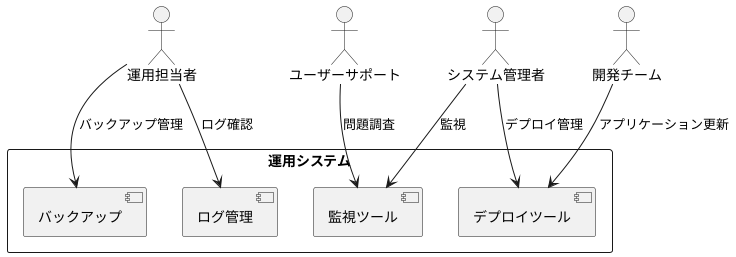

## 2. デプロイメント要件

### 2.1 デプロイメント アーキテクチャ

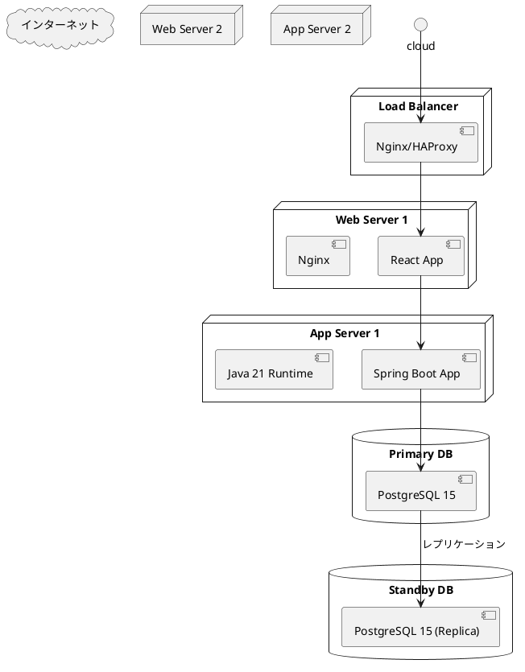

### 2.2 環境構成

#### 2.2.1 本番環境 (Production)

- **フロントエンド**
  - サーバー: 2台構成 (冗長化)
  - CPU: 2コア以上
  - メモリ: 4GB以上
  - ストレージ: 20GB以上

- **バックエンド**
  - サーバー: 2台構成 (冗長化)
  - CPU: 4コア以上
  - メモリ: 8GB以上
  - ストレージ: 50GB以上
  - Java: OpenJDK 21

- **データベース**
  - Primary/Standby 構成
  - CPU: 4コア以上
  - メモリ: 16GB以上
  - ストレージ: 200GB以上 (SSD)

#### 2.2.2 ステージング環境 (Staging)

- 本番環境の50%スペック
- 本番環境と同じ構成で検証

#### 2.2.3 開発環境 (Development)

- 単一サーバー構成
- Docker コンテナベース

### 2.3 デプロイメント手順

#### 2.3.1 Blue-Green デプロイメント

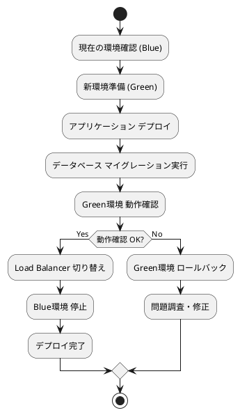

#### 2.3.2 デプロイメント チェックリスト

- [ ] データベース バックアップ確認
- [ ] アプリケーション ビルド成功確認
- [ ] ユニットテスト・統合テスト成功確認
- [ ] ステージング環境での動作確認
- [ ] ロードバランサー設定確認
- [ ] ロールバック計画確認

## 3. 監視・運用要件

### 3.1 監視項目

#### 3.1.1 インフラストラクチャ監視

- **サーバーメトリクス**
  - CPU使用率: 80%以下
  - メモリ使用率: 85%以下
  - ディスク使用率: 80%以下
  - ネットワーク I/O
  - ディスク I/O

- **データベースメトリクス**
  - 接続数: 最大接続数の80%以下
  - レプリケーション遅延: 5秒以下
  - クエリ実行時間: 1秒以下
  - デッドロック発生数

#### 3.1.2 アプリケーション監視

- **パフォーマンスメトリクス**
  - レスポンス時間: 2秒以下
  - スループット: 100 req/sec以上
  - エラー率: 1%以下

- **ビジネスメトリクス**
  - 予約作成数/日
  - 予約キャンセル率
  - ユーザー登録数
  - システム利用率

### 3.2 ログ管理

#### 3.2.1 ログレベル設定

```yaml
logging:
  level:
    root: INFO
    com.meetingroom: INFO
    org.springframework: WARN
    org.hibernate: WARN
    
  pattern:
    console: "%d{yyyy-MM-dd HH:mm:ss} [%thread] %-5level %logger{36} - %msg%n"
    file: "%d{yyyy-MM-dd HH:mm:ss} [%thread] %-5level %logger{36} - %msg%n"
```

#### 3.2.2 ログ種類

- **アプリケーションログ**
  - 業務処理ログ
  - エラーログ
  - パフォーマンスログ

- **アクセスログ**
  - HTTP アクセスログ
  - API 呼び出しログ
  - ユーザー操作ログ

- **監査ログ**
  - ユーザー認証ログ
  - データ変更ログ
  - システム設定変更ログ

### 3.3 アラート設定

#### 3.3.1 緊急アラート (Critical)

- サービス停止
- データベース接続不可
- CPU使用率 90%以上
- メモリ使用率 95%以上
- ディスク使用率 95%以上

#### 3.3.2 警告アラート (Warning)

- レスポンス時間 5秒以上
- エラー率 5%以上
- CPU使用率 80%以上
- メモリ使用率 85%以上

## 4. セキュリティ運用要件

### 4.1 認証・認可

#### 4.1.1 ユーザー認証

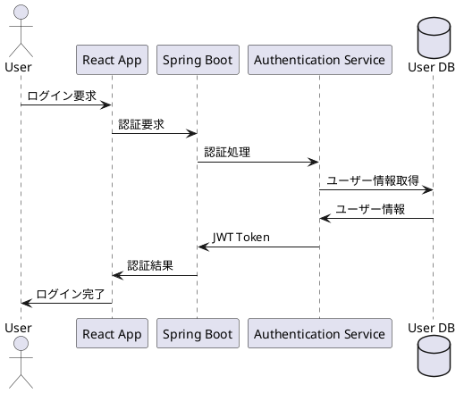

#### 4.1.2 セキュリティ監視

- **不正アクセス検知**
  - 連続ログイン失敗 (5回以上)
  - 異常なアクセス頻度
  - 不審なIPアドレスからのアクセス

- **セキュリティ監査**
  - 権限変更履歴
  - システム管理者操作履歴
  - データアクセス履歴

### 4.2 データセキュリティ

#### 4.2.1 データ暗号化

- **通信暗号化**: TLS 1.3
- **データベース暗号化**: 透過的データ暗号化 (TDE)
- **個人情報暗号化**: AES-256

#### 4.2.2 セキュリティアップデート

- **定期セキュリティパッチ適用**
  - OS: 月1回
  - Java Runtime: 四半期1回
  - データベース: 四半期1回
  - 依存ライブラリ: 月1回

## 5. バックアップ・復旧要件

### 5.1 バックアップ戦略

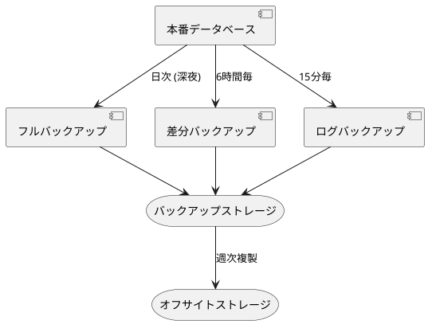

### 5.2 バックアップスケジュール

#### 5.2.1 データベースバックアップ

- **フルバックアップ**: 毎日 02:00 AM
- **差分バックアップ**: 6時間毎 (02:00, 08:00, 14:00, 20:00)
- **トランザクションログバックアップ**: 15分毎

#### 5.2.2 アプリケーションバックアップ

- **設定ファイル**: 日次
- **ログファイル**: 日次アーカイブ
- **静的コンテンツ**: 週次

### 5.3 復旧要件

#### 5.3.1 RTO/RPO 目標

- **RTO (目標復旧時間)**: 4時間以内
- **RPO (目標復旧ポイント)**: 15分以内

#### 5.3.2 復旧手順

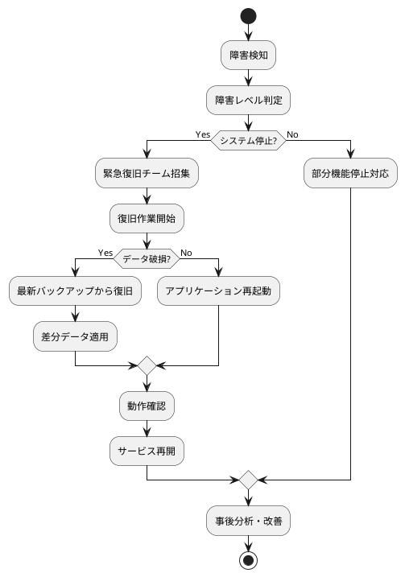

## 6. メンテナンス・保守要件

### 6.1 定期メンテナンス

#### 6.1.1 メンテナンス スケジュール

- **日次メンテナンス** (05:00-06:00)
  - ログローテーション
  - 一時ファイル削除
  - システムヘルスチェック

- **週次メンテナンス** (日曜 03:00-05:00)
  - データベースメンテナンス
  - インデックス再構築
  - 統計情報更新

- **月次メンテナンス** (第1日曜 02:00-06:00)
  - セキュリティパッチ適用
  - システムアップデート
  - パフォーマンス最適化

### 6.2 容量管理

#### 6.2.1 ストレージ管理

- **データ増加予測**: 月100GB
- **ログ保存期間**: 3ヶ月
- **アーカイブ期間**: 5年
- **容量監視閾値**: 80%

### 6.3 性能管理

#### 6.3.1 性能監視

```yaml
performance_thresholds:
  response_time:
    normal: < 2秒
    warning: 2-5秒
    critical: > 5秒
    
  throughput:
    minimum: 100 req/sec
    target: 500 req/sec
    maximum: 1000 req/sec
    
  database:
    query_time: < 1秒
    connection_pool: < 80%
    cpu_usage: < 70%
```

## 7. 運用フロー・手順書

### 7.1 日次運用フロー

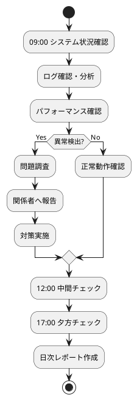

### 7.2 インシデント対応フロー

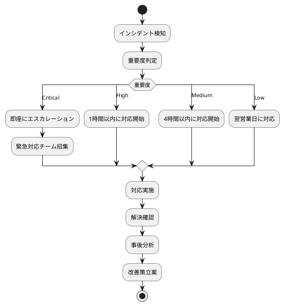

### 7.3 変更管理プロセス

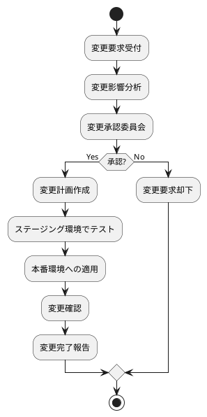

## 8. 災害対策・事業継続

### 8.1 災害対策計画

#### 8.1.1 対策レベル

- **レベル1**: 単一サーバー障害
  - 冗長化構成による自動切り替え
  - 復旧時間: 5分以内

- **レベル2**: データセンター部分障害
  - 手動切り替えによる復旧
  - 復旧時間: 1時間以内

- **レベル3**: データセンター全体障害
  - DR サイトへの切り替え
  - 復旧時間: 4時間以内

### 8.2 事業継続計画

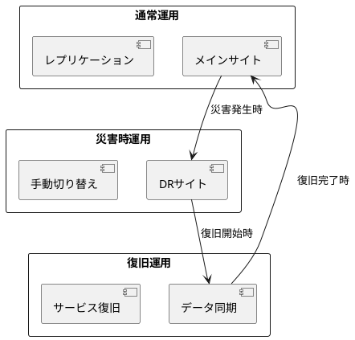

## 9. 運用品質管理

### 9.1 SLA (Service Level Agreement)

| 項目 | 目標値 |
|------|--------|
| 稼働率 | 99.5% |
| レスポンス時間 | 2秒以内 |
| エラー率 | 1%以下 |
| 復旧時間 | 4時間以内 |

### 9.2 KPI 管理

```yaml
operational_kpis:
  availability:
    target: 99.5%
    measurement: 月次
    
  performance:
    response_time: < 2秒
    throughput: > 100 req/sec
    measurement: 日次
    
  user_satisfaction:
    inquiry_reduction: 80%
    user_feedback: > 4.0/5.0
    measurement: 月次
```

## 10. 運用改善・最適化

### 10.1 継続的改善

- **月次レビュー**: KPI分析・改善点抽出
- **四半期レビュー**: インフラ・アーキテクチャ見直し
- **年次レビュー**: 運用戦略・技術戦略見直し

### 10.2 自動化推進

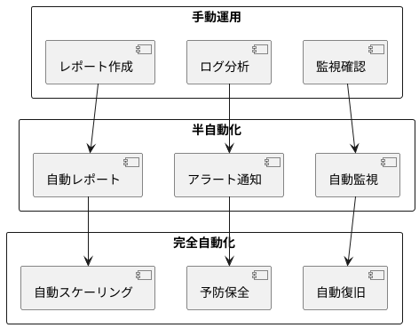

---

## 付録

### A. 運用チェックリスト

#### A.1 日次チェックリスト

- [ ] システム稼働状況確認
- [ ] エラーログ確認
- [ ] パフォーマンス監視
- [ ] バックアップ完了確認
- [ ] セキュリティアラート確認

#### A.2 週次チェックリスト

- [ ] データベースメンテナンス
- [ ] ログアーカイブ
- [ ] 容量使用状況確認
- [ ] セキュリティ更新確認

### B. 緊急連絡先

| 役割 | 担当者 | 連絡先 | 対応時間 |
|------|--------|--------|----------|
| システム管理者 | [担当者名] | [連絡先] | 24時間 |
| 開発チームリーダー | [担当者名] | [連絡先] | 平日 9-18時 |
| インフラ担当 | [担当者名] | [連絡先] | 24時間 |

### C. 関連ドキュメント

- [要件定義書](../requirements/requirements_definition.md)
- [アーキテクチャ設計書](./architecture_backend.md)
- [テスト戦略書](./test_strategy.md)
- [技術スタック仕様書](./tech_stack.md)