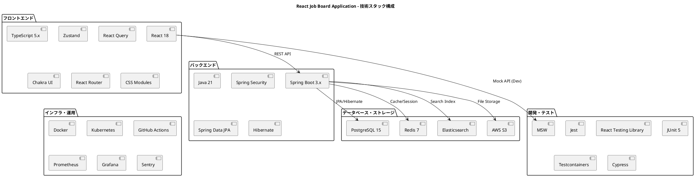

# 技術スタック - React Job Board Application

## 技術スタック概要



## フロントエンド技術スタック

### 1. コアフレームワーク・ライブラリ

| 技術 | バージョン | 選択理由 | 用途 |
|------|------------|----------|------|
| **React** | 18.x | - 最新の Concurrent Features<br>- 豊富なエコシステム<br>- チーム習熟度 | UI フレームワーク |
| **TypeScript** | 5.x | - 型安全性による品質向上<br>- 開発時エラー早期発見<br>- チーム開発効率化 | 言語・型システム |
| **Next.js** | 14.x | - ファイルベースルーティング<br>- SSR/SSG サポート<br>- API Routes<br>- 画像最適化 | React フレームワーク |

### 2. 状態管理

| 技術 | バージョン | 選択理由 | 用途 |
|------|------------|----------|------|
| **Zustand** | 4.x | - 軽量（2.9kb）<br>- シンプルな API<br>- TypeScript サポート<br>- ミドルウェア豊富 | クライアント状態管理 |
| **TanStack Query** | 5.x | - サーバー状態特化<br>- キャッシュ戦略豊富<br>- 楽観的更新<br>- オフラインサポート | サーバー状態管理 |

#### 状態管理戦略

```tsx
// サーバー状態 (TanStack Query)
const { data: jobs, isLoading } = useQuery({
  queryKey: ['jobs', filters],
  queryFn: () => getJobs(filters),
  staleTime: 5 * 60 * 1000 // 5分キャッシュ
});

// クライアント状態 (Zustand)
const useAuthStore = create<AuthState>()((set) => ({
  user: null,
  login: async (credentials) => {
    const user = await loginAPI(credentials);
    set({ user });
  }
}));
```

### 3. UI・スタイリング

| 技術 | バージョン | 選択理由 | 用途 |
|------|------------|----------|------|
| **Chakra UI** | 2.x | - アクセシビリティ重視<br>- TypeScript サポート<br>- テーマカスタマイズ<br>- モジュラー設計 | コンポーネントライブラリ |
| **CSS Modules** | - | - スコープ化 CSS<br>- パフォーマンス最適<br>- 保守性向上 | カスタムスタイリング |
| **Framer Motion** | 11.x | - 宣言的アニメーション<br>- React 統合<br>- 高パフォーマンス | アニメーション |

#### スタイリング戦略

```tsx
// Chakra UI + CSS Modules ハイブリッド
export const JobCard = ({ job }: JobCardProps) => (
  <Box className={styles.card} p={6} borderRadius="lg">
    <Heading size="md" className={styles.title}>
      {job.position}
    </Heading>
    <Text className={styles.company}>
      {job.organization.name}
    </Text>
  </Box>
);
```

### 4. ルーティング・ナビゲーション

| 技術 | バージョン | 選択理由 | 用途 |
|------|------------|----------|------|
| **React Router** | 6.x | - React 標準ルーター<br>- データローダー<br>- ネストルーティング<br>- 型安全ルーティング | SPA ルーティング |

#### 権限ベースルーティング

```tsx
const router = createBrowserRouter([
  {
    path: "/",
    element: <PublicLayout />,
    children: [
      { path: "jobs", element: <JobsPage /> },
      { path: "jobs/:id", element: <JobDetailPage /> }
    ]
  },
  {
    path: "/dashboard",
    element: <ProtectedRoute><DashboardLayout /></ProtectedRoute>,
    children: [
      { path: "jobs", element: <DashboardJobsPage /> },
      { path: "jobs/new", element: <CreateJobPage /> }
    ]
  }
]);
```

### 5. HTTP クライアント・API

| 技術 | バージョン | 選択理由 | 用途 |
|------|------------|----------|------|
| **Axios** | 1.x | - 豊富な機能<br>- インターセプター<br>- TypeScript サポート<br>- ブラウザ/Node 対応 | HTTP クライアント |

#### API クライアント設計

```tsx
class APIClient {
  private client: AxiosInstance;

  constructor() {
    this.client = axios.create({
      baseURL: process.env.NEXT_PUBLIC_API_URL,
      timeout: 10000
    });
    
    this.setupInterceptors();
  }

  private setupInterceptors() {
    // 認証トークン自動付与
    this.client.interceptors.request.use((config) => {
      const token = getAuthToken();
      if (token) {
        config.headers.Authorization = `Bearer ${token}`;
      }
      return config;
    });

    // エラーハンドリング
    this.client.interceptors.response.use(
      (response) => response,
      (error) => {
        if (error.response?.status === 401) {
          logout();
        }
        return Promise.reject(error);
      }
    );
  }
}
```

### 6. フォーム・バリデーション

| 技術 | バージョン | 選択理由 | 用途 |
|------|------------|----------|------|
| **React Hook Form** | 7.x | - パフォーマンス重視<br>- 最小再レンダリング<br>- TypeScript サポート<br>- バリデーション統合 | フォーム管理 |
| **Zod** | 3.x | - スキーマバリデーション<br>- TypeScript 型生成<br>- 実行時チェック<br>- 合成可能 | バリデーション |

#### フォーム実装例

```tsx
const createJobSchema = z.object({
  position: z.string().min(1, "職種名は必須です"),
  location: z.string().min(1, "勤務地は必須です"),
  description: z.string().min(10, "10文字以上で入力してください")
});

type CreateJobForm = z.infer<typeof createJobSchema>;

export function CreateJobForm() {
  const { register, handleSubmit, formState: { errors } } = useForm<CreateJobForm>({
    resolver: zodResolver(createJobSchema)
  });

  const onSubmit = (data: CreateJobForm) => {
    createJob(data);
  };

  return (
    <form onSubmit={handleSubmit(onSubmit)}>
      <Input {...register("position")} />
      {errors.position && <Text color="red">{errors.position.message}</Text>}
    </form>
  );
}
```

### 7. テスト

| 技術 | バージョン | 選択理由 | 用途 |
|------|------------|----------|------|
| **Jest** | 29.x | - React エコシステム標準<br>- スナップショットテスト<br>- モック機能充実 | テストランナー |
| **React Testing Library** | 14.x | - ユーザー中心テスト<br>- アクセシビリティ重視<br>- ベストプラクティス | コンポーネントテスト |
| **MSW** | 2.x | - モック API サーバー<br>- ブラウザ/Node 対応<br>- リアルな HTTP モック | API モック |
| **Playwright** | 1.x | - クロスブラウザ<br>- 並列実行<br>- スクリーンショット<br>- モバイル対応 | E2E テスト |

#### テスト構成比率

```
├── Unit Tests (60%)
│   ├── コンポーネントテスト
│   ├── カスタムフックテスト
│   └── ユーティリティテスト
├── Integration Tests (25%)
│   ├── API 統合テスト
│   ├── ルーティングテスト
│   └── ストアテスト
└── E2E Tests (15%)
    ├── ユーザーシナリオテスト
    ├── クロスブラウザテスト
    └── パフォーマンステスト
```

### 8. 開発ツール

| 技術 | バージョン | 選択理由 | 用途 |
|------|------------|----------|------|
| **Vite** | 5.x | - 高速ホットリロード<br>- ESM ベース<br>- プラグインエコシステム | ビルドツール |
| **ESLint** | 8.x | - 静的解析<br>- コード品質向上<br>- カスタムルール | Linter |
| **Prettier** | 3.x | - コードフォーマット<br>- チーム統一<br>- エディタ統合 | フォーマッター |
| **Storybook** | 7.x | - コンポーネントカタログ<br>- 独立開発環境<br>- ビジュアルテスト | 開発環境 |

## バックエンド技術スタック

### 1. コアフレームワーク・言語

| 技術 | バージョン | 選択理由 | 用途 |
|------|------------|----------|------|
| **Java** | 21 LTS | - 長期サポート<br>- エンタープライズ実績<br>- 豊富なライブラリ<br>- 仮想スレッド対応 | プログラミング言語 |
| **Spring Boot** | 3.2.x | - 設定簡易化<br>- 自動設定<br>- 組み込みサーバー<br>- 豊富なスターター | アプリケーションフレームワーク |
| **Spring Framework** | 6.1.x | - DI コンテナ<br>- AOP サポート<br>- 豊富なモジュール | コアフレームワーク |

### 2. Web・API

| 技術 | バージョン | 選択理由 | 用途 |
|------|------------|----------|------|
| **Spring Web MVC** | 6.1.x | - REST API 構築<br>- アノテーションベース<br>- 豊富な機能 | Web フレームワーク |
| **Spring Security** | 6.2.x | - 認証・認可<br>- JWT サポート<br>- CSRF 対策<br>- セキュリティ機能 | セキュリティフレームワーク |
| **OpenAPI 3** | 3.0.x | - API ドキュメント生成<br>- スキーマ駆動開発<br>- クライアント生成 | API 仕様 |

#### REST API 設計例

```java
@RestController
@RequestMapping("/api/jobs")
@SecurityRequirement(name = "bearerAuth")
public class JobController {
    
    private final CreateJobUseCase createJobUseCase;
    private final FindJobsQuery findJobsQuery;
    
    @PostMapping
    @PreAuthorize("hasRole('RECRUITER')")
    public ResponseEntity<JobResponse> createJob(
        @Valid @RequestBody CreateJobRequest request,
        Authentication auth
    ) {
        var command = CreateJobCommand.from(request, auth);
        var jobId = createJobUseCase.execute(command);
        return ResponseEntity.status(HttpStatus.CREATED)
            .body(JobResponse.from(jobId));
    }
    
    @GetMapping
    @Operation(summary = "求人検索", description = "条件に応じて求人を検索します")
    public ResponseEntity<JobListResponse> findJobs(
        @ParameterObject JobSearchCriteria criteria,
        @ParameterObject Pageable pageable
    ) {
        var result = findJobsQuery.execute(criteria, pageable);
        return ResponseEntity.ok(JobListResponse.from(result));
    }
}
```

### 3. データアクセス・永続化

| 技術 | バージョン | 選択理由 | 用途 |
|------|------------|----------|------|
| **Spring Data JPA** | 3.2.x | - リポジトリ抽象化<br>- 自動クエリ生成<br>- カスタムクエリ対応 | データアクセス |
| **Hibernate** | 6.4.x | - ORM 機能<br>- キャッシュ機能<br>- パフォーマンス最適化 | JPA 実装 |
| **Flyway** | 10.x | - データベースマイグレーション<br>- バージョン管理<br>- 自動実行 | マイグレーション |
| **QueryDSL** | 5.x | - 型安全クエリ<br>- 動的クエリ構築<br>- コンパイル時チェック | クエリ DSL |

#### ドメインモデル実装例

```java
@Entity
@Table(name = "jobs")
public class Job {
    @Id
    private JobId id;
    
    @Column(nullable = false)
    private OrganizationId organizationId;
    
    @Column(nullable = false, length = 100)
    private String position;
    
    @Enumerated(EnumType.STRING)
    private JobStatus status;
    
    @CreationTimestamp
    private LocalDateTime createdAt;
    
    @UpdateTimestamp
    private LocalDateTime updatedAt;
    
    // ビジネスルール
    public void publish() {
        if (status != JobStatus.DRAFT) {
            throw new IllegalJobStatusTransitionException(
                "下書き状態の求人のみ公開できます"
            );
        }
        this.status = JobStatus.PUBLISHED;
        this.updatedAt = LocalDateTime.now();
        addEvent(new JobPublishedEvent(this.id));
    }
    
    // ドメインイベント管理
    @Transient
    private List<DomainEvent> events = new ArrayList<>();
    
    protected void addEvent(DomainEvent event) {
        events.add(event);
    }
    
    public List<DomainEvent> getUncommittedEvents() {
        return List.copyOf(events);
    }
    
    public void clearEvents() {
        events.clear();
    }
}
```

### 4. キャッシュ・セッション

| 技術 | バージョン | 選択理由 | 用途 |
|------|------------|----------|------|
| **Spring Data Redis** | 3.2.x | - Redis 統合<br>- キャッシュ抽象化<br>- セッション管理 | Redis 連携 |
| **Spring Cache** | 6.1.x | - キャッシュ抽象化<br>- アノテーションベース<br>- 複数プロバイダー対応 | キャッシュ管理 |

#### キャッシュ戦略

```java
@Service
@Transactional(readOnly = true)
public class JobQueryService {
    
    @Cacheable(value = "popular-jobs", key = "#location")
    public List<JobSummary> findPopularJobsByLocation(String location) {
        return jobRepository.findPopularJobsByLocation(location);
    }
    
    @Cacheable(value = "job-detail", key = "#jobId")
    public JobDetail findJobDetail(JobId jobId) {
        return jobRepository.findJobDetailById(jobId)
            .orElseThrow(() -> new JobNotFoundException(jobId));
    }
    
    @CacheEvict(value = {"popular-jobs", "job-detail"}, allEntries = true)
    public void clearJobCaches() {
        // キャッシュクリア（求人更新時）
    }
}
```

### 5. テスト

| 技術 | バージョン | 選択理由 | 用途 |
|------|------------|----------|------|
| **JUnit 5** | 5.10.x | - 標準テストフレームワーク<br>- パラメータ化テスト<br>- 拡張モデル | テストフレームワーク |
| **Mockito** | 5.x | - モックライブラリ<br>- BDD スタイル<br>- Spring 統合 | モックフレームワーク |
| **Testcontainers** | 1.19.x | - 統合テスト環境<br>- Docker ベース<br>- データベーステスト | 統合テスト |
| **WireMock** | 3.x | - HTTP モック<br>- 外部 API テスト<br>- レスポンス制御 | API モック |

#### テスト実装例

```java
// ドメインエンティティテスト
@ExtendWith(MockitoExtension.class)
class JobTest {
    
    @Test
    @DisplayName("求人を公開状態に変更できる")
    void shouldPublishJob() {
        // Given
        var job = Job.create(
            JobId.generate(),
            OrganizationId.of("org-1"),
            "Software Engineer",
            "Engineering",
            "Tokyo",
            JobInfo.builder()
                .description("Java developer position")
                .requirements(List.of("Java", "Spring Boot"))
                .build()
        );
        
        // When
        job.publish();
        
        // Then
        assertThat(job.getStatus()).isEqualTo(JobStatus.PUBLISHED);
        assertThat(job.getUncommittedEvents())
            .hasSize(1)
            .first()
            .isInstanceOf(JobPublishedEvent.class);
    }
}

// 統合テスト
@SpringBootTest
@Testcontainers
@TestPropertySource(properties = {
    "spring.datasource.url=jdbc:tc:postgresql:15:///testdb"
})
class JobRepositoryIntegrationTest {
    
    @Container
    static PostgreSQLContainer<?> postgres = new PostgreSQLContainer<>("postgres:15")
            .withDatabaseName("testdb")
            .withUsername("test")
            .withPassword("test");
    
    @Autowired
    private JobRepository jobRepository;
    
    @Test
    @DisplayName("組織IDで求人を検索できる")
    void shouldFindJobsByOrganizationId() {
        // Given
        var organizationId = OrganizationId.of("org-1");
        var job1 = createJob(organizationId, "Engineer");
        var job2 = createJob(organizationId, "Designer");
        
        jobRepository.saveAll(List.of(job1, job2));
        
        // When
        var jobs = jobRepository.findByOrganizationId(organizationId);
        
        // Then
        assertThat(jobs)
            .hasSize(2)
            .extracting(Job::getPosition)
            .containsExactlyInAnyOrder("Engineer", "Designer");
    }
}
```

### 6. 監視・ログ

| 技術 | バージョン | 選択理由 | 用途 |
|------|------------|----------|------|
| **Spring Boot Actuator** | 3.2.x | - ヘルスチェック<br>- メトリクス公開<br>- 運用機能 | 運用監視 |
| **Micrometer** | 1.12.x | - メトリクス収集<br>- 複数モニタリングシステム対応 | メトリクス |
| **Logback** | 1.4.x | - 高性能ログ<br>- 設定柔軟性<br>- SLF4J 統合 | ログフレームワーク |

#### 監視設定例

```yaml
# application.yml
management:
  endpoints:
    web:
      exposure:
        include: health,info,metrics,prometheus
  endpoint:
    health:
      show-details: always
  metrics:
    export:
      prometheus:
        enabled: true

logging:
  level:
    com.jobboard: INFO
    org.springframework.security: DEBUG
  pattern:
    console: '%d{yyyy-MM-dd HH:mm:ss} - %msg%n'
    file: '%d{yyyy-MM-dd HH:mm:ss} [%thread] %-5level %logger{36} - %msg%n'
```

## データベース・ストレージ

### 1. メインデータベース

| 技術 | バージョン | 選択理由 | 用途 |
|------|------------|----------|------|
| **PostgreSQL** | 15.x | - ACID 特性<br>- 豊富なデータ型<br>- 全文検索<br>- 拡張性 | メインデータストア |

#### データベース設計

```sql
-- 求人テーブル
CREATE TABLE jobs (
    id UUID PRIMARY KEY DEFAULT gen_random_uuid(),
    organization_id UUID NOT NULL,
    position VARCHAR(100) NOT NULL,
    department VARCHAR(100) NOT NULL,
    location VARCHAR(100) NOT NULL,
    description TEXT NOT NULL,
    requirements TEXT[] NOT NULL,
    benefits TEXT[] NOT NULL,
    employment_type job_employment_type NOT NULL,
    salary_min INTEGER,
    salary_max INTEGER,
    salary_currency VARCHAR(3) DEFAULT 'JPY',
    status job_status NOT NULL DEFAULT 'DRAFT',
    published_at TIMESTAMP,
    created_at TIMESTAMP NOT NULL DEFAULT CURRENT_TIMESTAMP,
    updated_at TIMESTAMP NOT NULL DEFAULT CURRENT_TIMESTAMP,
    
    CONSTRAINT fk_job_organization 
        FOREIGN KEY (organization_id) REFERENCES organizations(id)
);

-- インデックス
CREATE INDEX idx_jobs_organization_status ON jobs(organization_id, status);
CREATE INDEX idx_jobs_location_position ON jobs(location, position);
CREATE INDEX idx_jobs_published_at ON jobs(published_at) WHERE status = 'PUBLISHED';
CREATE INDEX idx_jobs_fulltext ON jobs USING gin(to_tsvector('japanese', position || ' ' || description));
```

### 2. キャッシュ・セッション

| 技術 | バージョン | 選択理由 | 用途 |
|------|------------|----------|------|
| **Redis** | 7.x | - 高速インメモリDB<br>- 豊富なデータ構造<br>- 永続化サポート<br>- クラスタリング | キャッシュ・セッション |

#### Redis 使用例

```java
// セッション管理
@Configuration
@EnableRedisHttpSession(maxInactiveIntervalInSeconds = 1800) // 30分
public class SessionConfig {
    
    @Bean
    public LettuceConnectionFactory connectionFactory() {
        return new LettuceConnectionFactory(
            new RedisStandaloneConfiguration("localhost", 6379)
        );
    }
}

// キャッシュ設定
@Configuration
@EnableCaching
public class CacheConfig {
    
    @Bean
    public CacheManager cacheManager(RedisConnectionFactory factory) {
        RedisCacheConfiguration config = RedisCacheConfiguration.defaultCacheConfig()
            .entryTtl(Duration.ofMinutes(10))
            .serializeKeysWith(RedisSerializationContext.SerializationPair
                .fromSerializer(new StringRedisSerializer()))
            .serializeValuesWith(RedisSerializationContext.SerializationPair
                .fromSerializer(new GenericJackson2JsonRedisSerializer()));
        
        return RedisCacheManager.builder(factory)
            .cacheDefaults(config)
            .build();
    }
}
```

### 3. 検索エンジン

| 技術 | バージョン | 選択理由 | 用途 |
|------|------------|----------|------|
| **Elasticsearch** | 8.x | - 全文検索<br>- 分析機能<br>- スケーラビリティ<br>- リアルタイム検索 | 検索・分析 |

#### 検索実装例

```java
@Service
public class JobSearchService {
    
    private final ElasticsearchOperations elasticsearchTemplate;
    
    public SearchResult<JobDocument> searchJobs(JobSearchQuery query) {
        var searchQuery = NativeSearchQueryBuilder.builder()
            .withQuery(buildSearchQuery(query))
            .withHighlightBuilder(buildHighlight())
            .withPageable(query.getPageable())
            .build();
        
        var searchHits = elasticsearchTemplate.search(
            searchQuery, JobDocument.class
        );
        
        return SearchResult.from(searchHits);
    }
    
    private QueryBuilder buildSearchQuery(JobSearchQuery query) {
        var boolQuery = QueryBuilders.boolQuery();
        
        if (StringUtils.hasText(query.getKeyword())) {
            boolQuery.must(QueryBuilders.multiMatchQuery(
                query.getKeyword(),
                "position", "description"
            ).type(MultiMatchQueryBuilder.Type.BEST_FIELDS));
        }
        
        if (StringUtils.hasText(query.getLocation())) {
            boolQuery.filter(QueryBuilders.termQuery(
                "location.keyword", query.getLocation()
            ));
        }
        
        return boolQuery;
    }
}
```

### 4. ファイルストレージ

| 技術 | バージョン | 選択理由 | 用途 |
|------|------------|----------|------|
| **Amazon S3** | - | - 高可用性<br>- スケーラビリティ<br>- CDN 統合<br>- 豊富な機能 | ファイルストレージ |

#### ファイルアップロード実装

```java
@Service
public class FileStorageService {
    
    private final AmazonS3 s3Client;
    private final String bucketName;
    
    public FileReference uploadFile(MultipartFile file, String folder) {
        var key = generateFileKey(folder, file.getOriginalFilename());
        
        try {
            var metadata = new ObjectMetadata();
            metadata.setContentType(file.getContentType());
            metadata.setContentLength(file.getSize());
            
            s3Client.putObject(new PutObjectRequest(
                bucketName, key, file.getInputStream(), metadata
            ));
            
            return FileReference.builder()
                .key(key)
                .originalName(file.getOriginalFilename())
                .contentType(file.getContentType())
                .size(file.getSize())
                .url(generateUrl(key))
                .build();
                
        } catch (IOException e) {
            throw new FileUploadException("Failed to upload file", e);
        }
    }
    
    private String generateFileKey(String folder, String filename) {
        return String.format("%s/%s/%s", 
            folder, 
            LocalDate.now().format(DateTimeFormatter.ofPattern("yyyy/MM/dd")),
            UUID.randomUUID() + "_" + filename
        );
    }
}
```

## インフラ・運用技術

### 1. コンテナ・オーケストレーション

| 技術 | バージョン | 選択理由 | 用途 |
|------|------------|----------|------|
| **Docker** | 24.x | - アプリケーション分離<br>- 環境統一<br>- 軽量仮想化 | コンテナ化 |
| **Kubernetes** | 1.28.x | - コンテナオーケストレーション<br>- 自動スケーリング<br>- ローリングアップデート | コンテナ管理 |

#### Dockerfile 例

```dockerfile
# フロントエンド
FROM node:20-alpine AS build
WORKDIR /app
COPY package*.json ./
RUN npm ci --only=production
COPY . .
RUN npm run build

FROM nginx:alpine
COPY --from=build /app/dist /usr/share/nginx/html
COPY nginx.conf /etc/nginx/nginx.conf
EXPOSE 80
CMD ["nginx", "-g", "daemon off;"]

# バックエンド
FROM openjdk:21-jdk-slim AS build
WORKDIR /app
COPY . .
RUN ./gradlew build -x test

FROM openjdk:21-jre-slim
WORKDIR /app
COPY --from=build /app/build/libs/*.jar app.jar
EXPOSE 8080
ENTRYPOINT ["java", "-jar", "app.jar"]
```

### 2. CI/CD

| 技術 | バージョン | 選択理由 | 用途 |
|------|------------|----------|------|
| **GitHub Actions** | - | - GitHub 統合<br>- 豊富なアクション<br>- 並列実行<br>- 無料枠 | CI/CD パイプライン |

#### CI/CD パイプライン

```yaml
# .github/workflows/ci-cd.yml
name: CI/CD Pipeline

on:
  push:
    branches: [main, develop]
  pull_request:
    branches: [main]

jobs:
  test-frontend:
    runs-on: ubuntu-latest
    steps:
      - uses: actions/checkout@v4
      - uses: actions/setup-node@v4
        with:
          node-version: '20'
          cache: 'npm'
      - run: npm ci
      - run: npm run test
      - run: npm run build

  test-backend:
    runs-on: ubuntu-latest
    services:
      postgres:
        image: postgres:15
        env:
          POSTGRES_PASSWORD: postgres
        options: >-
          --health-cmd pg_isready
          --health-interval 10s
          --health-timeout 5s
          --health-retries 5
    steps:
      - uses: actions/checkout@v4
      - uses: actions/setup-java@v4
        with:
          java-version: '21'
          distribution: 'temurin'
      - run: ./gradlew test

  deploy:
    needs: [test-frontend, test-backend]
    runs-on: ubuntu-latest
    if: github.ref == 'refs/heads/main'
    steps:
      - uses: actions/checkout@v4
      - name: Deploy to production
        run: |
          # デプロイスクリプト実行
          ./scripts/deploy.sh
```

### 3. 監視・ログ

| 技術 | バージョン | 選択理由 | 用途 |
|------|------------|----------|------|
| **Prometheus** | 2.x | - メトリクス収集<br>- 時系列データベース<br>- 強力なクエリ言語 | メトリクス監視 |
| **Grafana** | 10.x | - ダッシュボード<br>- アラート機能<br>- 豊富な可視化 | メトリクス可視化 |
| **ELK Stack** | 8.x | - ログ収集・解析<br>- 全文検索<br>- リアルタイム分析 | ログ管理 |

### 4. エラー監視

| 技術 | バージョン | 選択理由 | 用途 |
|------|------------|----------|------|
| **Sentry** | 最新 | - リアルタイムエラー監視<br>- スタックトレース<br>- ユーザーコンテキスト | エラー追跡 |

## 開発・テスト環境

### 1. 開発環境

| 技術 | バージョン | 選択理由 | 用途 |
|------|------------|----------|------|
| **Docker Compose** | 2.x | - ローカル環境構築<br>- サービス統合<br>- 開発効率化 | 開発環境 |

#### docker-compose.yml

```yaml
version: '3.8'

services:
  frontend:
    build:
      context: ./frontend
      dockerfile: Dockerfile.dev
    ports:
      - "3000:3000"
    volumes:
      - ./frontend:/app
      - /app/node_modules
    environment:
      - REACT_APP_API_URL=http://localhost:8080/api

  backend:
    build:
      context: ./backend
      dockerfile: Dockerfile.dev
    ports:
      - "8080:8080"
    volumes:
      - ./backend:/app
    environment:
      - SPRING_PROFILES_ACTIVE=dev
      - DATABASE_URL=jdbc:postgresql://db:5432/jobboard
      - REDIS_URL=redis://redis:6379
    depends_on:
      - db
      - redis

  db:
    image: postgres:15
    environment:
      POSTGRES_DB: jobboard
      POSTGRES_USER: postgres
      POSTGRES_PASSWORD: postgres
    ports:
      - "5432:5432"
    volumes:
      - postgres_data:/var/lib/postgresql/data

  redis:
    image: redis:7-alpine
    ports:
      - "6379:6379"

volumes:
  postgres_data:
```

### 2. テスト戦略

#### フロントエンドテスト

```json
{
  "scripts": {
    "test": "jest",
    "test:watch": "jest --watch",
    "test:coverage": "jest --coverage",
    "test:e2e": "playwright test"
  }
}
```

#### バックエンドテスト

```yaml
# build.gradle
dependencies {
    testImplementation 'org.springframework.boot:spring-boot-starter-test'
    testImplementation 'org.testcontainers:postgresql'
    testImplementation 'org.testcontainers:junit-jupiter'
    testImplementation 'com.github.tomakehurst:wiremock-jre8'
}

test {
    useJUnitPlatform()
    testLogging {
        events "passed", "skipped", "failed"
    }
}
```

## セキュリティ

### 1. 認証・認可

| 技術 | バージョン | 選択理由 | 用途 |
|------|------------|----------|------|
| **JWT** | - | - ステートレス<br>- スケーラブル<br>- クロスドメイン対応 | トークンベース認証 |
| **OAuth 2.0** | - | - 標準プロトコル<br>- スコープベース認可<br>- サードパーティ連携 | 認可フレームワーク |

#### セキュリティ設定

```java
@Configuration
@EnableWebSecurity
@EnableMethodSecurity(prePostEnabled = true)
public class SecurityConfig {
    
    @Bean
    public SecurityFilterChain filterChain(HttpSecurity http) throws Exception {
        return http
            .csrf(csrf -> csrf.disable())
            .sessionManagement(session -> 
                session.sessionCreationPolicy(SessionCreationPolicy.STATELESS))
            .authorizeHttpRequests(auth -> auth
                .requestMatchers("/api/auth/**").permitAll()
                .requestMatchers(HttpMethod.GET, "/api/jobs/**").permitAll()
                .requestMatchers("/api/jobs/*/applications").hasRole("JOB_SEEKER")
                .requestMatchers(HttpMethod.POST, "/api/jobs").hasRole("RECRUITER")
                .anyRequest().authenticated())
            .oauth2ResourceServer(oauth2 -> oauth2
                .jwt(jwt -> jwt.jwtDecoder(jwtDecoder())))
            .build();
    }
}
```

### 2. データ保護

| 技術 | 選択理由 | 用途 |
|------|----------|------|
| **HTTPS/TLS** | データ転送暗号化 | 通信セキュリティ |
| **Password Hashing** | パスワード保護 | 認証情報保護 |
| **SQL Injection対策** | データベース保護 | 入力値サニタイズ |
| **XSS対策** | クライアント保護 | 出力エスケープ |

## パフォーマンス最適化

### 1. フロントエンド最適化

```tsx
// コード分割
const JobDetailPage = lazy(() => import('./JobDetailPage'));

// メモ化
const JobCard = memo(({ job }: JobCardProps) => (
  <Card>
    <CardHeader>
      <Heading size="md">{job.position}</Heading>
    </CardHeader>
    <CardBody>
      <Text>{job.organization.name}</Text>
    </CardBody>
  </Card>
));

// 仮想化
const VirtualizedJobList = ({ jobs }: { jobs: Job[] }) => (
  <FixedSizeList
    height={600}
    itemCount={jobs.length}
    itemSize={120}
    overscanCount={5}
  >
    {({ index, style }) => (
      <div style={style}>
        <JobCard job={jobs[index]} />
      </div>
    )}
  </FixedSizeList>
);
```

### 2. バックエンド最適化

```java
// キャッシュ戦略
@Cacheable(value = "jobs", key = "#filters")
public Page<Job> findJobs(JobSearchFilters filters, Pageable pageable) {
    return jobRepository.findAll(JobSpecifications.fromFilters(filters), pageable);
}

// バッチ処理
@BatchSize(size = 20)
@Entity
public class Job {
    @ManyToOne(fetch = FetchType.LAZY)
    @JoinColumn(name = "organization_id")
    private Organization organization;
}

// 非同期処理
@Async
@EventListener
public void handleJobPublished(JobPublishedEvent event) {
    emailService.sendJobPublishedNotification(event.getJobId());
    searchIndexService.indexJob(event.getJobId());
}
```

## 設定管理

### 1. 環境別設定

```yaml
# application-dev.yml
spring:
  datasource:
    url: jdbc:postgresql://localhost:5432/jobboard_dev
    username: postgres
    password: postgres
  redis:
    host: localhost
    port: 6379
  jpa:
    show-sql: true
    hibernate:
      ddl-auto: update

logging:
  level:
    com.jobboard: DEBUG

# application-prod.yml
spring:
  datasource:
    url: ${DATABASE_URL}
    username: ${DB_USERNAME}
    password: ${DB_PASSWORD}
  redis:
    url: ${REDIS_URL}
  jpa:
    hibernate:
      ddl-auto: validate

logging:
  level:
    com.jobboard: INFO
```

### 2. 設定外部化

```bash
# 環境変数
export DATABASE_URL="jdbc:postgresql://prod-db:5432/jobboard"
export REDIS_URL="redis://prod-redis:6379"
export JWT_SECRET="your-jwt-secret"
export AWS_ACCESS_KEY_ID="your-aws-key"
export AWS_SECRET_ACCESS_KEY="your-aws-secret"
```

## まとめ

React Job Board Application の技術スタックは、以下の要件を満たすよう選定されました：

### 主要選択基準
1. **開発効率**: TypeScript による型安全性、Hot Reload による高速開発
2. **パフォーマンス**: React の最適化機能、Spring Boot の高性能
3. **スケーラビリティ**: Kubernetes による水平スケーリング
4. **保守性**: モジュラー設計、包括的テスト
5. **セキュリティ**: 多層防御、認証・認可の強化

### 技術的特徴
- **フロントエンド**: React 18 + TypeScript + Zustand + TanStack Query
- **バックエンド**: Spring Boot 3 + Java 21 + PostgreSQL + Redis
- **インフラ**: Docker + Kubernetes + AWS
- **CI/CD**: GitHub Actions による自動化
- **監視**: Prometheus + Grafana + Sentry

この技術スタックにより、高品質で拡張性のある求人掲載・管理システムを構築できます。

<function_calls>
<invoke name="mcp__byterover-mcp__byterover-store-knowledge">
<parameter name="messages">React Job Board Application 技術スタック分析完了

## 技術選定概要
フルスタック技術スタック文書を作成。React ベースのフロントエンドと Spring Boot ベースのバックエンドを組み合わせた求人掲載・管理システム。

## フロントエンド技術スタック
- **React 18** + **TypeScript 5.x**: メインフレームワーク、型安全性
- **Next.js 14.x**: SSR/SSG サポート、ファイルベースルーティング
- **Zustand**: 軽量クライアント状態管理
- **TanStack Query**: サーバー状態管理、キャッシュ戦略
- **Chakra UI**: アクセシビリティ重視のコンポーネントライブラリ
- **CSS Modules**: スコープ化スタイリング

## バックエンド技術スタック
- **Java 21 LTS** + **Spring Boot 3.2.x**: エンタープライズレベルのバックエンド
- **Spring Security 6.2.x**: JWT ベース認証・認可
- **Spring Data JPA** + **Hibernate**: ドメインモデルパターン
- **PostgreSQL 15**: メインデータストア
- **Redis 7**: キャッシュ・セッション管理
- **Elasticsearch 8**: 全文検索・分析

## アーキテクチャ特徴
```java
// ドメインモデル例
@Entity
public class Job {
    @Id
    private JobId id;
    
    public void publish() {
        if (status != JobStatus.DRAFT) {
            throw new IllegalJobStatusTransitionException();
        }
        this.status = JobStatus.PUBLISHED;
        addEvent(new JobPublishedEvent(this.id));
    }
}
```

```tsx
// React 状態管理例
const useAuthStore = create<AuthState>()((set) => ({
  user: null,
  login: async (credentials) => {
    const user = await loginAPI(credentials);
    set({ user });
  }
}));

const { data: jobs } = useQuery({
  queryKey: ['jobs', filters],
  queryFn: () => getJobs(filters),
  staleTime: 5 * 60 * 1000
});
```

## インフラ・運用
- **Docker** + **Kubernetes**: コンテナオーケストレーション
- **GitHub Actions**: CI/CD パイプライン
- **Prometheus** + **Grafana**: メトリクス監視
- **Sentry**: エラー追跡

## テスト戦略
- フロントエンド: Jest + React Testing Library + Playwright (60%/25%/15%)
- バックエンド: JUnit 5 + Mockito + Testcontainers (70%/20%/10%)

## セキュリティ
- JWT ベース認証
- OAuth 2.0 認可フレームワーク
- HTTPS/TLS 通信暗号化
- SQL インジェクション・XSS 対策

React アプリケーションアーキテクチャサンプルを参考にしたフィーチャー駆動開発構造とモダンな技術スタックを採用。