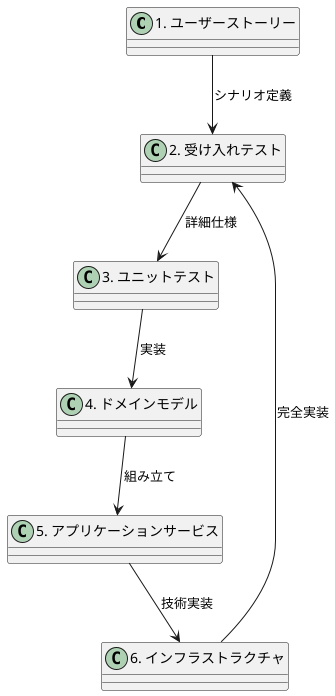

# テスト戦略ガイド

## 概要

本ドキュメントでは、会議室予約システムのテスト戦略を定義します。ヘキサゴナルアーキテクチャとドメイン駆動設計に基づく設計に適したテスト手法を採用し、高品質なソフトウェアの継続的な提供を実現します。

## テスト哲学

### 基本原則

- **テスト駆動開発（TDD）**: Red-Green-Refactor サイクルに従った開発
- **テストピラミッド**: 高速で安定したテスト基盤の構築
- **シフトレフト**: 開発プロセスの早い段階での品質確保
- **継続的テスト**: CI/CD パイプラインに組み込まれた自動テスト

### よいテストの条件

1. **Fast**: 高速に実行される
2. **Independent**: テスト間で独立している
3. **Repeatable**: 環境に依存せず再現可能
4. **Self-Validating**: 成功/失敗が明確
5. **Timely**: コード実装と同時に書かれる

## テストレベル定義

### 1. 単体テスト (Unit Test)

#### 対象
- ドメインオブジェクト（エンティティ、値オブジェクト、ドメインサービス）
- アプリケーションサービス
- インフラストラクチャ層の個別コンポーネント

#### 技術スタック
- **Backend**: JUnit 5, Mockito, AssertJ
- **Frontend**: Jest, React Testing Library

#### テスト方針

```java
// ドメインオブジェクトの例
@DisplayName("予約エンティティのテスト")
class ReservationTest {
    
    @DisplayName("予約開始時刻が終了時刻より後の場合、例外がスローされる")
    @Test
    void throwsException_whenStartTimeIsAfterEndTime() {
        // Given
        LocalDateTime startTime = LocalDateTime.of(2024, 1, 1, 14, 0);
        LocalDateTime endTime = LocalDateTime.of(2024, 1, 1, 13, 0);
        
        // When & Then
        assertThatThrownBy(() -> 
            new TimeSlot(startTime, endTime)
        ).isInstanceOf(IllegalArgumentException.class)
         .hasMessage("開始時刻は終了時刻より前である必要があります");
    }
}
```

#### カバレッジ目標
- **ドメイン層**: 100%
- **アプリケーション層**: 95%以上
- **インフラストラクチャ層**: 80%以上

### 2. 統合テスト (Integration Test)

#### 対象
- データベース連携テスト
- 外部 API 連携テスト
- アーキテクチャ境界をまたぐ連携テスト

#### 技術スタック
- **Backend**: Spring Boot Test, TestContainers, WireMock
- **Frontend**: MSW (Mock Service Worker)

#### テスト方針

```java
@SpringBootTest
@Testcontainers
@DisplayName("予約リポジトリ統合テスト")
class ReservationRepositoryIntegrationTest {
    
    @Container
    static PostgreSQLContainer<?> postgres = new PostgreSQLContainer<>("postgres:15")
            .withDatabaseName("test_db")
            .withUsername("test_user")
            .withPassword("test_password");
    
    @Test
    @DisplayName("予約を保存し、取得できる")
    void canSaveAndRetrieveReservation() {
        // テスト実装
    }
}
```

### 3. E2E テスト (End-to-End Test)

#### 対象
- ユーザーシナリオベースの完全なワークフロー
- クリティカルパス
- 主要ユーザージャーニー

#### 技術スタック
- **Playwright**: クロスブラウザ対応
- **Docker Compose**: テスト環境構築

#### テスト方針

```typescript
// E2Eテストの例
test.describe('会議室予約フロー', () => {
  test('ユーザーが会議室を検索し予約できる', async ({ page }) => {
    // Given: ログイン済みユーザー
    await page.goto('/login');
    await page.fill('[data-testid="email"]', 'test@example.com');
    await page.fill('[data-testid="password"]', 'password');
    await page.click('[data-testid="login-button"]');
    
    // When: 会議室を検索し予約
    await page.click('[data-testid="room-search"]');
    await page.fill('[data-testid="date-input"]', '2024-01-01');
    await page.selectOption('[data-testid="time-slot"]', '09:00-10:00');
    await page.click('[data-testid="search-button"]');
    
    // Then: 予約が完了する
    await expect(page.locator('[data-testid="reservation-success"]')).toBeVisible();
  });
});
```

## TDD アプローチの具体化

### ドメイン駆動のTDDサイクル



### 実装手順

1. **Red（失敗）**: ユーザーストーリーから受け入れテストを作成
2. **Green（成功）**: ドメインモデルから順に実装
3. **Refactor（改善）**: 設計品質の向上

### レイヤー別TDDアプローチ

#### ドメイン層

```java
// 1. Red: 失敗するテストを書く
@Test
void 予約時間が重複している場合_例外がスローされる() {
    assertThatThrownBy(() -> {
        reservationService.reserve(conflictingReservation);
    }).isInstanceOf(ReservationConflictException.class);
}

// 2. Green: 最小限の実装
public class ReservationService {
    public void reserve(Reservation reservation) {
        if (hasConflict(reservation)) {
            throw new ReservationConflictException();
        }
    }
}

// 3. Refactor: 実装を改善
```

#### アプリケーション層

```java
// モックを使った単体テスト
@ExtendWith(MockitoExtension.class)
class ReservationApplicationServiceTest {
    
    @Mock
    private ReservationRepository repository;
    
    @Mock
    private EmailService emailService;
    
    @InjectMocks
    private ReservationApplicationService service;
    
    @Test
    void 予約作成時_確認メールが送信される() {
        // Given
        given(repository.save(any())).willReturn(reservation);
        
        // When
        service.createReservation(command);
        
        // Then
        then(emailService).should().sendConfirmation(any());
    }
}
```

## テスト自動化戦略

### CI/CDパイプライン統合

```yaml
# GitHub Actions例
name: Test Pipeline

on: [push, pull_request]

jobs:
  unit-test:
    runs-on: ubuntu-latest
    steps:
      - name: Unit Tests
        run: ./gradlew test
        
  integration-test:
    runs-on: ubuntu-latest
    needs: unit-test
    services:
      postgres:
        image: postgres:15
    steps:
      - name: Integration Tests
        run: ./gradlew integrationTest
        
  e2e-test:
    runs-on: ubuntu-latest
    needs: integration-test
    steps:
      - name: E2E Tests
        run: npm run test:e2e
```

### テスト実行戦略

#### 開発者ローカル環境
- 単体テスト: 常時実行（ファイル保存時）
- 統合テスト: コミット前
- E2Eテスト: プルリクエスト前

#### CI環境
- 全レベルテスト実行
- 並列実行によるフィードバック高速化
- テスト失敗時の即座通知

## 品質メトリクス

### コードカバレッジ

| レイヤー | 目標カバレッジ | 測定ツール |
|---------|---------------|------------|
| ドメイン層 | 100% | JaCoCo |
| アプリケーション層 | 95% | JaCoCo |
| インフラストラクチャ層 | 80% | JaCoCo |
| フロントエンド | 85% | Jest Coverage |

### テスト品質メトリクス

- **テスト実行時間**: 単体テスト < 5分、統合テスト < 15分、E2E < 30分
- **テスト安定性**: Flaky Test Rate < 1%
- **変更検出能力**: Mutation Testing Score > 80%

### 品質ゲート

#### プルリクエスト
- [ ] 全テストが成功
- [ ] カバレッジが目標値以上
- [ ] 新しいFlaky Testがない
- [ ] パフォーマンス劣化がない

#### リリース
- [ ] 全E2Eテストが成功
- [ ] セキュリティテストが成功
- [ ] 負荷テストが成功

## テストデータ戦略

### テストデータ管理

#### 単体テスト
- **Object Mother パターン**: 再利用可能なテストデータ作成
- **Builder パターン**: 柔軟なテストデータ構築

```java
public class ReservationTestDataBuilder {
    public static Reservation.Builder aReservation() {
        return Reservation.builder()
            .userId(UserId.of("user123"))
            .roomId(RoomId.of("room001"))
            .timeSlot(TimeSlot.of(
                LocalDateTime.now().plusDays(1).with(LocalTime.of(9, 0)),
                LocalDateTime.now().plusDays(1).with(LocalTime.of(10, 0))
            ));
    }
}
```

#### 統合テスト
- **TestContainers**: 独立したデータベース環境
- **データリセット**: テスト間でのクリーンアップ

#### E2Eテスト
- **テスト専用環境**: 本番類似の独立環境
- **シナリオベース**: 実際のユーザーデータパターン

## 特殊なテストケース

### エラーハンドリングテスト

```java
@ParameterizedTest
@EnumSource(ReservationErrorType.class)
void 各種エラーケースで適切な例外がスローされる(ReservationErrorType errorType) {
    // Given
    Reservation invalidReservation = createInvalidReservation(errorType);
    
    // When & Then
    assertThatThrownBy(() -> service.reserve(invalidReservation))
        .isInstanceOf(errorType.getExceptionClass())
        .hasMessage(errorType.getMessage());
}
```

### セキュリティテスト

```java
@Test
void 権限のないユーザーは他人の予約を取得できない() {
    // Given
    User unauthorizedUser = createUser("unauthorized");
    Reservation otherUsersReservation = createReservation("other-user");
    
    // When & Then
    assertThatThrownBy(() -> 
        service.getReservation(unauthorizedUser, otherUsersReservation.getId())
    ).isInstanceOf(UnauthorizedException.class);
}
```

### パフォーマンステスト

```java
@Test
@Timeout(value = 2, unit = TimeUnit.SECONDS)
void 大量データ検索_性能要件を満たす() {
    // Given: 1000件の予約データ
    createReservations(1000);
    
    // When: 検索実行
    List<Reservation> results = service.searchReservations(searchCriteria);
    
    // Then: 2秒以内に完了（@Timeoutで自動チェック）
    assertThat(results).hasSize(expectedSize);
}
```

## テスト環境戦略

### 環境構成

| 環境 | 用途 | データ更新頻度 |
|------|------|---------------|
| Local | 開発者ローカルテスト | リアルタイム |
| CI | 継続的インテグレーション | コミット毎 |
| Staging | E2Eテスト・受け入れテスト | 日次 |
| Production | 本番監視テスト | 監視のみ |

### インフラストラクチャ

#### ローカル開発環境

```docker-compose
version: '3.8'
services:
  postgres-test:
    image: postgres:15
    environment:
      POSTGRES_DB: meeting_room_test
      POSTGRES_USER: test_user
      POSTGRES_PASSWORD: test_password
    ports:
      - "5433:5432"
    tmpfs:
      - /var/lib/postgresql/data
```

#### CI環境
- GitHub Actions + TestContainers
- 並列テスト実行
- アーティファクト保存（テストレポート、カバレッジ）

## 継続的改善

### テスト品質の監視

#### ダッシュボードメトリクス
- テスト成功率トレンド
- テスト実行時間トレンド
- カバレッジトレンド
- Flaky Test検出

#### 定期レビュー
- **週次**: テスト結果レビュー
- **月次**: テスト戦略見直し
- **四半期**: テストスイート最適化

### テスト技術の進化

#### 新技術の評価・導入
- AI支援テストケース生成
- Visual Regression Testing
- Chaos Engineering

## まとめ

本テスト戦略により、会議室予約システムの高品質な開発・運用を実現します：

1. **TDD による設計品質の向上**
2. **多層テストによる包括的な品質保証**
3. **自動化による継続的フィードバック**
4. **メトリクス監視による継続的改善**

これらの実践により、変更を楽に安全に行える、よいソフトウェアの実現を目指します。