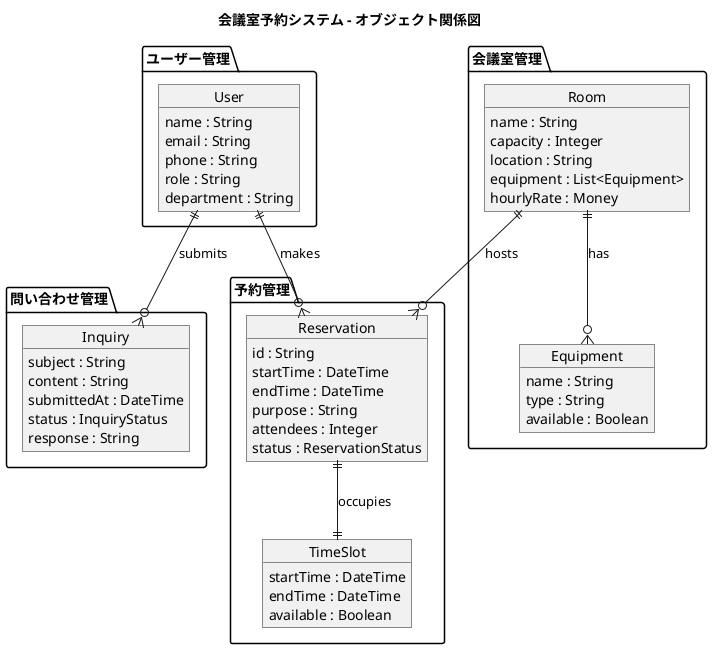
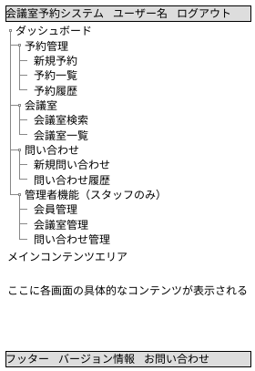
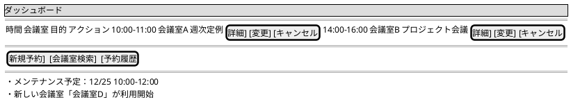
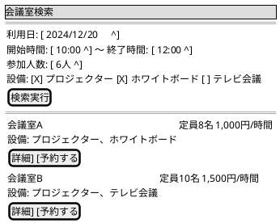
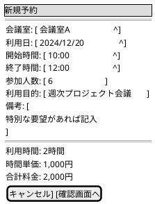
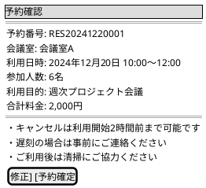
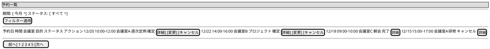
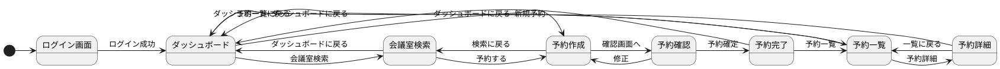
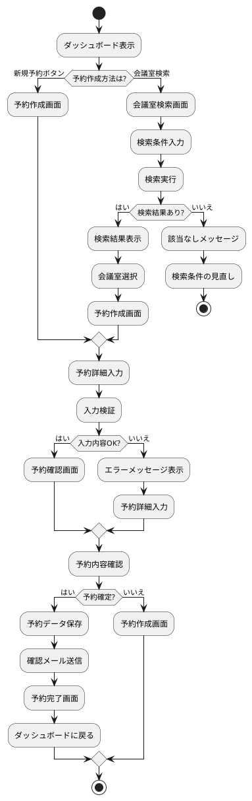

# UI設計書 - 会議室予約システム

## 1. 設計概要

### 1.1 UI設計アプローチ

**オブジェクト指向UI設計（OOUX）**を採用し、ユーザーが操作する「オブジェクト」を中心とした直感的なユーザーエクスペリエンスを提供します。

### 1.2 UI設計原則

1. **3クリック以内での操作完了** - 主要なタスクを最大3クリックで完了
2. **90%時間短縮** - 従来の予約方法と比較して大幅な効率化
3. **説明不要な直感的UI** - 初回利用でも迷わない操作性
4. **24時間セルフサービス** - いつでも利用可能な自律的操作

### 1.3 対象デバイス

- **デスクトップ** - 1200px以上（メイン利用環境）
- **タブレット** - 768px〜1199px（モバイル対応）
- **スマートフォン** - 767px以下（緊急時利用）

## 2. オブジェクト指向UI設計（OOUX）

### 2.1 主要オブジェクトの特定



### 2.2 オブジェクトのアクション定義

#### User（ユーザー）
- **Create**: 会員登録（スタッフ操作）
- **Read**: プロフィール確認
- **Update**: 情報変更
- **Delete**: 退会処理（論理削除）

#### Room（会議室）
- **Create**: 会議室追加（スタッフ操作）
- **Read**: 詳細表示、検索
- **Update**: 情報更新（スタッフ操作）
- **Delete**: 削除（スタッフ操作）

#### Reservation（予約）
- **Create**: 新規予約
- **Read**: 予約確認、一覧表示
- **Update**: 予約変更（スタッフ操作）
- **Delete**: キャンセル

#### Inquiry（問い合わせ）
- **Create**: 問い合わせ送信
- **Read**: 問い合わせ確認
- **Update**: 回答更新（スタッフ操作）

## 3. 画面構成とレイアウト設計

### 3.1 全体レイアウト構造



### 3.2 レスポンシブ対応

#### デスクトップ（1200px以上）
- 左サイドナビゲーション + メインコンテンツの2カラムレイアウト
- サイドナビゲーション幅：240px固定

#### タブレット（768px〜1199px）  
- 折りたたみ可能なサイドナビゲーション
- ハンバーガーメニューでナビゲーション表示

#### スマートフォン（767px以下）
- トップナビゲーション + ボトムナビゲーション
- スワイプジェスチャーによる画面切り替え

## 4. 主要画面設計

### 4.1 ダッシュボード画面



### 4.2 会議室検索画面



### 4.3 予約作成画面



### 4.4 予約確認画面



### 4.5 予約一覧画面



## 5. 画面遷移フロー

### 5.1 メイン画面遷移



### 5.2 予約フロー詳細



## 6. インタラクション設計

### 6.1 3クリック以内の操作フロー

#### 新規予約（最短パス）
1. **1クリック目**: ダッシュボード → 「新規予約」ボタン
2. **2クリック目**: 予約情報入力 → 「確認画面へ」ボタン  
3. **3クリック目**: 予約確認 → 「予約確定」ボタン

#### 会議室検索・予約
1. **1クリック目**: ダッシュボード → 「会議室検索」ボタン
2. **2クリック目**: 検索結果 → 「予約する」ボタン
3. **3クリック目**: 予約確認 → 「予約確定」ボタン

### 6.2 時間短縮のためのUI工夫

#### オートコンプリート機能
- **利用目的**: よく使用される目的を候補表示
- **参加人数**: 過去の利用実績から推測
- **時間設定**: 1時間単位での設定をデフォルト

#### スマートデフォルト
- **利用日**: 当日または翌営業日を自動設定
- **時間**: 現在時刻+2時間を開始時刻に設定
- **会議室**: 参加人数に適した部屋を優先表示

#### ワンクリック操作
- **お気に入り会議室**: よく使用する部屋をワンクリック予約
- **定期予約**: 同じ条件での繰り返し予約
- **緊急予約**: 即座に利用可能な部屋の優先表示

## 7. ユーザビリティ設計

### 7.1 アクセシビリティ対応

#### WCAG 2.1 AA準拠
- **キーボードナビゲーション**: Tab移動での全操作対応
- **スクリーンリーダー**: ARIA属性による適切な情報提供
- **カラーコントラスト**: 4.5:1以上のコントラスト比確保
- **フォーカス表示**: 明確なフォーカスインジケーター

#### 多様性への配慮
- **フォントサイズ**: 200%拡大まで対応
- **音声入力**: 音声での検索・予約操作
- **色覚サポート**: 色に依存しない情報伝達

### 7.2 エラーハンドリング

#### バリデーション
- **リアルタイム検証**: 入力と同時にエラー表示
- **建設的なエラーメッセージ**: 解決方法を明示
- **エラー位置の明示**: 問題箇所への誘導

#### エラー回復
- **自動保存**: 入力内容の一時保存
- **戻る機能**: 前の状態への復帰
- **代替案提示**: エラー時の選択肢表示

### 7.3 パフォーマンス最適化

#### 読み込み時間短縮
- **遅延読み込み**: 非重要コンテンツの後読み込み
- **キャッシュ活用**: 頻繁にアクセスするデータのキャッシュ
- **プリロード**: 次アクションで必要なデータの先読み

#### レスポンシブ表示
- **スケルトンスクリーン**: 読み込み中の構造表示
- **インクリメンタル表示**: 部分的なデータ表示
- **オフライン対応**: 基本機能のオフライン利用

## 8. デザインシステム

### 8.1 カラーパレット

```plantuml
@startuml
colors
' Primary Colors
#blue50 : Primary 50 (Background)
#blue500 : Primary 500 (Main)
#blue600 : Primary 600 (Hover)
#blue700 : Primary 700 (Active)

' Semantic Colors  
#green500 : Success
#yellow500 : Warning
#red500 : Error
#blue500 : Info

' Neutral Colors
#gray50 : Gray 50 (Background)
#gray300 : Gray 300 (Border)
#gray600 : Gray 600 (Text Secondary)
#gray900 : Gray 900 (Text Primary)
@enduml
```

### 8.2 タイポグラフィ

#### フォントスケール
- **H1**: 2rem (32px) - ページタイトル
- **H2**: 1.5rem (24px) - セクションタイトル  
- **H3**: 1.25rem (20px) - サブセクション
- **Body**: 1rem (16px) - 本文
- **Small**: 0.875rem (14px) - 補足情報

#### フォントファミリー
- **プライマリ**: 'Inter', system-ui, sans-serif
- **モノスペース**: 'JetBrains Mono', monospace

### 8.3 スペーシング

#### 基本スペーシング単位
- **xs**: 4px
- **sm**: 8px  
- **md**: 16px
- **lg**: 24px
- **xl**: 32px
- **2xl**: 48px

## 9. 実装ガイドライン

### 9.1 コンポーネント設計

#### Atomic Design適用
- **Atoms**: Button, Input, Label, Icon
- **Molecules**: SearchForm, ReservationCard, DatePicker
- **Organisms**: Header, Sidebar, ReservationList
- **Templates**: PageLayout, ModalLayout
- **Pages**: Dashboard, ReservationCreate, RoomSearch

#### 状態管理パターン
- **Local State**: useState, useReducer (コンポーネント内状態)
- **Global State**: Zustand (ユーザー情報、UI状態)
- **Server State**: React Query (API データ、キャッシュ)

### 9.2 パフォーマンス最適化

#### 仮想化
- **大量データ**: react-window による仮想スクロール
- **ページネーション**: 無限スクロールと従来型の併用
- **画像最適化**: 遅延読み込みとWebP対応

#### バンドル最適化
- **コード分割**: ルートベースの動的インポート
- **Tree Shaking**: 未使用コードの除去
- **圧縮**: Gzip/Brotli圧縮の適用

## 10. テスト戦略

### 10.1 ユーザビリティテスト

#### 対象ユーザー
- **メインユーザー**: オフィス勤務者（25-45歳）
- **サブユーザー**: 管理者・スタッフ（30-55歳）
- **アクセシビリティ**: スクリーンリーダー利用者

#### テストシナリオ
1. **初回利用**: 会員登録から初回予約まで
2. **日常利用**: 定期的な会議室予約
3. **緊急利用**: 急な会議での即時予約
4. **管理業務**: スタッフによる管理作業

### 10.2 A/Bテスト

#### テスト対象
- **予約フロー**: 3ステップ vs 2ステップ予約
- **検索UI**: フィルター配置の最適化
- **CTAボタン**: ボタンテキストとカラーの効果測定

## 11. 移行戦略

### 11.1 段階的リリース

#### Phase 1: Core MVP
- 基本的な予約・検索機能
- シンプルなダッシュボード
- 必須のユーザー管理機能

#### Phase 2: Enhanced UX  
- 高度な検索フィルター
- お気に入り機能
- 通知機能

#### Phase 3: Advanced Features
- 定期予約機能
- レポート・分析機能
- モバイルアプリ連携

### 11.2 ユーザー教育

#### オンボーディング
- **初回チュートリアル**: 主要機能の案内
- **ガイドツアー**: インタラクティブな機能説明
- **ヘルプセンター**: FAQ と操作ガイド

## 12. 成功指標（KPI）

### 12.1 効率性指標
- **予約完了時間**: 90%短縮目標達成
- **操作クリック数**: 平均3クリック以内
- **エラー発生率**: 5%以下

### 12.2 ユーザビリティ指標
- **ユーザー満足度**: NPS 70以上
- **タスク完了率**: 95%以上
- **離脱率**: 予約フロー 10%以下

### 12.3 アクセシビリティ指標
- **WCAG準拠**: AA評価達成
- **キーボード操作**: 100%対応
- **スクリーンリーダー**: 問題なし

この UI設計書により、ユーザー中心の直感的で効率的な会議室予約システムのユーザーインターフェースを実現します。