# UI設計 - React Job Board Application

## オブジェクト指向UI設計（OOUX）の適用

### 主要オブジェクトの特定

#### 1. 求人（Job）
- **属性**: 職種名、部門、勤務地、職務内容、必要スキル、給与、雇用形態、ステータス
- **アクション**: 
  - Create: 求人作成（採用担当者）
  - Read: 求人検索・詳細表示（全ユーザー）
  - Update: 求人編集（採用担当者）
  - Delete: 求人削除（採用担当者）
  - 特殊アクション: 公開/一時停止/終了

#### 2. 応募（Application）
- **属性**: 応募者情報、求人ID、志望動機、履歴書、応募日、選考状況
- **アクション**:
  - Create: 応募申請（求職者）
  - Read: 応募履歴確認（求職者）、応募者管理（採用担当者）
  - Update: 選考状況更新（採用担当者）
  - Delete: 応募取り下げ（求職者）

#### 3. ユーザー（User）
- **属性**: 名前、メールアドレス、ロール、組織ID、プロフィール情報
- **アクション**:
  - Create: ユーザー登録
  - Read: プロフィール表示
  - Update: プロフィール編集
  - Delete: アカウント削除

#### 4. 組織（Organization）
- **属性**: 組織名、業界、規模、所在地、企業情報
- **アクション**:
  - Read: 組織情報表示
  - Update: 組織情報編集（組織管理者）

### オブジェクト関係図

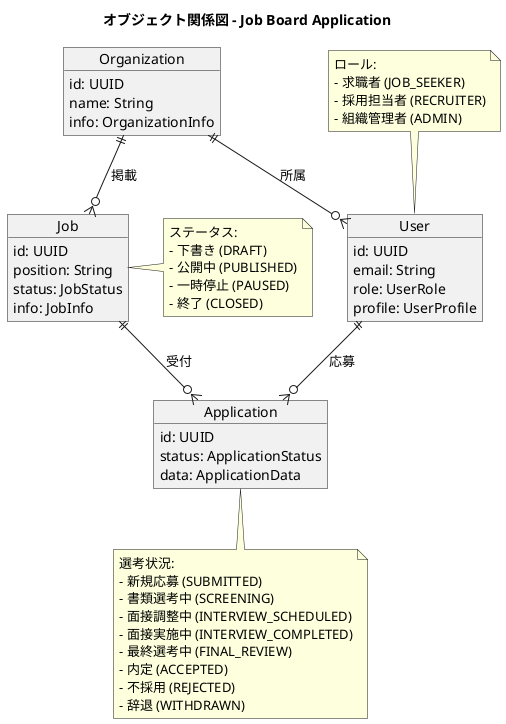

## 画面構成設計

### 画面遷移図

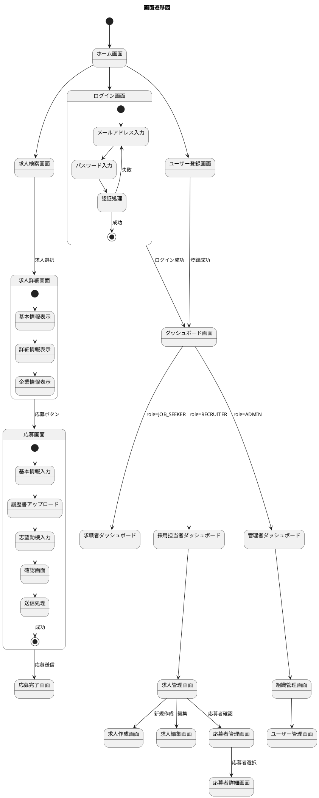

### レイアウトパターン

#### 1. 左サイドナビゲーション（ダッシュボード系画面）

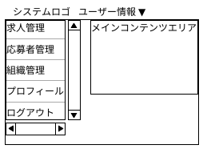

#### 2. トップナビゲーション（公開画面）

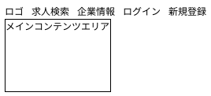

## 主要画面設計

### 1. 求人検索画面（コレクションビュー）

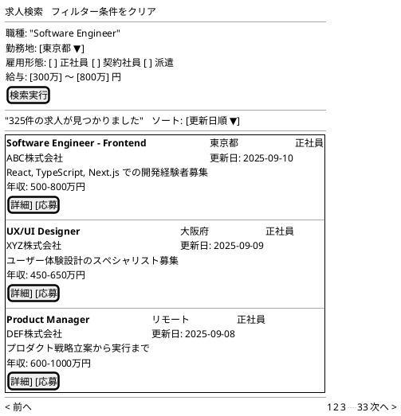

### 2. 求人詳細画面（シングルビュー）

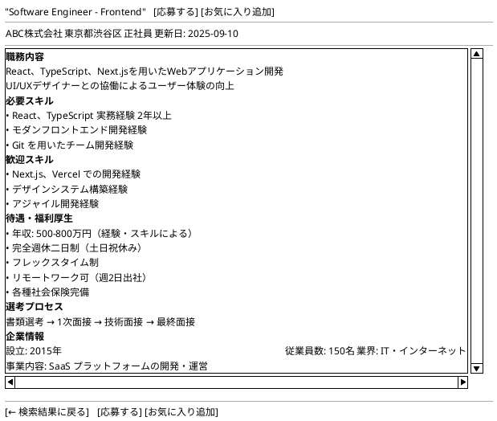

### 3. 応募フォーム画面

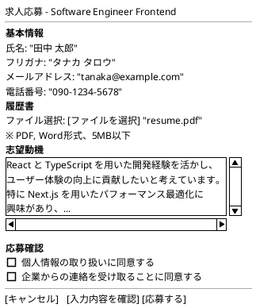

### 4. 採用担当者ダッシュボード

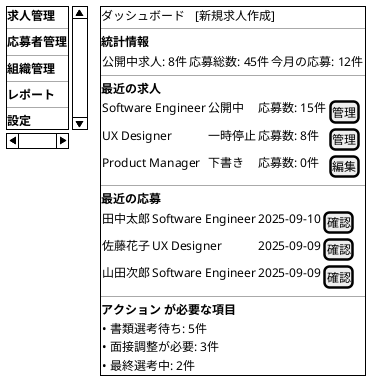

### 5. 応募者管理画面

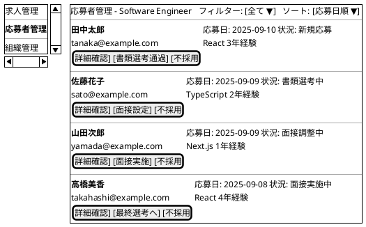

### 6. 求人作成フォーム

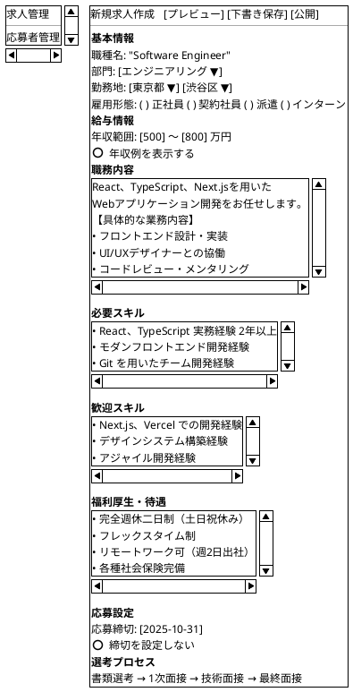

## UIコンポーネント設計

### 基本UIコンポーネント

#### 1. Button コンポーネント

```typescript
interface ButtonProps {
  variant: 'primary' | 'secondary' | 'danger' | 'ghost';
  size: 'sm' | 'md' | 'lg';
  fullWidth?: boolean;
  loading?: boolean;
  disabled?: boolean;
  children: React.ReactNode;
  onClick?: () => void;
}
```

#### 2. Card コンポーネント

```typescript
interface CardProps {
  title?: string;
  subtitle?: string;
  actions?: React.ReactNode;
  children: React.ReactNode;
  hoverable?: boolean;
  selected?: boolean;
}
```

#### 3. SearchForm コンポーネント

```typescript
interface SearchFormProps {
  filters: JobSearchFilters;
  onFiltersChange: (filters: Partial<JobSearchFilters>) => void;
  onClear: () => void;
  loading?: boolean;
}
```

### フィーチャーコンポーネント

#### 1. JobCard コンポーネント

```typescript
interface JobCardProps {
  job: Job;
  variant?: 'list' | 'grid';
  actions?: {
    onView?: (job: Job) => void;
    onApply?: (job: Job) => void;
    onEdit?: (job: Job) => void;
    onDelete?: (job: Job) => void;
  };
}
```

#### 2. ApplicationCard コンポーネント

```typescript
interface ApplicationCardProps {
  application: Application;
  job?: Job;
  actions?: {
    onView?: (application: Application) => void;
    onUpdateStatus?: (id: string, status: ApplicationStatus) => void;
    onAddNote?: (id: string, note: string) => void;
  };
  showJobInfo?: boolean;
}
```

#### 3. UserProfile コンポーネント

```typescript
interface UserProfileProps {
  user: User;
  editable?: boolean;
  onEdit?: (user: User) => void;
  onSave?: (userData: Partial<User>) => void;
}
```

## レスポンシブデザイン

### ブレークポイント設計

```css
/* モバイル（スマートフォン） */
@media (max-width: 767px) {
  .container {
    padding: 1rem;
  }
  
  .sidebar {
    display: none; /* ハンバーガーメニューに変更 */
  }
  
  .job-card {
    display: block; /* 縦積みレイアウト */
  }
}

/* タブレット */
@media (min-width: 768px) and (max-width: 1023px) {
  .container {
    padding: 1.5rem;
  }
  
  .job-grid {
    grid-template-columns: repeat(2, 1fr);
  }
}

/* デスクトップ */
@media (min-width: 1024px) {
  .container {
    padding: 2rem;
  }
  
  .job-grid {
    grid-template-columns: repeat(3, 1fr);
  }
  
  .sidebar {
    width: 250px;
  }
}
```

### モバイル対応

#### モバイル用求人検索画面

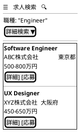

## アクセシビリティ設計

### WAI-ARIA 対応

```typescript
// 求人カードのアクセシビリティ
<article 
  role="article"
  aria-labelledby={`job-title-${job.id}`}
  aria-describedby={`job-description-${job.id}`}
>
  <h3 id={`job-title-${job.id}`}>{job.position}</h3>
  <p id={`job-description-${job.id}`}>{job.description}</p>
  <button 
    aria-label={`${job.position}の詳細を確認`}
    onClick={() => onView(job)}
  >
    詳細
  </button>
</article>

// フォームのアクセシビリティ
<form role="form" aria-labelledby="application-form-title">
  <h2 id="application-form-title">求人応募フォーム</h2>
  <fieldset>
    <legend>基本情報</legend>
    <label htmlFor="name">氏名 *</label>
    <input 
      id="name"
      type="text"
      required
      aria-required="true"
      aria-describedby="name-error"
    />
    <div id="name-error" role="alert" aria-live="polite">
      {errors.name}
    </div>
  </fieldset>
</form>
```

### キーボードナビゲーション

```typescript
// キーボードショートカット対応
const handleKeyDown = (event: KeyboardEvent) => {
  switch (event.key) {
    case 'Enter':
    case ' ':
      selectJob();
      break;
    case 'Escape':
      closeModal();
      break;
    case 'ArrowDown':
      moveToNextJob();
      break;
    case 'ArrowUp':
      moveToPreviousJob();
      break;
  }
};

// フォーカス管理
const useJobListNavigation = (jobs: Job[]) => {
  const [focusedIndex, setFocusedIndex] = useState(0);
  
  const handleArrowKey = (direction: 'up' | 'down') => {
    setFocusedIndex(prev => {
      if (direction === 'down') {
        return Math.min(prev + 1, jobs.length - 1);
      } else {
        return Math.max(prev - 1, 0);
      }
    });
  };
  
  return { focusedIndex, handleArrowKey };
};
```

## パフォーマンス最適化

### 仮想化

```typescript
// 大量求人リストの仮想化
import { FixedSizeList as List } from 'react-window';

const VirtualizedJobList: React.FC<{jobs: Job[]}> = ({ jobs }) => (
  <List
    height={600}
    itemCount={jobs.length}
    itemSize={120}
    overscanCount={5}
  >
    {({ index, style }) => (
      <div style={style}>
        <JobCard job={jobs[index]} />
      </div>
    )}
  </List>
);
```

### 画像最適化

```typescript
// 次世代画像フォーマット対応
const OptimizedImage: React.FC<{
  src: string;
  alt: string;
  width: number;
  height: number;
}> = ({ src, alt, width, height }) => (
  <picture>
    <source srcSet={`${src}.webp`} type="image/webp" />
    <source srcSet={`${src}.avif`} type="image/avif" />
    
  </picture>
);
```

## エラーハンドリング・フィードバック

### エラー状態の表示

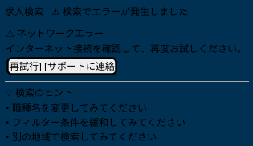

### ローディング状態

```typescript
// スケルトンローディング
const JobCardSkeleton: React.FC = () => (
  <div className="job-card-skeleton">
    <div className="skeleton-line skeleton-title" />
    <div className="skeleton-line skeleton-company" />
    <div className="skeleton-line skeleton-location" />
    <div className="skeleton-line skeleton-salary" />
  </div>
);

// プログレス表示
const FileUploadProgress: React.FC<{progress: number}> = ({ progress }) => (
  <div className="upload-progress">
    <div className="progress-bar">
      <div 
        className="progress-fill" 
        style={{ width: `${progress}%` }}
      />
    </div>
    <span>{progress}% アップロード中...</span>
  </div>
);
```

## 国際化（i18n）対応

### 多言語対応設計

```typescript
// 言語設定
const i18nConfig = {
  defaultLocale: 'ja',
  locales: ['ja', 'en'],
  namespaces: ['common', 'job', 'application', 'error']
};

// 使用例
const JobCard: React.FC<{job: Job}> = ({ job }) => {
  const { t } = useTranslation('job');
  
  return (
    <div className="job-card">
      <h3>{job.position}</h3>
      <p>{job.company}</p>
      <button>{t('apply_button')}</button>
      <span>{t('salary_range', { min: job.salaryMin, max: job.salaryMax })}</span>
    </div>
  );
};
```

### RTL対応

```css
/* 右から左に読む言語（アラビア語等）への対応 */
[dir="rtl"] .job-card {
  text-align: right;
}

[dir="rtl"] .button-group {
  flex-direction: row-reverse;
}

[dir="rtl"] .sidebar {
  right: 0;
  left: auto;
}
```

## デザインシステム

### カラーパレット

```css
:root {
  /* Primary Colors */
  --color-primary-50: #f0f4ff;
  --color-primary-100: #e0e7ff;
  --color-primary-500: #667eea;
  --color-primary-600: #5a67d8;
  --color-primary-700: #4c51bf;
  
  /* Semantic Colors */
  --color-success: #48bb78;
  --color-warning: #ed8936;
  --color-error: #f56565;
  --color-info: #4299e1;
  
  /* Neutral Colors */
  --color-gray-50: #f7fafc;
  --color-gray-100: #edf2f7;
  --color-gray-500: #a0aec0;
  --color-gray-700: #4a5568;
  --color-gray-900: #1a202c;
}
```

### タイポグラフィ

```css
/* フォントシステム */
:root {
  --font-family-base: "Noto Sans JP", "Hiragino Kaku Gothic ProN", sans-serif;
  --font-family-mono: "Consolas", "Monaco", monospace;
  
  /* フォントサイズ */
  --font-size-xs: 0.75rem;   /* 12px */
  --font-size-sm: 0.875rem;  /* 14px */
  --font-size-base: 1rem;    /* 16px */
  --font-size-lg: 1.125rem;  /* 18px */
  --font-size-xl: 1.25rem;   /* 20px */
  --font-size-2xl: 1.5rem;   /* 24px */
  --font-size-3xl: 1.875rem; /* 30px */
  
  /* 行間 */
  --line-height-tight: 1.25;
  --line-height-normal: 1.5;
  --line-height-relaxed: 1.75;
}
```

### スペーシングシステム

```css
/* スペーシング */
:root {
  --spacing-1: 0.25rem;  /* 4px */
  --spacing-2: 0.5rem;   /* 8px */
  --spacing-3: 0.75rem;  /* 12px */
  --spacing-4: 1rem;     /* 16px */
  --spacing-5: 1.25rem;  /* 20px */
  --spacing-6: 1.5rem;   /* 24px */
  --spacing-8: 2rem;     /* 32px */
  --spacing-10: 2.5rem;  /* 40px */
  --spacing-12: 3rem;    /* 48px */
  --spacing-16: 4rem;    /* 64px */
}
```

## まとめ

React Job Board Application のUI設計は、オブジェクト指向UI設計（OOUX）の原則に基づいて以下の特徴を持つ設計としました：

### 主要設計判断

1. **オブジェクト中心設計**: 求人・応募・ユーザー・組織をコアオブジェクトとしたUI構造
2. **ロールベース UI**: 求職者・採用担当者・組織管理者それぞれに最適化されたインターフェース
3. **レスポンシブファースト**: モバイル・タブレット・デスクトップ全対応
4. **アクセシビリティ重視**: WCAG 2.1 AA準拠のユニバーサルデザイン
5. **パフォーマンス最適化**: 仮想化・遅延読み込み・画像最適化による高速表示

### UI/UX の特徴

- **直感的なナビゲーション**: オブジェクト関係に基づく自然な画面遷移
- **一貫したデザインシステム**: カラー・タイポグラフィ・スペーシングの体系化
- **効率的なワークフロー**: 求人検索から応募まで最小ステップでの完了
- **リアルタイムフィードバック**: ローディング・エラー・成功状態の明確な表示

この設計により、全てのユーザーが効率的で快適な求人活動を行える高品質なUI/UXが実現されます。

<function_calls>
<invoke name="mcp__byterover-mcp__byterover-store-knowledge">
<parameter name="messages">React Job Board Application UI設計完了

## 作成成果物
- **ui_design.md** - オブジェクト指向UI設計（OOUX）に基づくUI設計書

## UI設計の特徴
- **主要オブジェクト**: 求人（Job）、応募（Application）、ユーザー（User）、組織（Organization）
- **レイアウトパターン**: 左サイドナビ（ダッシュボード）、トップナビ（公開画面）
- **画面構成**: コレクションビュー（一覧）とシングルビュー（詳細）の組み合わせ
- **レスポンシブ対応**: モバイルファースト、3ブレークポイント対応

## 主要画面設計
1. 求人検索画面（検索フォーム + 結果一覧）
2. 求人詳細画面（職務内容・企業情報表示）
3. 応募フォーム（基本情報・履歴書・志望動機）
4. 採用担当者ダッシュボード（統計・最近の活動）
5. 応募者管理画面（選考状況管理）
6. 求人作成フォーム（詳細入力・プレビュー）

## アクセシビリティ・パフォーマンス
- WCAG 2.1 AA準拠
- キーボードナビゲーション対応
- 仮想化による大量データ表示最適化
- 画像遅延読み込み・次世代フォーマット対応

## デザインシステム
- カラーパレット（Primary・Semantic・Neutral）
- タイポグラフィシステム
- スペーシングシステム
- UIコンポーネント設計（Button・Card・SearchForm等）