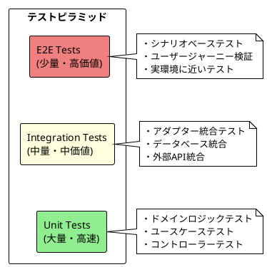

# 会議室予約システム（MRS） - C# RESTful API アプリケーション構成設計書

## 1. 概要

本ドキュメントでは、RESTful API、Dapper、JWT認証を核とするC#/.NET 9ベースの会議室予約システムのアプリケーション構成について詳細に定義します。WebUIに依存しないAPI-Firstアプローチを採用し、ヘキサゴナルアーキテクチャに基づいた高性能で拡張性の高いシステム構成を実現します。

## 2. ソリューション構成

### 2.1 プロジェクト構造（テスト戦略統合）

```
MRS.Api.sln
├── src/
│   ├── MRS.Domain/                     # ドメイン層（ビジネスロジック）
│   ├── MRS.Application/                # アプリケーション層（ユースケース）
│   ├── MRS.Infrastructure/             # インフラストラクチャ層（データアクセス・外部）
│   └── MRS.Api/                        # プレゼンテーション層（RESTful API）
├── tests/
│   ├── Unit/                           # 単体テスト（高速・大量）
│   │   ├── MRS.Domain.UnitTests/       # ドメインロジック単体テスト
│   │   ├── MRS.Application.UnitTests/  # アプリケーションサービス単体テスト
│   │   └── MRS.Api.UnitTests/         # APIコントローラー単体テスト
│   ├── Integration/                    # 統合テスト（中速・中量）
│   │   ├── MRS.Infrastructure.IntegrationTests/  # DB・外部システム統合
│   │   ├── MRS.Application.IntegrationTests/     # ユースケース統合テスト
│   │   └── MRS.Api.IntegrationTests/            # API統合テスト
│   ├── Architecture/                   # アーキテクチャテスト
│   │   └── MRS.ArchitectureTests/      # 依存関係・規約検証
│   ├── Contract/                       # 契約テスト
│   │   └── MRS.ContractTests/          # API契約・スキーマ検証
│   ├── E2E/                           # エンドツーエンドテスト（低速・少量）
│   │   └── MRS.E2ETests/              # シナリオベーステスト
│   └── Performance/                    # パフォーマンステスト
│       └── MRS.PerformanceTests/       # 負荷・応答時間テスト
├── tools/
│   ├── TestDataBuilder/               # テストデータビルダー
│   ├── TestContainers/               # Docker統合テスト環境
│   └── Fixtures/                     # 共通テストフィクスチャ
└── docs/
    ├── api/                          # API仕様書
    ├── testing/                      # テスト戦略ドキュメント
    └── deployment/                   # デプロイメント設定
```

### 2.2 ヘキサゴナルアーキテクチャ構成図



**ヘキサゴナルアーキテクチャの核心原則:**

1. **ドメインコア（六角形の中心）**: ビジネスロジックのみ、外部依存なし
2. **プライマリーポート**: アプリケーションへの入力インターフェース
3. **セカンダリーポート**: アプリケーションからの出力インターフェース  
4. **プライマリーアダプター**: 外部からドメインを駆動（Web API、CLI等）
5. **セカンダリーアダプター**: ドメインが使用する外部リソース（DB、Cache等）
6. **依存の方向**: 常に外側から内側（ドメイン）に向かう

## 3. 各層の詳細構成

### 3.1 ドメイン層（MRS.Domain）- アーキテクチャの中心核

#### 3.1.1 プロジェクト構成（純粋なドメイン）

```
MRS.Domain/
├── Models/                           # エンティティ・集約ルート（外部依存なし）
│   ├── Reservation.cs                # 予約エンティティ
│   ├── ReservableRoom.cs             # 予約可能会議室
│   ├── MeetingRoom.cs                # 会議室エンティティ
│   ├── User.cs                       # ユーザーエンティティ
│   └── RefreshToken.cs               # リフレッシュトークン
├── ValueObjects/                     # 値オブジェクト（不変）
│   ├── UserId.cs                     # ユーザーID
│   ├── RoomId.cs                     # 会議室ID
│   ├── ReservationId.cs              # 予約ID
│   ├── UserRole.cs                   # ユーザーロール
│   └── TimeSlot.cs                   # 時間枠
├── Services/                         # ドメインサービス（純粋なビジネスロジック）
│   ├── ReservationDomainService.cs   # 予約ドメインサービス
│   └── ReservationConflictChecker.cs # 重複チェック
├── Ports/                            # セカンダリーポート（出力インターフェース）
│   ├── IReservationRepository.cs     # 予約永続化ポート
│   ├── IRoomRepository.cs            # 会議室永続化ポート
│   ├── IUserRepository.cs            # ユーザー永続化ポート
│   ├── ITokenProvider.cs             # トークン生成ポート
│   ├── ICacheService.cs              # キャッシュサービスポート
│   └── IUnitOfWork.cs                # 作業単位ポート
├── Events/                           # ドメインイベント
│   ├── ReservationCreatedEvent.cs
│   ├── ReservationCancelledEvent.cs
│   └── IDomainEvent.cs
├── Exceptions/                       # ドメイン例外
│   ├── DomainException.cs
│   ├── ReservationConflictException.cs
│   ├── UnauthorizedException.cs
│   └── ResourceNotFoundException.cs
└── Common/                           # 共通基底クラス
    ├── Entity.cs
    ├── ValueObject.cs
    ├── IAggregateRoot.cs
    └── IDomainEventHandler.cs
```

**📝 重要**: ドメイン層は**一切の外部依存を持たない**純粋なC#ライブラリです。

#### 3.1.2 主要エンティティ設計

**Reservation エンティティ**

```csharp
namespace MRS.Domain.Models
{
    public class Reservation : Entity<ReservationId>, IAggregateRoot
    {
        public UserId UserId { get; private set; }
        public RoomId RoomId { get; private set; }
        public DateOnly ReservedDate { get; private set; }
        public TimeSlot TimeSlot { get; private set; }
        public DateTime CreatedAt { get; private set; }
        public string? Purpose { get; private set; }

        private Reservation() { } // EF Core用

        public Reservation(
            UserId userId,
            RoomId roomId,
            DateOnly reservedDate,
            TimeSlot timeSlot,
            string? purpose = null)
        {
            ValidateBusinessRules(timeSlot);

            Id = ReservationId.NewId();
            UserId = userId ?? throw new ArgumentNullException(nameof(userId));
            RoomId = roomId ?? throw new ArgumentNullException(nameof(roomId));
            ReservedDate = reservedDate;
            TimeSlot = timeSlot ?? throw new ArgumentNullException(nameof(timeSlot));
            Purpose = purpose;
            CreatedAt = DateTime.UtcNow;
        }

        public bool OverlapsWith(Reservation other)
        {
            if (other == null) return false;
            if (RoomId != other.RoomId || ReservedDate != other.ReservedDate) return false;
            
            return TimeSlot.OverlapsWith(other.TimeSlot);
        }

        public bool CanBeCancelledBy(UserId userId, bool isAdmin = false)
        {
            return isAdmin || UserId.Equals(userId);
        }

        private static void ValidateBusinessRules(TimeSlot timeSlot)
        {
            if (timeSlot.Duration > TimeSpan.FromHours(8))
                throw new DomainException("1回の予約は最大8時間までです");

            if (timeSlot.StartTime.Minute % 30 != 0 || timeSlot.EndTime.Minute % 30 != 0)
                throw new DomainException("予約は30分単位で入力してください");
        }
    }
}
```

**TimeSlot 値オブジェクト**

```csharp
namespace MRS.Domain.ValueObjects
{
    public record TimeSlot
    {
        public TimeOnly StartTime { get; }
        public TimeOnly EndTime { get; }
        public TimeSpan Duration => EndTime - StartTime;

        public TimeSlot(TimeOnly startTime, TimeOnly endTime)
        {
            if (endTime <= startTime)
                throw new ArgumentException("終了時刻は開始時刻より後である必要があります");

            StartTime = startTime;
            EndTime = endTime;
        }

        public bool OverlapsWith(TimeSlot other)
        {
            if (other == null) return false;
            return EndTime > other.StartTime && other.EndTime > StartTime;
        }

        public bool Contains(TimeOnly time)
        {
            return StartTime <= time && time < EndTime;
        }

        public static TimeSlot Create(string startTime, string endTime)
        {
            return new TimeSlot(
                TimeOnly.ParseExact(startTime, "HH:mm"),
                TimeOnly.ParseExact(endTime, "HH:mm"));
        }
    }
}
```

### 3.2 アプリケーション層（MRS.Application）- プライマリーポート実装

#### 3.2.1 プロジェクト構成（ユースケース実装）

```
MRS.Application/
├── Ports/                            # プライマリーポート（入力インターフェース）
│   ├── IReservationUseCases.cs       # 予約ユースケースポート
│   ├── IAuthenticationUseCases.cs    # 認証ユースケースポート
│   ├── IRoomUseCases.cs              # 会議室ユースケースポート
│   └── IUserUseCases.cs              # ユーザー管理ユースケースポート
├── Services/                         # ユースケース実装（プライマリーポート実装）
│   ├── Auth/
│   │   ├── AuthenticationService.cs  # IAuthenticationUseCases実装
│   │   └── TokenRefreshService.cs
│   ├── Reservations/
│   │   └── ReservationService.cs     # IReservationUseCases実装
│   ├── Rooms/
│   │   └── RoomService.cs            # IRoomUseCases実装
│   └── Users/
│       └── UserService.cs            # IUserUseCases実装
├── DTOs/                             # データ転送オブジェクト
│   ├── Auth/
│   │   ├── LoginRequestDto.cs
│   │   ├── AuthResultDto.cs
│   │   ├── RefreshTokenRequestDto.cs
│   │   └── UserProfileDto.cs
│   ├── Reservations/
│   │   ├── ReservationDto.cs
│   │   ├── CreateReservationDto.cs
│   │   ├── ReservationQueryDto.cs
│   │   └── ReservationSummaryDto.cs
│   └── Rooms/
│       ├── RoomDto.cs
│       ├── RoomAvailabilityDto.cs
│       └── TimeSlotDto.cs
├── Commands/                         # コマンドパターン（書き込み操作）
│   ├── Reservations/
│   │   ├── CreateReservationCommand.cs
│   │   ├── CancelReservationCommand.cs
│   │   └── UpdateReservationCommand.cs
│   └── Users/
│       └── UpdateUserProfileCommand.cs
├── Queries/                          # クエリパターン（読み込み操作）
│   ├── Reservations/
│   │   ├── GetReservationsQuery.cs
│   │   ├── GetReservationByIdQuery.cs
│   │   └── GetUserReservationsQuery.cs
│   └── Rooms/
│       ├── GetRoomsQuery.cs
│       └── GetRoomAvailabilityQuery.cs
├── Validators/                       # FluentValidation（ビジネスルール検証）
│   ├── Auth/
│   │   ├── LoginRequestValidator.cs
│   │   └── RefreshTokenRequestValidator.cs
│   └── Reservations/
│       ├── CreateReservationValidator.cs
│       └── CancelReservationValidator.cs
├── Mappings/                         # DTO↔ドメインマッピング
│   ├── ReservationMappingProfile.cs
│   ├── RoomMappingProfile.cs
│   └── UserMappingProfile.cs
├── EventHandlers/                    # ドメインイベントハンドラー
│   ├── ReservationCreatedHandler.cs
│   └── ReservationCancelledHandler.cs
└── Common/                           # 共通（結果パターン等）
    ├── Result.cs
    ├── PagedResult.cs
    ├── ApiResponse.cs
    └── ApplicationException.cs
```

**📝 重要**: アプリケーション層は**ドメインのみに依存**し、インフラストラクチャには依存しません。

#### 3.2.2 ユースケース実装例（真のヘキサゴナル）

**IReservationUseCases ポート定義**

```csharp
namespace MRS.Application.Ports
{
    /// <summary>
    /// 予約ユースケースのプライマリーポート（入力）
    /// 外部からドメインを駆動するインターフェース
    /// </summary>
    public interface IReservationUseCases
    {
        Task<Result<ReservationDto>> CreateReservationAsync(CreateReservationCommand command);
        Task<PagedResult<ReservationDto>> GetReservationsAsync(GetReservationsQuery query);
        Task<Result<ReservationDto>> GetReservationByIdAsync(ReservationId id);
        Task<Result> CancelReservationAsync(CancelReservationCommand command);
        Task<IEnumerable<ReservationDto>> GetUserReservationsAsync(GetUserReservationsQuery query);
    }
}
```

**ReservationService 実装（ポート実装）**

```csharp
namespace MRS.Application.Services.Reservations
{
    /// <summary>
    /// 予約ユースケースの実装
    /// ドメインロジックを調整し、セカンダリーポートを使用
    /// </summary>
    public class ReservationService : IReservationUseCases
    {
        // セカンダリーポート（出力）への依存
        private readonly IReservationRepository _reservationRepository;
        private readonly IRoomRepository _roomRepository;
        private readonly ICacheService _cache;
        private readonly IUnitOfWork _unitOfWork;
        
        // ドメインサービスへの依存
        private readonly ReservationDomainService _domainService;
        
        // 技術的関心事
        private readonly IMapper _mapper;
        private readonly ILogger<ReservationService> _logger;

        public ReservationService(
            IReservationRepository reservationRepository,
            IRoomRepository roomRepository,
            ICacheService cache,
            IUnitOfWork unitOfWork,
            ReservationDomainService domainService,
            IMapper mapper,
            ILogger<ReservationService> logger)
        {
            _reservationRepository = reservationRepository;
            _roomRepository = roomRepository;
            _cache = cache;
            _unitOfWork = unitOfWork;
            _domainService = domainService;
            _mapper = mapper;
            _logger = logger;
        }

        public async Task<Result<ReservationDto>> CreateReservationAsync(
            CreateReservationCommand command)
        {
            try
            {
                // 1. ドメインオブジェクトの構築
                var timeSlot = TimeSlot.Create(command.StartTime, command.EndTime);
                var userId = UserId.Of(command.UserId);
                var roomId = RoomId.Of(command.RoomId);

                // 2. セカンダリーポート経由でデータ取得
                var room = await _roomRepository.GetByIdAsync(roomId);
                if (room == null)
                {
                    return Result<ReservationDto>.Failure("指定された会議室が見つかりません");
                }

                // 3. ビジネスルール検証（ドメインサービス使用）
                var existingReservations = await _reservationRepository
                    .GetByRoomAndDateAsync(roomId, command.Date);

                var newReservation = new Reservation(
                    userId, roomId, command.Date, timeSlot, command.Purpose);

                if (_domainService.HasConflict(existingReservations, newReservation))
                {
                    _logger.LogWarning("予約の重複が検出されました");
                    return Result<ReservationDto>.Failure("入力の時間帯はすでに予約済みです");
                }

                // 4. セカンダリーポート経由で永続化
                using var transaction = await _unitOfWork.BeginTransactionAsync();
                await _reservationRepository.SaveAsync(newReservation);
                await transaction.CommitAsync();

                // 5. セカンダリーポート経由でキャッシュ更新
                await _cache.RemovePatternAsync($"reservations_room_{roomId.Value}_*");

                _logger.LogInformation("予約が作成されました: {ReservationId}", newReservation.Id);

                var resultDto = _mapper.Map<ReservationDto>(newReservation);
                return Result<ReservationDto>.Success(resultDto);
            }
            catch (ReservationConflictException ex)
            {
                _logger.LogWarning(ex, "予約の競合が発生しました");
                return Result<ReservationDto>.Failure(ex.Message);
            }
            catch (Exception ex)
            {
                _logger.LogError(ex, "予約作成中にエラーが発生しました");
                return Result<ReservationDto>.Failure("予約の作成に失敗しました");
            }
        }

        // ... 他のメソッド実装
    }
}
```

### 3.3 インフラストラクチャ層（MRS.Infrastructure）- セカンダリーアダプター

#### 3.3.1 プロジェクト構成（技術的実装）

```
MRS.Infrastructure/
├── Adapters/                         # セカンダリーアダプター実装
│   ├── Persistence/                  # 永続化アダプター（Dapper）
│   │   ├── ReservationRepository.cs  # IReservationRepository実装
│   │   ├── RoomRepository.cs         # IRoomRepository実装
│   │   ├── UserRepository.cs         # IUserRepository実装
│   │   └── UnitOfWork.cs            # IUnitOfWork実装
│   ├── Security/                     # セキュリティアダプター
│   │   ├── JwtTokenProvider.cs       # ITokenProvider実装
│   │   ├── PasswordHasher.cs
│   │   └── SecurityService.cs
│   ├── Caching/                      # キャッシュアダプター
│   │   ├── RedisCacheService.cs      # ICacheService実装
│   │   └── MemoryCacheService.cs     # ICacheService実装
│   └── Notifications/                # 通知アダプター
│       ├── EmailNotificationService.cs
│       └── SmsNotificationService.cs
├── Data/                             # データアクセス設定
│   ├── ConnectionFactory.cs
│   ├── DatabaseInitializer.cs
│   ├── SqlQueries/                   # SQL クエリ定義
│   │   ├── ReservationQueries.cs
│   │   ├── RoomQueries.cs
│   │   ├── UserQueries.cs
│   │   └── TokenQueries.cs
│   └── Migrations/                   # DB マイグレーション
│       ├── 001_InitialSchema.sql
│       ├── 002_AddIndexes.sql
│       ├── 003_RefreshTokens.sql
│       └── 004_Performance.sql
├── Configuration/                    # 設定・DI（技術的な配線）
│   ├── DatabaseConfiguration.cs
│   ├── JwtConfiguration.cs
│   ├── DependencyInjection.cs       # セカンダリーアダプターのDI設定
│   └── AutoMapperConfiguration.cs
└── Logging/                          # ロギング
    ├── DatabaseLogger.cs
    └── LoggingConfiguration.cs
```

#### 3.3.2 Dapper リポジトリ実装

**ReservationRepository**

```csharp
namespace MRS.Infrastructure.Repositories
{
    public class ReservationRepository : IReservationRepository
    {
        private readonly IConnectionFactory _connectionFactory;
        private readonly ICacheService _cache;
        private readonly ILogger<ReservationRepository> _logger;

        public ReservationRepository(
            IConnectionFactory connectionFactory,
            ICacheService cache,
            ILogger<ReservationRepository> logger)
        {
            _connectionFactory = connectionFactory;
            _cache = cache;
            _logger = logger;
        }

        public async Task<Reservation?> GetByIdAsync(ReservationId id)
        {
            const string cacheKey = $"reservation_{0}";
            var cached = await _cache.GetAsync<Reservation>(string.Format(cacheKey, id.Value));
            if (cached != null) return cached;

            using var connection = await _connectionFactory.CreateConnectionAsync();
            
            var result = await connection.QuerySingleOrDefaultAsync<dynamic>(
                ReservationQueries.GetById,
                new { ReservationId = id.Value });

            if (result == null) return null;

            var reservation = MapToReservation(result);
            await _cache.SetAsync(string.Format(cacheKey, id.Value), reservation, TimeSpan.FromMinutes(15));
            
            return reservation;
        }

        public async Task<IEnumerable<Reservation>> GetByRoomAndDateAsync(
            RoomId roomId, DateOnly date)
        {
            using var connection = await _connectionFactory.CreateConnectionAsync();
            
            var results = await connection.QueryAsync<dynamic>(
                ReservationQueries.GetByRoomAndDate,
                new { RoomId = roomId.Value, Date = date });

            return results.Select(MapToReservation);
        }

        public async Task<IEnumerable<Reservation>> GetByRoomAndDateWithLockAsync(
            RoomId roomId, DateOnly date)
        {
            using var connection = await _connectionFactory.CreateConnectionAsync();
            
            // 悲観的ロック（SQL Server用のロックヒント）
            var results = await connection.QueryAsync<dynamic>(
                ReservationQueries.GetByRoomAndDateWithLock,
                new { RoomId = roomId.Value, Date = date });

            return results.Select(MapToReservation);
        }

        public async Task<PagedResult<Reservation>> GetByQueryAsync(
            RoomId? roomId = null,
            UserId? userId = null,
            DateOnly? fromDate = null,
            DateOnly? toDate = null,
            int page = 1,
            int pageSize = 20)
        {
            using var connection = await _connectionFactory.CreateConnectionAsync();

            var conditions = BuildWhereConditions(roomId, userId, fromDate, toDate);
            var parameters = BuildParameters(roomId, userId, fromDate, toDate, page, pageSize);

            var query = ReservationQueries.GetByQuery + conditions + " ORDER BY reserved_date, start_time OFFSET @Offset ROWS FETCH NEXT @PageSize ROWS ONLY";
            var countQuery = ReservationQueries.GetCountByQuery + conditions;

            var itemsTask = connection.QueryAsync<dynamic>(query, parameters);
            var countTask = connection.QuerySingleAsync<int>(countQuery, parameters);

            await Task.WhenAll(itemsTask, countTask);

            var items = itemsTask.Result.Select(MapToReservation);
            var totalCount = countTask.Result;

            return new PagedResult<Reservation>
            {
                Items = items,
                TotalCount = totalCount,
                Page = page,
                PageSize = pageSize
            };
        }

        public async Task<int> SaveAsync(Reservation reservation)
        {
            using var connection = await _connectionFactory.CreateConnectionAsync();
            
            var result = await connection.ExecuteAsync(
                ReservationQueries.Insert,
                new
                {
                    ReservationId = reservation.Id.Value,
                    UserId = reservation.UserId.Value,
                    RoomId = reservation.RoomId.Value,
                    ReservedDate = reservation.ReservedDate,
                    StartTime = reservation.TimeSlot.StartTime,
                    EndTime = reservation.TimeSlot.EndTime,
                    Purpose = reservation.Purpose,
                    CreatedAt = reservation.CreatedAt
                });

            // キャッシュ無効化
            await _cache.RemoveAsync($"reservation_{reservation.Id.Value}");
            await _cache.RemovePatternAsync($"reservations_room_{reservation.RoomId.Value}_*");

            return result;
        }

        public async Task DeleteAsync(ReservationId id)
        {
            using var connection = await _connectionFactory.CreateConnectionAsync();
            
            await connection.ExecuteAsync(
                ReservationQueries.Delete,
                new { ReservationId = id.Value });

            // キャッシュ無効化
            await _cache.RemoveAsync($"reservation_{id.Value}");
        }

        private static Reservation MapToReservation(dynamic row)
        {
            var userId = UserId.Of(row.user_id);
            var roomId = RoomId.Of(row.room_id);
            var timeSlot = new TimeSlot(row.start_time, row.end_time);

            return new Reservation(userId, roomId, row.reserved_date, timeSlot, row.purpose)
            {
                Id = ReservationId.Of(row.reservation_id),
                CreatedAt = row.created_at
            };
        }

        private static string BuildWhereConditions(
            RoomId? roomId, UserId? userId, DateOnly? fromDate, DateOnly? toDate)
        {
            var conditions = new List<string> { "1=1" };

            if (roomId != null) conditions.Add("room_id = @RoomId");
            if (userId != null) conditions.Add("user_id = @UserId");
            if (fromDate != null) conditions.Add("reserved_date >= @FromDate");
            if (toDate != null) conditions.Add("reserved_date <= @ToDate");

            return " WHERE " + string.Join(" AND ", conditions);
        }

        private static object BuildParameters(
            RoomId? roomId, UserId? userId, DateOnly? fromDate, DateOnly? toDate, int page, int pageSize)
        {
            return new
            {
                RoomId = roomId?.Value,
                UserId = userId?.Value,
                FromDate = fromDate,
                ToDate = toDate,
                Offset = (page - 1) * pageSize,
                PageSize = pageSize
            };
        }
    }
}
```

### 3.4 プレゼンテーション層（MRS.Api）- プライマリーアダプター

#### 3.4.1 プロジェクト構成（外部インターフェース）

```
MRS.Api/
├── Adapters/                         # プライマリーアダプター
│   ├── Controllers/                  # REST API アダプター
│   │   ├── V1/                       # バージョニング
│   │   │   ├── AuthController.cs
│   │   │   ├── RoomsController.cs
│   │   │   ├── ReservationsController.cs
│   │   │   └── UsersController.cs
│   │   └── BaseApiController.cs      # 基底コントローラー
│   ├── CLI/                          # コマンドラインアダプター（将来拡張）
│   │   └── ReservationCliAdapter.cs
│   └── GraphQL/                      # GraphQL アダプター（将来拡張）
│       └── ReservationGraphQLAdapter.cs
├── Middleware/                       # HTTP ミドルウェア
│   ├── ErrorHandlingMiddleware.cs
│   ├── RequestLoggingMiddleware.cs
│   ├── PerformanceMiddleware.cs
│   └── SecurityHeadersMiddleware.cs
├── Filters/                          # アクションフィルター
│   ├── ValidateModelFilter.cs
│   ├── AuthorizeFilter.cs
│   ├── RateLimitFilter.cs
│   └── ApiVersionFilter.cs
├── Extensions/                       # 拡張メソッド
│   ├── ServiceCollectionExtensions.cs
│   ├── ApplicationBuilderExtensions.cs
│   ├── ControllerExtensions.cs
│   └── ClaimsPrincipalExtensions.cs
├── Configuration/                    # API設定
│   ├── SwaggerConfiguration.cs
│   ├── CorsConfiguration.cs
│   ├── ApiVersioningConfiguration.cs
│   └── SecurityConfiguration.cs
├── Models/                           # API専用モデル（HTTP境界）
│   ├── Requests/
│   │   ├── LoginRequest.cs
│   │   ├── CreateReservationRequest.cs
│   │   └── RefreshTokenRequest.cs
│   ├── Responses/
│   │   ├── ApiResponse.cs
│   │   ├── AuthResponse.cs
│   │   ├── ReservationResponse.cs
│   │   └── ErrorResponse.cs
│   └── ViewModels/
│       ├── ReservationViewModel.cs
│       └── RoomAvailabilityViewModel.cs
├── Validators/                       # API入力検証（HTTP層）
│   ├── LoginRequestValidator.cs
│   ├── CreateReservationRequestValidator.cs
│   └── RefreshTokenRequestValidator.cs
├── appsettings.json
├── appsettings.Development.json
├── appsettings.Production.json
├── Program.cs
└── Startup.cs
```

#### 3.4.2 プライマリーアダプター実装例（真のヘキサゴナル）

**ReservationsController - REST APIアダプター**

```csharp
namespace MRS.Api.Adapters.Controllers.V1
{
    /// <summary>
    /// 予約用REST APIアダプター（プライマリーアダプター）
    /// HTTP プロトコルをプライマリーポートに変換
    /// </summary>
    [ApiController]
    [ApiVersion("1.0")]
    [Route("api/v{version:apiVersion}/[controller]")]
    [Authorize]
    public class ReservationsController : BaseApiController
    {
        // プライマリーポートへの依存（ドメインへのエントリーポイント）
        private readonly IReservationUseCases _reservationUseCases;

        public ReservationsController(IReservationUseCases reservationUseCases)
        {
            _reservationUseCases = reservationUseCases;
        }

        /// <summary>
        /// HTTP GET → ユースケース呼び出し
        /// </summary>
        [HttpGet]
        [ProducesResponseType(typeof(ApiResponse<PagedResult<ReservationResponse>>), StatusCodes.Status200OK)]
        public async Task<IActionResult> GetReservations([FromQuery] GetReservationsRequest request)
        {
            try
            {
                // HTTP入力をドメインクエリに変換
                var query = new GetReservationsQuery
                {
                    RoomId = request.RoomId.HasValue ? RoomId.Of(request.RoomId.Value) : null,
                    UserId = request.UserId.HasValue ? UserId.Of(request.UserId.Value) : null,
                    FromDate = request.FromDate?.ToDateOnly(),
                    ToDate = request.ToDate?.ToDateOnly(),
                    Page = request.Page ?? 1,
                    PageSize = request.PageSize ?? 20
                };

                // プライマリーポート経由でユースケース実行
                var result = await _reservationUseCases.GetReservationsAsync(query);
                
                // ドメイン結果をHTTPレスポンスに変換
                var response = new ApiResponse<PagedResult<ReservationResponse>>(
                    result.ToHttpResponse());

                return Ok(response);
            }
            catch (Exception ex)
            {
                return HandleException(ex);
            }
        }

        /// <summary>
        /// HTTP POST → ユースケース呼び出し
        /// </summary>
        [HttpPost]
        [ProducesResponseType(typeof(ApiResponse<ReservationResponse>), StatusCodes.Status201Created)]
        [ProducesResponseType(typeof(ErrorResponse), StatusCodes.Status409Conflict)]
        public async Task<IActionResult> CreateReservation([FromBody] CreateReservationRequest request)
        {
            try
            {
                // HTTP認証情報からユーザーID取得
                var userId = GetCurrentUserId();

                // HTTP入力をドメインコマンドに変換
                var command = new CreateReservationCommand(
                    userId,
                    RoomId.Of(request.RoomId),
                    DateOnly.FromDateTime(request.Date),
                    request.StartTime,
                    request.EndTime,
                    request.Purpose);

                // プライマリーポート経由でユースケース実行
                var result = await _reservationUseCases.CreateReservationAsync(command);

                if (result.IsFailure)
                {
                    // ドメインエラーをHTTPステータスコードに変換
                    return result.ErrorMessage.Contains("予約済み") 
                        ? Conflict(new ErrorResponse(result.ErrorMessage))
                        : BadRequest(new ErrorResponse(result.ErrorMessage));
                }

                var response = new ApiResponse<ReservationResponse>(
                    result.Value.ToHttpResponse(), "予約が正常に作成されました");

                return CreatedAtAction(
                    nameof(GetReservation),
                    new { id = result.Value.Id },
                    response);
            }
            catch (Exception ex)
            {
                return HandleException(ex);
            }
        }

        // その他のHTTPメソッド...
    }
}
```

**CLI アダプター（将来拡張例）**

```csharp
namespace MRS.Api.Adapters.CLI
{
    /// <summary>
    /// コマンドライン インターフェース アダプター（プライマリーアダプター）
    /// CLIコマンドをプライマリーポートに変換
    /// </summary>
    public class ReservationCliAdapter
    {
        private readonly IReservationUseCases _reservationUseCases;

        public ReservationCliAdapter(IReservationUseCases reservationUseCases)
        {
            _reservationUseCases = reservationUseCases;
        }

        public async Task<int> CreateReservationAsync(string[] args)
        {
            try
            {
                // CLI引数をドメインコマンドに変換
                var command = ParseCreateReservationCommand(args);
                
                // 同じプライマリーポート経由でユースケース実行
                var result = await _reservationUseCases.CreateReservationAsync(command);
                
                if (result.IsFailure)
                {
                    Console.WriteLine($"エラー: {result.ErrorMessage}");
                    return 1;
                }

                Console.WriteLine($"予約が作成されました: {result.Value.Id}");
                return 0;
            }
            catch (Exception ex)
            {
                Console.WriteLine($"予期しないエラー: {ex.Message}");
                return 1;
            }
        }

        private CreateReservationCommand ParseCreateReservationCommand(string[] args)
        {
            // CLI引数のパース処理...
        }
    }
}
```

## 4. 設定・起動クラス

### 4.1 Program.cs

```csharp
namespace MRS.Api
{
    public class Program
    {
        public static void Main(string[] args)
        {
            var builder = WebApplication.CreateBuilder(args);

            // 設定
            builder.Services.Configure<DatabaseOptions>(
                builder.Configuration.GetSection("Database"));
            builder.Services.Configure<JwtOptions>(
                builder.Configuration.GetSection("Jwt"));
            builder.Services.Configure<CacheOptions>(
                builder.Configuration.GetSection("Cache"));

            // データベース
            builder.Services.AddDatabaseServices(builder.Configuration);

            // JWT認証
            builder.Services.AddJwtAuthentication(builder.Configuration);

            // アプリケーションサービス
            builder.Services.AddApplicationServices();

            // インフラストラクチャサービス
            builder.Services.AddInfrastructureServices();

            // キャッシュ
            builder.Services.AddCachingServices(builder.Configuration);

            // FluentValidation
            builder.Services.AddFluentValidationAutoValidation();
            builder.Services.AddValidatorsFromAssemblyContaining<CreateReservationRequestValidator>();

            // AutoMapper
            builder.Services.AddAutoMapper(typeof(ReservationMappingProfile));

            // CORS
            builder.Services.AddCorsConfiguration(builder.Configuration);

            // API バージョニング
            builder.Services.AddApiVersioningConfiguration();

            // Swagger
            builder.Services.AddSwaggerConfiguration();

            // コントローラーとフィルター
            builder.Services.AddControllers(options =>
            {
                options.Filters.Add<ValidateModelFilter>();
                options.Filters.Add<PerformanceFilter>();
            });

            // ヘルスチェック
            builder.Services.AddHealthChecks()
                .AddSqlServer(builder.Configuration.GetConnectionString("DefaultConnection"))
                .AddRedis(builder.Configuration.GetConnectionString("Redis"));

            // ログ設定
            builder.Services.AddLogging(logging =>
            {
                logging.ClearProviders();
                logging.AddConsole();
                logging.AddDebug();
                
                if (builder.Environment.IsProduction())
                {
                    logging.AddApplicationInsights();
                    logging.AddSerilog();
                }
            });

            var app = builder.Build();

            // ミドルウェアパイプライン
            if (app.Environment.IsDevelopment())
            {
                app.UseDeveloperExceptionPage();
                app.UseSwagger();
                app.UseSwaggerUI(c =>
                {
                    c.SwaggerEndpoint("/swagger/v1/swagger.json", "MRS API V1");
                    c.RoutePrefix = "api-docs";
                });
            }
            else
            {
                app.UseErrorHandlingMiddleware();
                app.UseHsts();
            }

            app.UseHttpsRedirection();
            app.UseSecurityHeaders();
            app.UseCors("AllowSpecificOrigins");
            app.UseRequestLogging();
            app.UsePerformanceLogging();
            
            app.UseAuthentication();
            app.UseAuthorization();
            
            app.UseRateLimiting();
            
            app.MapControllers();
            app.MapHealthChecks("/health");

            // データベース初期化
            if (app.Environment.IsDevelopment())
            {
                using var scope = app.Services.CreateScope();
                var initializer = scope.ServiceProvider.GetRequiredService<DatabaseInitializer>();
                await initializer.InitializeAsync();
            }

            app.Run();
        }
    }
}
```

## 5. サイクロマティック複雑度制御

### 5.1 複雑度計測・制御指針

**サイクロマティック複雑度を7以下に保つためのガイドライン:**

1. **メソッドの分割**: 複雑な処理は複数のプライベートメソッドに分割
2. **戦略パターン**: 条件分岐が多い場合は戦略パターンを適用
3. **ガード節**: 早期リターンによるネストの削減
4. **ポリモーフィズム**: switch文をポリモーフィズムで置換
5. **設定駆動**: ハードコードされた条件を設定ファイルに外出し

**例: 複雑度を下げるリファクタリング**

```csharp
// ❌ 複雑度が高い例（10）
public async Task<Result> ProcessReservationAsync(CreateReservationCommand command)
{
    if (command == null) return Result.Failure("Invalid command");
    if (string.IsNullOrEmpty(command.UserId)) return Result.Failure("User required");
    if (command.RoomId <= 0) return Result.Failure("Room required");
    if (command.Date < DateOnly.Today) return Result.Failure("Past date not allowed");
    
    var room = await _roomRepository.GetByIdAsync(command.RoomId);
    if (room == null) return Result.Failure("Room not found");
    if (!room.IsActive) return Result.Failure("Room inactive");
    
    var timeSlot = TimeSlot.Create(command.StartTime, command.EndTime);
    if (timeSlot.Duration > TimeSpan.FromHours(8)) return Result.Failure("Too long");
    if (timeSlot.StartTime.Hour < 9 || timeSlot.EndTime.Hour > 18) return Result.Failure("Outside hours");
    
    // ... 処理続行
}

// ✅ 複雑度を下げた例（3）
public async Task<Result> ProcessReservationAsync(CreateReservationCommand command)
{
    var validationResult = ValidateCommand(command);
    if (validationResult.IsFailure) return validationResult;
    
    var roomValidationResult = await ValidateRoomAsync(command.RoomId);
    if (roomValidationResult.IsFailure) return roomValidationResult;
    
    var timeValidationResult = ValidateTimeSlot(command.StartTime, command.EndTime);
    if (timeValidationResult.IsFailure) return timeValidationResult;
    
    return await CreateReservationInternalAsync(command);
}

private Result ValidateCommand(CreateReservationCommand command) { /* 複雑度2 */ }
private async Task<Result> ValidateRoomAsync(RoomId roomId) { /* 複雑度3 */ }
private Result ValidateTimeSlot(string startTime, string endTime) { /* 複雑度4 */ }
```

### 5.2 静的解析ツール設定

**`.editorconfig`にサイクロマティック複雑度制限を設定:**

```ini
# .editorconfig
[*.cs]
dotnet_analyzer_rule.CA1502.severity = warning
dotnet_code_quality.CA1502.max_complexity = 7

dotnet_analyzer_rule.S1541.severity = warning
dotnet_code_quality.S1541.threshold = 7
```

この構成により、RESTful API、Dapper、JWT認証を核とした高性能で保守性の高いC#アプリケーションを実現できます。各層の責任が明確に分離され、サイクロマティック複雑度も適切に制御された設計となっています。

## 6. ヘキサゴナルアーキテクチャのテスト戦略

### 6.1 テストピラミッド設計



### 6.2 ヘキサゴナル対応テスト分類

#### 6.2.1 ドメインコアテスト（Unit Tests）

**目的**: ビジネスロジックの正確性を保証

```csharp
namespace MRS.Domain.UnitTests.Models
{
    public class ReservationTests
    {
        [Theory]
        [InlineData("09:00", "10:00", "09:30", "10:30", true)]  // 重複あり
        [InlineData("09:00", "10:00", "10:00", "11:00", false)] // 重複なし
        [InlineData("09:00", "10:00", "08:00", "09:30", true)]  // 重複あり
        public void OverlapsWith_Given_TimeSlots_Returns_Expected(
            string start1, string end1, string start2, string end2, bool expected)
        {
            // Arrange
            var userId = UserId.Of(Guid.NewGuid());
            var roomId = RoomId.Of(Guid.NewGuid());
            var date = DateOnly.Today;
            
            var reservation1 = new Reservation(userId, roomId, date, 
                TimeSlot.Create(start1, end1));
            var reservation2 = new Reservation(userId, roomId, date, 
                TimeSlot.Create(start2, end2));

            // Act
            var result = reservation1.OverlapsWith(reservation2);

            // Assert
            result.Should().Be(expected);
        }

        [Fact]
        public void Constructor_Given_InvalidTimeSlot_Throws_DomainException()
        {
            // Arrange
            var userId = UserId.Of(Guid.NewGuid());
            var roomId = RoomId.Of(Guid.NewGuid());
            var date = DateOnly.Today;

            // Act & Assert
            Assert.Throws<DomainException>(() => 
                new Reservation(userId, roomId, date, 
                    TimeSlot.Create("09:00", "18:00"))); // 8時間超過
        }
    }
}
```

#### 6.2.2 ユースケーステスト（Unit Tests with Mocks）

**目的**: アプリケーションロジックとポート連携の検証

```csharp
namespace MRS.Application.UnitTests.Services
{
    public class ReservationServiceTests
    {
        private readonly Mock<IReservationRepository> _mockReservationRepo;
        private readonly Mock<IRoomRepository> _mockRoomRepo;
        private readonly Mock<ICacheService> _mockCache;
        private readonly Mock<IUnitOfWork> _mockUnitOfWork;
        private readonly ReservationService _service;

        public ReservationServiceTests()
        {
            _mockReservationRepo = new Mock<IReservationRepository>();
            _mockRoomRepo = new Mock<IRoomRepository>();
            _mockCache = new Mock<ICacheService>();
            _mockUnitOfWork = new Mock<IUnitOfWork>();
            
            _service = new ReservationService(
                _mockReservationRepo.Object,
                _mockRoomRepo.Object,
                _mockCache.Object,
                _mockUnitOfWork.Object,
                new ReservationDomainService(),
                Mock.Of<IMapper>(),
                Mock.Of<ILogger<ReservationService>>());
        }

        [Fact]
        public async Task CreateReservationAsync_Given_ConflictingReservation_Returns_Failure()
        {
            // Arrange
            var command = new CreateReservationCommand(
                UserId.Of(Guid.NewGuid()),
                RoomId.Of(Guid.NewGuid()),
                DateOnly.Today,
                "09:00", "10:00", "会議");

            var existingReservation = new Reservation(
                command.UserId, command.RoomId, command.Date,
                TimeSlot.Create("09:30", "10:30"));

            _mockRoomRepo.Setup(x => x.GetByIdAsync(command.RoomId))
                .ReturnsAsync(new MeetingRoom(command.RoomId, "会議室A"));
            
            _mockReservationRepo.Setup(x => x.GetByRoomAndDateAsync(command.RoomId, command.Date))
                .ReturnsAsync(new[] { existingReservation });

            // Act
            var result = await _service.CreateReservationAsync(command);

            // Assert
            result.IsFailure.Should().BeTrue();
            result.ErrorMessage.Should().Contain("予約済み");
            
            // セカンダリーポートが呼ばれていないことを確認
            _mockReservationRepo.Verify(x => x.SaveAsync(It.IsAny<Reservation>()), Times.Never);
        }
    }
}
```

#### 6.2.3 アダプタータスト（Integration Tests）

**目的**: セカンダリーアダプターの外部システム連携検証

```csharp
namespace MRS.Infrastructure.IntegrationTests.Repositories
{
    public class ReservationRepositoryTests : IClassFixture<DatabaseFixture>
    {
        private readonly DatabaseFixture _fixture;
        private readonly ReservationRepository _repository;

        public ReservationRepositoryTests(DatabaseFixture fixture)
        {
            _fixture = fixture;
            _repository = new ReservationRepository(
                _fixture.ConnectionFactory,
                Mock.Of<ICacheService>(),
                Mock.Of<ILogger<ReservationRepository>>());
        }

        [Fact]
        public async Task SaveAsync_Given_ValidReservation_Persists_Successfully()
        {
            // Arrange
            using var transaction = await _fixture.BeginTransactionAsync();
            
            var reservation = new Reservation(
                UserId.Of(Guid.NewGuid()),
                RoomId.Of(Guid.NewGuid()),
                DateOnly.Today,
                TimeSlot.Create("09:00", "10:00"),
                "テスト会議");

            // Act
            await _repository.SaveAsync(reservation);
            var saved = await _repository.GetByIdAsync(reservation.Id);

            // Assert
            saved.Should().NotBeNull();
            saved.Id.Should().Be(reservation.Id);
            saved.TimeSlot.StartTime.Should().Be(TimeOnly.Parse("09:00"));
        }

        [Fact]
        public async Task GetByRoomAndDateWithLockAsync_Given_ConcurrentAccess_Prevents_Conflicts()
        {
            // Arrange & Act & Assert
            // 同時アクセステストによる楽観的・悲観的ロック検証
        }
    }
}
```

#### 6.2.4 API統合テスト（Integration Tests）

**目的**: プライマリーアダプターのHTTP境界検証

```csharp
namespace MRS.Api.IntegrationTests.Controllers
{
    public class ReservationsControllerTests : IClassFixture<WebApplicationFactory<Program>>
    {
        private readonly WebApplicationFactory<Program> _factory;
        private readonly HttpClient _client;

        public ReservationsControllerTests(WebApplicationFactory<Program> factory)
        {
            _factory = factory;
            _client = _factory.CreateClient();
        }

        [Fact]
        public async Task POST_Reservations_Given_ValidRequest_Returns_201_Created()
        {
            // Arrange
            var request = new CreateReservationRequest
            {
                RoomId = Guid.NewGuid(),
                Date = DateTime.Today.AddDays(1),
                StartTime = "09:00",
                EndTime = "10:00",
                Purpose = "チーム会議"
            };

            var jwt = await GetValidJwtTokenAsync();
            _client.DefaultRequestHeaders.Authorization = 
                new AuthenticationHeaderValue("Bearer", jwt);

            // Act
            var response = await _client.PostAsJsonAsync("/api/v1/reservations", request);

            // Assert
            response.StatusCode.Should().Be(HttpStatusCode.Created);
            
            var content = await response.Content.ReadAsStringAsync();
            var result = JsonSerializer.Deserialize<ApiResponse<ReservationResponse>>(content);
            result.Data.Should().NotBeNull();
            result.Data.Purpose.Should().Be("チーム会議");
        }

        [Fact]
        public async Task POST_Reservations_Given_ConflictingTime_Returns_409_Conflict()
        {
            // 既存予約との重複テスト
        }
    }
}
```

#### 6.2.5 アーキテクチャテスト（Architecture Tests）

**目的**: ヘキサゴナルアーキテクチャの依存関係制約検証

```csharp
namespace MRS.ArchitectureTests
{
    public class HexagonalArchitectureTests
    {
        [Fact]
        public void Domain_Should_Not_Depend_On_Infrastructure()
        {
            // Arrange
            var domainAssembly = typeof(Reservation).Assembly;
            var infrastructureAssembly = typeof(ReservationRepository).Assembly;

            // Act & Assert
            var result = Types.InAssembly(domainAssembly)
                .Should()
                .NotHaveDependencyOn(infrastructureAssembly.GetName().Name);

            result.GetResult().IsSuccessful.Should().BeTrue();
        }

        [Fact]
        public void Application_Should_Only_Depend_On_Domain()
        {
            // Arrange & Act & Assert
            var result = Types.InAssembly(typeof(ReservationService).Assembly)
                .Should()
                .OnlyHaveDependenciesOn(
                    "MRS.Domain",
                    "System",
                    "Microsoft",
                    "AutoMapper",
                    "FluentValidation");

            result.GetResult().IsSuccessful.Should().BeTrue();
        }

        [Fact]
        public void Controllers_Should_Only_Depend_On_Application_Ports()
        {
            // プライマリーアダプターがプライマリーポートのみに依存することを検証
            var result = Types.InAssembly(typeof(ReservationsController).Assembly)
                .That().ResideInNamespace("MRS.Api.Controllers")
                .Should()
                .OnlyHaveDependenciesOn(
                    "MRS.Application.Ports",
                    "MRS.Application.DTOs",
                    "System",
                    "Microsoft");

            result.GetResult().IsSuccessful.Should().BeTrue();
        }
    }
}
```

#### 6.2.6 契約テスト（Contract Tests）

**目的**: API仕様とOpenAPI契約の整合性検証

```csharp
namespace MRS.ContractTests
{
    public class OpenApiContractTests
    {
        [Fact]
        public async Task API_Should_Match_OpenAPI_Specification()
        {
            // OpenAPI仕様と実装の整合性を検証
            var factory = new WebApplicationFactory<Program>();
            var client = factory.CreateClient();

            var swaggerDoc = await client.GetStringAsync("/swagger/v1/swagger.json");
            var apiSpec = OpenApiDocument.Parse(swaggerDoc);

            // スキーマ検証、エンドポイント検証等
            apiSpec.Paths.Should().ContainKey("/api/v1/reservations");
        }
    }
}
```

### 6.3 テスト実行戦略

#### 6.3.1 継続的インテグレーション

```yaml
# .github/workflows/test.yml
name: Test Strategy

on: [push, pull_request]

jobs:
  unit-tests:
    runs-on: ubuntu-latest
    steps:
      - name: Unit Tests
        run: dotnet test tests/Unit/ --configuration Release
        
  integration-tests:
    runs-on: ubuntu-latest
    services:
      sqlserver:
        image: mcr.microsoft.com/mssql/server:2022-latest
    steps:
      - name: Integration Tests
        run: dotnet test tests/Integration/ --configuration Release
        
  architecture-tests:
    runs-on: ubuntu-latest
    steps:
      - name: Architecture Tests
        run: dotnet test tests/Architecture/ --configuration Release
```

#### 6.3.2 テストカバレッジ目標

- **ドメイン層**: 100% （ビジネスロジックの完全性）
- **アプリケーション層**: 95% （ユースケースの網羅性）
- **インフラストラクチャ層**: 80% （技術的実装の検証）
- **API層**: 90% （エンドポイントの信頼性）

このテスト戦略により、ヘキサゴナルアーキテクチャの利点を最大限に活用した、品質の高いシステムを構築できます。
