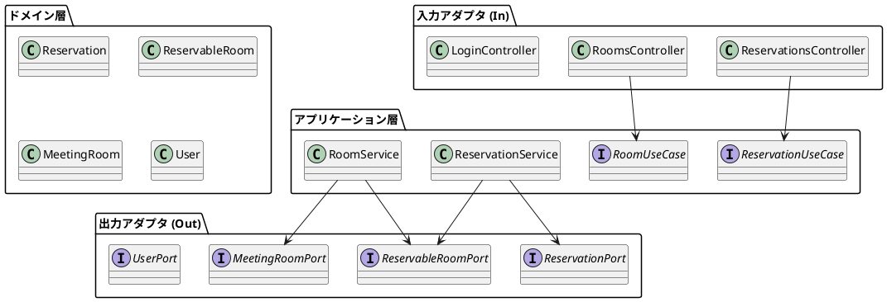

# アプリケーション構成

最終更新: 2025-08-29
方針サマリ: データアクセス=MyBatis / 認証=JWT（Stateless） / API E2E=Cucumber

参照: 
- 要件: ../requirements/仕様.md
- リリース計画: ../requirements/リリース計画.md
- 実装詳細: ../reference/会議室予約システムのケーススタディ/実装詳細.md
 - 設計: ./アーキテクチャ.md

---

## 着手前に必ず実施すること

- 要件・非機能・制約の確認（`docs/requirements/仕様.md` とリリース/イテレーション計画の整合）
- 既存設計（`docs/design/アーキテクチャ.md`）との整合・差分確認
- 実行/ビルド環境の確認（Java 17+, Spring Boot 3.3.x, Gradle）
- 品質ゲート（テスト/静的解析/カバレッジ）の閾値・運用確認
- データベース・マイグレーション運用（Flyway dev/prd 分離）の確認

## 全体方針（ヘキサゴナル×TDD）

- アーキテクチャ: ヘキサゴナル（Ports & Adapters）を基本とし、ドメインモデル中心にビジネスルールを配置
- 実装スタイル: TDD（Red/Green/Refactor）と継続的な設計・コードのリファクタリング
- セキュリティ: Spring Security + JWT によるトークン認証（Stateless）、メソッドレベルの `@PreAuthorize`
- データアクセス: MyBatis、Flyway でスキーマ/データのバージョン管理
- テスト階層: 単体→統合→API E2E（Cucumber）→運用リグレッションの順で信頼性を積み上げ

### 論理構成（コンポーネント概要）



## 物理構成（パッケージ/モジュール）

```
src/
└── main/java/mrs/
    ├── Application.java
    ├── WebSecurityConfig.java
    ├── application/
    │   ├── domain/model/{auth,reservation,room}/...
    │   ├── port/{in,out}/...
    │   └── service/{reservation,room,auth}/...
  ├── infrastructure/
  │   ├── in/web/...
  │   └── out/persistence/
  │       └── mybatis/   // Mapperインターフェース・DAO
    └── common/validation/...
└── main/resources/
  └── mybatis/
    └── mappers/       // Mapper XML
└── test/java/
    ├── 単体/統合テスト各種
    └── e2e/cucumber/
        ├── stepdefs/...
        └── Spring/Cucumber ランナー
└── test/resources/
    └── features/ (Gherkin)
```

- ドメイン層は値オブジェクトとエンティティを中心（例: `UserId`, `Reservation`, `ReservationTimeSlot`）
- アプリケーション層はユースケースとサービス（排他/重複判定などの協調を担う）
- アダプタ層は Web（入力）と永続化（出力）に分離（ポートでインターフェイスを固定）

## ビルド/依存関係（Gradle）

- プラグイン: `java`, `org.springframework.boot`, `io.spring.dependency-management`, `jacoco`, 静的解析（`checkstyle`, `pmd`, `com.github.spotbugs`）
- 主要依存: Spring Boot Starters（web, validation, security, thymeleaf）+ MyBatis Starter
- DB: dev=H2(PostgreSQLモード), prd=PostgreSQL, マイグレーション=Flyway
- テスト: JUnit 5, Spring Security Test, AssertJ
- API E2E（Cucumber）: `io.cucumber:cucumber-java`, `io.cucumber:cucumber-junit-platform-engine`, `io.cucumber:cucumber-spring`, HTTP操作に `io.rest-assured:rest-assured` もしくは `MockMvc`
- （任意）実DB疎通検証: Testcontainers（PostgreSQL）

例: MyBatis 追加依存（抜粋）

```groovy
dependencies {
  implementation 'org.mybatis.spring.boot:mybatis-spring-boot-starter:3.0.3'
  runtimeOnly 'com.h2database:h2:2.2.224'
  runtimeOnly 'org.postgresql:postgresql:42.7.3'
}
```

例: JWT 追加依存（抜粋）

1) 自前で発行/検証（JJWT）
```groovy
dependencies {
  implementation 'io.jsonwebtoken:jjwt-api:0.12.5'
  runtimeOnly 'io.jsonwebtoken:jjwt-impl:0.12.5'
  runtimeOnly 'io.jsonwebtoken:jjwt-jackson:0.12.5'
}
```

2) リソースサーバとして検証（外部IdP想定）
```groovy
dependencies {
  implementation 'org.springframework.boot:spring-boot-starter-oauth2-resource-server:3.3.2'
}
```

例: Cucumber 追加依存（抜粋）

```groovy
dependencies {
  testImplementation 'io.cucumber:cucumber-java:7.18.1'
  testImplementation 'io.cucumber:cucumber-junit-platform-engine:7.18.1'
  testImplementation 'io.cucumber:cucumber-spring:7.18.1'
  testImplementation 'org.springframework.boot:spring-boot-starter-test'
  testImplementation 'org.springframework.security:spring-security-test'
  testImplementation 'io.rest-assured:rest-assured:5.5.0' // または MockMvc
  // testImplementation 'org.testcontainers:postgresql:1.20.2'
}

tasks.named('test') {
  useJUnitPlatform()
}
```

## 設定（プロファイル別）

- `application.properties`（dev）: H2, Flyway `classpath:/db/migration/dev`
- `application-prd.properties`（prd）: PostgreSQL, Flyway `classpath:/db/migration/prd`
- ロギング: SQL/バインドパラメータは開発時のみ詳細出力

MyBatis 推奨設定（例）:

```
mybatis.mapper-locations=classpath:/mybatis/mappers/*.xml
mybatis.type-aliases-package=mrs.application.domain.model
mybatis.configuration.map-underscore-to-camel-case=true
```

JWT 関連設定（例）:

開発（対称鍵 / HS256）
```
app.security.jwt.issuer=mrs
app.security.jwt.access-token-ttl=PT15M
app.security.jwt.refresh-token-ttl=P30D
# 環境変数で供給
# JWT_SECRET=change-me
```

本番（非対称鍵 / RS256 例）
```
app.security.jwt.issuer=mrs
app.security.jwt.jwk-set-uri=https://idp.example.com/.well-known/jwks.json
app.security.jwt.access-token-ttl=PT15M
app.security.jwt.refresh-token-ttl=P30D
```

## セキュリティ構成

- 認証: JWT（アクセス/リフレッシュ）を採用。署名 dev=HS256、prd=RS256（JWK/Keystore）
- 認可: ロールに基づくURL/メソッド保護（`@PreAuthorize`）
- フィルタ: `OncePerRequestFilter` で Authorization: Bearer を検証し `SecurityContext` を構築
- セッション/CSRF: APIはStateless（`SessionCreationPolicy.STATELESS`）、API系エンドポイントはCSRF無効
- ユーザー管理: パスワードはBCrypt。ログイン時にユーザー/ロールを取得しトークンにrolesクレームとして付与
- エンドポイント例:
  - `POST /api/auth/login`（資格情報→JWT発行）
  - `POST /api/auth/refresh`（リフレッシュ→新アクセストークン）
  - 保護API: `GET /api/rooms`, `POST /api/reservations`（Bearer必須）
-
- CORS: APIクライアント要件に応じて適切に許可

## データ永続化/トランザクション

- 悲観的ロックで同時更新競合を回避（SQLの行ロック: `SELECT ... FOR UPDATE` をMyBatisのMapperで発行）
- 予約の重複判定はドメインロジックで責務集中（`Reservation#overlap`）
- Flyway でスキーマ/初期データを版管理（`V1.00__schema_startup.sql`, `V1.01__data_startup.sql`）

Mapper 構成（方針）:
- Mapperインターフェース（Java）と対応するXML（resources）でクエリを管理
- 例: `ReservableRoomMapper.findOneForUpdateById(...)` が `SELECT ... FOR UPDATE` を発行
- トランザクション境界はサービス層（`@Transactional`）で管理

## テスト戦略

- 単体: 値オブジェクト/エンティティ/サービスの純粋ロジックを高速に検証
- 統合: Web層（Controller+Security）や永続化アダプタ（MyBatis Mapper）の連携を Spring Test で検証（`@MybatisTest` も活用可）
- API E2E: Cucumber を採用（要求: 本ドキュメントのスコープ）

### API E2E: Cucumber 採用

- 目的: ビジネス言語（Gherkin）でユースケースを記述し、API をエンドツーエンドで検証
- ランタイム: JUnit Platform + `cucumber-junit-platform-engine`、必要に応じ `cucumber-spring` で Spring 文脈を共有
- HTTPクライアント: `RestAssured`（または `MockMvc`）
- データ準備: Testcontainers(PostgreSQL) もしくは H2 + Flyway による再現可能な初期化

ディレクトリ構成例:

```
src/test/resources/features/
  reservations/
    create_reservation.feature
src/test/java/mrs/e2e/cucumber/
  stepdefs/ReservationStepDefs.java
  CucumberSpringConfig.java   // @CucumberContextConfiguration + @SpringBootTest
```

Gherkin 例（抜粋）:

```
Feature: 会議室予約API
  Background:
    Given 認証用のユーザー "user1" とパスワード "demo" が存在する
    And /api/auth/login でアクセストークンを取得する

  Scenario: 空き時間に予約を作成できる
    Given 日付 "2025-09-01" の会議室 1 は空いている
    When Authorization ヘッダに取得したトークンを付与して 09:00 から 10:00 で会議室 1 を予約する
    Then 201 Created で予約が作成される
    And 重複予約は拒否されること
```

Step 定義（方針）:
- Given: DBにユーザー/ロール/予約可能枠を投入（Flyway or リポジトリ/Mapper経由）
- When: `POST /api/auth/login` でJWTを取得→ `Authorization: Bearer <token>` を付与して業務APIを呼び出し
- Then: ステータスコード/レスポンス本文/永続化状態を検証

品質ゲート連携:
- `./gradlew test` に Cucumber を統合（タグで e2e を分岐可能）
- CI ではユニット/統合を並列、E2E を後段ゲートに配置

## 品質ゲート/自動化

- 静的解析: Checkstyle, PMD, SpotBugs（最低限のルールセットから段階的強化）
- カバレッジ: JaCoCo（HTML レポート生成、しきい値は段階的に引き上げ）
- タスク統合: `qualityCheck`, `fullCheck`, `tdd` 等のカスタム Gradle タスク
- 実行例: `fullCheck` = test + 静的解析 + JaCoCo レポート

## トレーサビリティと拡張

- 要件→ユースケース→テスト（Gherkin/単体）→コードの往復参照を維持
- ポート/アダプタにより外部要素（DB/メッセージング/IDP）を差し替え可能
- 非機能はドメイン/アプリ/インフラ各層に対応する受け皿を用意（性能、可用性、セキュリティ、運用）

## 補足: 本構成と参照資料の対応

- 実装詳細（会議室予約システム）をベースに、重複判定・ロック戦略・セキュリティ方針を継承
- Java入門2 から Gradle/静的解析/カバレッジ/タスク化の運用知見を採用
- 本ドキュメントでは API の E2E テストに Cucumber を正式採用（要求事項）

---

このドキュメントは、アプリの構造・テスト・運用を一箇所で共有するための基準点です。詳細なユースケース/設計の補完は `docs/design/アーキテクチャ.md` を参照してください。
