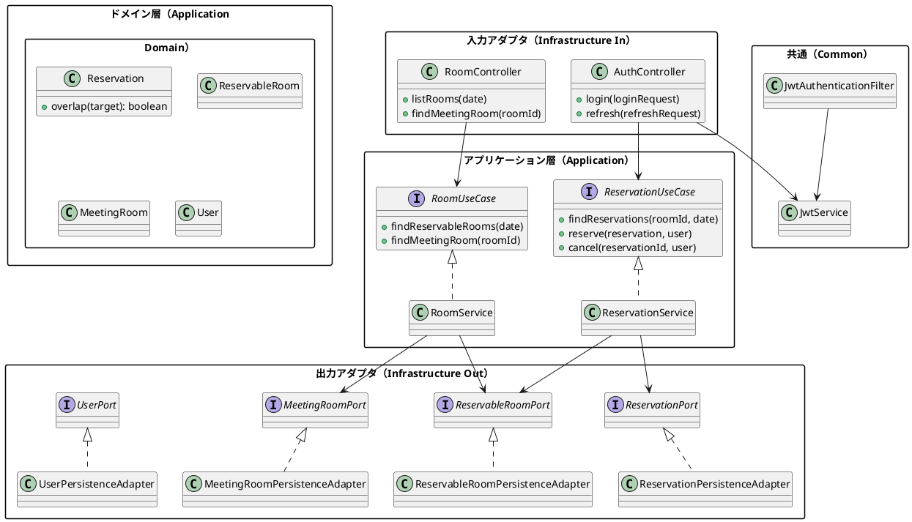
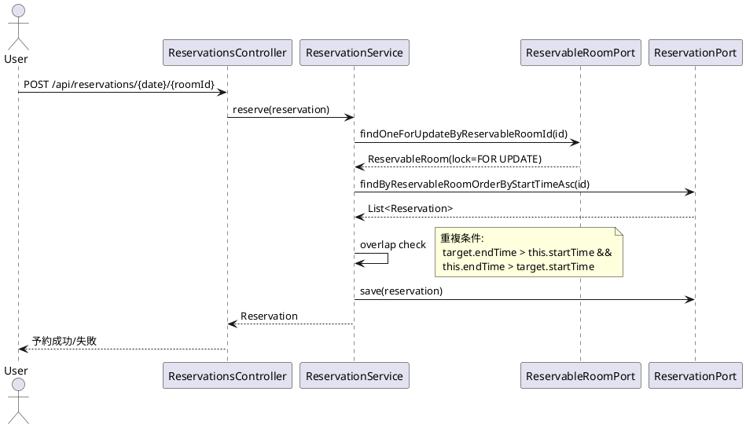

# 会議室予約システム（MRS）アーキテクチャ

最終更新: 2025-08-29

参照: 
- 要件: ../requirements/仕様.md
- リリース計画: ../requirements/リリース計画.md
- 実装詳細: ../reference/会議室予約システムのケーススタディ/実装詳細.md

---

## 1. アーキテクチャ概要
- スタイル: ヘキサゴナルアーキテクチャ（Ports & Adapters）
- 目的: ドメイン中心、テスタブル、入出力依存の分離、段階的進化を可能にする
- キー特性: 疎結合、単方向依存（外→内）、境界での契約（ポート）

### 1.1 コンポーネント構成


### 1.2 層の責務
- **Application.Domain**: ビジネスルール（重複判定、値オブジェクトの整合性）
- **Application.Service**: ユースケース調停（取引、排他、権限境界での意思決定）
- **Application.Port**: ドメインサービスとの契約（入力・出力ポート）
- **Infrastructure.In**: Web API/DTO変換、認証エンドポイント
- **Infrastructure.Out**: DBアクセス（MyBatis）、永続化アダプター
- **Infrastructure.Config**: OpenAPI設定、Swaggerドキュメント生成
- **Common.Security**: JWT認証フィルター、セキュリティサービス

---

## 2. ポートとアダプタ
- 入力ポート（UseCase）
  - ReservationUseCase, RoomUseCase
- 出力ポート（Repository/Service）
  - ReservationPort, ReservableRoomPort, MeetingRoomPort, UserPort
- アダプタ
  - In: Controller（Spring MVC）
  - Out: PersistenceAdapter（MyBatis + SQL明示の悲観ロック）

契約の例（抜粋）
- ReservableRoomPort.findOneForUpdateByReservableRoomId(id): SQLの`FOR UPDATE`で予約可能会議室を取得
- ReservationPort.findByReservableRoomOrderByStartTimeAsc(id): 開始時刻昇順取得

---

## 3. 主要ユースケースのフロー

### 3.1 予約作成（重複排除＋排他制御）


前提条件
- ログイン済（F001）
- 予約可能日/部屋の組み合わせが有効

異常系
- UnavailableReservationException: 予約不可組合せ
- AlreadyReservedException: 時間帯重複

### 3.2 予約キャンセル（権限制御）
- @PreAuthorize("hasRole('ADMIN') or #reservation.user.userId.value == principal.user.userId.value")
- 予約者本人または管理者のみ削除可能

---

## 4. セキュリティ設計
- 認証: Spring Security + JWT（Stateless）、BCrypt
- 認可: URL保護 + メソッドレベル（@PreAuthorize）
- フィルタ: `OncePerRequestFilter` で Authorization: Bearer を検証し `SecurityContext` を構築
- セッション/CSRF: APIは `SessionCreationPolicy.STATELESS`、API系エンドポイントはCSRF無効
- エンドポイント例: `POST /api/auth/login`, `POST /api/auth/refresh`、保護API: `GET /api/rooms`, `POST /api/reservations`

---

## 5. API設計・開発者体験（DX）
### 5.1 OpenAPI（Swagger）統合
- **目的**: API仕様の自己文書化、開発効率向上、API動作確認の簡易化
- **ツール**: springdoc-openapi-starter-webmvc-ui 2.6.0
- **アクセス**: `gradle bootRun` → http://localhost:8080/swagger-ui.html

### 5.2 API仕様（OpenAPI 3.0）
```yaml
paths:
  /api/auth/login:
    post:
      summary: ユーザー認証
      requestBody:
        content:
          application/json:
            schema:
              type: object
              properties:
                username:
                  type: string
                  example: "user1"
                password:
                  type: string
                  example: "demo"
      responses:
        200:
          description: 認証成功
          content:
            application/json:
              schema:
                type: object
                properties:
                  accessToken:
                    type: string
                    description: JWT access token
        401:
          description: 認証失敗
          
  /api/rooms:
    get:
      summary: 会議室一覧取得
      security:
        - bearerAuth: []
      responses:
        200:
          description: 会議室一覧
          content:
            application/json:
              schema:
                type: array
                items:
                  $ref: '#/components/schemas/ReservableRoom'
                  
  /api/rooms/{date}:
    get:
      summary: 指定日の会議室一覧取得
      security:
        - bearerAuth: []
      parameters:
        - name: date
          in: path
          required: true
          schema:
            type: string
            format: date
            example: "2025-08-30"
      responses:
        200:
          description: 指定日の会議室一覧

components:
  securitySchemes:
    bearerAuth:
      type: http
      scheme: bearer
      bearerFormat: JWT
  schemas:
    MeetingRoom:
      type: object
      properties:
        roomId:
          type: integer
          example: 1
        roomName:
          type: string
          example: "新木場"
    ReservableRoom:
      type: object
      properties:
        reservableRoomId:
          type: object
          properties:
            meetingRoom:
              $ref: '#/components/schemas/MeetingRoom'
            reservedDate:
              type: string
              format: date
              example: "2025-08-30"
```

### 5.3 Swagger UI設定
- **プロファイル**: dev環境のみ有効（`application-dev.properties`）
- **セキュリティ**: JWT認証のテスト機能（Authorize ボタン）
- **タグ**: API群の論理分類（Authentication, Rooms, Reservations）
- **例外**: 統一エラーレスポンス形式のドキュメント化

### 5.4 開発フロー
1. `gradle bootRun` でアプリケーション起動
2. http://localhost:8080/swagger-ui.html を開く
3. `/api/auth/login` でJWTトークン取得
4. 「Authorize」ボタンでトークンを設定
5. 保護APIをSwagger UIから直接テスト
6. レスポンス確認、スキーマ検証

---

## 6. データモデルと永続化
- DB: Dev=H2(PostgreSQLモード)、Prd=PostgreSQL
- マイグレーション: Flyway（dev/prd フォルダ分離）
- エンティティ/テーブル（ERDは仕様参照）
  - usr, meeting_room, reservable_room, reservation
- 永続化: MyBatis（`infrastructure/out/persistence/mybatis` + `resources/mybatis/mappers`）
- 排他: ReservableRoom取得時に `SELECT ... FOR UPDATE` を用いて行ロックを取得
- バリデーション: Bean Validation + カスタム（30分単位、終了>開始）

---

## 7. 非機能要件への対応（N001–N004）
- 性能（N001）
  - 一覧/予約作成のクエリ最適化、インデックス、N+1回避
  - 画面≤2s、予約≤3s、ログイン≤1s を目標
- 可用性（N002）
  - 稼働率99.0%、日次バックアップ、≤4h復旧手順
- セキュリティ（N003）
  - BCrypt、CSRF、URL/メソッド保護
- 運用（N004）
  - Actuatorヘルス/メトリクス、SQL/アプリ/セキュリティログ

---

## 8. テスト戦略
- 単体: 値オブジェクト/重複判定/サービスのビジネスロジック
- 統合: Controller+Security、PersistenceAdapter（テストDB）
- E2E: Cucumber による 認証（JWT）→会議室一覧→予約→キャンセル主要シナリオ
- 否定テスト: 権限外操作、重複予約、トークン不備

---

## 9. 品質設計と原則
- **DDD**: 重要ロジックはドメインへ（Reservation.overlap）
- **値オブジェクト**: UserId/Password/Name/ReservationTimeSlot 等
- **不変/境界**: 生成時検証で不正状態を防止
- **単方向依存**: UI→Application→Domain（インフラは適応層）
- **アーキテクチャテスト**: ArchUnitによる依存関係とレイヤー境界の自動検証
  - レイヤー依存関係の検証（ドメイン層の純粋性保証）
  - ヘキサゴナルアーキテクチャ原則の検証（ポート&アダプター）
  - パッケージ構造と命名規約の検証
  - 参照: [ADR-20250830-ArchUnit導入](../adr/20250830-archunit-introduction.md)

---

## 10. トレーサビリティ
- 機能: F001–F005 / UI001–003 に対応
- 非機能: N001–N004
- 制約: C001–C003
- リリース計画: Iteration 1–4 の各スコープにマッピング

---

## 11. 拡張方針
- 検索/フィルタ機能の強化（会議室属性/設備）
- 監査ログ/変更履歴の導入
- 管理機能（一括キャンセル、休日管理）
- 可観測性（分散トレース、ダッシュボード）
- **API進化**: OpenAPI仕様の継続メンテナンス、バージョニング戦略

---

## 付録A. パッケージ構成（実装済み）
```
src/main/java/mrs/
  ├── application/
  │   ├── domain/
  │   │   └── model/
  │   │       ├── auth/
  │   │       │   └── User.java
  │   │       ├── reservation/
  │   │       │   └── Reservation.java
  │   │       └── room/
  │   │           ├── MeetingRoom.java
  │   │           └── ReservableRoom.java
  │   ├── port/
  │   │   ├── in/
  │   │   │   ├── ReservationUseCase.java
  │   │   │   └── RoomUseCase.java
  │   │   └── out/
  │   │       ├── MeetingRoomPort.java
  │   │       ├── ReservableRoomPort.java
  │   │       ├── ReservationPort.java
  │   │       └── UserPort.java
  │   └── service/
  │       ├── ReservationService.java
  │       └── RoomService.java
  ├── infrastructure/
  │   ├── config/
  │   │   └── OpenApiConfig.java
  │   ├── in/
  │   │   └── web/
  │   │       ├── AuthController.java
  │   │       └── RoomController.java
  │   └── out/
  │       └── persistence/
  │           ├── MeetingRoomPersistenceAdapter.java
  │           ├── ReservableRoomPersistenceAdapter.java
  │           ├── ReservationPersistenceAdapter.java
  │           ├── UserPersistenceAdapter.java
  │           ├── ReservationMapper.java
  │           ├── RoomMapper.java
  │           └── UserMapper.java
  ├── common/
  │   └── security/
  │       ├── JwtAuthenticationFilter.java
  │       └── JwtService.java
  ├── Application.java
  ├── DevDataInitializer.java
  ├── SwaggerConfig.java
  └── WebSecurityConfig.java
```

---

備考: 本ドキュメントは実装詳細および要件仕様/リリース計画に整合し、変更時は三者（仕様・設計・実装）同期を維持すること。