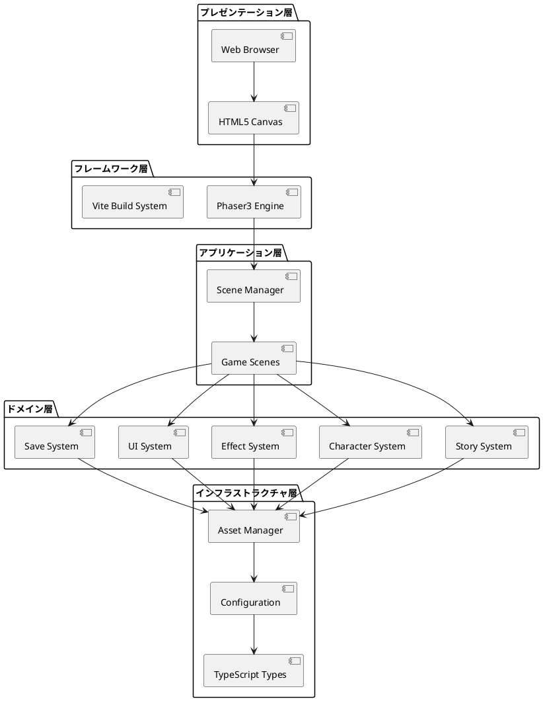
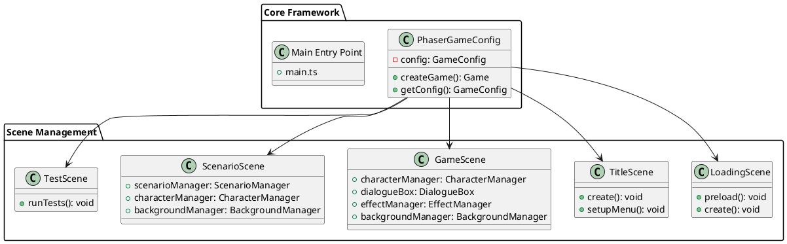
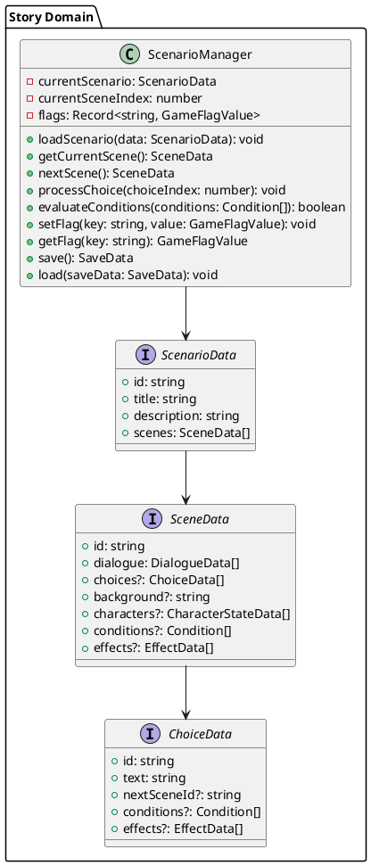
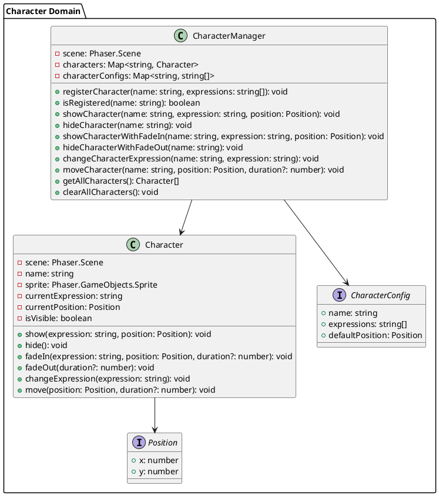
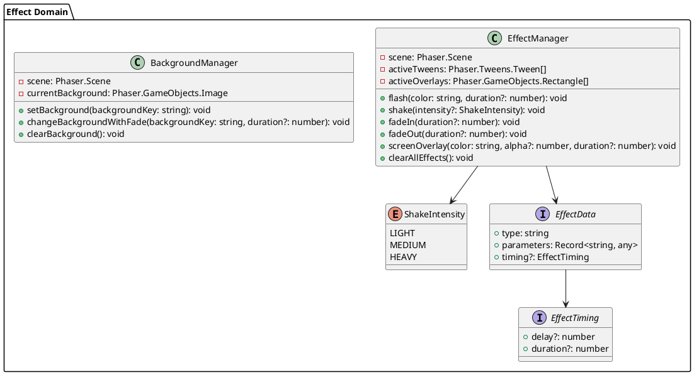
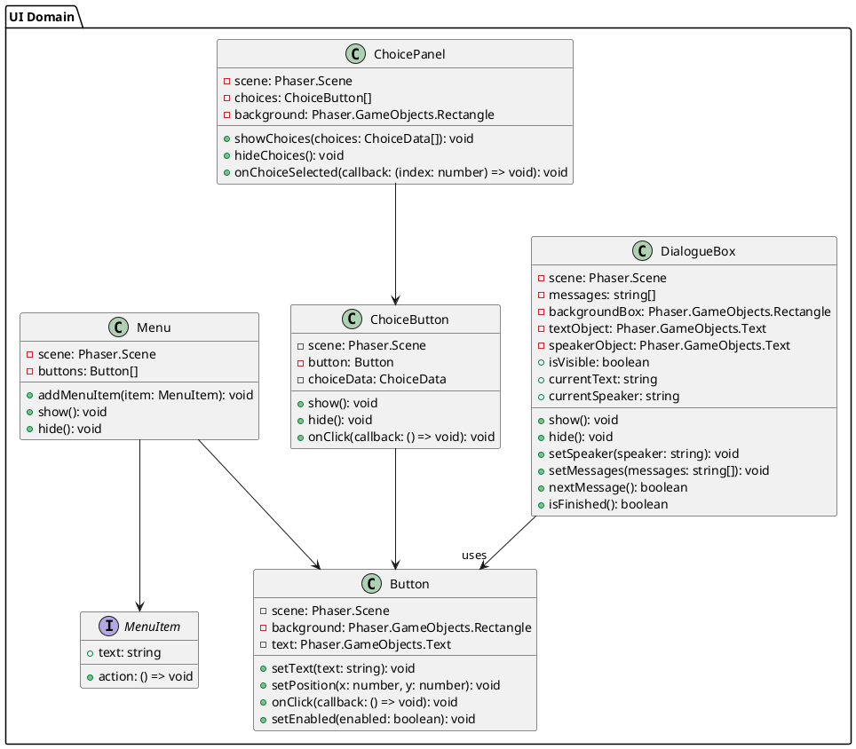
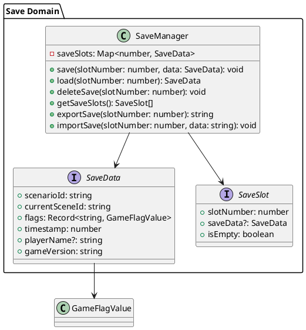
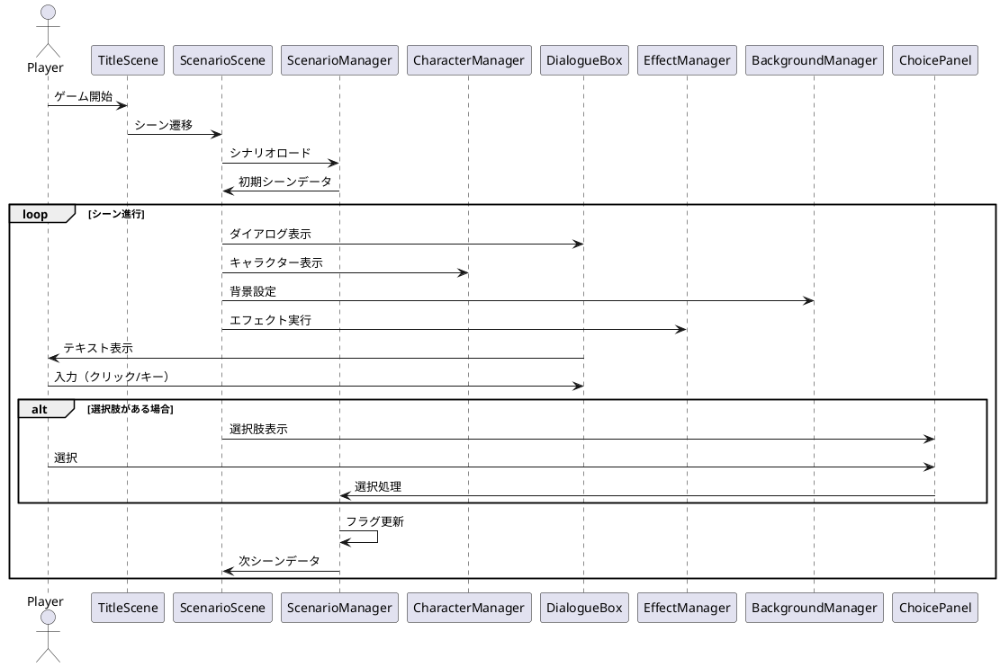
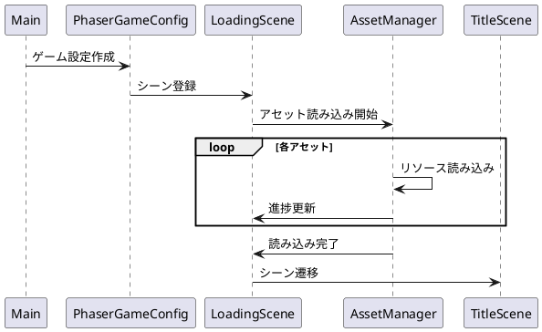

# TypeScriptノベルゲーム - アーキテクチャ仕様書

## 概要

本アプリケーションは、TypeScript + Phaser3を基盤としたビジュアルノベルゲームエンジンです。  
モジュラー設計により、拡張性と保守性を重視した商用レベルのアーキテクチャを採用しています。

## システム全体構成

### レイヤー構成図

## システム構成要素

### 1. コアアーキテクチャ

### 2. ストーリーシステム

### 3. キャラクターシステム

### 4. エフェクトシステム

### 5. UIシステム

### 6. セーブシステム

## 設計パターンと原則

### 1. アーキテクチャパターン

- **Layered Architecture**: 明確な責務分離
- **Component-Based Architecture**: Phaser3の特性を活かした構成
- **Manager Pattern**: 各ドメインの責務を一元管理

### 2. 設計原則

- **Single Responsibility Principle**: 各クラスは単一の責務を持つ
- **Open/Closed Principle**: 拡張に対して開いており、修正に対して閉じている
- **Dependency Inversion Principle**: 抽象に依存し、具象に依存しない
- **Interface Segregation Principle**: 必要なインターフェースのみに依存

### 3. TypeScript活用

- **型安全性**: 完全な型定義によるコンパイル時エラー検出
- **インターフェース活用**: 契約の明確化
- **ジェネリクス**: 型パラメータによる再利用性向上

## データフロー

### ゲーム進行のメインフロー

### システム初期化フロー

## テクノロジースタック

### フロントエンド

| カテゴリ | 技術 | バージョン | 役割 |
|----------|------|------------|------|
| 言語 | TypeScript | 5.x | 型安全なJavaScript |
| ゲームエンジン | Phaser3 | 3.x | 2Dゲーム開発フレームワーク |
| ビルドツール | Vite | 5.x | 高速開発サーバー・ビルド |
| テストフレームワーク | Vitest | 3.x | ユニットテスト |
| リンター | ESLint | 9.x | コード品質検査 |
| フォーマッター | Prettier | 3.x | コード整形 |
| タスクランナー | Gulp | 5.x | 開発タスク自動化 |

### 開発・運用

| カテゴリ | 技術 | 役割 |
|----------|------|------|
| バージョン管理 | Git | ソースコード管理 |
| パッケージ管理 | npm | 依存関係管理 |
| 開発環境 | Docker + Dev Container | 統一開発環境 |
| ドキュメント | MkDocs | ドキュメント生成 |

## パフォーマンス考慮事項

### 1. アセット管理

- **遅延読み込み**: 必要時のみアセット読み込み
- **テクスチャアトラス**: 描画パフォーマンス向上
- **オーディオ圧縮**: ファイルサイズ最適化

### 2. メモリ管理

- **オブジェクトプール**: 頻繁な生成・破棄の回避
- **適切な破棄処理**: メモリリーク防止
- **参照管理**: 循環参照の回避

### 3. レンダリング最適化

- **レイヤー分離**: 更新頻度による描画最適化
- **カリング**: 画面外オブジェクトの描画スキップ
- **バッチング**: 描画コール数の削減

## セキュリティ考慮事項

### 1. データ保護

- **セーブデータ整合性**: チェックサム検証
- **不正データ防止**: 入力値検証
- **XSS対策**: ユーザー入力のサニタイズ

### 2. アセット保護

- **難読化**: コードの可読性低下
- **整合性チェック**: アセット改ざん検出

## 拡張ポイント

### 1. 新機能追加

- **プラグインシステム**: 独立したモジュールとして機能追加
- **カスタムエフェクト**: EffectManagerの拡張
- **新UIコンポーネント**: UI層への追加

### 2. データ形式拡張

- **シナリオフォーマット**: 新たなストーリー表現
- **キャラクター設定**: より詳細な属性管理
- **選択肢システム**: 複雑な分岐制御

### 3. プラットフォーム対応

- **マルチプラットフォーム**: Electron等での展開
- **モバイル対応**: タッチインターフェース最適化
- **VR対応**: 没入体験の実現

## 品質保証

### 1. テスト戦略

- **ユニットテスト**: 個別モジュールのテスト（273テスト）
- **統合テスト**: システム連携のテスト
- **E2Eテスト**: エンドユーザー視点のテスト

### 2. コード品質

- **ESLint**: 静的解析によるコード品質向上
- **Prettier**: 一貫したコードフォーマット
- **TypeScript**: 型システムによる安全性確保

### 3. 継続的インテグレーション

- **自動テスト**: コミット時の品質チェック
- **自動ビルド**: デプロイ可能な成果物生成
- **品質メトリクス**: コードカバレッジ・複雑度測定

## 運用考慮事項

### 1. デプロイメント

- **静的サイト**: GitHub Pages, Netlify等での配信
- **CDN活用**: アセット配信の高速化
- **キャッシュ戦略**: ブラウザキャッシュ最適化

### 2. 監視・メンテナンス

- **エラー追跡**: 実行時エラーの監視
- **パフォーマンス計測**: フレームレート・読み込み時間
- **ユーザーフィードバック**: プレイデータ分析

## 今後の発展

### 短期目標（次イテレーション）

1. **CI/CDパイプライン構築**: 自動テスト・デプロイ
2. **シナリオエディター**: GUI-based story creation tool
3. **音響システム**: BGM・SE統合管理
4. **セーブ機能完全実装**: クラウドセーブ対応

### 中期目標（3-6ヶ月）

1. **マルチプラットフォーム対応**: Desktop/Mobile
2. **アニメーションシステム**: キャラクター動作
3. **ボイス対応**: 音声データ統合
4. **国際化対応**: 多言語サポート

### 長期目標（6ヶ月以上）

1. **AI統合**: 動的ストーリー生成
2. **VR対応**: 没入型体験
3. **商用エンジン化**: 一般開発者向けツール
4. **クラウドサービス化**: SaaS型提供

---

本アーキテクチャは、現在の商用レベル品質を維持しながら、将来の拡張性を確保したモジュラー設計です。各システムが疎結合で設計されており、個別の改良・拡張が容易な構造となっています。
