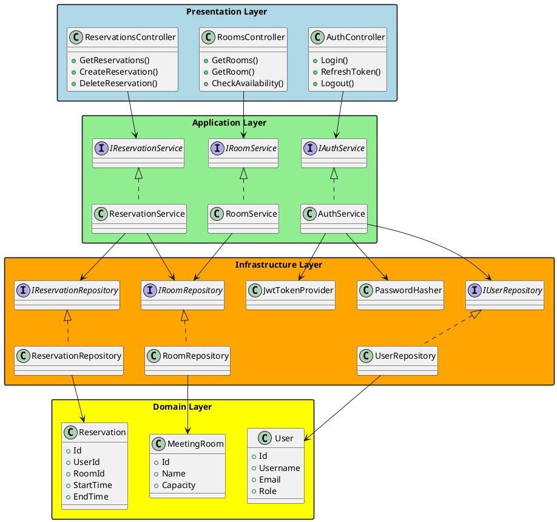
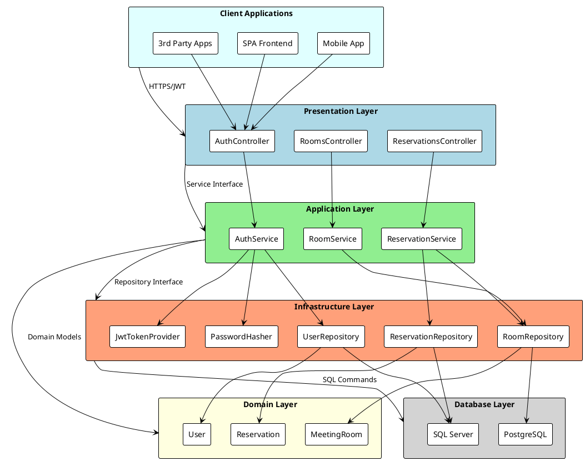

# 会議室予約システム（MRS） - C# RESTful API アーキテクチャ設計書

## 1. アーキテクチャ概要

本システムは**RESTful API**を中心とした**ヘキサゴナルアーキテクチャ**（ポート・アンド・アダプター）を採用し、ASP.NET Core Web APIを基盤として実装します。WebUIは提供せず、フロントエンド非依存のAPIファーストアプローチを採用します。

### 1.1 アーキテクチャ原則

- **API First**: RESTful APIを中心とした設計
- **JWT認証**: ステートレスな認証・認可
- **軽量データアクセス**: Dapperによる高性能SQLマッピング
- **依存関係逆転**: ドメイン層は外部技術に依存しない
- **テスタビリティ**: 依存性注入による単体テスト容易性

### 1.2 技術スタック

| 分類 | 技術 | バージョン | 用途 |
|------|------|------------|------|
| フレームワーク | .NET | 8.0 | アプリケーション基盤 |
| Web API | ASP.NET Core Web API | 8.0 | REST API エンドポイント |
| データアクセス | Dapper | 2.1+ | 軽量O/Rマッピング |
| データベース | SQL Server / PostgreSQL | - | データ永続化 |
| 認証 | JWT (JSON Web Token) | - | ステートレス認証 |
| DI コンテナ | Microsoft.Extensions.DependencyInjection | 8.0 | 依存性注入 |
| バリデーション | FluentValidation | 11.0+ | 入力値検証 |
| テスト | xUnit + Moq | - | ユニット・統合テスト |
| API仕様 | Swagger/OpenAPI | 3.0 | API ドキュメント |

### 1.3 全体アーキテクチャ図



### 1.4 レイヤー構成図



## 2. プロジェクト構成

### 2.1 ソリューション構造

```
MRS.Api.sln
├── src/
│   ├── MRS.Domain/                     # ドメイン層
│   │   ├── Models/                     # エンティティ・集約ルート
│   │   │   ├── Reservation.cs
│   │   │   ├── ReservableRoom.cs
│   │   │   ├── MeetingRoom.cs
│   │   │   ├── User.cs
│   │   │   └── RefreshToken.cs
│   │   ├── ValueObjects/               # 値オブジェクト
│   │   │   ├── UserId.cs
│   │   │   ├── RoomId.cs
│   │   │   ├── ReservationId.cs
│   │   │   └── UserRole.cs
│   │   ├── Services/                   # ドメインサービス
│   │   │   └── ReservationDomainService.cs
│   │   ├── Interfaces/                 # ドメインインターフェース
│   │   │   ├── IReservationRepository.cs
│   │   │   ├── IRoomRepository.cs
│   │   │   ├── IUserRepository.cs
│   │   │   ├── ITokenRepository.cs
│   │   │   └── IUnitOfWork.cs
│   │   └── Exceptions/                 # ドメイン例外
│   │       ├── DomainException.cs
│   │       ├── ReservationConflictException.cs
│   │       └── UnauthorizedException.cs
│   │
│   ├── MRS.Application/                # アプリケーション層
│   │   ├── Services/                   # アプリケーションサービス
│   │   │   ├── IAuthService.cs
│   │   │   ├── AuthService.cs
│   │   │   ├── IReservationService.cs
│   │   │   ├── ReservationService.cs
│   │   │   ├── IRoomService.cs
│   │   │   └── RoomService.cs
│   │   ├── DTOs/                       # データ転送オブジェクト
│   │   │   ├── Auth/
│   │   │   │   ├── LoginRequestDto.cs
│   │   │   │   ├── AuthResultDto.cs
│   │   │   │   └── RefreshTokenRequestDto.cs
│   │   │   ├── Reservations/
│   │   │   │   ├── ReservationDto.cs
│   │   │   │   ├── CreateReservationDto.cs
│   │   │   │   └── ReservationQueryDto.cs
│   │   │   ├── Rooms/
│   │   │   │   ├── RoomDto.cs
│   │   │   │   └── AvailabilityDto.cs
│   │   │   └── Users/
│   │   │       ├── UserDto.cs
│   │   │       └── UserProfileDto.cs
│   │   ├── Commands/                   # コマンドパターン
│   │   │   ├── CreateReservationCommand.cs
│   │   │   ├── CancelReservationCommand.cs
│   │   │   └── UpdateUserCommand.cs
│   │   ├── Queries/                    # クエリパターン
│   │   │   ├── GetReservationsQuery.cs
│   │   │   ├── GetRoomsQuery.cs
│   │   │   └── GetUserQuery.cs
│   │   ├── Validators/                 # FluentValidation
│   │   │   ├── LoginRequestValidator.cs
│   │   │   ├── CreateReservationValidator.cs
│   │   │   └── RefreshTokenValidator.cs
│   │   ├── Mappings/                   # AutoMapper プロファイル
│   │   │   ├── ReservationProfile.cs
│   │   │   ├── RoomProfile.cs
│   │   │   └── UserProfile.cs
│   │   └── Common/                     # 共通
│   │       ├── Result.cs
│   │       ├── PagedResult.cs
│   │       └── ApplicationException.cs
│   │
│   ├── MRS.Infrastructure/             # インフラストラクチャ層
│   │   ├── Repositories/               # Dapper リポジトリ
│   │   │   ├── ReservationRepository.cs
│   │   │   ├── RoomRepository.cs
│   │   │   ├── UserRepository.cs
│   │   │   ├── TokenRepository.cs
│   │   │   └── UnitOfWork.cs
│   │   ├── Data/                       # データアクセス設定
│   │   │   ├── ConnectionFactory.cs
│   │   │   ├── SqlQueries/             # SQL クエリ定義
│   │   │   │   ├── ReservationQueries.cs
│   │   │   │   ├── RoomQueries.cs
│   │   │   │   ├── UserQueries.cs
│   │   │   │   └── TokenQueries.cs
│   │   │   └── Migrations/             # DB マイグレーション
│   │   │       ├── 001_InitialSchema.sql
│   │   │       ├── 002_AddIndexes.sql
│   │   │       └── 003_RefreshTokens.sql
│   │   ├── Security/                   # セキュリティ実装
│   │   │   ├── JwtTokenProvider.cs
│   │   │   ├── PasswordHasher.cs
│   │   │   ├── JwtMiddleware.cs
│   │   │   └── SecurityOptions.cs
│   │   └── Configuration/              # 設定
│   │       ├── DatabaseConfiguration.cs
│   │       ├── JwtConfiguration.cs
│   │       └── DependencyInjection.cs
│   │
│   └── MRS.Api/                        # プレゼンテーション層 (Web API)
│       ├── Controllers/                # API コントローラー
│       │   ├── AuthController.cs
│       │   ├── RoomsController.cs
│       │   ├── ReservationsController.cs
│       │   └── UsersController.cs
│       ├── Middleware/                 # カスタムミドルウェア
│       │   ├── ErrorHandlingMiddleware.cs
│       │   ├── LoggingMiddleware.cs
│       │   └── SecurityHeadersMiddleware.cs
│       ├── Filters/                    # アクションフィルター
│       │   ├── ValidateModelFilter.cs
│       │   ├── AuthorizeFilter.cs
│       │   └── RateLimitFilter.cs
│       ├── Extensions/                 # 拡張メソッド
│       │   ├── ServiceCollectionExtensions.cs
│       │   ├── ApplicationBuilderExtensions.cs
│       │   └── ControllerExtensions.cs
│       ├── Configuration/              # API設定
│       │   ├── SwaggerConfiguration.cs
│       │   ├── CorsConfiguration.cs
│       │   └── ApiVersioningConfiguration.cs
│       ├── appsettings.json
│       ├── appsettings.Development.json
│       ├── appsettings.Production.json
│       └── Program.cs
│
└── tests/                              # テストプロジェクト
    ├── MRS.Domain.Tests/               # ドメイン層テスト
    ├── MRS.Application.Tests/          # アプリケーション層テスト
    ├── MRS.Infrastructure.Tests/       # インフラ層テスト
    └── MRS.Api.Tests/                  # API層テスト
        ├── Controllers/
        ├── Integration/
        └── EndToEnd/
```

## 3. RESTful API 設計

### 3.1 API エンドポイント設計

#### 3.1.1 認証 API

```http
### 認証
POST   /api/v1/auth/login               # ログイン
POST   /api/v1/auth/refresh             # トークンリフレッシュ
POST   /api/v1/auth/logout              # ログアウト
POST   /api/v1/auth/revoke              # トークン無効化

### ユーザー
GET    /api/v1/users/me                 # 現在のユーザー情報取得
PUT    /api/v1/users/me                 # 現在のユーザー情報更新
```

#### 3.1.2 会議室 API

```http
### 会議室
GET    /api/v1/rooms                    # 会議室一覧取得
GET    /api/v1/rooms/{roomId}           # 会議室詳細取得
GET    /api/v1/rooms/{roomId}/availability?date={date}&startTime={time}&endTime={time}
                                        # 会議室の空き状況確認
```

#### 3.1.3 予約 API

```http
### 予約
GET    /api/v1/reservations             # 予約一覧取得（クエリパラメータでフィルタリング）
POST   /api/v1/reservations             # 予約作成
GET    /api/v1/reservations/{reservationId}  # 予約詳細取得
DELETE /api/v1/reservations/{reservationId}  # 予約キャンセル

### 予約検索・フィルタリング
GET    /api/v1/reservations?roomId={roomId}&date={date}&userId={userId}&page={page}&size={size}
```

### 3.2 HTTP レスポンス設計

#### 3.2.1 成功レスポンス

```json
// 200 OK - データ取得成功
{
  "success": true,
  "data": {
    "id": "123e4567-e89b-12d3-a456-426614174000",
    "roomName": "会議室A",
    "startTime": "2024-01-15T10:00:00Z",
    "endTime": "2024-01-15T11:00:00Z"
  },
  "message": null
}

// 201 Created - 作成成功
{
  "success": true,
  "data": {
    "id": "123e4567-e89b-12d3-a456-426614174000",
    "roomId": 1,
    "userId": "user123",
    "startTime": "2024-01-15T10:00:00Z",
    "endTime": "2024-01-15T11:00:00Z",
    "createdAt": "2024-01-15T09:30:00Z"
  },
  "message": "予約が正常に作成されました"
}

// ページング対応
{
  "success": true,
  "data": {
    "items": [...],
    "totalCount": 150,
    "pageNumber": 1,
    "pageSize": 20,
    "totalPages": 8
  },
  "message": null
}
```

#### 3.2.2 エラーレスポンス

```json
// 400 Bad Request - バリデーションエラー
{
  "success": false,
  "data": null,
  "message": "入力値に誤りがあります",
  "errors": [
    {
      "field": "startTime",
      "message": "開始時刻は必須です"
    },
    {
      "field": "endTime", 
      "message": "終了時刻は開始時刻より後である必要があります"
    }
  ]
}

// 401 Unauthorized - 認証エラー
{
  "success": false,
  "data": null,
  "message": "認証が必要です",
  "errors": null
}

// 403 Forbidden - 認可エラー
{
  "success": false,
  "data": null,
  "message": "この操作を行う権限がありません",
  "errors": null
}

// 409 Conflict - ビジネスルール違反
{
  "success": false,
  "data": null,
  "message": "入力の時間帯はすでに予約済みです",
  "errors": null
}

// 500 Internal Server Error - システムエラー
{
  "success": false,
  "data": null,
  "message": "システム内部でエラーが発生しました",
  "errors": null
}
```

## 4. JWT認証設計

### 4.1 JWT実装アーキテクチャ

```csharp
// JwtTokenProvider.cs
public class JwtTokenProvider
{
    private readonly IConfiguration _configuration;
    private readonly SymmetricSecurityKey _key;

    public JwtTokenProvider(IConfiguration configuration)
    {
        _configuration = configuration;
        _key = new SymmetricSecurityKey(Encoding.UTF8.GetBytes(
            _configuration["Jwt:Secret"]));
    }

    public string GenerateAccessToken(User user)
    {
        var claims = new[]
        {
            new Claim(JwtRegisteredClaimNames.Sub, user.Id.Value),
            new Claim(JwtRegisteredClaimNames.Email, user.Email),
            new Claim(JwtRegisteredClaimNames.Jti, Guid.NewGuid().ToString()),
            new Claim(ClaimTypes.Role, user.Role.ToString()),
            new Claim("username", user.Username)
        };

        var credentials = new SigningCredentials(_key, SecurityAlgorithms.HmacSha256);
        var expires = DateTime.UtcNow.AddMinutes(
            _configuration.GetValue<int>("Jwt:AccessTokenExpirationMinutes"));

        var token = new JwtSecurityToken(
            issuer: _configuration["Jwt:Issuer"],
            audience: _configuration["Jwt:Audience"], 
            claims: claims,
            expires: expires,
            signingCredentials: credentials);

        return new JwtSecurityTokenHandler().WriteToken(token);
    }

    public string GenerateRefreshToken()
    {
        var randomBytes = new byte[32];
        using var rng = RandomNumberGenerator.Create();
        rng.GetBytes(randomBytes);
        return Convert.ToBase64String(randomBytes);
    }

    public ClaimsPrincipal? ValidateToken(string token)
    {
        var tokenHandler = new JwtSecurityTokenHandler();
        
        try
        {
            var principal = tokenHandler.ValidateToken(token, new TokenValidationParameters
            {
                ValidateIssuerSigningKey = true,
                IssuerSigningKey = _key,
                ValidateIssuer = true,
                ValidIssuer = _configuration["Jwt:Issuer"],
                ValidateAudience = true,
                ValidAudience = _configuration["Jwt:Audience"],
                ValidateLifetime = true,
                ClockSkew = TimeSpan.Zero
            }, out SecurityToken validatedToken);

            return principal;
        }
        catch
        {
            return null;
        }
    }
}
```

### 4.2 JWT ミドルウェア

```csharp
// JwtMiddleware.cs
public class JwtMiddleware
{
    private readonly RequestDelegate _next;
    private readonly JwtTokenProvider _tokenProvider;

    public JwtMiddleware(RequestDelegate next, JwtTokenProvider tokenProvider)
    {
        _next = next;
        _tokenProvider = tokenProvider;
    }

    public async Task InvokeAsync(HttpContext context)
    {
        var token = ExtractTokenFromHeader(context.Request);
        
        if (!string.IsNullOrEmpty(token))
        {
            var principal = _tokenProvider.ValidateToken(token);
            if (principal != null)
            {
                context.User = principal;
            }
        }

        await _next(context);
    }

    private static string? ExtractTokenFromHeader(HttpRequest request)
    {
        var authHeader = request.Headers["Authorization"].FirstOrDefault();
        return authHeader?.StartsWith("Bearer ") == true 
            ? authHeader.Substring("Bearer ".Length).Trim() 
            : null;
    }
}
```

### 4.3 認証サービス実装

```csharp
// AuthService.cs
public class AuthService : IAuthService
{
    private readonly IUserRepository _userRepository;
    private readonly ITokenRepository _tokenRepository;
    private readonly JwtTokenProvider _tokenProvider;
    private readonly PasswordHasher _passwordHasher;

    public async Task<Result<AuthResultDto>> AuthenticateAsync(LoginRequestDto request)
    {
        var user = await _userRepository.GetByUsernameAsync(request.Username);
        
        if (user == null || !_passwordHasher.VerifyPassword(request.Password, user.PasswordHash))
        {
            return Result<AuthResultDto>.Failure("ユーザー名またはパスワードが正しくありません");
        }

        if (!user.IsActive)
        {
            return Result<AuthResultDto>.Failure("このアカウントは無効です");
        }

        var accessToken = _tokenProvider.GenerateAccessToken(user);
        var refreshToken = _tokenProvider.GenerateRefreshToken();

        // リフレッシュトークンを保存
        await _tokenRepository.SaveRefreshTokenAsync(new RefreshToken
        {
            Token = refreshToken,
            UserId = user.Id,
            ExpiresAt = DateTime.UtcNow.AddDays(7), // 7日間有効
            CreatedAt = DateTime.UtcNow
        });

        return Result<AuthResultDto>.Success(new AuthResultDto
        {
            AccessToken = accessToken,
            RefreshToken = refreshToken,
            ExpiresIn = TimeSpan.FromMinutes(30).TotalSeconds, // 30分
            TokenType = "Bearer",
            User = UserDto.FromDomain(user)
        });
    }

    public async Task<Result<AuthResultDto>> RefreshTokenAsync(RefreshTokenRequestDto request)
    {
        var storedToken = await _tokenRepository.GetRefreshTokenAsync(request.RefreshToken);
        
        if (storedToken == null || storedToken.ExpiresAt < DateTime.UtcNow || storedToken.IsRevoked)
        {
            return Result<AuthResultDto>.Failure("無効なリフレッシュトークンです");
        }

        var user = await _userRepository.GetByIdAsync(storedToken.UserId);
        if (user == null || !user.IsActive)
        {
            return Result<AuthResultDto>.Failure("ユーザーが見つからないか無効です");
        }

        // 新しいトークンペアを生成
        var newAccessToken = _tokenProvider.GenerateAccessToken(user);
        var newRefreshToken = _tokenProvider.GenerateRefreshToken();

        // 古いリフレッシュトークンを無効化
        await _tokenRepository.RevokeTokenAsync(request.RefreshToken);

        // 新しいリフレッシュトークンを保存
        await _tokenRepository.SaveRefreshTokenAsync(new RefreshToken
        {
            Token = newRefreshToken,
            UserId = user.Id,
            ExpiresAt = DateTime.UtcNow.AddDays(7),
            CreatedAt = DateTime.UtcNow
        });

        return Result<AuthResultDto>.Success(new AuthResultDto
        {
            AccessToken = newAccessToken,
            RefreshToken = newRefreshToken,
            ExpiresIn = TimeSpan.FromMinutes(30).TotalSeconds,
            TokenType = "Bearer",
            User = UserDto.FromDomain(user)
        });
    }
}
```

## 5. Dapper データアクセス設計

### 5.1 接続ファクトリ

```csharp
// ConnectionFactory.cs
public class ConnectionFactory : IConnectionFactory
{
    private readonly string _connectionString;

    public ConnectionFactory(IConfiguration configuration)
    {
        _connectionString = configuration.GetConnectionString("DefaultConnection")
            ?? throw new InvalidOperationException("データベース接続文字列が設定されていません");
    }

    public IDbConnection CreateConnection()
    {
        return new SqlConnection(_connectionString);
    }

    public async Task<IDbConnection> CreateConnectionAsync()
    {
        var connection = new SqlConnection(_connectionString);
        await connection.OpenAsync();
        return connection;
    }
}
```

### 5.2 SQLクエリ定義

```csharp
// ReservationQueries.cs
public static class ReservationQueries
{
    public const string GetById = @"
        SELECT r.reservation_id, r.user_id, r.room_id, r.reserved_date, 
               r.start_time, r.end_time, r.created_at,
               mr.room_name
        FROM reservations r
        INNER JOIN meeting_rooms mr ON r.room_id = mr.room_id
        WHERE r.reservation_id = @ReservationId";

    public const string GetByRoomAndDate = @"
        SELECT r.reservation_id, r.user_id, r.room_id, r.reserved_date, 
               r.start_time, r.end_time, r.created_at,
               mr.room_name,
               u.first_name, u.last_name
        FROM reservations r
        INNER JOIN meeting_rooms mr ON r.room_id = mr.room_id
        INNER JOIN users u ON r.user_id = u.user_id
        WHERE r.room_id = @RoomId AND r.reserved_date = @Date
        ORDER BY r.start_time";

    public const string GetByUserId = @"
        SELECT r.reservation_id, r.user_id, r.room_id, r.reserved_date, 
               r.start_time, r.end_time, r.created_at,
               mr.room_name
        FROM reservations r
        INNER JOIN meeting_rooms mr ON r.room_id = mr.room_id
        WHERE r.user_id = @UserId 
        AND r.reserved_date >= @FromDate
        ORDER BY r.reserved_date, r.start_time";

    public const string Insert = @"
        INSERT INTO reservations (reservation_id, user_id, room_id, reserved_date, start_time, end_time, created_at)
        VALUES (@ReservationId, @UserId, @RoomId, @ReservedDate, @StartTime, @EndTime, @CreatedAt)";

    public const string Delete = @"
        DELETE FROM reservations WHERE reservation_id = @ReservationId";

    public const string CheckOverlap = @"
        SELECT COUNT(1)
        FROM reservations 
        WHERE room_id = @RoomId 
        AND reserved_date = @Date
        AND end_time > @StartTime 
        AND start_time < @EndTime";
}
```

### 5.3 Dapper リポジトリ実装

```csharp
// ReservationRepository.cs
public class ReservationRepository : IReservationRepository
{
    private readonly IConnectionFactory _connectionFactory;

    public ReservationRepository(IConnectionFactory connectionFactory)
    {
        _connectionFactory = connectionFactory;
    }

    public async Task<Reservation?> GetByIdAsync(ReservationId id)
    {
        using var connection = await _connectionFactory.CreateConnectionAsync();
        
        var result = await connection.QuerySingleOrDefaultAsync<dynamic>(
            ReservationQueries.GetById, 
            new { ReservationId = id.Value });

        return result != null ? MapToReservation(result) : null;
    }

    public async Task<IEnumerable<Reservation>> GetByRoomAndDateAsync(RoomId roomId, DateOnly date)
    {
        using var connection = await _connectionFactory.CreateConnectionAsync();
        
        var results = await connection.QueryAsync<dynamic>(
            ReservationQueries.GetByRoomAndDate, 
            new { RoomId = roomId.Value, Date = date });

        return results.Select(MapToReservation);
    }

    public async Task<int> SaveAsync(Reservation reservation)
    {
        using var connection = await _connectionFactory.CreateConnectionAsync();
        
        // 重複チェック（悲観的ロック相当）
        var overlapCount = await connection.QuerySingleAsync<int>(
            ReservationQueries.CheckOverlap,
            new 
            { 
                RoomId = reservation.RoomId.Value,
                Date = reservation.ReservedDate,
                StartTime = reservation.StartTime,
                EndTime = reservation.EndTime
            });

        if (overlapCount > 0)
        {
            throw new ReservationConflictException("入力の時間帯はすでに予約済みです。");
        }

        return await connection.ExecuteAsync(
            ReservationQueries.Insert,
            new
            {
                ReservationId = reservation.Id.Value,
                UserId = reservation.UserId.Value,
                RoomId = reservation.RoomId.Value,
                ReservedDate = reservation.ReservedDate,
                StartTime = reservation.StartTime,
                EndTime = reservation.EndTime,
                CreatedAt = reservation.CreatedAt
            });
    }

    public async Task DeleteAsync(ReservationId id)
    {
        using var connection = await _connectionFactory.CreateConnectionAsync();
        
        await connection.ExecuteAsync(
            ReservationQueries.Delete, 
            new { ReservationId = id.Value });
    }

    private static Reservation MapToReservation(dynamic row)
    {
        return new Reservation(
            UserId.Of(row.user_id),
            RoomId.Of(row.room_id),
            row.reserved_date,
            row.start_time,
            row.end_time)
        {
            Id = ReservationId.Of(row.reservation_id),
            CreatedAt = row.created_at
        };
    }
}
```

### 5.4 Unit of Work パターン

```csharp
// UnitOfWork.cs
public class UnitOfWork : IUnitOfWork, IDisposable
{
    private IDbConnection? _connection;
    private IDbTransaction? _transaction;
    private readonly IConnectionFactory _connectionFactory;
    private bool _disposed;

    public UnitOfWork(IConnectionFactory connectionFactory)
    {
        _connectionFactory = connectionFactory;
    }

    public async Task<IDbTransaction> BeginTransactionAsync()
    {
        if (_connection == null)
        {
            _connection = await _connectionFactory.CreateConnectionAsync();
        }

        _transaction = _connection.BeginTransaction();
        return _transaction;
    }

    public async Task CommitAsync()
    {
        if (_transaction == null)
            throw new InvalidOperationException("トランザクションが開始されていません");

        try
        {
            _transaction.Commit();
        }
        catch
        {
            _transaction.Rollback();
            throw;
        }
        finally
        {
            _transaction.Dispose();
            _transaction = null;
        }
    }

    public void Rollback()
    {
        _transaction?.Rollback();
        _transaction?.Dispose();
        _transaction = null;
    }

    public void Dispose()
    {
        if (!_disposed)
        {
            _transaction?.Dispose();
            _connection?.Dispose();
            _disposed = true;
        }
    }
}
```

## 6. セキュリティ設計

### 6.1 セキュリティ要件

- **JWT認証**: ステートレスなトークンベース認証
- **HTTPS強制**: 全ての通信をHTTPS化
- **CORS設定**: 適切なクロスオリジン設定
- **レート制限**: API呼び出し頻度制限
- **入力検証**: すべての入力値の検証
- **SQLインジェクション対策**: パラメータ化クエリの使用

### 6.2 セキュリティミドルウェア

```csharp
// SecurityHeadersMiddleware.cs
public class SecurityHeadersMiddleware
{
    private readonly RequestDelegate _next;

    public SecurityHeadersMiddleware(RequestDelegate next)
    {
        _next = next;
    }

    public async Task InvokeAsync(HttpContext context)
    {
        // セキュリティヘッダーの設定
        context.Response.Headers.Add("X-Content-Type-Options", "nosniff");
        context.Response.Headers.Add("X-Frame-Options", "DENY");
        context.Response.Headers.Add("X-XSS-Protection", "1; mode=block");
        context.Response.Headers.Add("Referrer-Policy", "strict-origin-when-cross-origin");
        context.Response.Headers.Add("Content-Security-Policy", 
            "default-src 'self'; script-src 'self'; style-src 'self' 'unsafe-inline';");

        await _next(context);
    }
}
```

## 7. パフォーマンス設計

### 7.1 最適化戦略

- **Dapper使用**: 軽量で高速なO/Rマッピング
- **接続プール**: データベース接続の効率的な管理
- **非同期処理**: async/awaitパターンの活用
- **キャッシュ**: メモリキャッシュとRedisキャッシュの活用
- **ページング**: 大量データの分割取得

### 7.2 キャッシュ設計

```csharp
// CacheService.cs
public class CacheService : ICacheService
{
    private readonly IMemoryCache _memoryCache;
    private readonly IDistributedCache _distributedCache;

    public async Task<T?> GetAsync<T>(string key) where T : class
    {
        // まずメモリキャッシュをチェック
        if (_memoryCache.TryGetValue(key, out T? cachedValue))
        {
            return cachedValue;
        }

        // 分散キャッシュをチェック
        var distributedValue = await _distributedCache.GetStringAsync(key);
        if (!string.IsNullOrEmpty(distributedValue))
        {
            var value = JsonSerializer.Deserialize<T>(distributedValue);
            _memoryCache.Set(key, value, TimeSpan.FromMinutes(5)); // メモリキャッシュにも保存
            return value;
        }

        return null;
    }

    public async Task SetAsync<T>(string key, T value, TimeSpan expiration)
    {
        var serializedValue = JsonSerializer.Serialize(value);
        await _distributedCache.SetStringAsync(key, serializedValue, new DistributedCacheEntryOptions
        {
            AbsoluteExpirationRelativeToNow = expiration
        });

        _memoryCache.Set(key, value, TimeSpan.FromMinutes(Math.Min(5, expiration.TotalMinutes)));
    }
}
```

## 8. エラーハンドリング・ログ設計

### 8.1 グローバル例外ハンドラー

```csharp
// ErrorHandlingMiddleware.cs
public class ErrorHandlingMiddleware
{
    private readonly RequestDelegate _next;
    private readonly ILogger<ErrorHandlingMiddleware> _logger;

    public async Task InvokeAsync(HttpContext context)
    {
        try
        {
            await _next(context);
        }
        catch (Exception ex)
        {
            _logger.LogError(ex, "未処理の例外が発生しました");
            await HandleExceptionAsync(context, ex);
        }
    }

    private static async Task HandleExceptionAsync(HttpContext context, Exception exception)
    {
        var response = new ApiResponse<object>
        {
            Success = false,
            Data = null,
            Message = GetErrorMessage(exception),
            Errors = GetValidationErrors(exception)
        };

        context.Response.ContentType = "application/json";
        context.Response.StatusCode = GetStatusCode(exception);

        await context.Response.WriteAsync(JsonSerializer.Serialize(response));
    }

    private static string GetErrorMessage(Exception exception)
    {
        return exception switch
        {
            DomainException => exception.Message,
            ReservationConflictException => exception.Message,
            UnauthorizedException => "認証が必要です",
            ValidationException => "入力値に誤りがあります",
            _ => "システム内部でエラーが発生しました"
        };
    }

    private static int GetStatusCode(Exception exception)
    {
        return exception switch
        {
            DomainException => 400,
            ReservationConflictException => 409,
            UnauthorizedException => 401,
            ValidationException => 400,
            KeyNotFoundException => 404,
            _ => 500
        };
    }
}
```

この設計書は、RESTful API、JWT認証、Dapperに特化したC#アーキテクチャの包括的な設計を示しています。WebUIに依存しない、フロントエンド非依存のAPIファーストアプローチを採用し、高性能で安全な会議室予約システムを実現します。
