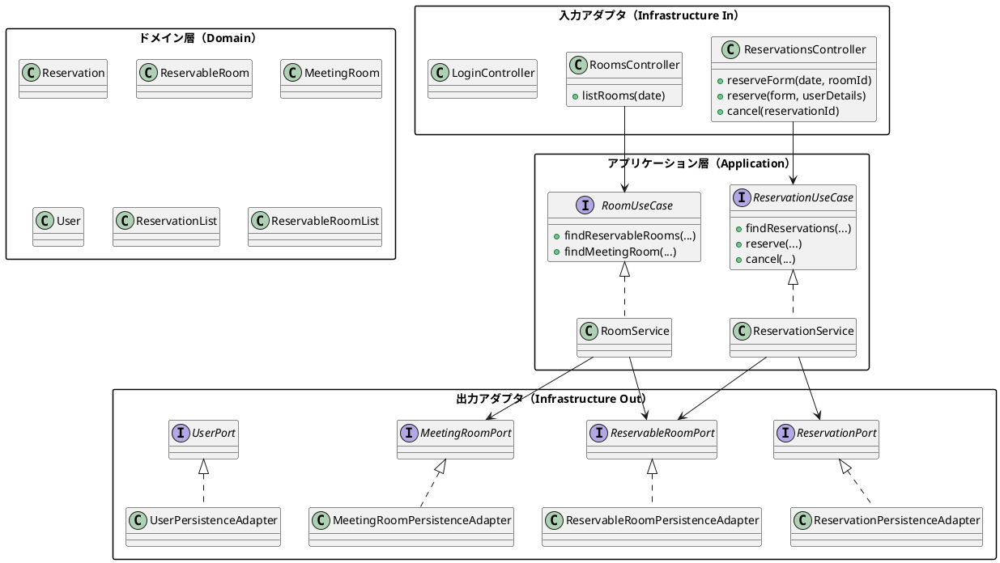
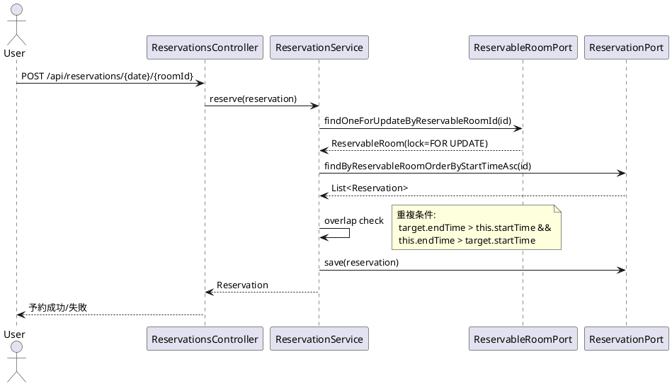

# 会議室予約システム（MRS）アーキテクチャ

最終更新: 2025-08-29

参照: 
- 要件: ../requirements/仕様.md
- リリース計画: ../requirements/リリース計画.md
- 実装詳細: ../reference/会議室予約システムのケーススタディ/実装詳細.md

---

## 1. アーキテクチャ概要
- スタイル: ヘキサゴナルアーキテクチャ（Ports & Adapters）
- 目的: ドメイン中心、テスタブル、入出力依存の分離、段階的進化を可能にする
- キー特性: 疎結合、単方向依存（外→内）、境界での契約（ポート）

### 1.1 コンポーネント構成


### 1.2 層の責務
- Domain: ビジネスルール（重複判定、値オブジェクトの整合性）
- Application: ユースケース調停（取引、排他、権限境界での意思決定）
- Infrastructure In: Web API/DTO変換
- Infrastructure Out: DBアクセス（MyBatis/Flyway）、外部システム

---

## 2. ポートとアダプタ
- 入力ポート（UseCase）
  - ReservationUseCase, RoomUseCase
- 出力ポート（Repository/Service）
  - ReservationPort, ReservableRoomPort, MeetingRoomPort, UserPort
- アダプタ
  - In: Controller（Spring MVC）
  - Out: PersistenceAdapter（MyBatis + SQL明示の悲観ロック）

契約の例（抜粋）
- ReservableRoomPort.findOneForUpdateByReservableRoomId(id): SQLの`FOR UPDATE`で予約可能会議室を取得
- ReservationPort.findByReservableRoomOrderByStartTimeAsc(id): 開始時刻昇順取得

---

## 3. 主要ユースケースのフロー

### 3.1 予約作成（重複排除＋排他制御）


前提条件
- ログイン済（F001）
- 予約可能日/部屋の組み合わせが有効

異常系
- UnavailableReservationException: 予約不可組合せ
- AlreadyReservedException: 時間帯重複

### 3.2 予約キャンセル（権限制御）
- @PreAuthorize("hasRole('ADMIN') or #reservation.user.userId.value == principal.user.userId.value")
- 予約者本人または管理者のみ削除可能

---

## 4. セキュリティ設計
- 認証: Spring Security + JWT（Stateless）、BCrypt
- 認可: URL保護 + メソッドレベル（@PreAuthorize）
- フィルタ: `OncePerRequestFilter` で Authorization: Bearer を検証し `SecurityContext` を構築
- セッション/CSRF: APIは `SessionCreationPolicy.STATELESS`、API系エンドポイントはCSRF無効
- エンドポイント例: `POST /api/auth/login`, `POST /api/auth/refresh`、保護API: `GET /api/rooms`, `POST /api/reservations`

---

## 5. データモデルと永続化
- DB: Dev=H2(PostgreSQLモード)、Prd=PostgreSQL
- マイグレーション: Flyway（dev/prd フォルダ分離）
- エンティティ/テーブル（ERDは仕様参照）
  - usr, meeting_room, reservable_room, reservation
- 永続化: MyBatis（`infrastructure/out/persistence/mybatis` + `resources/mybatis/mappers`）
- 排他: ReservableRoom取得時に `SELECT ... FOR UPDATE` を用いて行ロックを取得
- バリデーション: Bean Validation + カスタム（30分単位、終了>開始）

---

## 6. 非機能要件への対応（N001–N004）
- 性能（N001）
  - 一覧/予約作成のクエリ最適化、インデックス、N+1回避
  - 画面≤2s、予約≤3s、ログイン≤1s を目標
- 可用性（N002）
  - 稼働率99.0%、日次バックアップ、≤4h復旧手順
- セキュリティ（N003）
  - BCrypt、CSRF、URL/メソッド保護
- 運用（N004）
  - Actuatorヘルス/メトリクス、SQL/アプリ/セキュリティログ

---

## 7. テスト戦略
- 単体: 値オブジェクト/重複判定/サービスのビジネスロジック
- 統合: Controller+Security、PersistenceAdapter（テストDB）
- E2E: Cucumber による 認証（JWT）→会議室一覧→予約→キャンセル主要シナリオ
- 否定テスト: 権限外操作、重複予約、トークン不備

---

## 8. 品質設計と原則
- DDD: 重要ロジックはドメインへ（Reservation.overlap）
- 値オブジェクト: UserId/Password/Name/ReservationTimeSlot 等
- 不変/境界: 生成時検証で不正状態を防止
- 単方向依存: UI→Application→Domain（インフラは適応層）

---

## 9. トレーサビリティ
- 機能: F001–F005 / UI001–003 に対応
- 非機能: N001–N004
- 制約: C001–C003
- リリース計画: Iteration 1–4 の各スコープにマッピング

---

## 10. 拡張方針
- 検索/フィルタ機能の強化（会議室属性/設備）
- 監査ログ/変更履歴の導入
- 管理機能（一括キャンセル、休日管理）
- 可観測性（分散トレース、ダッシュボード）

---

## 付録A. パッケージ構成（例）
```
src/main/java/mrs/
  ├── application/
  │   ├── domain/model/{auth,reservation,room}
  │   ├── port/{in,out}
  │   └── service/{reservation,room,auth}
  ├── infrastructure/
  │   ├── in/web
  │   └── out/persistence
  ├── common/validation
  ├── WebSecurityConfig.java
  └── Application.java
```

---

備考: 本ドキュメントは実装詳細および要件仕様/リリース計画に整合し、変更時は三者（仕様・設計・実装）同期を維持すること。