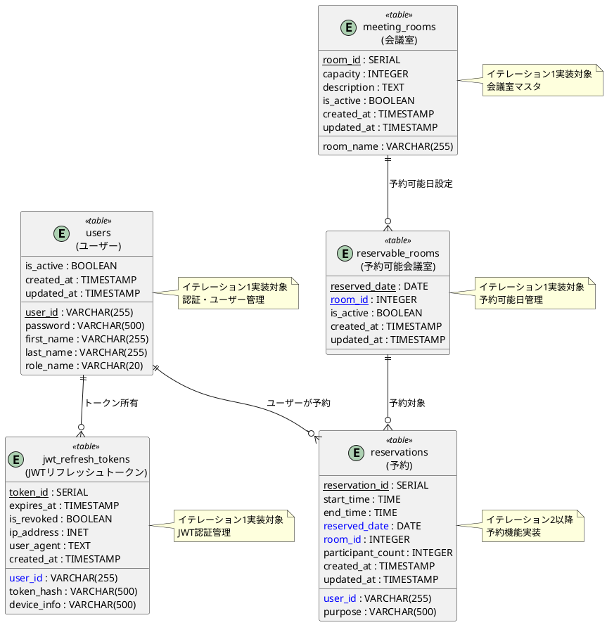

# データモデル設計

**更新日**: 2025-08-29  
**バージョン**: 1.0  
**参照**: [イテレーション計画1](../development/イテレーション計画1.md) | [ドメインモデル](ドメインモデル.md)

---

## 1. 概要

会議室予約システム（MRS）のデータモデルは、PostgreSQLを使用したリレーショナルデータベース設計です。Dapperを使用したデータアクセス層で、ドメインモデルとデータベーススキーマをマッピングします。

### 1.1 設計原則
- **正規化**: 第3正規形まで正規化し、データの整合性を保証
- **パフォーマンス**: 適切なインデックス設計による高速なクエリ実行
- **拡張性**: 将来的な機能追加に対応できるスキーマ設計
- **保守性**: マイグレーション管理による安全なスキーマ変更

### 1.2 技術スタック
- **データベース**: PostgreSQL 16+
- **O/Rマッピング**: Dapper（.NET 9）
- **マイグレーション**: Entity Framework Core Migrations
- **接続プール**: Npgsql Connection Pooling

## 2. データベース設計全体図



## 3. イテレーション1実装対象テーブル

### 3.1 ユーザーテーブル（users）

```sql
CREATE TABLE users (
    user_id VARCHAR(255) NOT NULL PRIMARY KEY,
    password VARCHAR(500) NOT NULL,  -- BCryptハッシュ用に大きめのサイズ
    first_name VARCHAR(255) NOT NULL,
    last_name VARCHAR(255) NOT NULL,
    role_name VARCHAR(20) NOT NULL CHECK (role_name IN ('Admin', 'User', 'Guest')),
    is_active BOOLEAN NOT NULL DEFAULT true,
    created_at TIMESTAMP WITH TIME ZONE NOT NULL DEFAULT CURRENT_TIMESTAMP,
    updated_at TIMESTAMP WITH TIME ZONE NOT NULL DEFAULT CURRENT_TIMESTAMP
);

-- インデックス
CREATE INDEX idx_users_role_name ON users(role_name);
CREATE INDEX idx_users_is_active ON users(is_active);
CREATE INDEX idx_users_created_at ON users(created_at);

-- 更新日時自動更新トリガー
CREATE OR REPLACE FUNCTION update_updated_at()
RETURNS TRIGGER AS $$
BEGIN
    NEW.updated_at = CURRENT_TIMESTAMP;
    RETURN NEW;
END;
$$ LANGUAGE plpgsql;

CREATE TRIGGER trigger_users_updated_at
    BEFORE UPDATE ON users
    FOR EACH ROW
    EXECUTE FUNCTION update_updated_at();
```

**設計ポイント**:
- `user_id`: 文字列型で業務上の意味を持つID
- `password`: BCryptハッシュを格納（$2a$形式で60文字程度）
- `role_name`: ENUMではなくVARCHARでCHECK制約による柔軟性
- `is_active`: 論理削除用フラグ
- タイムスタンプ列でデータ管理

### 3.2 会議室テーブル（meeting_rooms）

```sql
CREATE TABLE meeting_rooms (
    room_id SERIAL PRIMARY KEY,
    room_name VARCHAR(255) NOT NULL UNIQUE,
    capacity INTEGER,
    description TEXT,
    is_active BOOLEAN NOT NULL DEFAULT true,
    created_at TIMESTAMP WITH TIME ZONE NOT NULL DEFAULT CURRENT_TIMESTAMP,
    updated_at TIMESTAMP WITH TIME ZONE NOT NULL DEFAULT CURRENT_TIMESTAMP
);

-- インデックス
CREATE INDEX idx_meeting_rooms_is_active ON meeting_rooms(is_active);
CREATE INDEX idx_meeting_rooms_room_name ON meeting_rooms(room_name);

-- 更新日時自動更新トリガー
CREATE TRIGGER trigger_meeting_rooms_updated_at
    BEFORE UPDATE ON meeting_rooms
    FOR EACH ROW
    EXECUTE FUNCTION update_updated_at();
```

**設計ポイント**:
- `room_id`: SERIAL型による自動採番
- `room_name`: 一意制約で重複防止
- `capacity`: 将来的な収容人数制限用（nullable）
- `description`: 会議室の詳細説明用

### 3.3 予約可能会議室テーブル（reservable_rooms）

```sql
CREATE TABLE reservable_rooms (
    reserved_date DATE NOT NULL,
    room_id INTEGER NOT NULL REFERENCES meeting_rooms(room_id),
    is_active BOOLEAN NOT NULL DEFAULT true,
    created_at TIMESTAMP WITH TIME ZONE NOT NULL DEFAULT CURRENT_TIMESTAMP,
    updated_at TIMESTAMP WITH TIME ZONE NOT NULL DEFAULT CURRENT_TIMESTAMP,
    PRIMARY KEY (reserved_date, room_id)
);

-- インデックス
CREATE INDEX idx_reservable_rooms_reserved_date ON reservable_rooms(reserved_date);
CREATE INDEX idx_reservable_rooms_room_id ON reservable_rooms(room_id);
CREATE INDEX idx_reservable_rooms_is_active ON reservable_rooms(is_active);

-- 日付＋会議室の複合インデックス（主キーで自動作成されるが明示）
-- CREATE INDEX idx_reservable_rooms_date_room ON reservable_rooms(reserved_date, room_id);

-- 更新日時自動更新トリガー
CREATE TRIGGER trigger_reservable_rooms_updated_at
    BEFORE UPDATE ON reservable_rooms
    FOR EACH ROW
    EXECUTE FUNCTION update_updated_at();
```

**設計ポイント**:
- **複合主キー**: `(reserved_date, room_id)`で一意性保証
- 外部キー制約で`meeting_rooms`テーブルとの整合性保証
- 日付範囲検索に最適化されたインデックス

### 3.4 JWTリフレッシュトークンテーブル（jwt_refresh_tokens）

```sql
CREATE TABLE jwt_refresh_tokens (
    token_id SERIAL PRIMARY KEY,
    user_id VARCHAR(255) NOT NULL REFERENCES users(user_id),
    token_hash VARCHAR(500) NOT NULL UNIQUE,
    expires_at TIMESTAMP WITH TIME ZONE NOT NULL,
    is_revoked BOOLEAN NOT NULL DEFAULT false,
    device_info VARCHAR(500),
    ip_address INET,
    user_agent TEXT,
    created_at TIMESTAMP WITH TIME ZONE NOT NULL DEFAULT CURRENT_TIMESTAMP
);

-- インデックス
CREATE INDEX idx_jwt_refresh_tokens_user_id ON jwt_refresh_tokens(user_id);
CREATE INDEX idx_jwt_refresh_tokens_expires_at ON jwt_refresh_tokens(expires_at);
CREATE INDEX idx_jwt_refresh_tokens_is_revoked ON jwt_refresh_tokens(is_revoked);
CREATE INDEX idx_jwt_refresh_tokens_token_hash ON jwt_refresh_tokens(token_hash);

-- 期限切れトークンの自動削除用インデックス
CREATE INDEX idx_jwt_refresh_tokens_cleanup ON jwt_refresh_tokens(expires_at, is_revoked);
```

**設計ポイント**:
- `token_hash`: リフレッシュトークンのSHA-256ハッシュ値
- `expires_at`: トークンの有効期限（30日）
- セキュリティ監査用のデバイス情報・IP記録
- 期限切れトークンの効率的なクリーンアップ

## 4. Dapperマッピング設計

### 4.1 エンティティマッピングクラス

```csharp
namespace MRS.Infrastructure.Persistence.Entities
{
    /// <summary>
    /// ユーザーテーブルエンティティ
    /// </summary>
    public class UserEntity
    {
        public string UserId { get; set; } = string.Empty;
        public string Password { get; set; } = string.Empty;
        public string FirstName { get; set; } = string.Empty;
        public string LastName { get; set; } = string.Empty;
        public string RoleName { get; set; } = string.Empty;
        public bool IsActive { get; set; }
        public DateTime CreatedAt { get; set; }
        public DateTime UpdatedAt { get; set; }
    }

    /// <summary>
    /// 会議室テーブルエンティティ
    /// </summary>
    public class MeetingRoomEntity
    {
        public int RoomId { get; set; }
        public string RoomName { get; set; } = string.Empty;
        public int? Capacity { get; set; }
        public string? Description { get; set; }
        public bool IsActive { get; set; }
        public DateTime CreatedAt { get; set; }
        public DateTime UpdatedAt { get; set; }
    }

    /// <summary>
    /// 予約可能会議室テーブルエンティティ
    /// </summary>
    public class ReservableRoomEntity
    {
        public DateOnly ReservedDate { get; set; }
        public int RoomId { get; set; }
        public bool IsActive { get; set; }
        public DateTime CreatedAt { get; set; }
        public DateTime UpdatedAt { get; set; }
        
        // JOIN用ナビゲーションプロパティ（Dapperで手動マッピング）
        public MeetingRoomEntity? MeetingRoom { get; set; }
    }
}
```

### 4.2 ドメインエンティティマッパー

```csharp
namespace MRS.Infrastructure.Persistence.Mappers
{
    /// <summary>
    /// ドメインエンティティ↔データベースエンティティのマッピング
    /// </summary>
    public static class EntityMapper
    {
        public static User ToUser(UserEntity entity)
        {
            return new User(
                new UserId(entity.UserId),
                Password.CreateFromHash(entity.Password),
                new Name(entity.FirstName, entity.LastName),
                Enum.Parse<RoleName>(entity.RoleName)
            );
        }

        public static UserEntity ToUserEntity(User user)
        {
            return new UserEntity
            {
                UserId = user.UserId.Value,
                Password = user.Password.HashedValue,
                FirstName = user.Name.FirstName,
                LastName = user.Name.LastName,
                RoleName = user.RoleName.ToString(),
                IsActive = true,
                CreatedAt = DateTime.UtcNow,
                UpdatedAt = DateTime.UtcNow
            };
        }

        public static Room ToRoom(MeetingRoomEntity entity)
        {
            return new Room(
                new RoomId(entity.RoomId),
                new RoomName(entity.RoomName)
            );
        }

        public static ReservableRoom ToReservableRoom(ReservableRoomEntity entity)
        {
            var room = entity.MeetingRoom != null ? ToRoom(entity.MeetingRoom) : null;
            return new ReservableRoom(
                new ReservableRoomId(new RoomId(entity.RoomId), entity.ReservedDate),
                room!,
                entity.ReservedDate
            );
        }
    }
}
```

## 5. データアクセス実装

### 5.1 基底リポジトリクラス

```csharp
namespace MRS.Infrastructure.Persistence.Repositories
{
    public abstract class BaseRepository
    {
        protected readonly IDbConnection _connection;
        protected readonly ILogger _logger;

        protected BaseRepository(IDbConnection connection, ILogger logger)
        {
            _connection = connection;
            _logger = logger;
        }

        protected async Task<T> QuerySingleAsync<T>(string sql, object? param = null)
        {
            _logger.LogDebug("Executing Query: {Sql}, Parameters: {@Param}", sql, param);
            return await _connection.QuerySingleAsync<T>(sql, param);
        }

        protected async Task<IEnumerable<T>> QueryAsync<T>(string sql, object? param = null)
        {
            _logger.LogDebug("Executing Query: {Sql}, Parameters: {@Param}", sql, param);
            return await _connection.QueryAsync<T>(sql, param);
        }
    }
}
```

### 5.2 ユーザーリポジトリ実装

```csharp
namespace MRS.Infrastructure.Persistence.Repositories
{
    public class UserRepository : BaseRepository, IUserRepository
    {
        public UserRepository(IDbConnection connection, ILogger<UserRepository> logger)
            : base(connection, logger) { }

        public async Task<User?> FindByIdAsync(UserId userId)
        {
            const string sql = @"
                SELECT user_id, password, first_name, last_name, role_name, 
                       is_active, created_at, updated_at
                FROM users 
                WHERE user_id = @UserId AND is_active = true";

            var entity = await _connection.QuerySingleOrDefaultAsync<UserEntity>(
                sql, new { UserId = userId.Value });

            return entity != null ? EntityMapper.ToUser(entity) : null;
        }

        public async Task<User?> FindByCredentialsAsync(UserId userId, string plainPassword)
        {
            var user = await FindByIdAsync(userId);
            return user?.Password.IsValid(plainPassword) == true ? user : null;
        }

        public async Task<bool> ExistsAsync(UserId userId)
        {
            const string sql = "SELECT COUNT(1) FROM users WHERE user_id = @UserId";
            var count = await _connection.QuerySingleAsync<int>(sql, new { UserId = userId.Value });
            return count > 0;
        }

        public async Task SaveAsync(User user)
        {
            const string sql = @"
                INSERT INTO users (user_id, password, first_name, last_name, role_name)
                VALUES (@UserId, @Password, @FirstName, @LastName, @RoleName)
                ON CONFLICT (user_id) 
                DO UPDATE SET 
                    password = EXCLUDED.password,
                    first_name = EXCLUDED.first_name,
                    last_name = EXCLUDED.last_name,
                    role_name = EXCLUDED.role_name,
                    updated_at = CURRENT_TIMESTAMP";

            var entity = EntityMapper.ToUserEntity(user);
            await _connection.ExecuteAsync(sql, entity);
        }
    }
}
```

### 5.3 会議室リポジトリ実装

```csharp
namespace MRS.Infrastructure.Persistence.Repositories
{
    public class RoomRepository : BaseRepository, IRoomRepository
    {
        public RoomRepository(IDbConnection connection, ILogger<RoomRepository> logger)
            : base(connection, logger) { }

        public async Task<IEnumerable<ReservableRoom>> FindReservableRoomsAsync(DateOnly date)
        {
            const string sql = @"
                SELECT 
                    rr.reserved_date, rr.room_id, rr.is_active,
                    rr.created_at, rr.updated_at,
                    mr.room_id as room_room_id, mr.room_name, mr.capacity, 
                    mr.description, mr.is_active as room_is_active,
                    mr.created_at as room_created_at, mr.updated_at as room_updated_at
                FROM reservable_rooms rr
                INNER JOIN meeting_rooms mr ON rr.room_id = mr.room_id
                WHERE rr.reserved_date = @Date 
                  AND rr.is_active = true 
                  AND mr.is_active = true
                ORDER BY mr.room_id";

            var results = await _connection.QueryAsync<ReservableRoomEntity, MeetingRoomEntity, ReservableRoomEntity>(
                sql,
                (reservableRoom, meetingRoom) =>
                {
                    reservableRoom.MeetingRoom = meetingRoom;
                    return reservableRoom;
                },
                new { Date = date },
                splitOn: "room_room_id"
            );

            return results.Select(EntityMapper.ToReservableRoom);
        }

        public async Task<Room?> FindByIdAsync(RoomId roomId)
        {
            const string sql = @"
                SELECT room_id, room_name, capacity, description, is_active, created_at, updated_at
                FROM meeting_rooms 
                WHERE room_id = @RoomId AND is_active = true";

            var entity = await _connection.QuerySingleOrDefaultAsync<MeetingRoomEntity>(
                sql, new { RoomId = roomId.Value });

            return entity != null ? EntityMapper.ToRoom(entity) : null;
        }
    }
}
```

## 6. マイグレーション管理

### 6.1 Entity Framework Core Migrations設定

```csharp
// MRS.Infrastructure/Persistence/MrsDbContext.cs
namespace MRS.Infrastructure.Persistence
{
    public class MrsDbContext : DbContext
    {
        public MrsDbContext(DbContextOptions<MrsDbContext> options) : base(options) { }

        // マイグレーション用のダミーDbSet（Dapperメインなので実際のCRUDでは使用しない）
        public DbSet<UserEntity> Users { get; set; } = null!;
        public DbSet<MeetingRoomEntity> MeetingRooms { get; set; } = null!;
        public DbSet<ReservableRoomEntity> ReservableRooms { get; set; } = null!;

        protected override void OnModelCreating(ModelBuilder modelBuilder)
        {
            // テーブル設定
            modelBuilder.Entity<UserEntity>(entity =>
            {
                entity.ToTable("users");
                entity.HasKey(e => e.UserId);
                entity.Property(e => e.Password).HasMaxLength(500);
                entity.Property(e => e.FirstName).HasMaxLength(255);
                entity.Property(e => e.LastName).HasMaxLength(255);
                entity.Property(e => e.RoleName).HasMaxLength(20);
            });

            modelBuilder.Entity<MeetingRoomEntity>(entity =>
            {
                entity.ToTable("meeting_rooms");
                entity.HasKey(e => e.RoomId);
                entity.Property(e => e.RoomName).HasMaxLength(255);
            });

            modelBuilder.Entity<ReservableRoomEntity>(entity =>
            {
                entity.ToTable("reservable_rooms");
                entity.HasKey(e => new { e.ReservedDate, e.RoomId });
            });
        }
    }
}
```

### 6.2 初期マイグレーション

```bash
# マイグレーション作成
dotnet ef migrations add InitialCreate --project MRS.Infrastructure --startup-project MRS.Api

# データベース更新
dotnet ef database update --project MRS.Infrastructure --startup-project MRS.Api
```

## 7. 接続設定とDI構成

### 7.1 接続文字列設定

```json
{
  "ConnectionStrings": {
    "DefaultConnection": "Host=localhost;Port=5432;Database=mrs_db;Username=mrs_user;Password=mrs_password;Include Error Detail=true",
    "TestConnection": "Host=localhost;Port=5432;Database=mrs_test_db;Username=mrs_user;Password=mrs_password;Include Error Detail=true"
  },
  "Dapper": {
    "CommandTimeout": 30,
    "EnableSensitiveDataLogging": false
  }
}
```

### 7.2 DI設定

```csharp
// MRS.Api/Extensions/ServiceCollectionExtensions.cs
public static class ServiceCollectionExtensions
{
    public static IServiceCollection AddInfrastructure(this IServiceCollection services, 
        IConfiguration configuration)
    {
        // データベース接続
        services.AddScoped<IDbConnection>(provider =>
        {
            var connectionString = configuration.GetConnectionString("DefaultConnection");
            return new NpgsqlConnection(connectionString);
        });

        // Entity Framework（マイグレーション用）
        services.AddDbContext<MrsDbContext>(options =>
            options.UseNpgsql(configuration.GetConnectionString("DefaultConnection")));

        // リポジトリ
        services.AddScoped<IUserRepository, UserRepository>();
        services.AddScoped<IRoomRepository, RoomRepository>();

        return services;
    }
}
```

## 8. パフォーマンス最適化

### 8.1 インデックス戦略
- **単一列インデックス**: 頻繁な検索条件（`user_id`, `room_id`, `reserved_date`）
- **複合インデックス**: JOINとWHEREの最適化
- **部分インデックス**: `is_active = true`条件での絞り込み最適化

### 8.2 クエリ最適化
- **JOIN最適化**: 必要な列のみSELECT
- **N+1問題回避**: Dapperの`QueryMultiple`活用
- **接続プール**: Npgsqlの接続プーリング設定

### 8.3 キャッシュ戦略（将来実装）
```csharp
// 将来的なキャッシュ実装例
public class CachedRoomRepository : IRoomRepository
{
    private readonly IRoomRepository _repository;
    private readonly IMemoryCache _cache;

    public async Task<IEnumerable<ReservableRoom>> FindReservableRoomsAsync(DateOnly date)
    {
        var cacheKey = $"reservable-rooms:{date:yyyy-MM-dd}";
        return await _cache.GetOrCreateAsync(cacheKey, async entry =>
        {
            entry.SlidingExpiration = TimeSpan.FromMinutes(15);
            return await _repository.FindReservableRoomsAsync(date);
        });
    }
}
```

## 9. テストデータ投入

### 9.1 開発用テストデータ

```sql
-- V1.01__test_data.sql
-- テストユーザー（パスワード：Password123!）
INSERT INTO users (user_id, password, first_name, last_name, role_name) VALUES 
('admin', '$2a$10$92IXUNpkjO0rOQ5byMi.Ye4oKoEa3Ro9llC/.og/at2.uheWG/igi', 'Admin', 'User', 'Admin'),
('user01', '$2a$10$92IXUNpkjO0rOQ5byMi.Ye4oKoEa3Ro9llC/.og/at2.uheWG/igi', '太郎', '田中', 'User'),
('user02', '$2a$10$92IXUNpkjO0rOQ5byMi.Ye4oKoEa3Ro9llC/.og/at2.uheWG/igi', '花子', '山田', 'User');

-- 会議室マスタ
INSERT INTO meeting_rooms (room_name, capacity, description) VALUES 
('新木場', 10, '10名用会議室'),
('辰巳', 8, '8名用会議室'),
('豊洲', 20, '20名用大会議室'),
('月島', 6, '6名用小会議室'),
('新富町', 12, '12名用会議室'),
('銀座一丁目', 15, '15名用会議室'),
('有楽町', 25, '25名用大会議室');

-- 今日から1週間分の予約可能日設定
INSERT INTO reservable_rooms (reserved_date, room_id) 
SELECT 
    (CURRENT_DATE + INTERVAL '1 day' * d.day_offset)::date as reserved_date,
    r.room_id
FROM generate_series(0, 6) as d(day_offset)
CROSS JOIN meeting_rooms r
WHERE r.is_active = true;
```

## 10. 監視・運用設計

### 10.1 ログ設計
```csharp
public class DatabaseMetricsMiddleware
{
    public async Task InvokeAsync(HttpContext context, RequestDelegate next)
    {
        var stopwatch = Stopwatch.StartNew();
        
        try
        {
            await next(context);
        }
        finally
        {
            var metrics = new
            {
                Duration = stopwatch.ElapsedMilliseconds,
                RequestPath = context.Request.Path,
                StatusCode = context.Response.StatusCode
            };
            
            // メトリクス記録
            _logger.LogInformation("Database operation completed: {@Metrics}", metrics);
        }
    }
}
```

### 10.2 ヘルスチェック
```csharp
services.AddHealthChecks()
    .AddNpgSql(configuration.GetConnectionString("DefaultConnection"));
```

---

**承認者**: データベース設計責任者  
**レビュワー**: 開発チーム・DBA
