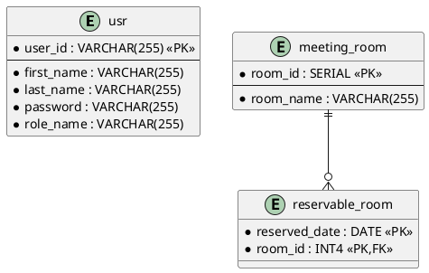

データモデル（Iteration 1: 認証＋会議室一覧）

最終更新: 2025-08-29
参照:
- イテレーション計画: ../development/イテレーション計画1.md
- アプリ構成: ./アプリケーション構成.md（MyBatis / JWT / Cucumber）
- 実装詳細: ../reference/会議室予約システムのケーススタディ/実装詳細.md
- ADR: ../adr/20250829.md

---

Iteration 1 のスコープに必要な最小テーブル/カラムと制約を示す。

## ERD（抜粋）

予約テーブル（reservation）は Iteration 1 では未使用。

## テーブル定義と制約（要点）

- usr
  - PK: (user_id)
  - password: BCrypt が格納される（平文不可）
  - role_name: 'ADMIN' | 'USER'
- meeting_room
  - PK: (room_id)
  - room_name: NOT NULL, ユニーク制約は任意
- reservable_room
  - PK: (reserved_date, room_id)
  - FK: (room_id) → meeting_room(room_id)
  - 取得は reserved_date 単位で room_id 昇順が多い

## インデックス

- reservable_room(reserved_date, room_id) PK でカバー
- meeting_room(room_id) PK
- usr(user_id) PK

## マイグレーション（Flyway）

- `V1.00__schema_startup.sql` / `V1.01__data_startup.sql` をベースに dev/prd を分離
- Iteration 1 では初期ユーザー（BCrypt）、会議室、予約可能日を準備

## MyBatis マッピング方針

- Type Alias は `mrs.application.domain.model.*`
- カラム名はスネークケース、ドメインはキャメル → `map-underscore-to-camel-case=true`
- 典型的なMapper例:
  - `UserMapper.findById(userId)` → `SELECT user_id, first_name, last_name, password, role_name FROM usr WHERE user_id = #{userId}`
  - `ReservableRoomMapper.findByDate(reservedDate)` → `SELECT rr.reserved_date, rr.room_id, mr.room_name FROM reservable_room rr JOIN meeting_room mr ON rr.room_id = mr.room_id WHERE rr.reserved_date = #{reservedDate} ORDER BY rr.room_id ASC`

## データ整合性と注意点

- usr.password は必ずBCrypt（`^\$2[aby]\$` で判定可）
- reservable_room の一意性で一覧重複防止
- タイムゾーン: reserved_date は LocalDate（DBはDATE）で扱い、UTC変換は不要

---

備考: Iteration 2 以降で reservation テーブルと排他（`FOR UPDATE`）が活性化される。