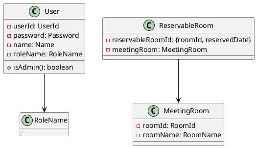

# ドメインモデル（Iteration 1: 認証＋会議室一覧）

最終更新: 2025-08-29
参照: 
- イテレーション計画: ../development/イテレーション計画1.md
- アプリ構成: ./アプリケーション構成.md（MyBatis / JWT / Cucumber）
- 実装詳細: ../reference/会議室予約システムのケーススタディ/実装詳細.md
- ADR: ../adr/20250829.md

---

本ドキュメントは Iteration 1 のスコープ（F001 認証、F002 会議室一覧/日付切替）で必要となる最小のドメインモデルを示す。

## 境界づけとアグリゲート

- 認証（Auth）境界
  - エンティティ: User
  - 値オブジェクト: UserId, Password(BCrypt), Name, RoleName（Enum）
  - 不変条件: UserIdは非空/長さ制限、Passwordはハッシュで保存
- 会議室（Room）境界
  - エンティティ: MeetingRoom
  - エンティティ: ReservableRoom（キー: roomId + reservedDate）
  - 値オブジェクト: RoomId, RoomName, ReservedDate

予約（Reservation）境界はIteration 1のスコープ外（参照のみ）。

## クラス関係（簡易）

## ユースケースとドメイン協調

- UC01 ログイン
  - 入力: username, password（平文）
  - 処理: User を取得→BCryptで照合→JWTアクセストークン/リフレッシュを発行
  - 出力: JWT, ロール情報
- UC03 会議室一覧
  - 入力: reservedDate
  - 処理: ReservableRoom を reservedDate で昇順取得、MeetingRoomを含めて返却
  - 出力: 会議室一覧
- UC09 日付切替
  - 入力: reservedDate +/- 1日
  - 処理: UC03と同様

## ポートと契約（抜粋）

- UserPort
  - findById(UserId): User | null
  - save(User): void（今回は参照主体）
- ReservableRoomPort
  - findByReservedDate(ReservedDate): List<ReservableRoom>
  - findOneForUpdateById(ReservableRoomId): ReservableRoom（将来の予約で使用）

出力アダプタは MyBatis Mapper で実装する。

## ドメインルール（Iteration 1）

- User
  - passwordはハッシュ（BCrypt）。平文保持禁止。
- ReservableRoom
  - 同一reservedDate + roomId の一意制約（データモデルで担保）

## 例外/エラー

- 認証失敗: InvalidCredentialsException（401）
- 権限不足: AccessDenied（403）
- データ未存在: NotFound（404）

## テスト指針（ドメイン）

- 値オブジェクトのバリデーション（UserId, Password, RoomId, RoomName, ReservedDate）
- User.isAdmin()
- ReservableRoom のID構築/等価性

---

備考: Iteration 2 以降で Reservation 境界の重複判定（Reservation#overlap）と悲観ロックが活性化される。
