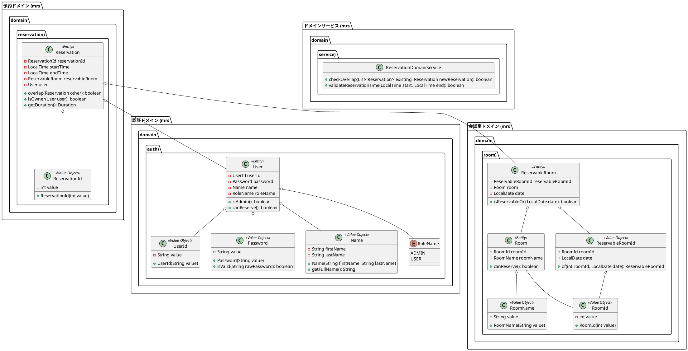

# ドメインモデル設計

**更新日**: 2025-08-29  
**バージョン**: 1.0  
**参照**: [イテレーション計画1](../development/イテレーション計画1.md) | [アーキテクチャ設計](アーキテクチャ.md)

---

## 1. 概要

会議室予約システム（MRS）のドメインモデルは、ヘキサゴナルアーキテクチャのドメイン層として設計され、ビジネスロジックとドメインルールを表現します。イテレーション1では認証と会議室閲覧の基盤となるドメインモデルを実装します。

### 1.1 設計原則
- **ドメインファースト**: ビジネスロジックをドメイン層に集約
- **不変性**: エンティティとバリューオブジェクトの不変性を保証
- **リッチドメインモデル**: アネミックドメインモデルを避け、ビジネスロジックをドメインオブジェクトに配置
- **バリデーション駆動**: ドメインオブジェクト作成時に必要なバリデーションを実行

## 2. ドメインモデル全体図



## 3. イテレーション1実装対象

### 3.1 認証ドメイン（Authentication Domain）

#### 3.1.1 User エンティティ
```csharp
namespace MRS.Domain.Entities.Auth
{
    /// <summary>
    /// ユーザーエンティティ
    /// システムの利用者を表すドメインエンティティ
    /// </summary>
    public class User
    {
        public UserId UserId { get; }
        public Password Password { get; }
        public Name Name { get; }
        public RoleName RoleName { get; }

        public User(UserId userId, Password password, Name name, RoleName roleName)
        {
            UserId = userId ?? throw new ArgumentNullException(nameof(userId));
            Password = password ?? throw new ArgumentNullException(nameof(password));
            Name = name ?? throw new ArgumentNullException(nameof(name));
            RoleName = roleName;
        }

        /// <summary>
        /// 管理者権限を持っているかの判定
        /// </summary>
        public bool IsAdmin() => RoleName == RoleName.Admin;

        /// <summary>
        /// 予約権限を持っているかの判定
        /// </summary>
        public bool CanReserve() => RoleName != RoleName.Guest;
    }
}
```

#### 3.1.2 UserId バリューオブジェクト
```csharp
namespace MRS.Domain.ValueObjects.Auth
{
    /// <summary>
    /// ユーザーID値オブジェクト
    /// ドメインの一意識別子として機能
    /// </summary>
    public record UserId
    {
        public string Value { get; }

        public UserId(string value)
        {
            if (string.IsNullOrWhiteSpace(value))
                throw new ArgumentException("ユーザーIDは必須です", nameof(value));
            
            if (value.Length > 255)
                throw new ArgumentException("ユーザーIDは255文字以内である必要があります", nameof(value));

            Value = value.Trim();
        }

        public static implicit operator string(UserId userId) => userId.Value;
        public static implicit operator UserId(string value) => new(value);
    }
}
```

#### 3.1.3 Password バリューオブジェクト
```csharp
namespace MRS.Domain.ValueObjects.Auth
{
    /// <summary>
    /// パスワード値オブジェクト
    /// ハッシュ化された状態で保持
    /// </summary>
    public record Password
    {
        public string HashedValue { get; }

        private Password(string hashedValue)
        {
            HashedValue = hashedValue;
        }

        /// <summary>
        /// 平文パスワードからハッシュ化パスワードを作成
        /// </summary>
        public static Password CreateFromPlainText(string plainText)
        {
            if (string.IsNullOrWhiteSpace(plainText))
                throw new ArgumentException("パスワードは必須です", nameof(plainText));
            
            if (plainText.Length < 8)
                throw new ArgumentException("パスワードは8文字以上である必要があります", nameof(plainText));

            return new Password(BCrypt.Net.BCrypt.HashPassword(plainText));
        }

        /// <summary>
        /// ハッシュ済みパスワードから作成（DB復元用）
        /// </summary>
        public static Password CreateFromHash(string hashedValue)
        {
            if (string.IsNullOrWhiteSpace(hashedValue))
                throw new ArgumentException("ハッシュ化パスワードは必須です", nameof(hashedValue));

            return new Password(hashedValue);
        }

        /// <summary>
        /// 平文パスワードとの照合
        /// </summary>
        public bool IsValid(string plainText) => 
            BCrypt.Net.BCrypt.Verify(plainText, HashedValue);
    }
}
```

#### 3.1.4 Name バリューオブジェクト
```csharp
namespace MRS.Domain.ValueObjects.Auth
{
    /// <summary>
    /// 氏名値オブジェクト
    /// </summary>
    public record Name
    {
        public string FirstName { get; }
        public string LastName { get; }

        public Name(string firstName, string lastName)
        {
            if (string.IsNullOrWhiteSpace(firstName))
                throw new ArgumentException("名は必須です", nameof(firstName));
            
            if (string.IsNullOrWhiteSpace(lastName))
                throw new ArgumentException("姓は必須です", nameof(lastName));

            FirstName = firstName.Trim();
            LastName = lastName.Trim();
        }

        /// <summary>
        /// フルネームを取得（姓 名の形式）
        /// </summary>
        public string GetFullName() => $"{LastName} {FirstName}";

        public override string ToString() => GetFullName();
    }
}
```

#### 3.1.5 RoleName 列挙型
```csharp
namespace MRS.Domain.ValueObjects.Auth
{
    /// <summary>
    /// ユーザーロール
    /// </summary>
    public enum RoleName
    {
        /// <summary>管理者</summary>
        Admin,
        /// <summary>一般ユーザー</summary>
        User,
        /// <summary>ゲスト（閲覧のみ）</summary>
        Guest
    }
}
```

### 3.2 会議室ドメイン（Room Domain）

#### 3.2.1 Room エンティティ
```csharp
namespace MRS.Domain.Entities.Room
{
    /// <summary>
    /// 会議室エンティティ
    /// 物理的な会議室を表現
    /// </summary>
    public class Room
    {
        public RoomId RoomId { get; }
        public RoomName RoomName { get; }

        public Room(RoomId roomId, RoomName roomName)
        {
            RoomId = roomId ?? throw new ArgumentNullException(nameof(roomId));
            RoomName = roomName ?? throw new ArgumentNullException(nameof(roomName));
        }

        /// <summary>
        /// 予約可能な会議室かの判定
        /// </summary>
        public bool CanReserve() => true; // イテレーション1では常にtrue
    }
}
```

#### 3.2.2 ReservableRoom エンティティ
```csharp
namespace MRS.Domain.Entities.Room
{
    /// <summary>
    /// 予約可能会議室エンティティ
    /// 特定の日付における会議室の予約可能性を表現
    /// </summary>
    public class ReservableRoom
    {
        public ReservableRoomId ReservableRoomId { get; }
        public Room Room { get; }
        public DateOnly Date { get; }

        public ReservableRoom(ReservableRoomId reservableRoomId, Room room, DateOnly date)
        {
            ReservableRoomId = reservableRoomId ?? throw new ArgumentNullException(nameof(reservableRoomId));
            Room = room ?? throw new ArgumentNullException(nameof(room));
            Date = date;
        }

        /// <summary>
        /// 指定日に予約可能かの判定
        /// </summary>
        public bool IsReservableOn(DateOnly targetDate) => Date == targetDate;
    }
}
```

#### 3.2.3 RoomId バリューオブジェクト
```csharp
namespace MRS.Domain.ValueObjects.Room
{
    /// <summary>
    /// 会議室ID値オブジェクト
    /// </summary>
    public record RoomId
    {
        public int Value { get; }

        public RoomId(int value)
        {
            if (value <= 0)
                throw new ArgumentException("会議室IDは正の数である必要があります", nameof(value));

            Value = value;
        }

        public static implicit operator int(RoomId roomId) => roomId.Value;
        public static implicit operator RoomId(int value) => new(value);
    }
}
```

#### 3.2.4 RoomName バリューオブジェクト
```csharp
namespace MRS.Domain.ValueObjects.Room
{
    /// <summary>
    /// 会議室名値オブジェクト
    /// </summary>
    public record RoomName
    {
        public string Value { get; }

        public RoomName(string value)
        {
            if (string.IsNullOrWhiteSpace(value))
                throw new ArgumentException("会議室名は必須です", nameof(value));
            
            if (value.Length > 255)
                throw new ArgumentException("会議室名は255文字以内である必要があります", nameof(value));

            Value = value.Trim();
        }

        public static implicit operator string(RoomName roomName) => roomName.Value;
        public static implicit operator RoomName(string value) => new(value);

        public override string ToString() => Value;
    }
}
```

#### 3.2.5 ReservableRoomId バリューオブジェクト
```csharp
namespace MRS.Domain.ValueObjects.Room
{
    /// <summary>
    /// 予約可能会議室ID値オブジェクト
    /// 会議室IDと日付の複合キー
    /// </summary>
    public record ReservableRoomId
    {
        public RoomId RoomId { get; }
        public DateOnly Date { get; }

        public ReservableRoomId(RoomId roomId, DateOnly date)
        {
            RoomId = roomId ?? throw new ArgumentNullException(nameof(roomId));
            Date = date;
        }

        /// <summary>
        /// ファクトリメソッド
        /// </summary>
        public static ReservableRoomId Of(int roomId, DateOnly date) => 
            new(new RoomId(roomId), date);
    }
}
```

## 4. 今後のイテレーション対象（参考）

### 4.1 予約ドメイン（Reservation Domain）
```csharp
// 次期イテレーションで実装予定
namespace MRS.Domain.Entities.Reservation
{
    public class Reservation
    {
        public ReservationId ReservationId { get; }
        public TimeOnly StartTime { get; }
        public TimeOnly EndTime { get; }
        public ReservableRoom ReservableRoom { get; }
        public User User { get; }

        // 重複判定、オーナー確認等のビジネスロジック
        public bool Overlap(Reservation other) { /* 実装予定 */ }
        public bool IsOwner(User user) { /* 実装予定 */ }
    }
}
```

## 5. ドメインサービス（イテレーション1対象外）

```csharp
// 将来的に複雑なビジネスロジックが必要になった場合のドメインサービス
namespace MRS.Domain.Services
{
    public class ReservationDomainService
    {
        public bool CheckOverlap(IEnumerable<Reservation> existingReservations, 
                                Reservation newReservation) { /* 実装予定 */ }
    }
}
```

## 6. バリデーション戦略

### 6.1 作成時バリデーション
- すべてのバリューオブジェクトは作成時に不正な値を検証
- `ArgumentException`または`ArgumentNullException`をスロー
- ビジネスルールに違反する場合は専用の例外クラスを使用

### 6.2 ビジネスルールバリデーション
```csharp
namespace MRS.Domain.Exceptions
{
    public class DomainException : Exception
    {
        public DomainException(string message) : base(message) { }
        public DomainException(string message, Exception innerException) 
            : base(message, innerException) { }
    }

    public class InvalidUserCredentialsException : DomainException
    {
        public InvalidUserCredentialsException() 
            : base("ユーザー認証に失敗しました") { }
    }
}
```

## 7. テスト戦略

### 7.1 単体テスト構成
```
MRS.Domain.Tests/
├── Entities/
│   ├── Auth/
│   │   └── UserTest.cs
│   └── Room/
│       ├── RoomTest.cs
│       └── ReservableRoomTest.cs
└── ValueObjects/
    ├── Auth/
    │   ├── UserIdTest.cs
    │   ├── PasswordTest.cs
    │   └── NameTest.cs
    └── Room/
        ├── RoomIdTest.cs
        ├── RoomNameTest.cs
        └── ReservableRoomIdTest.cs
```

### 7.2 テストケース例
```csharp
[Test]
public void UserId_正常な値で作成される()
{
    // Arrange
    var validUserId = "test-user";
    
    // Act
    var userId = new UserId(validUserId);
    
    // Assert
    Assert.That(userId.Value, Is.EqualTo(validUserId));
}

[Test]
public void UserId_Nullで例外が発生する()
{
    // Act & Assert
    Assert.Throws<ArgumentException>(() => new UserId(null));
}
```

## 8. 不変性の保証

### 8.1 Record型の活用
- バリューオブジェクトは`record`として定義
- 自動的に不変性とequality比較が実装される
- パフォーマンスと型安全性を両立

### 8.2 エンティティの不変性
- プロパティはget-onlyで定義
- コンストラクタでのみ値を設定
- 状態変更が必要な場合は新しいインスタンスを生成

## 9. 実装順序（Day 1-2）

### Day 1: バリューオブジェクト実装
1. **UserId** - 最もシンプルなVOから開始
2. **RoomId** - 数値型VOのパターン確立
3. **Name** - 複合VOの実装パターン
4. **Password** - セキュリティ要件を含むVO
5. **RoomName** - 文字列VOの完成

### Day 2: エンティティ実装
1. **Room** - シンプルなエンティティから開始
2. **User** - 認証ドメインの中核エンティティ
3. **ReservableRoom** - 複合エンティティの実装
4. **ReservableRoomId** - 複合キーVOの実装

各実装はTDDサイクル（Red-Green-Refactor）で進め、テストカバレッジ100%を目指します。

---

**承認者**: 設計責任者  
**レビュワー**: 開発チーム
