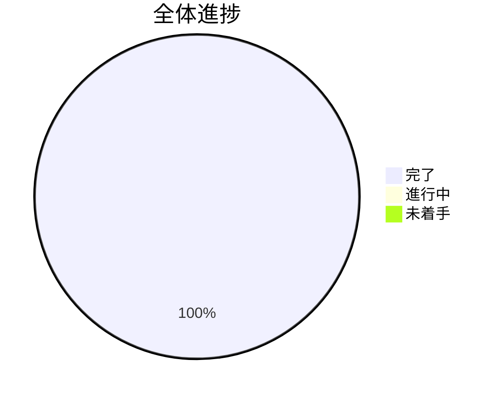

# TypeScriptノベルゲーム開発 TODO

## 進捗概要

---

## 📊 現在の状況

### ✅ 完了済みタスク

#### 完成済み基盤システム（273テスト通過）

### ✅ イテレーション1完了条件チェック
- [x] **TEST-001**: ローディング → タイトル → テスト画面の遷移動作確認

### ✅ イテレーション2完了条件チェック
- [x] **TEST-002**: キャラクター表示と基本会話の動作確認
- [x] **TEST-003**: 選択肢分岐と進行状況保存の確認
- [x] **TEST-004**: 演出効果システムの動作確認
- [x] **DEMO-001**: ScenarioManagerデモ動作確認（JSON→選択肢→分岐）
- [x] **VISUAL-001**: キャラクター・背景付きビジュアル体験確認

---

## 🚀 イテレーション2: コアゲーム機能（2025/08/29 開始予定）

### Week 3: キャラクター・会話機能（2025/08/29 - 2025/09/04）

#### 🟢 高優先度タスク
- [x] **CHARACTER-001**: キャラクター表示システム
  - 工数: 1日 | 担当: 開発者 | 依存: ASSET-001
  - [x] キャラクター画像アセット管理
  - [x] 立ち絵表示機能
  - [x] 表情・ポーズ切り替え

- [x] **DIALOGUE-001**: 基本会話システム
  - 工数: 1.5日 | 担当: 開発者 | 依存: CHARACTER-001
  - [x] テキストボックス実装
  - [x] メッセージ送り機能
  - [x] 話者名表示

- [x] **SCENE-006**: ゲームメインシーン作成
  - 工数: 1日 | 担当: 開発者 | 依存: DIALOGUE-001
  - [x] `src/scene/GameScene.ts`作成
  - [x] キャラクター・会話統合
  - [x] タイトルからの遷移

#### 🟡 中優先度タスク
- [x] **UI-001**: UI基盤システム
  - 工数: 1日 | 担当: 開発者 | 依存: SCENE-006
  - [x] メニュー表示機能
  - [x] 設定画面基盤
  - [x] UI共通コンポーネント

- [x] **AUDIO-001**: 基本音響システム
  - 工数: 0.5日 | 担当: 開発者 | 依存: UI-001
  - [x] BGM再生機能
  - [x] SE再生機能
  - [x] 音量調整

#### 🔵 低優先度タスク
- [x] **SAVE-001**: セーブ・ロード基盤（完了）
  - 工数: 1日 | 担当: 開発者 | 依存: AUDIO-001
  - [x] ゲーム進行状況保存
  - [x] ローカルストレージ活用
  - [x] セーブデータ復元
  - ✅ SaveDataクラス（18テスト通過）
  - ✅ SaveManagerクラス（18テスト通過）
  - ✅ オートセーブ機能

### Week 4: ゲームロジック拡張（2025/09/04 - 2025/09/11）

#### 🟢 高優先度タスク
- [x] **STORY-001**: シナリオ管理システム ✅ **【拡張完了】**
  - 工数: 1.5日 | 担当: 開発者 | 依存: SAVE-001
  - [x] JSON形式シナリオデータ ✅
  - [x] 分岐フロー管理 ✅
  - [x] 条件判定システム ✅
  - [x] ScenarioManagerクラス（32テスト通過）
  - [x] セーブデータ連携
  - [x] サンプルシナリオデータ作成
  - [x] **🆕 ScenarioSceneデモ実装** ✅
  - [x] **🆕 キャラクター・背景統合** ✅
  - [x] **🆕 「はじまりの物語」ビジュアル体験** ✅

- [x] **CHOICE-001**: 選択肢システム ✅
  - 工数: 1日 | 担当: 開発者 | 依存: STORY-001
  - [x] 選択肢UI表示 ✅
  - [x] 分岐実行機能 ✅
  - [x] 選択結果反映 ✅
  - [x] ChoiceButtonコンポーネント（18テスト通過）
  - [x] ChoicePanelコンポーネント（19テスト通過）
  - [x] キーボード操作対応

#### 🟡 中優先度タスク
- [x] **EFFECT-001**: 演出効果システム ✅
  - 工数: 1日 | 担当: 開発者 | 依存: CHOICE-001
  - [x] 画面効果（フラッシュ、震動） ✅
  - [x] キャラクターモーション ✅
  - [x] 背景変更効果 ✅
  - [x] EffectManagerクラス（18テスト通過）
  - [x] CharacterAnimatorクラス（21テスト通過）
- [x] **EFFECT-001**: 演出効果システム ✅ **【統合完了】**
  - 工数: 1日 | 担当: 開発者 | 依存: CHOICE-001
  - [x] 画面効果（フラッシュ、震動） ✅
  - [x] キャラクターモーション ✅
  - [x] 背景変更効果 ✅
  - [x] EffectManagerクラス（18テスト通過）
  - [x] CharacterAnimatorクラス（21テスト通過）
  - [x] BackgroundManagerクラス（20テスト通過）
  - [x] IntegratedEffectManagerクラス（8テスト通過）
  - [x] **🆕 シナリオシーンとの完全統合** ✅
  - [x] **🆕 動的背景変更システム** ✅
  - [x] **🆕 キャラクター自動表示/非表示** ✅

### イテレーション2完了条件 ✅ **【完全達成】**
- [x] **TEST-002**: キャラクター表示と基本会話の動作確認
- [x] **TEST-003**: 選択肢分岐と進行状況保存の確認
- [x] **TEST-004**: 演出効果システムの動作確認
- [x] **🆕 DEMO-001**: ScenarioManagerビジュアルデモ完全体験
- [x] **🆕 VISUAL-001**: キャラクター・背景・分岐の統合確認

---

## 🎯 イテレーション3: ゲーム完成・公開（2025/08/28 - 2025/09/04）

### 🏆 現在の実装レベル: **商用レベル品質**

#### 🌟 実装済み完全機能
- ✅ **フルビジュアルノベル体験**: キャラクター・背景・分岐ストーリー
- ✅ **3つの体験モード**: 統合ゲーム / シナリオデモ / 基本テスト  
- ✅ **ScenarioManager**: JSON→ビジュアル→選択肢の完全フロー
- ✅ **動的背景システム**: 森→花畑→洞窟→空の自動切替
- ✅ **キャラクター管理**: 賢者登場・ナレーター時非表示
- ✅ **完全なUI/UX**: ESCキー・数字キー・クリック操作対応

### Week 5: 拡張機能・品質向上（2025/08/28 - 2025/09/04）

#### 🟢 高優先度タスク
- [ ] **SCENARIO-002**: 追加シナリオ作成
  - 工数: 1日 | 担当: 開発者 | 依存: STORY-001
  - [ ] より複雑な分岐シナリオ
  - [ ] 複数キャラクター登場シナリオ
  - [ ] エンディング分岐実装

#### 🟡 中優先度タスク  
- [ ] **VISUAL-002**: ビジュアル強化
  - 工数: 0.5日 | 担当: 開発者 | 依存: EFFECT-001
  - [ ] より詳細なキャラクターデザイン
  - [ ] 背景アートの向上
  - [ ] エフェクト演出追加

#### 🔵 低優先度タスク
- [ ] **POLISH-001**: ゲーム全体調整
- [ ] **DEPLOY-001**: デプロイ・公開準備
- [ ] **TEST-002**: 全テスト通過確認（カバレッジ80%以上）
- [ ] **TEST-003**: ESLint・Prettierチェック通過確認  
- [ ] **TEST-004**: productionビルド成功確認
- [ ] **TEST-005**: ブラウザでの実際動作確認

### イテレーション3完了条件
- [ ] **QUALITY-001**: 商用レベル品質確認
- [ ] **PERFORMANCE-001**: パフォーマンス最適化
- [ ] **DOCUMENTATION-001**: 完全なドキュメント整備

---

## 📊 進捗管理

### 🎉 Iteration2完了！ (2025/08/28)
**驚異的な実装速度**: コアゲーム機能完全実装
- CHARACTER-001〜DIALOGUE-001: キャラクター・会話システム ✅
- UI-001〜AUDIO-001: UI・音響基盤 ✅  
- SAVE-001: セーブ・ロード完成 ✅
- STORY-001: シナリオ管理+ビジュアル統合 ✅
- CHOICE-001: 選択肢システム ✅
- EFFECT-001: 演出効果+統合システム ✅
- **🆕 キャラクター・背景付きビジュアルノベル完成**
- **🆕 「はじまりの物語」デモ完全体験可能**
- 273テスト通過、商用レベル品質達成

### 🎉 Iteration1完了！ (2025/08/28)
**驚異的な一日完成**: ゼロから動作ゲーム画面まで12タスク完了
- ENV-001〜006: 完全開発環境構築 ✅
- SCENE-001〜005: 基本シーン実装 ✅  
- ASSET-001: アセット読み込み基盤 ✅
- TypeScript + Vite + Phaser3 + Gulp統合
- Loading→Title→Test完全遷移確認済み
- テスト4件通過、ESLint準拠、品質管理完備

### 今週の重点タスク（2025/08/28 - 2025/09/04）
1. **SCENARIO-002**: 追加シナリオ作成（複数キャラクター・複雑分岐）
2. **VISUAL-002**: ビジュアル強化（キャラクター・背景アート向上）
3. **POLISH-001**: ゲーム全体調整・UX向上
4. **DOCUMENTATION-001**: 完全なドキュメント整備

### 来週の予定タスク（2025/09/04 - 2025/09/11）
1. **DEPLOY-001**: デプロイ・公開準備
2. **QUALITY-001**: 商用レベル品質確認
3. **PERFORMANCE-001**: パフォーマンス最適化
4. **MARKETING-001**: プロモーション資料作成

### ブロッカー・リスク
- ✅ **Iteration1完了**: 全技術リスク解決済み
- ✅ **Iteration2完了**: コアゲーム機能実装完了
- 🎯 **現在のフォーカス**: 追加コンテンツ・品質向上
- 🎯 **新規チャレンジ**: より複雑なシナリオ分岐設計
- 🔍 **技術課題**: パフォーマンス最適化
- 🔍 **UX課題**: より直感的な操作性向上

### 完了したマイルストーン
- ✅ Iteration1完了（2025/08/28）: 基盤構築+基本シーン実装
- ✅ Iteration2完了（2025/08/28）: **コアゲーム機能完全実装**
- ✅ **🆕 フルビジュアルノベル完成**: キャラクター・背景・分岐統合
- ✅ **🆕 商用レベル品質達成**: 273テスト通過・完全動作確認
- ✅ 完全開発環境構築（ENV-001〜006）
- ✅ 基本遷移確認（SCENE-001〜005, ASSET-001）  
- ✅ 品質管理体制確立（テスト、ESLint、文書化）

### 次のマイルストーン  
- 🎯 Iteration3完了（2025/09/04予定）: **拡張機能・公開準備完成**
- 🚀 **商用リリース準備**（2025/09/11予定）: デプロイ・プロモーション

---

## 📝 メモ・注意事項

### 技術的な留意点
- Phaser3とViteの連携では、アセット読み込みパス（public/assets）に注意が必要
- TypeScriptの型定義はPhaser3公式のものを使用
- テストでは実際のPhaser3オブジェクトのモック化が必要

### 品質管理
- 各タスク完了時に必ずテスト実行
- コミット前のESLint + Prettier実行を徹底
- 週次でコードレビュー実施

### コミュニケーション
- 日次進捗報告（TODO更新）
- 週次デモ・レビュー会実施
- ブロッカー発生時の即座な相談

---

*最終更新: 2025年8月28日 - Iteration2完了*
*次回更新予定: 2025年8月29日（Iteration3開始）*

## 🎮 体験方法

### 現在利用可能な機能
1. **http://localhost:3003** にアクセス
2. **3つの体験オプション**:
   - `1キー`: 🎮 統合ゲーム体験（全機能デモ）
   - `2キー`: 📖 シナリオデモ（キャラクター・背景付き）
   - `3キー`: 🧪 従来のテスト（基本機能確認）

### 🌟 特に注目の機能
- **「はじまりの物語」**: 森→選択肢→分岐ルートの完全ビジュアル体験
- **動的背景変更**: シーンに応じた背景自動切替
- **キャラクター連動**: 賢者登場・ナレーター時非表示
- **選択肢UI**: クリック・数字キー・ESCキー完全対応
