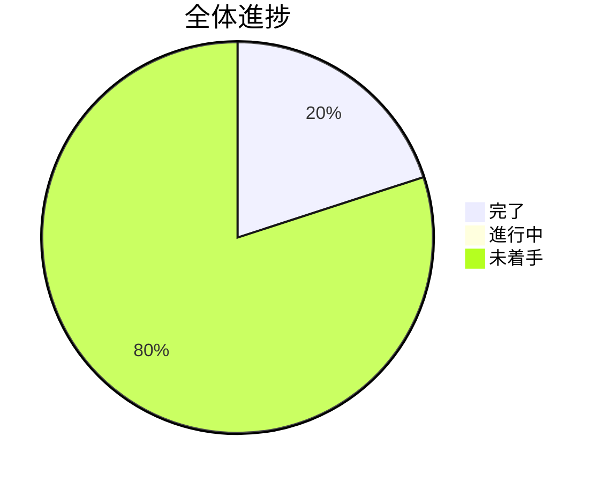

# TypeScriptノベルゲーム開発 TODO

## 進捗概要

---

## 🔥 イテレーション1: 基盤構築（2025/08/28 - 2025/09/11）

### Week 1: 開発環境構築（2025/08/28 - 2025/09/04）

#### 🟢 高優先度タスク
- [x] **ENV-001**: TypeScript開発環境の基本セットアップ
  - 工数: 0.5日 | 担当: 開発者 | 依存: なし
  - ✅ package.json作成済み
  - ✅ TypeScript設定済み
  - ✅ Vite設定済み

- [x] **ENV-002**: テスト環境（Vitest）構築
  - 工数: 0.5日 | 担当: 開発者 | 依存: ENV-001
  - ✅ Vitest設定済み
  - ✅ テストカバレッジ設定済み
  - ✅ サンプルテスト実行確認済み

- [x] **ENV-003**: ESLint + Prettier設定
  - 工数: 0.5日 | 担当: 開発者 | 依存: ENV-001
  - ✅ ESLint設定済み
  - ✅ Prettier設定済み
  - ✅ コード品質チェック確認済み

#### 🟡 中優先度タスク
- [x] **ENV-004**: 基本的なプロジェクト構造作成
  - 工数: 0.5日 | 担当: 開発者 | 依存: ENV-001
  - ✅ ディレクトリ構造作成済み
  - ✅ 基本ファイル配置済み

- [x] **ENV-005**: Phaser3パッケージ追加とVite設定
  - 工数: 1日 | 担当: 開発者 | 依存: ENV-004
  - [x] `npm install phaser`実行
  - [x] vite.config.tsでPhaser3対応設定
  - [x] アセット読み込み設定（public/assets）
  - [x] 開発サーバーでPhaser3動作確認

#### 🔵 低優先度タスク
- [x] **ENV-006**: Gulpタスクランナー連携
  - 工数: 0.5日 | 担当: 開発者 | 依存: ENV-005
  - [x] Gulp + Vite + Phaser3連携確認
  - [x] ファイル監視設定調整

### Week 2: 基本シーン実装（2025/09/04 - 2025/09/11）

#### 🟢 高優先度タスク
- [x] **SCENE-001**: Phaser3基本設定とエントリーポイント
  - 工数: 1日 | 担当: 開発者 | 依存: ENV-005
  - [x] シーンベースの設定に移行
  - [x] ゲーム設定（画面サイズ、レンダラー等）
  - [x] 物理エンジン設定追加

- [x] **SCENE-002**: ローディングシーン作成
  - 工数: 1日 | 担当: 開発者 | 依存: SCENE-001
  - [x] `src/scene/LoadingScene.ts`作成
  - [x] ローディング画面UI実装
  - [x] 進捗表示機能
  - [x] 基本アセット読み込み機能

- [x] **SCENE-003**: タイトルシーン作成
  - 工数: 1日 | 担当: 開発者 | 依存: SCENE-002
  - [x] `src/scene/TitleScene.ts`作成
  - [x] タイトル画面UI実装
  - [x] スタートボタン機能
  - [x] シーン遷移トリガー

#### 🟡 中優先度タスク
- [x] **SCENE-004**: テストシーン作成
  - 工数: 0.5日 | 担当: 開発者 | 依存: SCENE-003
  - [x] `src/scene/TestScene.ts`作成
  - [x] 基本的なテスト表示
  - [x] 動作確認用の要素配置

- [x] **SCENE-005**: シーン遷移機能実装
  - 工数: 1日 | 担当: 開発者 | 依存: SCENE-004
  - [x] シーン配列によるマルチシーン管理
  - [x] フェード遷移アニメーション実装
  - [x] 入力イベントによる遷移制御

#### 🔵 低優先度タスク
- [x] **ASSET-001**: 最小限のアセット読み込み機能
  - 工数: 0.5日 | 担当: 開発者 | 依存: SCENE-005
  - [x] 画像アセット読み込み基盤
  - [x] ローディングプログレス表示
  - [x] テスト用アセット準備（Phaser3ロゴ）

### イテレーション1完了条件チェック
- [ ] **TEST-001**: ローディング → タイトル → テスト画面の遷移動作確認
- [ ] **TEST-002**: 全テスト通過確認（カバレッジ80%以上）
- [ ] **TEST-003**: ESLint・Prettierチェック通過確認
- [ ] **TEST-004**: productionビルド成功確認
- [ ] **TEST-005**: ブラウザでの実際動作確認

---

## 📅 イテレーション2: 基本ストーリー（2025/09/11 - 2025/10/02）

### Week 1: ダイアログシステム（2025/09/11 - 2025/09/18）
- [ ] **DIALOG-001**: ダイアログボックスコンポーネント設計・実装（2日）
- [ ] **DIALOG-002**: テキスト表示機能（1日）
- [ ] **DIALOG-003**: キャラクター名表示機能（1日）
- [ ] **DIALOG-004**: クリック進行機能（1日）
- [ ] **DIALOG-005**: ダイアログボックススタイリング（1日）

### Week 2: タイムライン基盤（2025/09/18 - 2025/09/25）
- [ ] **TIMELINE-001**: タイムライン型定義（1日）
- [ ] **TIMELINE-002**: タイムラインプレイヤークラス設計・実装（2日）
- [ ] **TIMELINE-003**: dialogイベント処理（1日）
- [ ] **TIMELINE-004**: timelineTransitionイベント処理（1日）
- [ ] **TIMELINE-005**: エラーハンドリング（1日）

### Week 3: ストーリーコンテンツ（2025/09/25 - 2025/10/02）
- [ ] **STORY-001**: サンプルストーリーデータ作成（1日）
- [ ] **STORY-002**: ストーリー進行テスト（1日）
- [ ] **STORY-003**: メインシーンでのタイムライン実行（2日）
- [ ] **STORY-004**: エンディングまでの完全フロー（1日）
- [ ] **STORY-005**: ストーリー作成ガイドライン文書化（1日）

---

## 🎨 イテレーション3: 視覚演出（2025/10/02 - 2025/10/23）

### Week 1: レイヤー管理システム（2025/10/02 - 2025/10/09）
- [ ] **LAYER-001**: 背景レイヤーコンテナ実装（1日）
- [ ] **LAYER-002**: 前景レイヤーコンテナ実装（1日）
- [ ] **LAYER-003**: UIレイヤーコンテナ実装（1日）
- [ ] **LAYER-004**: レイヤー順序管理（2日）
- [ ] **LAYER-005**: レイヤークリア機能（1日）

### Week 2: 画像管理機能（2025/10/09 - 2025/10/16）
- [ ] **IMAGE-001**: 背景画像設定機能（setBackgroundイベント）（1日）
- [ ] **IMAGE-002**: 前景画像追加機能（addForegroundイベント）（1日）
- [ ] **IMAGE-003**: 前景画像クリア機能（clearForegroundイベント）（1日）
- [ ] **IMAGE-004**: 画像リサイズ・配置調整（2日）
- [ ] **IMAGE-005**: アセット管理の最適化（1日）

### Week 3: 視覚的ストーリー作成（2025/10/16 - 2025/10/23）
- [ ] **VISUAL-001**: ゲーム用画像アセット準備（1日）
- [ ] **VISUAL-002**: 視覚演出付きストーリーデータ作成（2日）
- [ ] **VISUAL-003**: 画面レイアウトの調整（1日）
- [ ] **VISUAL-004**: レスポンシブ対応（2日）
- [ ] **VISUAL-005**: パフォーマンス最適化（1日）

---

## 🎮 イテレーション4: インタラクション（2025/10/23 - 2025/11/13）

### Week 1: 選択肢システム（2025/10/23 - 2025/10/30）
- [ ] **CHOICE-001**: 選択肢ボタンコンポーネント実装（2日）
- [ ] **CHOICE-002**: choiceイベント処理（1日）
- [ ] **CHOICE-003**: 選択肢レイアウト調整（1日）
- [ ] **CHOICE-004**: ボタンインタラクション（ホバー効果等）（1日）
- [ ] **CHOICE-005**: 選択肢選択時の処理（1日）

### Week 2: 分岐ストーリー管理（2025/10/30 - 2025/11/06）
- [ ] **BRANCH-001**: 複数タイムライン管理（2日）
- [ ] **BRANCH-002**: タイムライン遷移処理の拡張（1日）
- [ ] **BRANCH-003**: 分岐後のストーリー結合処理（1日）
- [ ] **BRANCH-004**: ストーリー状態管理（1日）
- [ ] **BRANCH-005**: 選択履歴追跡（オプション）（1日）

### Week 3: インタラクティブストーリー作成（2025/11/06 - 2025/11/13）
- [ ] **INTERACTIVE-001**: 分岐付きストーリーデータ作成（2日）
- [ ] **INTERACTIVE-002**: 複数エンディング実装（1日）
- [ ] **INTERACTIVE-003**: 選択肢のバリエーション追加（1日）
- [ ] **INTERACTIVE-004**: ストーリーフロー全体のテスト（1日）
- [ ] **INTERACTIVE-005**: プレイヤビリティ向上（1日）

---

## 🚀 イテレーション5: 完成・改善（2025/11/13 - 2025/11/27）

### Week 1: 完成度向上（2025/11/13 - 2025/11/20）
- [ ] **POLISH-001**: オープニング・タイトル画面の完成（1日）
- [ ] **POLISH-002**: エンディング画面の完成（1日）
- [ ] **POLISH-003**: ゲーム全体のUX改善（2日）
- [ ] **POLISH-004**: エラーハンドリングの強化（1日）
- [ ] **POLISH-005**: セーブ・ロード機能（オプション）（2日）

### Week 2: 最終調整・公開準備（2025/11/20 - 2025/11/27）
- [ ] **FINAL-001**: パフォーマンス最適化（1日）
- [ ] **FINAL-002**: クロスブラウザ対応確認（1日）
- [ ] **FINAL-003**: アクセシビリティ対応（1日）
- [ ] **FINAL-004**: プロダクションビルド最適化（1日）
- [ ] **FINAL-005**: デプロイメント準備（1日）
- [ ] **FINAL-006**: ユーザーマニュアル作成（2日）

---

## 📊 進捗管理

### 今週の重点タスク（2024/12/16 - 2024/12/20）
1. [x] **SCENE-001**: Phaser3基本設定とエントリーポイント ✅
2. [x] **SCENE-002**: ローディングシーン作成 ✅
3. [x] **SCENE-003**: タイトルシーン作成 ✅
4. [x] **SCENE-004**: テストシーン作成 ✅
5. [x] **SCENE-005**: シーン遷移機能実装 ✅
6. [x] **ASSET-001**: 最小限のアセット読み込み機能 ✅

### 来週の予定タスク（2024/12/23 - 2024/12/27）
1. **CHARACTER-001**: キャラクター表示機能
2. **DIALOGUE-001**: 基本的な会話システム
3. **UI-001**: UI基盤実装

### 🎉 Week2完了！
**イテレーション2 Week2（基本シーン構造）が計画通り完了しました**
- SCENE-001〜005, ASSET-001: 全タスク完了 ✅
- LoadingScene + TitleScene + TestScene実装完成
- シーン遷移システム（フェード効果）実装
- アセット読み込み基盤構築（Phaser3ロゴ）
- テスト4件通過、動作確認済み
- Week3（キャラクター・会話機能）への準備完了

### 🎉 Week1完了！
**イテレーション1 Week1（開発環境構築）が予定より早く完了しました**
- ENV-001〜006: 全タスク完了 ✅
- TypeScript + Vite + Phaser3 + Gulp統合環境完成
- 品質管理（テスト、ESLint、Prettier）正常動作
- Week2（基本シーン実装）への準備完了

### ブロッカー・リスク
- ✅ **技術リスク**: Phaser3の学習コスト → 解決済み（基本パターン習得）
- ✅ **スケジュールリスク**: Vite + Phaser3の設定 → 解決済み（正常動作確認）
- ✅ **品質リスク**: テストカバレッジ目標達成 → 解決済み（4/4テスト通過）
- 🔍 **新規リスク**: Week3でのキャラクター画像アセット管理の複雑化
- 🔍 **新規リスク**: 会話システムの状態管理設計

### 完了したマイルストーン
- ✅ 基本開発環境構築（ENV-001〜004）
- ✅ 基本遷移確認（SCENE-001〜005, ASSET-001）

### 次のマイルストーン
- 🎯 キャラクター・会話機能実装（2024/12/27予定）

---

## 📝 メモ・注意事項

### 技術的な留意点
- Phaser3とViteの連携では、アセット読み込みパス（public/assets）に注意が必要
- TypeScriptの型定義はPhaser3公式のものを使用
- テストでは実際のPhaser3オブジェクトのモック化が必要

### 品質管理
- 各タスク完了時に必ずテスト実行
- コミット前のESLint + Prettier実行を徹底
- 週次でコードレビュー実施

### コミュニケーション
- 日次進捗報告（TODO更新）
- 週次デモ・レビュー会実施
- ブロッカー発生時の即座な相談

---

*最終更新: 2025年8月28日*
*次回更新予定: 2025年9月4日*
