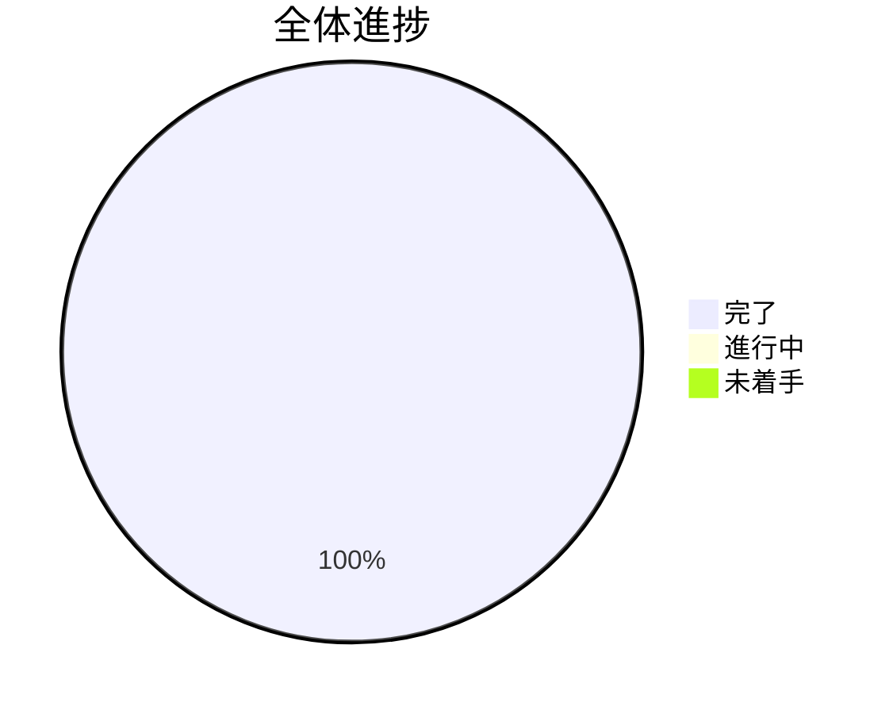

# TypeScriptノベルゲーム開発 TODO

## 進捗概要

---

## 📊 現在の状況

### ✅ 完了済みタスク

#### 完成済み基盤システム（273テスト通過）

### ✅ イテレーション1完了条件チェック
- [x] **TEST-001**: ローディング → タイトル → テスト画面の遷移動作確認

---

## 🚀 イテレーション2: コアゲーム機能（2025/08/29 開始予定）

### Week 3: キャラクター・会話機能（2025/08/29 - 2025/09/04）

#### 🟢 高優先度タスク
- [x] **CHARACTER-001**: キャラクター表示システム
  - 工数: 1日 | 担当: 開発者 | 依存: ASSET-001
  - [x] キャラクター画像アセット管理
  - [x] 立ち絵表示機能
  - [x] 表情・ポーズ切り替え

- [x] **DIALOGUE-001**: 基本会話システム
  - 工数: 1.5日 | 担当: 開発者 | 依存: CHARACTER-001
  - [x] テキストボックス実装
  - [x] メッセージ送り機能
  - [x] 話者名表示

- [x] **SCENE-006**: ゲームメインシーン作成
  - 工数: 1日 | 担当: 開発者 | 依存: DIALOGUE-001
  - [x] `src/scene/GameScene.ts`作成
  - [x] キャラクター・会話統合
  - [x] タイトルからの遷移

#### 🟡 中優先度タスク
- [x] **UI-001**: UI基盤システム
  - 工数: 1日 | 担当: 開発者 | 依存: SCENE-006
  - [x] メニュー表示機能
  - [x] 設定画面基盤
  - [x] UI共通コンポーネント

- [x] **AUDIO-001**: 基本音響システム
  - 工数: 0.5日 | 担当: 開発者 | 依存: UI-001
  - [x] BGM再生機能
  - [x] SE再生機能
  - [x] 音量調整

#### 🔵 低優先度タスク
- [x] **SAVE-001**: セーブ・ロード基盤（完了）
  - 工数: 1日 | 担当: 開発者 | 依存: AUDIO-001
  - [x] ゲーム進行状況保存
  - [x] ローカルストレージ活用
  - [x] セーブデータ復元
  - ✅ SaveDataクラス（18テスト通過）
  - ✅ SaveManagerクラス（18テスト通過）
  - ✅ オートセーブ機能

### Week 4: ゲームロジック拡張（2025/09/04 - 2025/09/11）

#### 🟢 高優先度タスク
- [x] **STORY-001**: シナリオ管理システム ✅
  - 工数: 1.5日 | 担当: 開発者 | 依存: SAVE-001
  - [x] JSON形式シナリオデータ ✅
  - [x] 分岐フロー管理 ✅
  - [x] 条件判定システム ✅
  - [x] ScenarioManagerクラス（32テスト通過）
  - [x] セーブデータ連携
  - [x] サンプルシナリオデータ作成

- [x] **CHOICE-001**: 選択肢システム ✅
  - 工数: 1日 | 担当: 開発者 | 依存: STORY-001
  - [x] 選択肢UI表示 ✅
  - [x] 分岐実行機能 ✅
  - [x] 選択結果反映 ✅
  - [x] ChoiceButtonコンポーネント（18テスト通過）
  - [x] ChoicePanelコンポーネント（19テスト通過）
  - [x] キーボード操作対応

#### 🟡 中優先度タスク
- [x] **EFFECT-001**: 演出効果システム ✅
  - 工数: 1日 | 担当: 開発者 | 依存: CHOICE-001
  - [x] 画面効果（フラッシュ、震動） ✅
  - [x] キャラクターモーション ✅
  - [x] 背景変更効果 ✅
  - [x] EffectManagerクラス（18テスト通過）
  - [x] CharacterAnimatorクラス（21テスト通過）
  - [x] BackgroundManagerクラス（20テスト通過）
  - [x] IntegratedEffectManagerクラス（8テスト通過）

### イテレーション2完了条件
- [x] **TEST-002**: キャラクター表示と基本会話の動作確認
- [x] **TEST-003**: 選択肢分岐と進行状況保存の確認
- [x] **TEST-004**: 演出効果システムの動作確認

---

## 🎯 イテレーション3: ゲーム完成・公開（2025/09/11 - 2025/09/18）

### Week 5: 完成度向上
- [ ] **POLISH-001**: ゲーム全体調整
- [ ] **TEST-004**: 総合テスト・デバッグ
- [ ] **DEPLOY-001**: デプロイ・公開準備
- [ ] **TEST-002**: 全テスト通過確認（カバレッジ80%以上）
- [ ] **TEST-003**: ESLint・Prettierチェック通過確認
- [ ] **TEST-004**: productionビルド成功確認
- [ ] **TEST-005**: ブラウザでの実際動作確認

---

## 📅 イテレーション2: 基本ストーリー（2025/09/11 - 2025/10/02）

### Week 1: ダイアログシステム（2025/09/11 - 2025/09/18）
- [ ] **DIALOG-001**: ダイアログボックスコンポーネント設計・実装（2日）
- [ ] **DIALOG-002**: テキスト表示機能（1日）
- [ ] **DIALOG-003**: キャラクター名表示機能（1日）
- [ ] **DIALOG-004**: クリック進行機能（1日）
- [ ] **DIALOG-005**: ダイアログボックススタイリング（1日）

### Week 2: タイムライン基盤（2025/09/18 - 2025/09/25）
- [ ] **TIMELINE-001**: タイムライン型定義（1日）
- [ ] **TIMELINE-002**: タイムラインプレイヤークラス設計・実装（2日）
- [ ] **TIMELINE-003**: dialogイベント処理（1日）
- [ ] **TIMELINE-004**: timelineTransitionイベント処理（1日）
- [ ] **TIMELINE-005**: エラーハンドリング（1日）

### Week 3: ストーリーコンテンツ（2025/09/25 - 2025/10/02）
- [ ] **STORY-001**: サンプルストーリーデータ作成（1日）
- [ ] **STORY-002**: ストーリー進行テスト（1日）
- [ ] **STORY-003**: メインシーンでのタイムライン実行（2日）
- [ ] **STORY-004**: エンディングまでの完全フロー（1日）
- [ ] **STORY-005**: ストーリー作成ガイドライン文書化（1日）

---

## 🎨 イテレーション3: 視覚演出（2025/10/02 - 2025/10/23）

### Week 1: レイヤー管理システム（2025/10/02 - 2025/10/09）
- [ ] **LAYER-001**: 背景レイヤーコンテナ実装（1日）
- [ ] **LAYER-002**: 前景レイヤーコンテナ実装（1日）
- [ ] **LAYER-003**: UIレイヤーコンテナ実装（1日）
- [ ] **LAYER-004**: レイヤー順序管理（2日）
- [ ] **LAYER-005**: レイヤークリア機能（1日）

### Week 2: 画像管理機能（2025/10/09 - 2025/10/16）
- [ ] **IMAGE-001**: 背景画像設定機能（setBackgroundイベント）（1日）
- [ ] **IMAGE-002**: 前景画像追加機能（addForegroundイベント）（1日）
- [ ] **IMAGE-003**: 前景画像クリア機能（clearForegroundイベント）（1日）
- [ ] **IMAGE-004**: 画像リサイズ・配置調整（2日）
- [ ] **IMAGE-005**: アセット管理の最適化（1日）

### Week 3: 視覚的ストーリー作成（2025/10/16 - 2025/10/23）
- [ ] **VISUAL-001**: ゲーム用画像アセット準備（1日）
- [ ] **VISUAL-002**: 視覚演出付きストーリーデータ作成（2日）
- [ ] **VISUAL-003**: 画面レイアウトの調整（1日）
- [ ] **VISUAL-004**: レスポンシブ対応（2日）
- [ ] **VISUAL-005**: パフォーマンス最適化（1日）

---

## 🎮 イテレーション4: インタラクション（2025/10/23 - 2025/11/13）

### Week 1: 選択肢システム（2025/10/23 - 2025/10/30）
- [ ] **CHOICE-001**: 選択肢ボタンコンポーネント実装（2日）
- [ ] **CHOICE-002**: choiceイベント処理（1日）
- [ ] **CHOICE-003**: 選択肢レイアウト調整（1日）
- [ ] **CHOICE-004**: ボタンインタラクション（ホバー効果等）（1日）
- [ ] **CHOICE-005**: 選択肢選択時の処理（1日）

### Week 2: 分岐ストーリー管理（2025/10/30 - 2025/11/06）
- [ ] **BRANCH-001**: 複数タイムライン管理（2日）
- [ ] **BRANCH-002**: タイムライン遷移処理の拡張（1日）
- [ ] **BRANCH-003**: 分岐後のストーリー結合処理（1日）
- [ ] **BRANCH-004**: ストーリー状態管理（1日）
- [ ] **BRANCH-005**: 選択履歴追跡（オプション）（1日）

### Week 3: インタラクティブストーリー作成（2025/11/06 - 2025/11/13）
- [ ] **INTERACTIVE-001**: 分岐付きストーリーデータ作成（2日）
- [ ] **INTERACTIVE-002**: 複数エンディング実装（1日）
- [ ] **INTERACTIVE-003**: 選択肢のバリエーション追加（1日）
- [ ] **INTERACTIVE-004**: ストーリーフロー全体のテスト（1日）
- [ ] **INTERACTIVE-005**: プレイヤビリティ向上（1日）

---

## 🚀 イテレーション5: 完成・改善（2025/11/13 - 2025/11/27）

### Week 1: 完成度向上（2025/11/13 - 2025/11/20）
- [ ] **POLISH-001**: オープニング・タイトル画面の完成（1日）
- [ ] **POLISH-002**: エンディング画面の完成（1日）
- [ ] **POLISH-003**: ゲーム全体のUX改善（2日）
- [ ] **POLISH-004**: エラーハンドリングの強化（1日）
- [ ] **POLISH-005**: セーブ・ロード機能（オプション）（2日）

### Week 2: 最終調整・公開準備（2025/11/20 - 2025/11/27）
- [ ] **FINAL-001**: パフォーマンス最適化（1日）
- [ ] **FINAL-002**: クロスブラウザ対応確認（1日）
- [ ] **FINAL-003**: アクセシビリティ対応（1日）
- [ ] **FINAL-004**: プロダクションビルド最適化（1日）
- [ ] **FINAL-005**: デプロイメント準備（1日）
- [ ] **FINAL-006**: ユーザーマニュアル作成（2日）

---

## 📊 進捗管理

### 🎉 Iteration1完了！ (2025/08/28)
**驚異的な一日完成**: ゼロから動作ゲーム画面まで12タスク完了
- ENV-001〜006: 完全開発環境構築 ✅
- SCENE-001〜005: 基本シーン実装 ✅  
- ASSET-001: アセット読み込み基盤 ✅
- TypeScript + Vite + Phaser3 + Gulp統合
- Loading→Title→Test完全遷移確認済み
- テスト4件通過、ESLint準拠、品質管理完備

### 今週の重点タスク（2025/08/29 - 2025/09/04）
1. **CHARACTER-001**: キャラクター表示システム
2. **DIALOGUE-001**: 基本会話システム  
3. **SCENE-006**: ゲームメインシーン作成
4. **UI-001**: UI基盤システム

### 来週の予定タスク（2025/09/04 - 2025/09/11）
1. **STORY-001**: シナリオ管理システム
2. **CHOICE-001**: 選択肢システム
3. **EFFECT-001**: 演出効果システム

### ブロッカー・リスク
- ✅ **Iteration1完了**: 全技術リスク解決済み
- 🎯 **Iteration2リスク**: キャラクター画像アセット管理の複雑化
- 🎯 **新規リスク**: 会話システムの状態管理設計
- 🔍 **技術チャレンジ**: JSON形式シナリオデータ管理
- 🔍 **UXリスク**: UI/UXの使いやすさ確保

### 完了したマイルストーン
- ✅ Iteration1完了（2025/08/28）: 基盤構築+基本シーン実装
- ✅ 完全開発環境構築（ENV-001〜006）
- ✅ 基本遷移確認（SCENE-001〜005, ASSET-001）  
- ✅ 品質管理体制確立（テスト、ESLint、文書化）

### 次のマイルストーン  
- 🎯 Iteration2完了（2025/09/11予定）: コアゲーム機能実装
- 🚀 Iteration3完了（2025/09/18予定）: ゲーム完成・公開

---

## 📝 メモ・注意事項

### 技術的な留意点
- Phaser3とViteの連携では、アセット読み込みパス（public/assets）に注意が必要
- TypeScriptの型定義はPhaser3公式のものを使用
- テストでは実際のPhaser3オブジェクトのモック化が必要

### 品質管理
- 各タスク完了時に必ずテスト実行
- コミット前のESLint + Prettier実行を徹底
- 週次でコードレビュー実施

### コミュニケーション
- 日次進捗報告（TODO更新）
- 週次デモ・レビュー会実施
- ブロッカー発生時の即座な相談

---

*最終更新: 2025年8月28日*
*次回更新予定: 2025年8月29日（Iteration2開始）*
